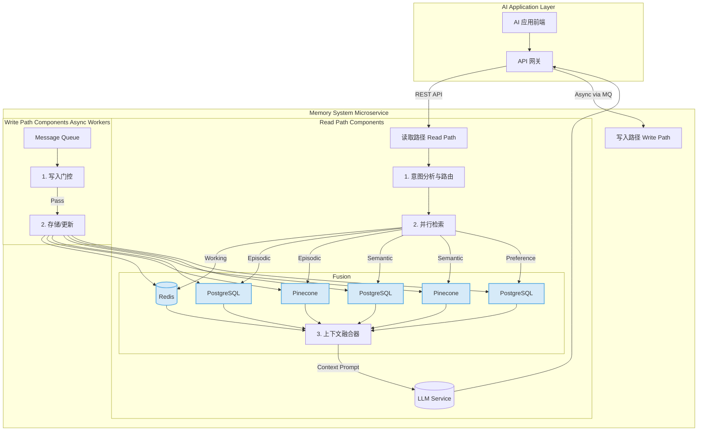

# AI 记忆管理系统：工程实现设计方案

本文档为《从“健忘”到“懂我”：构建新一代AI记忆系统》中所述理念的详细工程实现方案。它将聚焦于技术选型、模块设计、数据流转和核心算法，为开发团队提供清晰的落地指引。


## 1. 系统架构与技术选型


为实现分层记忆与读写分离的设计理念，我们将记忆系统构建为一套独立的微服务，通过 RESTful API 与上层应用（如聊天服务、任务助手）交互。

| **记忆层级**                  | **核心存储**                                       | **备选/补充**          | **技术选型 rationale**                                       |
| ----------------------------- | -------------------------------------------------- | ---------------------- | ------------------------------------------------------------ |
| **工作记忆 (Working Memory)** | **Redis**                                          | N/A                    | 内存数据库，提供微秒级读写延迟，完美匹配高频、易失的会话缓冲需求。其 `LIST` 和 `HASH` 数据结构天然契合滚动窗口与锚点实现。 |
| **偏好/画像 (Preference)**    | **PostgreSQL / MySQL**                             | MongoDB                | 关系型数据库能强力约束画像数据的 Schema，保证数据一致性与可解释性。使用 JSONB 字段可兼顾结构化查询与非固定偏好的灵活性。 |
| **情节记忆 (Episodic)**       | **Vector DB (Pinecone / Milvus)** + **PostgreSQL** | OpenSearch (with k-NN) | 向量数据库是实现高效语义检索的核心。将元数据与原始文本存储在 PostgreSQL 中，可实现“元数据过滤 + 向量搜索”的混合检索策略，极大提升精度和效率。 |
| **语义知识 (Semantic KB)**    | **Vector DB (Pinecone / Milvus)** + **PostgreSQL** | Elasticsearch          | 同情节记忆，RAG 的核心是向量检索。PostgreSQL 用于存储文档的结构化信息（版本、来源、层级），保证知识的可追溯性和版本管理。 |
| **服务间通信**                | **RabbitMQ / Kafka**                               | gRPC                   | 采用消息队列实现写操作的异步化，避免阻塞主流程的用户响应。   |
| **核心计算**                  | **Python Service (FastAPI / Flask)**               | Go                     | Python 拥有最丰富的 AI/ML 生态（Hugging Face, Scikit-learn 等），是实现 embedding、reranking、NER 等任务的首选。 |

**整体架构图:**




## 2. 记忆读取路径 (Read Path)：完整流程

当用户请求到达时，读取路径被同步调用，其核心目标是在预算内（延迟、Token 数）构建最优质的 Prompt。

### Step 1: 意图分析与路由 (Intent Analysis & Routing)


接收到用户请求后，首先由一个轻量级分类器进行意图分析。

- **实现**: 使用基于 `DistilBERT` 或 `fastText` 微调的文本分类模型，或者更简单的基于关键词和正则表达式的规则引擎。

- **输入**: `{"user_id": "...", "session_id": "...", "query": "我们上次关于苍穹项目的决策是什么？"}`

- **输出**: 一个包含意图标签和提取实体的结构化对象。


  ```json
  {
    "query": "我们上次关于苍穹项目的决策是什么？",
    "intents": ["project_review", "recall_decision"],
    "entities": {
      "project_name": "苍穹",
      "event_type": "决策"
    },
    "metadata_filter": {
      "episodic_memory": {
        "project_id": "proj_123_cangqiong",
        "event_type": "decision"
      }
    }
  }
  ```

- **作用**: 该输出将指导后续的并行检索该去哪些记忆库中查找，以及使用什么元数据进行过滤。


### **Step 2: 并行检索 (Parallel Retrieval)**


根据路由结果，系统向各个记忆模块分发检索任务。

1. **查询扩展 (Multi-Query Expansion)**:
    - **HyDE (Hypothetical Document Embeddings)**: 对于复杂的知识问答，系统会先请求 LLM 生成一个针对该问题的“假设性理想答案”。
    - **调用**: `LLM("为问题'X'生成一个理想的回答") -> hypothetical_answer`
    - **后续**: 使用 `hypothetical_answer` 的 embedding 进行向量检索，这比直接用问题的 embedding 效果更好。
2. **混合检索 (Hybrid Search)**: 每个记忆模块执行“先过滤，再搜索”的策略。
    - **稀疏检索 (BM25)**: 可在 PostgreSQL 中使用 `tsvector` 实现，或调用独立的 Elasticsearch/OpenSearch 服务，擅长关键词匹配。
    - **稠密检索 (Vector)**: 使用 `user_query` 或 `hypothetical_answer` 的 embedding 查询 Pinecone/Milvus。擅长语义匹配。


### **Step 3: 结果融合与重排 (Fusion & Reranking)**


各模块召回 Top-K（例如 K=50）的结果后，进入融合阶段。

1. **结果合并 (Reciprocal Rank Fusion - RRF)**:
    - **算法**: RRF 是一种无需调参的、效果出色的结果合并算法。它根据每个文档在不同检索器（BM25, Vector Search）结果列表中的排名倒数来计算最终得分。
    - **公式**: RRF_score(d)=sum_rinRfrac1k+rank_r(d) (k 是一个小的平滑常数，如 60)
    - **作用**: 将多个异构检索源的结果公平地融合在一起。
2. **重排 (Reranking)**:
    - **模型**: 使用 Cross-Encoder 模型（如 `BGE-Reranker-base`）对 RRF 排序后的 Top-K 结果进行精排。
    - **过程**: Cross-Encoder 会同时接收 `query` 和每个 `document_chunk`，输出一个更精确的相关性分数。
    - **输出**: 得到最终的 Top-N（例如 N=10）个最相关的记忆片段。


### **Step 4: 预算感知与提示词构建 (Budget-Aware Prompting)**


这是将信息呈现给 LLM 的最后一步。

- **实现**:

    1. 定义一个严格的 Token 预算（如 6000 tokens）。
    2. 按照固定优先级填充内容：**锚点 > 用户偏好 > 工作记忆 > (重排后的)情节记忆 > (重排后的)语义知识**。
    3. 每个记忆片段前都应附带其来源，实现引用注入 (Citation Injection)。

- **示例 Prompt 结构**:

  Plaintext

  ```
  # System Instructions
  You are a helpful AI assistant.
  
  # User Profile (from Preference Memory)
  - timezone: Asia/Tokyo
  - communication_tone: concise and professional
  - project_roles: {"proj_123_cangqiong": "lead_engineer"}
  
  # Anchors (from Working Memory)
  - language_preference: respond_in_chinese
  
  # Conversation History (from Working Memory)
  User: 上次我们聊到哪了？
  AI: 我们正在讨论“苍穹”项目的性能瓶颈。
  
  # Retrieved Memories (Top 3 from Reranker)
  ---
  [Source: Episodic, doc_id: event_89, date: 2025-07-28]
  - Decision: 会议决定采用 Redis 替代现有的本地缓存方案。
  ---
  [Source: Semantic, doc_id: tech_doc_v1.2, section: 3.4]
  - Document Content: Redis 在高并发场景下相比本地缓存，具有...
  ---
  [Source: Episodic, doc_id: chat_log_45, date: 2025-07-25]
  - Discussion: 阿泽提到目前的本地缓存存在锁竞争问题。
  ---
  
  # Current User Request
  User: 我们上次关于苍穹项目的决策是什么？
  ```


## 3. 记忆写入路径 (Write Path)：异步处理

写入路径在响应用户后被异步触发，确保记忆质量。

### Step 1: 触发写入


- **时机**: 用户与 AI 的一轮完整交互结束后，将该轮的交互数据（query, response, retrieved_sources）打包发送到消息队列（如 RabbitMQ）。

- **消息体 (Message Body)**:

  ```json
  {
    "user_id": "...",
    "session_id": "...",
    "interaction_id": "...",
    "timestamp": "...",
    "user_query": "...",
    "ai_response": "...",
    "llm_context": "...", // The final prompt sent to LLM
    "user_feedback": {"rating": "good", "correction": null}
  }
  ```


### Step 2: 写入门控 (Write Gating)


消费消息的 Worker 执行严格的检查。

1. **提炼记忆原子**: 调用 LLM 将原始对话提炼成结构化的“记忆原子”。

    - Prompt: `"从以下对话中，提取关键事实、决策、任务、实体关系和新学到的用户偏好。以 JSON 格式输出。对话：..."`

    - **输出**:

      ```json
      {
        "episodic": [{"type": "decision", "content": "采用Redis作为缓存", "project": "苍穹"}],
        "preference": [{"key": "logging_style", "value": "DEBUG", "confidence": 0.6}] 
      }
      ```

2. **查重 (Deduplication)**:

    - 算法: 对提炼出的每个“情节记忆原子”，生成其 embedding。使用 `MinHash LSH` 或在向量数据库中进行近似最近邻搜索，检查近期（如过去7天）是否存在向量余弦相似度 > 0.95 的记忆。
    - 处理: 若重复，则更新现有记忆的 `last_accessed_at` 和重要性评分，而不是新增。

3. **查信 (Confidence Check)**:

    - 算法: 主要针对推断出的偏好。其置信度根据用户行为动态调整。
        - `confidence = initial_score (e.g., 0.6)`
        - 如果用户在后续交互中采纳了基于此偏好的建议，`confidence += 0.2`。
        - 如果用户纠正，`confidence -= 0.4` 或直接删除。
    - 处理: 只有当 `confidence > 0.7` 时，该偏好才能被读取路径直接使用。低于此阈值的偏好仅用于观察。

4. **查敏 (Sensitivity Check)**:

    - 实现: 使用 `presidio` (by Microsoft) 或类似的 PII（个人身份信息）检测库，结合自定义的正则表达式（如 API Key 格式）。
    - 处理: 检测到敏感信息后，根据策略进行**拒写**或**脱敏**。


### **Step 3: 存储与索引**


通过门控后，记忆原子被写入相应的数据库。

- **工作记忆**: 此部分在读取路径中已实时更新，写入路径不处理。
- **偏好记忆**: 将通过验证的偏好写入或更新 PostgreSQL 的 `user_preferences` 表。
- **情节/语义记忆**: 将提炼的记忆原子、其 embedding 和元数据分别写入 PostgreSQL 和 Pinecone。


## 4. 核心模块：数据 Schema 与实现细节

### 4.1 工作记忆 (Working Memory)

- **存储**: Redis

- **数据结构**:

    - **对话历史**: `LIST`，键为 `wm:history:{session_id}`。每次交互 `LPUSH` 一个 JSON 字符串，并 `LTRIM` 保持窗口大小（如最近 20 条）。

      JSON

      ```json
      // 一个 LIST 元素
      {"role": "user", "content": "你好", "timestamp": "..."}
      ```

    - **层级摘要**: `LIST`，键为 `wm:summary:{session_id}`。当历史长度或 Token 数超限时，触发 LLM 生成摘要，`LPUSH` 到此列表，并清空部分历史记录。

    - **锚点**: `HASH`，键为 `wm:anchors:{session_id}`。存储会话级指令，如 `{"language": "german"}`。


### 4.2 情节记忆 (Episodic Memory)

- **存储**: PostgreSQL (元数据) + Pinecone (向量)

- **PostgreSQL Table: `episodic_events`**


  ```sql
  CREATE TABLE episodic_events (
      event_id UUID PRIMARY KEY DEFAULT gen_random_uuid(),
      user_id VARCHAR(255) NOT NULL,
      session_id VARCHAR(255),
      created_at TIMESTAMPTZ DEFAULT NOW(),
      last_accessed_at TIMESTAMPTZ DEFAULT NOW(),
      event_type VARCHAR(50), -- 'decision', 'task', 'qa', 'fact'
      content_text TEXT NOT NULL,
      content_embedding_id VARCHAR(255), -- ID in Pinecone
      importance_score FLOAT DEFAULT 0.5, -- 用于衰减和排序
      metadata JSONB, -- {"project_id": "...", "tags": [...]}
      source_interaction_id UUID -- 关联到原始交互记录
  );
  ```

- **时间衰减 (Time Decay) 实现**: 在检索排序时，结合检索得分和时间衰减函数。

    - **公式**: `FinalScore = RetrievalScore * exp(-k * (NOW() - last_accessed_at))`。`k` 是衰减系数。`last_accessed_at` 在每次被成功引用时更新。


### 4.3 语义记忆 (Semantic Memory)

- **存储**: PostgreSQL (元数据) + Pinecone (向量)

- **PostgreSQL Table: `knowledge_chunks`**

  ```sql
  CREATE TABLE knowledge_chunks (
      chunk_id UUID PRIMARY KEY DEFAULT gen_random_uuid(),
      document_id VARCHAR(255) NOT NULL,
      document_version VARCHAR(50) NOT NULL,
      chunk_text TEXT NOT NULL,
      chunk_embedding_id VARCHAR(255),
      source_metadata JSONB, -- {"filepath": "...", "title": "..."}
      hierarchy_info JSONB, -- {"h1": "Sec 1", "h2": "Sub Sec 1.1"}
      status VARCHAR(20) DEFAULT 'active' -- 'active', 'archived'
  );
  CREATE INDEX ON knowledge_chunks (document_id, document_version);
  ```

- **分块策略**: 使用 Markdown 解析器，按 `#`, `##`, `###` 标题进行语义分块。每个块都保留其标题层级作为 `hierarchy_info`，以便在引用时生成精确来源。


### 4.4 偏好/画像 (Preference Memory)

- **存储**: PostgreSQL

- **PostgreSQL Table: `user_preferences`**

  ```sql
  CREATE TABLE user_preferences (
      id SERIAL PRIMARY KEY,
      user_id VARCHAR(255) NOT NULL,
      preference_key VARCHAR(100) NOT NULL,
      preference_value JSONB NOT NULL,
      scope VARCHAR(100) DEFAULT 'global', -- 'global', 'project_id_123'
      source VARCHAR(50) NOT NULL, -- 'explicit', 'confirmed', 'inferred'
      confidence FLOAT DEFAULT 1.0,
      created_at TIMESTAMPTZ DEFAULT NOW(),
      last_updated_at TIMESTAMPTZ DEFAULT NOW(),
      UNIQUE (user_id, preference_key, scope)
  );
  ```

- **冲突解决策略**: 在读取时，使用 SQL 查询的 `ORDER BY` 子句或在应用层实现。

  ```sql
  -- 示例查询，自动解决冲突
  SELECT * FROM user_preferences
  WHERE user_id = 'user_abc' AND preference_key = 'communication_style'
    AND (scope = 'current_project_xyz' OR scope = 'global')
  ORDER BY
    CASE 
      WHEN scope != 'global' THEN 1 -- 场景瞬时偏好
      WHEN source = 'explicit' THEN 2 -- 用户全局偏好
      WHEN source = 'confirmed' THEN 3
      ELSE 4 -- 模型推断偏好
    END
  LIMIT 1;
  ```

  该逻辑完美实现了原文描述的优先级：**场景瞬时偏好 > 用户全局偏好 > ... > 模型推断偏好**。


## 5. 结语


本设计方案将原文的理念具体化，提供了一套可操作、可扩展的工程蓝图。通过采用微服务架构、成熟的技术栈和明确的数据流，该系统能够高效地为 AI 应用赋予强大而可靠的记忆能力。成功的关键在于对读写路径的精细控制、对记忆质量的持续监控，以及一个能够将用户反馈融入系统迭代的闭环机制。