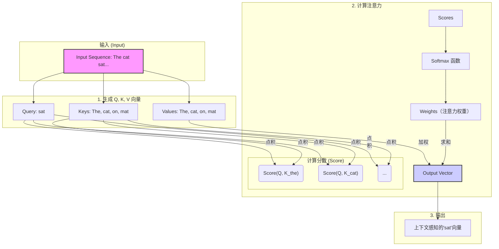
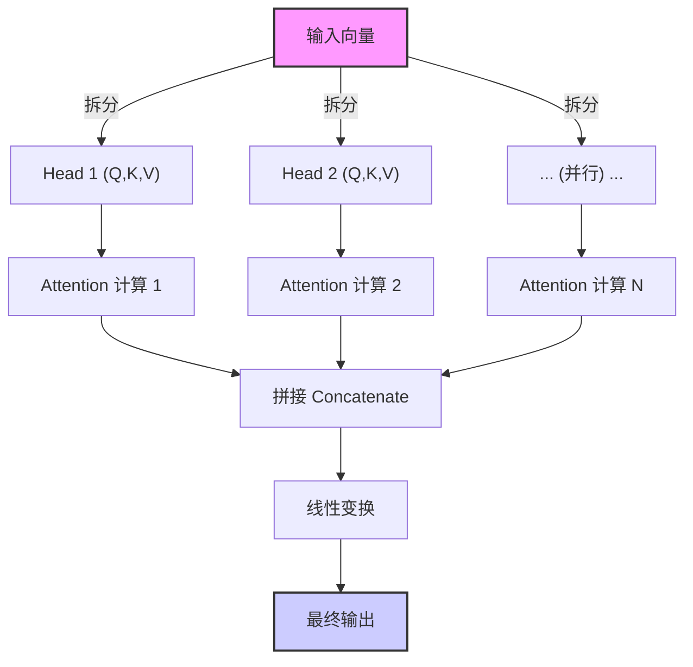
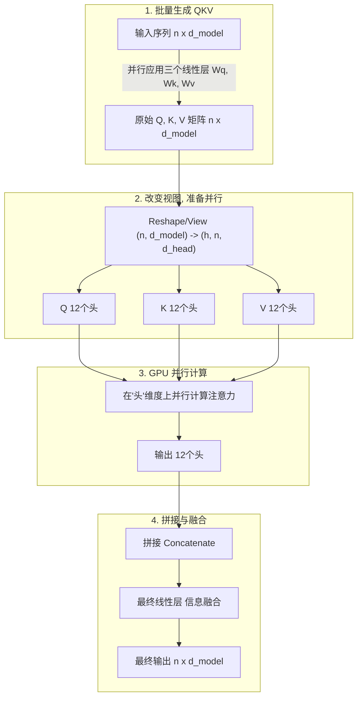
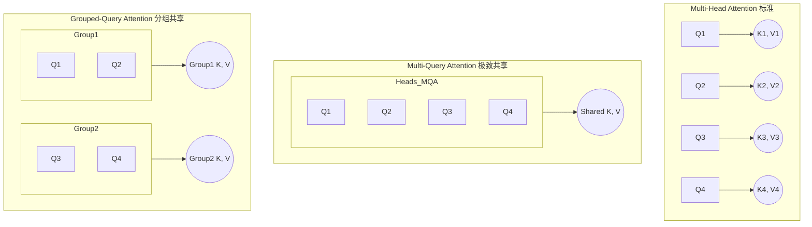
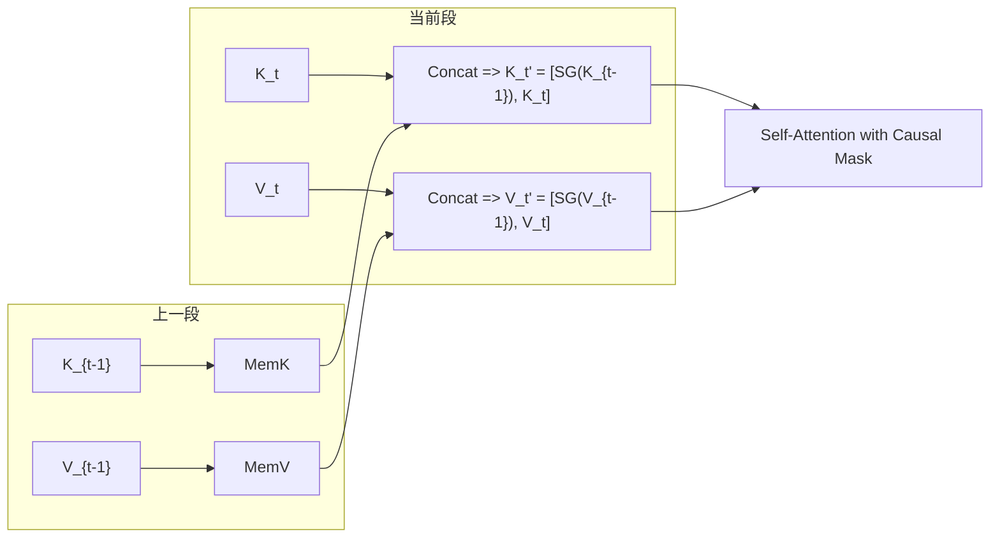
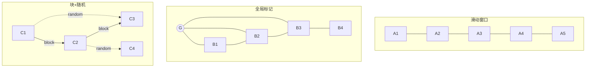

# 从 Attention 到 Multi-Head：Go 工程师也能看懂的大模型注意力机制全解析


你好，Gopher！在我们的世界里，我们用 `goroutine` 和 `channel` 优雅地处理并发，用 `context.Context` 在复杂的调用链中传递信号。我们追求代码的极致性能和资源的高效利用。

当你与 ChatGPT、Claude 或 Gemini 这样的 AI 大模型交互时，你是否曾惊叹于它们如何能准确理解长篇大论的需求，捕捉到对话中那些微妙的上下文关联？比如，当你说“它”的时候，模型如何知道“它”指的是上文提到的“那个新发布的开源库”而不是“你的猫”？

这背后的核心技术，很大程度上归功于一种名为**注意力机制 (Attention Mechanism)** 的强大理念。这篇文章将为你——一位 Golang 程序员——彻底讲透注意力机制。我们将用你熟悉的概念（比如键值存储、缓存命中率）来做类比，并通过图解和案例，让你真正理解它的魅力所在。


## 第一章：从“键值对”到“注意力”——直观理解注意力机制


在 Go 语言中，我们对 `map[string]interface{}` 再熟悉不过了。它是一个简单的键值存储，通过一个 `key`，我们可以精确地查找到对应的 `value`。

现在，让我们把这个简单的概念稍微升级一下，想象一个更智能的“查询”系统。这，就是注意力机制最核心的三个角色：**Query (查询)**、**Key (键)** 和 **Value (值)**，简称 QKV。

- **Query (Q)**: 代表当前需要处理的元素（比如一个单词）发出的“查询请求”。这个请求表达了“我正在寻找与我相关的信息”。
- **Key (K)**: 代表序列中所有可以被关注的元素（包括它自己）所拥有的“键”。它像是在说：“嘿，这是我的标识，你可以通过这个来判断我与你的‘查询’有多相关。”
- **Value (V)**: 代表元素实际包含的“值”或信息。一旦一个 `Key` 被 `Query` 高度关注，它对应的 `Value` 就会被重点“提取”。

**一个简单的例子：**

> The cat sat on the mat. (猫坐在垫子上。)

当模型处理到单词 "sat" (坐) 时，它的 `Query` 可能会问：“这个‘坐’的动作，主语是谁？发生在哪里？”

此时，句子中每个单词的 `Key` 都会响应这个查询：

- "The" 的 `Key` 表示自己是个冠词。
- "cat" 的 `Key` 表示自己是个名词，是个动物。
- "on" 的 `Key` 表示自己是个介词，表位置关系。
- "the" 的 `Key` 再次表示自己是个冠词。
- "mat" 的 `Key` 表示自己是个名词，是个物体。

通过计算 "sat" 的 `Query` 和每个单词 `Key` 之间的“相关性分数”，模型发现 "cat" 和 "mat" 的 `Key` 与 "sat" 的 `Query` 最为相关。因此，它们的 `Value` (即“猫”和“垫子”所代表的深层含义) 就会被赋予最高的权重，从而让模型理解：是“猫”坐在“垫子”上。

这个过程，就像一次**加权的、模糊的键值查询**。它不是返回一个结果，而是返回所有 `Value` 的加权和，权重大小由 `Query` 和 `Key` 的相关性决定。


## 第二章：注意力是怎样炼成的？——深入核心计算


理解了 QKV 的概念，我们来看看这个“相关性分数”和“加权求和”具体是怎么计算的。整个过程分为三步：

1. **计算相关性分数 (Score)**：用每个 `Query` 去和所有的 `Key` 计算一个“相似度”分数。最常见、最高效的方式就是**点积 (Dot Product)**。分数越高，代表 Q 和 K 的相关性越强。
2. **计算权重 (Softmax)**：得到的分数有高有低，需要被“归一化”成一个权重分布。这里使用 `Softmax` 函数，它能将一组任意实数转换成一个和为 1 的概率分布。这就好比将相关性分数，转换成了**“注意力分配比例”**。
3. **加权求和 (Weighted Sum)**：用上一步得到的权重，去乘以每个对应的 `Value`，然后将它们全部相加，得到最终的输出。

我们可以用一个 Mermaid 图来清晰地展示这个流程：





### 关联概念：注意力的“缓存命中率”


对于 Golang 程序员来说，“缓存命中率”是一个衡量性能的关键指标。我们可以用一个类比来理解注意力的权重：

> **注意力的权重 ≈ 缓存命中率**

- **高权重 (High Attention Weight)**: 就像一次**缓存命中 (Cache Hit)**。`Query` 发现了一个高度相关的 `Key`，于是这个 `Key` 对应的 `Value` 被大量“读取”，对最终结果产生巨大影响。
- **低权重 (Low Attention Weight)**: 就像一次**缓存未命中 (Cache Miss)**。`Query` 和某个 `Key` 不相关，于是这个 `Key` 对应的 `Value` 几乎被忽略，权重趋近于零，对结果影响甚微。

通过这种方式，模型在处理每个单词时，都能动态地“命中”上下文中最重要的部分，忽略无关噪声。


## 第三章：进化！从 Self-Attention 到 Multi-Head Attention


我们刚才讨论的，当 Q, K, V 都来源于同一个输入序列时（例如，一句话自己跟自己玩 QKV 游戏），就称为**自注意力机制 (Self-Attention)**。这是像 GPT 这样的解码器模型的核心，它让模型在内部建立起复杂的依赖关系，理解语法、指代和语境。

但这里有个问题：一次注意力计算，可能只能学到一种关系。比如，只学会了“谁做了什么”。但一句话里可能包含多种关系，比如动作的施受者、时态关系、因果关系等等。怎么办？

答案是：**多头注意力机制 (Multi-Head Attention)**。

这个想法非常符合我们 Gopher 的工程思维：**并行化**。

Multi-Head Attention 不做一次大的、复杂的注意力计算，而是把 Q, K, V 向量在维度上切分成多个“头 (Head)”，然后让每个“头”独立地、并行地进行一次完整的 QKV 注意力计算。最后，再把所有“头”的输出结果拼接起来，进行一次线性变换。

**一个绝佳的比喻：**

想象你是一个项目主管，需要评审一份复杂的技术文档。

- **单头注意力**: 你自己从头到尾读一遍，试图理解所有方面（架构、性能、安全、代码风格……）。这很困难，你可能会顾此失彼。

- **多头注意力**: 你找来了几位专家（“头”）：一位架构师，一位性能优化专家，一位安全工程师。你们**并行**阅读文档，每个人都只**关注**自己最擅长的领域。

    - 架构师的“头”会关注服务之间的依赖关系。

    - 性能专家的“头”会关注热点路径和资源消耗。

    - 安全工程师的“头”会关注潜在的漏洞和认证授权。

      最后，你们坐在一起，把各自的发现汇总起来，形成一份全面、深刻的评审报告。

这就是 Multi-Head Attention 的威力。它允许模型从不同子空间、不同角度去理解输入，捕捉到更丰富、更细微的特征。





## 第四章：当注意力遇上大模型：ChatGPT、Gemini 和 KV 缓存


所有现代大语言模型，无论是 OpenAI 的 ChatGPT 系列、Google 的 Gemini，还是 Anthropic 的 Claude，其根基都是一种叫做 **Transformer** 的架构。而 **Multi-Head Attention** 正是 Transformer 架构的心脏。

然而，注意力机制有一个天生的“缺陷”——它的计算复杂度是输入序列长度 `n` 的平方，即 O(n2)。这意味着，当文本越来越长，计算量会爆炸式增长。

在模型进行**推理 (Inference)**，也就是我们聊天时它一个词一个词地生成回答时，这个问题尤为突出。

**场景：** 模型已经生成了 "The cat sat on the..."，现在要预测下一个词。它需要对前面所有的词（The, cat, sat, on, the）进行注意力计算。当它生成了 "mat" 之后，要再预测下一个词，它又需要对（The, cat, sat, on, the, mat）进行计算。

你发现问题了吗？在每一步生成中，对**已经处理过的词**的 `Key` 和 `Value` 向量的计算被**大量重复**了！这对于追求性能的我们来说是不可接受的。

**于是，KV 缓存 (KV Cache) 闪亮登场。**

这是一个**真正**的缓存技术，而不是比喻。它的原理对于 Golang 程序员来说非常容易理解：

> 在自回归生成（一个接一个地生成 token）的过程中，每当一个 token 被处理完，就将其计算出的 `Key` 和 `Value` 向量存储起来（缓存起来）。在下一个时间步，当新的 token（作为 `Query`）需要计算注意力时，它无需为所有历史 token 重新计算 K 和 V，而是直接从缓存中读取它们。

这个简单的优化，极大地提升了 LLM 的推理速度，降低了显存占用，使得长对话和长文生成成为可能。它将每次注意力计算的复杂度从 O(n2) 降低到了 O(n)，因为我们只需要用新的 `Query` 和所有缓存的 `Key` 进行计算。


## 第五章：案例演示：注意力在看哪里？


让我们来看一个更复杂的句子，来感受注意力的威力：

> The robot, which was delivered to the warehouse, quickly charged itself after a long day.
>
> (被运送到仓库的机器人，在劳累了一天后，给自己快速充了电。)

当模型处理到最后一个词 "itself"（它自己）时，它的注意力应该放在哪里？

- **传统模型 (RNN/LSTM)**: 可能会因为距离太远而“遗忘”了主语是“机器人”。它可能会错误地将“itself”与离它更近的“warehouse”（仓库）或“day”（天）关联起来。
- **注意力机制**: "itself" 的 `Query` 会寻找一个可以“自己给自己”做某事的主体。它会扫描整句话的 `Key`，最终发现 "robot" 的 `Key` 与之高度匹配。因此，"robot" 的 `Value` 会获得极高的注意力权重。模型从而清晰地理解，是“机器人”给自己充电，而不是“仓库”或“天”。

这就是注意力机制解决**长距离依赖 (Long-range Dependency)** 问题的能力，也是它相比于旧模型的革命性之处。


## 第六章：深入“多头”内部：一次精心设计的并行计算


我们在前面用“多位专家并行评审”的比喻解释了多头注意力（MHA）。现在，让我们像剖析一段 Go 并发代码一样，看看 MHA 内部的数据流和计算过程。

你可能会问，既然是并行，GPU 是如何高效实现的？这背后是一系列巧妙的线性代数变换，非常像我们在做数据处理时进行的 ETL 操作。

1. **数据准备 (Extract)**：首先，输入的整个句子序列（一个大的数据块），会通过三个独立的线性变换（可以想象成三个不同的 `SELECT` 查询），一次性地计算出完整的 Q、K、V 矩阵。这一步并**没有**物理上把数据拆开。
2. **整形与分组 (Transform)**：接下来是最关键的一步。计算出的 Q, K, V 矩阵会进行一次 `Reshape` 或 `View` 操作。在 Go 里，你可以想象把一个大的 `slice` `[]MyStruct`，通过指针和元数据操作，变成了 `[][][]MyStruct` 的三维结构，而没有实际的数据拷贝。在 PyTorch 中，就是把一个 `(批量大小, 序列长度, 768)` 的张量，变成了 `(批量大小, 12, 序列长度, 64)`。这里的 `12` 就是头的数量，`64` 是每个头的维度。这一步操作，纯粹是改变数据的“视图”，为并行计算做好了准备。
3. **并行计算 (Load)**：GPU 的强大之处在于其大规模并行处理能力。它会把 `12` 个头看作是一个批次维度，然后**同时**对这 12 组 Q, K, V 执行我们第二章提到的“点积 -> Softmax -> 加权求和”操作。这就像启动了 12 个 `goroutine`，每个 `goroutine` 处理一组数据，但它们是在硬件层面被同时执行的。
4. **结果合并 (Aggregate)**：当所有头都计算出自己的结果后，再通过一次 `Reshape` 操作将它们“拼接”回原来的形状，最后通过一个线性层进行信息融合，得到最终的输出。

这是一个更符合工程师视角的 Mermaid 图：




> **⚙️ Gopher 洞察**：这套流程的核心是“先计算，再重组”，而不是“先拆分，再计算”。这最大化地利用了 GPU 对大矩阵运算的优化。它避免了琐碎的、小规模的计算，这与我们在 Go 中会倾向于批量处理数据而不是逐条处理以减少 `syscall` 开销的思路，有异曲同工之妙。


## 第七章：性能瓶颈与“闪电”救援：FlashAttention


随着我们处理的上下文越来越长（比如从几百字增加到几千字），注意力机制的 O(n2) 复杂度带来了两个致命问题：

1. **计算速度慢**：这很好理解。
2. **显存访问爆炸 (I/O Bottleneck)**：这是更隐蔽的杀手。在 GPU 中，从高延迟、大容量的显存（DRAM）读取数据到高速、小容量的缓存（SRAM）是一个昂贵的操作。标准的注意力计算需要反复读写完整的 Q, K, V 和中间的注意力分数矩阵，导致大量的 DRAM I/O。

这就像你的 Go 程序，算法本身的时间复杂度不高，但由于糟糕的内存访问模式（例如，在巨大的 `slice` 中随机跳跃访问），导致 CPU Cache Miss 率飙升，性能急剧下降。

**FlashAttention** 就是来解决这个 **I/O 瓶颈**的“黑科技”。它不是一个全新的算法，而是一项底层的工程优化。

**核心思想：分块计算，减少内存读写。**

与其一次性加载整个 Q, K, V 矩阵到 SRAM，FlashAttention 会这样做：

1. **Tiling (分块)**：将 Q, K, V 矩阵切成一个个小块 (Tile)。
2. **SRAM 上的融合计算**：加载一小块 Q 和一小块 K 到高速的 SRAM 中，**立即**在 SRAM 内部完成点积和 Softmax 的部分计算。计算结果会一直保留在 SRAM 中。
3. **迭代计算**：接着加载下一块 K 和 V，与 SRAM 中已有的中间结果进行合并计算。这个过程不断迭代，直到处理完所有数据块。

整个过程中，巨大的中间注意力分数矩阵（ntimesn）从未被完整地写入到慢速的 DRAM 中，极大地减少了 I/O 次数。

**一个 Go 的类比：**

想象你要计算一个 10GB 巨大文件的 MD5 值。

- **标准做法**：`data, err := ioutil.ReadAll(file)`，一次性把 10GB 文件读入内存，然后计算。如果内存不够，程序就崩溃了。
- **FlashAttention 做法**：使用 `bufio.Reader`，创建一个小的缓冲区（就像 SRAM），`io.Copy(hasher, reader)`，一块一块地读取文件内容到缓冲区，并流式地送入哈希函数进行计算。内存占用极低，且 I/O 友好。

FlashAttention 就是注意力计算的 `bufio` 版实现，通过 Tiling 和 Kernel Fusion 技术，实现了对 GPU 内存层级的极致优化。如今，它已经成为 PyTorch 等主流框架的内置功能，是训练和推理长序列模型的必备组件。


## 第八章：为 KV 缓存“瘦身”：从 MHA 到 MQA 和 GQA


我们在第四章谈到了 KV 缓存对于推理加速的至关重要性。但它也带来了新的问题：**显存占用**。

在多头注意力（MHA）中，每个头都有自己独立的 K 和 V 向量。假设我们有 12 个头，序列长度为 4096，那么我们需要存储 `12 * 4096 * d_head` 这么多的 K 和 V 数据。当上下文窗口增大时，KV 缓存甚至会比模型本身的参数还要占用更多显存！

这就像我们启动了 12 个 `goroutine`，每个 `goroutine` 都 `deep copy` 了一份完整的配置数据，造成了巨大的内存浪费。更聪明的做法是什么？共享只读数据！

于是，两种为 KV 缓存“瘦身”的技术应运而生。


### 8.1 多查询注意力 (Multi-Query Attention, MQA)


MQA 采取了最极致的共享策略：**所有的头共享同一套 K 和 V 向量**。只有 Q 是每个头独有的。

- **优点**: 极大地减少了 KV 缓存的显存占用（减少为原来的 `1/h`，h 是头数）。在推理时，加载 K 和 V 的内存带宽压力也大大降低，从而提速。
- **缺点**: 所有头共享信息，可能会导致信息瓶颈，损失一些模型精度。
- **适用场景**: 对推理速度和显存有极致要求的场景。像 Llama 等模型的早期版本就采用了它。


### 8.2 分组查询注意力 (Grouped-Query Attention, GQA)


GQA 是 MHA 和 MQA 之间的一个完美折中。它将 12 个头分成若干个组，比如分成 4 组，每组 3 个头。**组内的头共享同一套 K 和 V**。

- **优点**: 在显存节省和模型性能之间取得了绝佳的平衡。相比 MQA，它保留了更多的信息多样性；相比 MHA，它显著降低了 KV 缓存的大小。
- **适用场景**: 目前的主流选择。像 Llama 2/3、Mistral 等顶尖模型都采用了 GQA 技术，实现了长上下文窗口下的高效推理。

我们可以用一张图来直观地理解三者的区别：




> **💡 Gopher 洞察**: MQA/GQA 的思想和 Go 并发编程中的资源共享模式如出一辙。MHA 像是每个 goroutine 都有独立的 `*sql.DB` 连接池；MQA 像是所有 goroutine 共享一个全局的 `*sql.DB` 实例；而 GQA 则像是我们创建了几个有界的、分组的连接池，不同的 goroutine 组使用不同的连接池，实现了隔离与效率的平衡。


## 第九章：Cross-/Memory-/Sparse Attention：三把扩展之钥

这一章我们引入三种在工业界非常常见、且与自注意力（Self-Attention）并列的重要机制：**Cross-Attention**、**Memory-Attention** 与 **Sparse-Attention**。它们分别解决“多源对齐”“长程记忆”与“平方复杂度”的现实问题。

### 9.1 Cross-Attention（交叉注意力）
**场景**：编码器-解码器（Encoder–Decoder）架构（如 T5/BART）或 RAG 等检索增强场景。

- **定义**：Query 来自解码端隐状态（当前生成位置），Key/Value 来自外部源（编码端输出、检索文档、工具返回等）。
- **形状与公式**：
  - 设解码端隐状态 $H_{dec} \in \mathbb{R}^{B\times L_t\times d_{model}}$，编码端输出 $H_{enc} \in \mathbb{R}^{B\times L_s\times d_{model}}$。
  - 线性映射：
    $$
    Q = H_{dec} W_Q^{dec},\quad K = H_{enc} W_K^{enc},\quad V = H_{enc} W_V^{enc}
    $$
  - 计算注意力：
    $$
    \text{Attn}(Q,K,V) = \text{Softmax}\!\left(\frac{QK^\top}{\sqrt{d_{head}}}\right) V
    $$
- **直觉类比（Go）**：解码器像是你的“业务服务”，向“搜索服务/知识库”（编码器输出或检索结果）发查询；Q 是业务问题，K/V 是知识库的索引与条目内容。

> 在 **ChatGPT + 检索** 流程中，检索到的文档被编码为向量，作为 K/V；当前的对话状态提供 Q，通过 Cross-Attention 将外部知识融入生成过程。


### 9.2 Memory-Attention（记忆注意力）
**目标**：在不显著增加计算量的前提下，建立 **长时依赖**。

常见两类做法：

1) **段级记忆（Transformer-XL 思路）**：
   - 把长序列切成若干段。对第 $t$ 段计算时，把上段的 **Key/Value** 作为只读 **Memory** 拼接在当前段的 K/V 前面（梯度不回传到旧段）。
   - 公式化：
     $$
     K_t' = [\text{SG}(K_{t-1}),\ K_t],\quad V_t' = [\text{SG}(V_{t-1}),\ V_t]
     $$
     其中 SG 是 stop-gradient，确保旧记忆不被更新。
   - **掩码**：仍使用因果掩码，禁止“看见未来”。

2) **外部/检索记忆（KNN-LM / Memorizing Transformer / RAG）**：
   - 维护一个向量库（长期记忆），按需检索相似向量并作为 **额外 K/V** 拼接；解码端对其做 Cross-Attention。

**Go 类比**：把上一批任务的只读快照（memory）加入到本批计算中；或在运行中查询一个外部只读 KV 存储，并在注意力阶段将其“并联进来”。

Mermaid 图（段级记忆）：


### 9.3 Sparse-Attention（稀疏注意力）
**问题**：全连接注意力是 $\mathcal{O}(n^2)$。

**思路**：把“每个 token 都看所有位置”改成“**局部 + 少量全局/随机** 的图连接”，复杂度接近 $\mathcal{O}(n\cdot w)$ 或 $\mathcal{O}(n)$。

常见图样：
- **滑动窗口（Local/Sliding Window）**：每个位置只看前后 $w$ 个 token。
- **全局标记（Global Tokens）**：少数“汇总”token（如 CLS）与全体互联。
- **随机/块稀疏（Random/Block Sparse）**：注入少量随机或分块跨越连接，保证可达性与表达力（如 BigBird/Longformer）。

简单示意：


**工程权衡**：
- 局部窗口 $w$ 越大，信息流越畅通但显存/算力越高；
- 少量全局/随机边能显著提升可达性与理论表达力，同时保持线性/近线性复杂度。


## 第十章：以 ChatGPT 对话为例：从一个提问到连续生成的整个流水线

下面用一个具体对话片段串起 **自注意力、因果掩码、KV 缓存、（可选）Cross-Attention/RAG** 的全流程。

> **用户**："用 Go 写一个最小的 HTTP 服务器，并解释每行代码。"

### 10.1 第一步：分词与嵌入
- 文本被分成 token 序列 $x_{1:L}$。
- 查表得到词向量并加上位置编码（常见为 **RoPE** 旋转位置编码）。对每一层的 Q/K 应用旋转：
  $$
  \text{RoPE}(q_m) = R_m \cdot q_m,\quad \text{RoPE}(k_m) = R_m \cdot k_m
  $$
  其中 $R_m$ 是按频率构造的二维旋转块对角矩阵（不同维度频率不同）。

### 10.2 第二步：逐层计算（以一层为例）
1) 线性映射并 reshape：
$$
Q = X W_Q,\ K = X W_K,\ V = X W_V \;\Rightarrow\; [B,L,h,d_{head}]
$$
2) **因果掩码（Causal Mask）**：对未来位置 $j>i$ 的得分置为 $-\infty$：
$$
S_{ij} = \begin{cases}
  \frac{q_i k_j^\top}{\sqrt{d_{head}}}, & j \le i \\
  -\infty, & j>i
\end{cases}
$$
3) **数值稳定 Softmax**：
$$
\text{Softmax}(s_i) = \frac{\exp(s_i-\max(s_i))}{\sum_j \exp(s_j-\max(s_i))}
$$
4) 权重与加权和： $P=\text{Softmax}(S),\ Y = P V$。
5) 残差 + 前馈（MLP）+ LayerNorm，得到该层输出，层层堆叠。

### 10.3 第三步：自回归生成与 KV 缓存
- 第一个生成步（例如要生成第 $L+1$ 个 token），会把历史 token 的 K/V **写入 KV-Cache**：
  ```text
  cache.K[layer][1:L], cache.V[layer][1:L]
  ```
- 之后每一步只需：
  1) 计算新 token 的 $q_{L+t}$；
  2) 与缓存的 K 做点积，免去历史 K/V 的重复计算；
  3) 更新缓存：追加 $k_{L+t}, v_{L+t}$。

### 10.4 第四步：（可选）检索增强 Cross-Attention
- 如果系统触发检索/工具调用，取回文档向量作为外部 **K/V**；
- 当前对话隐状态产出 **Q**，对外部 K/V 做一次 Cross-Attention，把外部知识融合进解码。

### 10.5 第五步：采样与流式输出
- 线性层 + logits；按 **temperature**、**top-p** 等策略采样下一个 token；
- 通过流（SSE/HTTP chunk）把新 token 持续推给客户端，形成你熟悉的“逐字打印”。


## 第十一章：未来展望：Attention 的继任者们？


尽管 Attention 机制如此强大，但其 O(n2) 的计算复杂度仍然是探索无限长上下文的根本障碍。学术界和工业界正在积极探索新的、更高效的架构，这有点像数据库领域从通用的 B-Tree 索引，演进出为特定场景设计的列存、向量存储等。

目前有几个热门的竞争者：

- **状态空间模型 (State-Space Models, SSM)**: 如 Mamba。它的计算模式更像传统的 RNN，以线性复杂度 O(n) 进行序列处理。它擅长处理超长序列，但在捕捉复杂模式上仍在追赶 Attention。
- **长卷积 (Long Convolutions)**: 如 Hyena。它巧妙地用卷积操作来模拟长距离依赖，并通过 FFT 等算法优化，复杂度为 O(nlogn)。
- **混合架构 (Hybrid Architectures)**: 这可能是近期最现实的路径。比如，在模型底层使用线性复杂度的 SSM 或卷积来处理长距离的粗粒度信息，在高层仍然使用 FlashAttention 来处理局部、精细的依赖关系。

> **🔭 趋势洞察**：纯粹的 Transformer 可能不会永远统治世界。未来的大模型很可能会演变成一个**混合系统**，就像我们现代的微服务架构一样，根据任务的特性（短文本理解、长文摘要、代码生成），智能地路由到最适合的计算组件（Attention, SSM, Conv...）。对于我们工程师来说，理解不同组件的性能特点和适用场景，将变得越来越重要。

## 结论


好了，Gopher！现在我们来总结一下今天的核心要点：

1. **QKV 模型是基石**: 注意力机制通过 Query、Key、Value 三个角色，实现了一次“智能”的、加权的信息检索。
2. **多头注意力是进化**: 通过并行化多个注意力“头”，模型能从不同角度理解文本，捕捉更丰富的上下文信息。这与我们通过并发提升系统吞吐和维度的思想不谋而合。
3. **大模型的动力核心**: Multi-Head Attention 是 Transformer 架构的心脏，驱动着 ChatGPT、Gemini 等所有顶尖大模型。
4. **KV 缓存是性能关键**: 对于我们程序员来说，理解 KV 缓存尤为重要。它是一个简单而高效的工程优化，是让大模型能够在你我面前流畅对话的关键所在。

希望这篇博客能帮你揭开注意力机制的神秘面纱。当你下一次和 AI 对话，或是看到某个 AI 项目宣称支持更长的“上下文窗口”时，你就能会心一笑，因为你已经洞悉了它背后最核心的技术原理和性能关键。