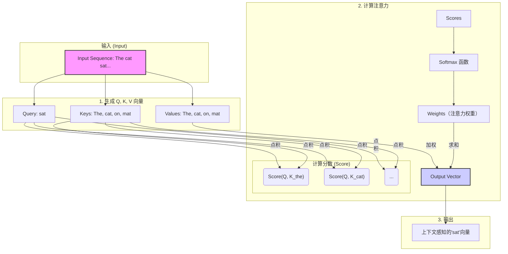
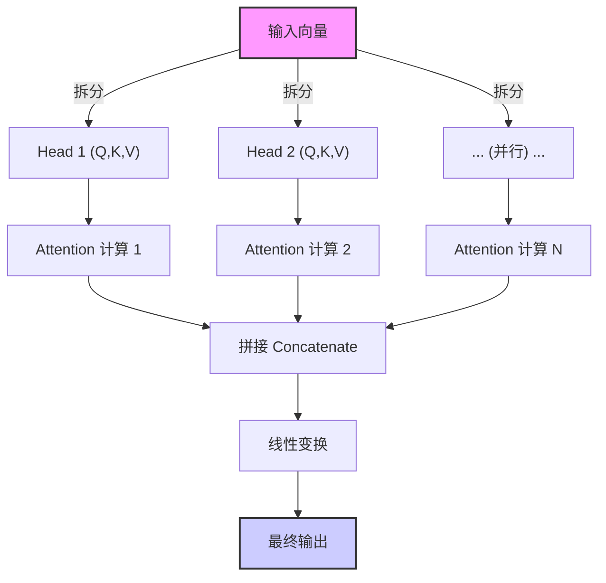
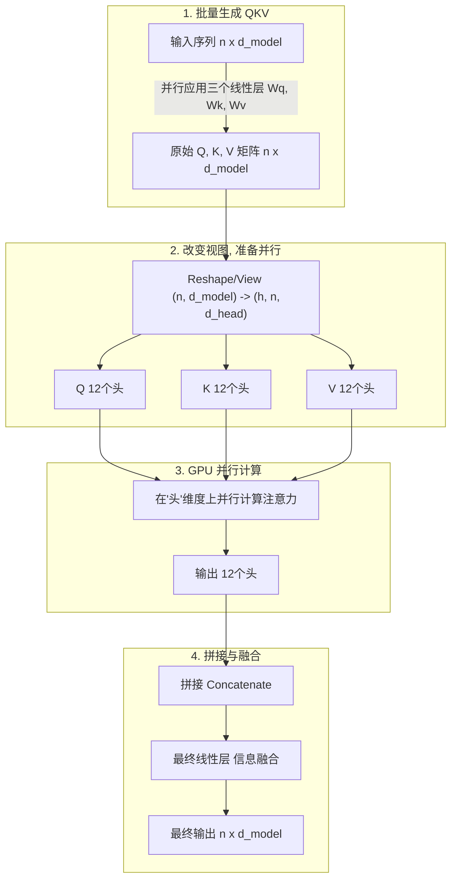
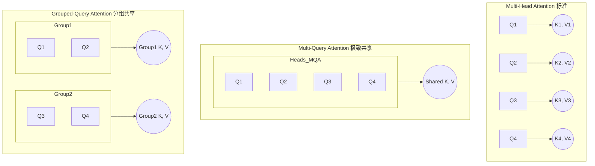
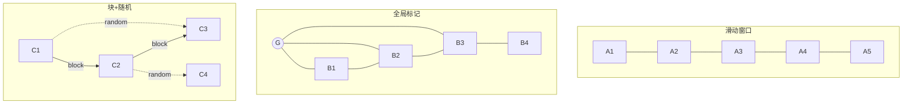

# 从 Attention 到 Multi-Head：Go 工程师也能看懂的大模型注意力机制全解析

你好，Gopher！在我们的世界里，我们用 `goroutine` 和 `channel` 优雅地处理并发，用 `context.Context` 在复杂的调用链中传递信号。我们追求代码的极致性能和资源的高效利用。

当你与 ChatGPT、Claude 或 Gemini 这样的 AI 大模型交互时，你是否曾惊叹于它们如何能准确理解长篇大论的需求，捕捉到对话中那些微妙的上下文关联？比如，当你说“它”的时候，模型如何知道“它”指的是上文提到的“那个新发布的开源库”而不是“你的猫”？

这背后的核心技术，很大程度上归功于一种名为**注意力机制 (Attention Mechanism)** 的强大理念。这篇文章将为你——一位 Golang 程序员——彻底讲透注意力机制。我们将用你熟悉的概念（比如键值存储、缓存命中率）来做类比，并通过图解和案例，让你真正理解它的魅力所在。

## 第一章：从“键值对”到“注意力”——直观理解注意力机制

在 Go 语言中，我们对 `map[string]interface{}` 再熟悉不过了。它是一个简单的键值存储，通过一个 `key`，我们可以精确地查找到对应的 `value`。

现在，让我们把这个简单的概念稍微升级一下，想象一个更智能的“查询”系统。这，就是注意力机制最核心的三个角色：**Query (查询)**、**Key (键)** 和 **Value (值)**，简称 QKV。

- **Query (Q)**: 代表当前需要处理的元素（比如一个单词）发出的“查询请求”。这个请求表达了“我正在寻找与我相关的信息”。
- **Key (K)**: 代表序列中所有可以被关注的元素（包括它自己）所拥有的“键”。它像是在说：“嘿，这是我的标识，你可以通过这个来判断我与你的‘查询’有多相关。”
- **Value (V)**: 代表元素实际包含的“值”或信息。一旦一个 `Key` 被 `Query` 高度关注，它对应的 `Value` 就会被重点“提取”。

**一个简单的例子：**

> The cat sat on the mat. (猫坐在垫子上。)

当模型处理到单词 "sat" (坐) 时，它的 `Query` 可能会问：“这个‘坐’的动作，主语是谁？发生在哪里？”

此时，句子中每个单词的 `Key` 都会响应这个查询：

- "The" 的 `Key` 表示自己是个冠词。
- "cat" 的 `Key` 表示自己是个名词，是个动物。
- "on" 的 `Key` 表示自己是个介词，表位置关系。
- "the" 的 `Key` 再次表示自己是个冠词。
- "mat" 的 `Key` 表示自己是个名词，是个物体。

通过计算 "sat" 的 `Query` 和每个单词 `Key` 之间的“相关性分数”，模型发现 "cat" 和 "mat" 的 `Key` 与 "sat" 的 `Query` 最为相关。因此，它们的 `Value` (即“猫”和“垫子”所代表的深层含义) 就会被赋予最高的权重，从而让模型理解：是“猫”坐在“垫子”上。

这个过程，就像一次**加权的、模糊的键值查询**。它不是返回一个结果，而是返回所有 `Value` 的加权和，权重大小由 `Query` 和 `Key` 的相关性决定。

## 第二章：注意力是怎样炼成的？——深入核心计算

理解了 QKV 的概念，我们来看看这个“相关性分数”和“加权求和”具体是怎么计算的。整个过程分为三步：

1.  **计算相关性分数 (Score)**：用每个 `Query` 去和所有的 `Key` 计算一个“相似度”分数。最常见、最高效的方式就是**点积 (Dot Product)**。分数越高，代表 Q 和 K 的相关性越强。
2.  **计算权重 (Softmax)**：得到的分数有高有低，需要被“归一化”成一个权重分布。这里使用 `Softmax` 函数，它能将一组任意实数转换成一个和为 1 的概率分布。这就好比将相关性分数，转换成了**“注意力分配比例”**。
3.  **加权求和 (Weighted Sum)**：用上一步得到的权重，去乘以每个对应的 `Value`，然后将它们全部相加，得到最终的输出。

### 专业定义：缩放点积注意力 (Scaled Dot-Product Attention)

这套流程有一个标准化的名字和公式，你会在所有论文和框架中看到它：

$$
\text{Attention}(Q, K, V) = \text{softmax}\left(\frac{QK^\top}{\sqrt{d_k}}\right)V
$$

让我们用 Gopher 的思维来拆解这个公式：

-   $QK^\top$: 这里的 $Q$ 和 $K$ 都是矩阵。这个操作就是计算出每个 `Query` 向量和所有 `Key` 向量的点积。结果是一个“注意力分数”矩阵，每一行都代表一个词对其他所有词的关注度。
-   $\sqrt{d_k}$: 这是**缩放因子 (Scale)**。$d_k$ 是 Key 向量的维度。为什么要除以它？当向量维度很高时（比如 512），两个随机向量的点积的方差会随维度线性增长。过大的点积值会将 Softmax 函数推向饱和区域，导致梯度消失和注意力分布过于尖锐，影响模型训练稳定性。除以 $\sqrt{d_k}$ 是为了将点积结果的方差重新缩放回 1，保证了数值的稳定性。这是一个不起眼但至关重要的工程技巧。
-   $\text{softmax}(\dots)$: 将缩放后的分数矩阵进行 `Softmax` 运算，将其转换为概率分布（权重），确保每行的和为 1。
-   $(\dots)V$: 最后，用这个权重矩阵去乘以 `Value` 矩阵。本质上，就是对所有的 `Value` 向量进行加权求和，得到最终的输出。

这个公式完美地封装了“按需查询、加权返回”的核心思想。

我们可以用一个 Mermaid 图来清晰地展示这个流程：

### 关联概念：注意力的“缓存命中率”

对于 Golang 程序员来说，“缓存命中率”是一个衡量性能的关键指标。我们可以用一个类比来理解注意力的权重：

> **注意力的权重 ≈ 缓存命中率**

- **高权重 (High Attention Weight)**: 就像一次**缓存命中 (Cache Hit)**。`Query` 发现了一个高度相关的 `Key`，于是这个 `Key` 对应的 `Value` 被大量“读取”，对最终结果产生巨大影响。
- **低权重 (Low Attention Weight)**: 就像一次**缓存未命中 (Cache Miss)**。`Query` 和某个 `Key` 不相关，于是这个 `Key` 对应的 `Value` 几乎被忽略，权重趋近于零，对结果影响甚微。

通过这种方式，模型在处理每个单词时，都能动态地“命中”上下文中最重要的部分，忽略无关噪声。

## 第三章：进化！从 Self-Attention 到 Multi-Head Attention

我们刚才讨论的，当 Q, K, V 都来源于同一个输入序列时（例如，一句话自己跟自己玩 QKV 游戏），就称为**自注意力机制 (Self-Attention)**。这是像 GPT 这样的解码器模型的核心，它让模型在内部建立起复杂的依赖关系，理解语法、指代和语境。

但这里有个问题：单头注意力在高维空间中虽然也能捕捉多种关系，但多头机制通过将特征空间分解为多个子空间，能让模型并行地学习到更细粒度、甚至互补的特征表示。怎么办？

答案是：**多头注意力机制 (Multi-Head Attention)**。

这个想法非常符合我们 Gopher 的工程思维：**并行化**。

Multi-Head Attention 不做一次大的、复杂的注意力计算，而是把 Q, K, V 向量在维度上切分成多个“头 (Head)”，然后让每个“头”独立地、并行地进行一次完整的 QKV 注意力计算。最后，再把所有“头”的输出结果拼接起来，进行一次线性变换。

**关于头数和维度的选择**：
以一个 768 维的向量为例，Transformer 论文中选择了 12 个头。这意味着总维度被分成了 `12 * 64`。
- **为什么是 12？** 这是一个经验性的权衡。头数太少，并行学习多种特征的能力受限；头数太多，每个头的维度过低（比如低于 32），可能无法捕捉足够复杂的语义信息，且计算碎片化可能不利用 GPU 优化。12 头被证明是一个在模型表达能力和计算效率之间的良好折中点。

**一个绝佳的比喻：**

想象你是一个项目主管，需要评审一份复杂的技术文档。

- **单头注意力**: 你自己从头到尾读一遍，试图理解所有方面（架构、性能、安全、代码风格……）。这很困难，你可能会顾此失彼。

- **多头注意力**: 你找来了几位专家（“头”）：一位架构师，一位性能优化专家，一位安全工程师。你们**并行**阅读文档，每个人都只**关注**自己最擅长的领域。

    - 架构师的“头”会关注服务之间的依赖关系。

    - 性能专家的“头”会关注热点路径和资源消耗。

    - 安全工程师的“头”会关注潜在的漏洞和认证授权。

      最后，你们坐在一起，把各自的发现汇总起来，形成一份全面、深刻的评审报告。

这就是 Multi-Head Attention 的威力。它允许模型从不同子空间、不同角度去理解输入，捕捉到更丰富、更细微的特征。

### 专业定义：多头注意力 (Multi-Head Attention)

多头注意力的计算过程也可以用一个公式来优雅地概括：

$$
\text{MultiHead}(Q, K, V) = \text{Concat}(\text{head}_1, \dots, \text{head}_h)W^O
$$

其中，每个“头”都是一次独立的缩放点积注意力计算：

$$
\text{head}_i = \text{Attention}(QW_i^Q, KW_i^K, VW_i^V)
$$

-   $W_i^Q, W_i^K, W_i^V$: 这些是为每个头 $i$ 专门学习的权重矩阵。它们的作用就像是不同的“透镜”，在输入 Q, K, V 进入注意力计算之前，先把它们投影到不同的、更小的子空间中。这就是“从不同角度去理解”的数学实现。
-   $\text{Attention}(\dots)$: 每个头都执行我们上一章学到的标准注意力计算，但输入是经过投影后的 Q, K, V。
-   $\text{Concat}(\dots)$: 把所有 `head` 的输出向量拼接在一起。就像专家们开完会，把各自的报告汇总到一份文档里。
-   $W^O$: 最后一个线性变换矩阵，用于将拼接后的结果重新整合、降维，并输出最终的向量。

这个结构，将一次高维度的复杂计算，分解成了多次低维度的并行计算，完美契合了 GPU 的硬件特性。

## 第四章：当注意力遇上大模型：ChatGPT、Gemini 和 KV 缓存

所有现代大语言模型，无论是 OpenAI 的 ChatGPT 系列、Google 的 Gemini，还是 Anthropic 的 Claude，其根基都是一种叫做 **Transformer** 的架构。而 **Multi-Head Attention** 正是 Transformer 架构的心脏。

然而，注意力机制有一个天生的“缺陷”——它的计算复杂度是输入序列长度 `n` 的平方，即 O(n2)。这意味着，当文本越来越长，计算量会爆炸式增长。

在模型进行**推理 (Inference)**，也就是我们聊天时它一个词一个词地生成回答时，这个问题尤为突出。

**场景：** 模型已经生成了 "The cat sat on the..."，现在要预测下一个词。它需要对前面所有的词（The, cat, sat, on, the）进行注意力计算。当它生成了 "mat" 之后，要再预测下一个词，它又需要对（The, cat, sat, on, the, mat）进行计算。

你发现问题了吗？在每一步生成中，对**已经处理过的词**的 `Key` 和 `Value` 向量的计算被**大量重复**了！这对于追求性能的我们来说是不可接受的。

**于是，KV 缓存 (KV Cache) 闪亮登场。**

这是一个**真正**的缓存技术，而不是比喻。它的原理对于 Golang 程序员来说非常容易理解：

> 在自回归生成（一个接一个地生成 token）的过程中，每当一个 token 被处理完，就将其计算出的 `Key` 和 `Value` 向量存储起来（缓存起来）。在下一个时间步，当新的 token（作为 `Query`）需要计算注意力时，它无需为所有历史 token 重新计算 K 和 V，而是直接从缓存中读取它们。

这个简单的优化，极大地提升了 LLM 的推理速度，降低了显存占用，使得长对话和长文生成成为可能。它将每次注意力计算的复杂度从 O(n2) 降低到了 O(n)，因为我们只需要用新的 `Query` 和所有缓存的 `Key` 进行计算。

## 第五章：案例演示：注意力在看哪里？

让我们来看一个更复杂的句子，来感受注意力的威力：

> The robot, which was delivered to the warehouse, quickly charged itself after a long day.
>
> (被运送到仓库的机器人，在劳累了一天后，给自己快速充了电。)

当模型处理到最后一个词 "itself"（它自己）时，它的注意力应该放在哪里？

- **传统模型 (RNN/LSTM)**: 可能会因为距离太远而“遗忘”了主语是“机器人”。它可能会错误地将“itself”与离它更近的“warehouse”（仓库）或“day”（天）关联起来。
- **注意力机制**: "itself" 的 `Query` 会寻找一个可以“自己给自己”做某事的主体。它会扫描整句话的 `Key`，最终发现 "robot" 的 `Key` 与之高度匹配。因此，"robot" 的 `Value` 会获得极高的注意力权重。模型从而清晰地理解，是“机器人”给自己充电，而不是“仓库”或“天”。

这就是注意力机制解决**长距离依赖 (Long-range Dependency)** 问题的能力，也是它相比于旧模型的革命性之处。

## 第六章：深入“多头”内部：一次精心设计的并行计算

我们在前面用“多位专家并行评审”的比喻解释了多头注意力（MHA）。现在，让我们像剖析一段 Go 并发代码一样，看看 MHA 内部的数据流和计算过程。

你可能会问，既然是并行，GPU 是如何高效实现的？这背后是一系列巧妙的线性代数变换，非常像我们在做数据处理时进行的 ETL 操作。

1. **数据准备 (Extract)**：首先，输入的整个句子序列（一个大的数据块），会通过三个独立的线性变换（可以想象成三个不同的 `SELECT` 查询），一次性地计算出完整的 Q、K、V 矩阵。这一步并**没有**物理上把数据拆开。
2. **整形与分组 (Transform)**：接下来是最关键的一步。计算出的 Q, K, V 矩阵会进行一次 `Reshape` 或 `View` 操作。在 Go 里，你可以想象把一个大的 `slice` `[]MyStruct`，通过指针和元数据操作，变成了 `[][][]MyStruct` 的三维结构，而没有实际的数据拷贝。在 PyTorch 中，就是把一个 `(批量大小, 序列长度, 768)` 的张量，变成了 `(批量大小, 12, 序列长度, 64)`。这里的 `12` 就是头的数量，`64` 是每个头的维度。这一步操作，纯粹是改变数据的“视图”，为并行计算做好了准备。
3. **并行计算 (Load)**：GPU 的强大之处在于其大规模并行处理能力。它会把 `12` 个头看作是一个批次维度，然后**同时**对这 12 组 Q, K, V 执行我们第二章提到的“点积 -> Softmax -> 加权求和”操作。这就像启动了 12 个 `goroutine`，每个 `goroutine` 处理一组数据，但它们是在硬件层面被同时执行的。
4. **结果合并 (Aggregate)**：当所有头都计算出自己的结果后，再通过一次 `Reshape` 操作将它们“拼接”回原来的形状，最后通过一个线性层进行信息融合，得到最终的输出。

这是一个更符合工程师视角的 Mermaid 图：

> **⚙️ Gopher 洞察**：这套流程的核心是“先计算，再重组”，而不是“先拆分，再计算”。这最大化地利用了 GPU 对大矩阵运算的优化。它避免了琐碎的、小规模的计算，这与我们在 Go 中会倾向于批量处理数据而不是逐条处理以减少 `syscall` 开销的思路，有异曲同工之妙。

## 第七章：性能瓶颈与“闪电”救援：FlashAttention

随着我们处理的上下文越来越长（比如从几百字增加到几千字），注意力机制的 O(n2) 复杂度带来了两个致命问题：

1. **计算速度慢**：这很好理解。
2. **显存访问爆炸 (I/O Bottleneck)**：这是更隐蔽的杀手。在 GPU 中，从高延迟、大容量的显存（DRAM）读取数据到高速、小容量的缓存（SRAM）是一个昂贵的操作。标准的注意力计算需要反复读写完整的 Q, K, V 和中间的注意力分数矩阵，导致大量的 DRAM I/O。

这就像你的 Go 程序，算法本身的时间复杂度不高，但由于糟糕的内存访问模式（例如，在巨大的 `slice` 中随机跳跃访问），导致 CPU Cache Miss 率飙升，性能急剧下降。

**FlashAttention** 就是来解决这个 **I/O 瓶颈**的“黑科技”。它不是一个全新的算法，而是一项底层的工程优化，其核心是**内核融合 (Kernel Fusion)** 和 **重计算 (Recomputation)**。

**核心思想：分块计算，融合内核，减少内存读写。**

与其一次性加载整个 Q, K, V 矩阵到 SRAM，FlashAttention 会这样做：

1.  **Tiling (分块)**：将 Q, K, V 矩阵切成一个个小块 (Tile)。Tile 的大小需精心选择，以确保能完全装入 GPU 的高速 SRAM 中，这是触发优化的前提。
2.  **SRAM 上的融合计算 (Kernel Fusion)**：加载一小块 Q 和一小块 K 到高速的 SRAM 中，**立即**在 SRAM 内部通过一个**融合后的 CUDA 内核**完成点积、Softmax、加权求和等多个操作。计算结果会一直保留在 SRAM 中。
3.  **迭代与重计算 (Recomputation)**：接着加载下一块 K 和 V，与 SRAM 中已有的中间结果进行合并计算。为了节省显存，FlashAttention 不会存储用于反向传播的庞大中间注意力矩阵，而是在反向传播时**重新计算**部分必要的中间结果。这是一种“以计算换显存”的策略。

整个过程中，巨大的中间注意力分数矩阵（n x n）从未被完整地写入到慢速的 DRAM 中，通过内核融合和重计算，极大地减少了 I/O 次数和显存峰值。

**一个 Go 的类比：**

想象你要计算一个 10GB 巨大文件的 MD5 值。

- **标准做法**：`data, err := ioutil.ReadAll(file)`，一次性把 10GB 文件读入内存，然后计算。如果内存不够，程序就崩溃了。
- **FlashAttention 做法**：使用 `bufio.Reader`，创建一个小的缓冲区（就像 SRAM），`io.Copy(hasher, reader)`，一块一块地读取文件内容到缓冲区，并流式地送入哈希函数进行计算。内存占用极低，且 I/O 友好。

FlashAttention 就是注意力计算的 `bufio` 版实现，通过 Tiling 和 Kernel Fusion 技术，实现了对 GPU 内存层级的极致优化。如今，它已经成为 PyTorch 等主流框架的内置功能，是训练和推理长序列模型的必备组件。

## 第八章：为 KV 缓存“瘦身”：从 MHA 到 MQA 和 GQA

我们在第四章谈到了 KV 缓存对于推理加速的至关重要性。但它也带来了新的问题：**显存占用**。

在多头注意力（MHA）中，每个头都有自己独立的 K 和 V 向量。假设我们有 `h` 个头，序列长度为 `seq_len`，每个头的维度为 `d_head`，那么我们需要存储的 KV 缓存大小为 `h * seq_len * d_head`。当上下文窗口增大时，KV 缓存甚至会比模型本身的参数还要占用更多显存！

**这就像我们构建一个高并发的 Go 后端服务，面对海量请求。**

-   **MHA (Multi-Head Attention)** 的做法，相当于为每个 `goroutine` 都 `deep copy` 了一份完整的、独立的配置数据和数据库连接池。这显然是巨大的资源浪费。
-   **更聪明的做法是什么？** 共享只读数据！

于是，两种为 KV 缓存“瘦身”的技术应运而生。

### 8.1 多查询注意力 (Multi-Query Attention, MQA)

MQA 采取了最极致的共享策略：**所有的头共享同一套 K 和 V 向量**。只有 Q 是每个头独有的。

-   **内存节省**: KV 缓存大小从 MHA 的 `h * seq_len * d_head` 急剧减少到 `seq_len * d_head`，节省了 `h` 倍。
-   **Go 类比**: 就像所有 `goroutine` 共享一个全局的 `*sql.DB` 实例。内存效率最高，但所有查询都挤在同一个通道，可能会成为性能瓶颈或信息瓶颈。
-   **优点**: 极大地减少了 KV 缓存的显存占用（减少为原来的 `1/h`，h 是头数）。在推理时，加载 K 和 V 的内存带宽压力也大大降低，从而提速。
-   **缺点**: 所有头共享信息，可能会导致信息瓶颈，损失一些模型精度。
-   **适用场景**: 对推理速度和显存有极致要求的场景。像 Llama 等模型的早期版本就采用了它。

### 8.2 分组查询注意力 (Grouped-Query Attention, GQA)

GQA 是 MHA 和 MQA 之间的一个完美折中。它将 `h` 个头分成 `g` 个组，比如将 12 个头分成 4 组，每组 3 个头。**组内的头共享同一套 K 和 V**。

-   **内存节省**: KV 缓存大小为 `g * seq_len * d_head`，介于 MHA 和 MQA 之间。
-   **Go 类比**: 这就像我们创建了几个有界的、分组的连接池。比如，处理用户请求的 `goroutine` 组使用一个连接池，处理内部任务的 `goroutine` 组使用另一个。实现了隔离与效率的平衡。
-   **优点**: 在显存节省和模型性能之间取得了绝佳的平衡。相比 MQA，它保留了更多的信息多样性；相比 MHA，它显著降低了 KV 缓存的大小。
-   **适用场景**: 目前的主流选择。像 Llama 2/3、Mistral 等顶尖模型都采用了 GQA 技术，实现了长上下文窗口下的高效推理。

我们可以用一张图来直观地理解三者的区别：

> **💡 Gopher 洞察**: MQA/GQA 的思想和 Go 并发编程中的资源共享模式如出一辙。MHA 像是每个 goroutine 都有独立的 `*sql.DB` 连接池；MQA 像是所有 goroutine 共享一个全局的 `*sql.DB` 实例；而 GQA 则像是我们创建了几个有界的、分组的连接池，不同的 goroutine 组使用不同的连接池，实现了隔离与效率的平衡。

## 第九章：Attention 的“瑞士军刀”：交叉、记忆与稀疏注意力

到目前为止，我们主要讨论的是 **自注意力 (Self-Attention)**，即一句话自己和自己玩 QKV 游戏，来理解内部的语法和语境。但这把“瑞士军刀”还有其他几种强大的刀片，它们在工业界非常常见，解决了更复杂的问题。

### 9.1 交叉注意力 (Cross-Attention)：让模型“博览群书”

**场景**: 当模型需要理解两种不同信息源之间的关系时。最典型的就是“翻译”或“问答”任务。

-   **定义**: Query 来自解码端隐状态（当前生成位置），Key/Value 来自外部源（编码端输出、检索文档、工具返回等）。
-   **Go 类比**: 想象你的主业务服务 (作为 `Query`) 需要调用一个外部的“知识库”微服务（比如 Elasticsearch，它提供 `Key` 和 `Value`）。主服务提出问题 (Q)，知识库返回最相关的文档片段 (V)，权重由 Q 和文档索引 (K) 的相关性决定。这就是一次 Cross-Attention。
- **形状与公式**：

    - 设解码端隐状态 $H_{dec} \in \mathbb{R}^{B\times L_t\times d_{model}}$，编码端输出 $H_{enc} \in \mathbb{R}^{B\times L_s\times d_{model}}$。

    - 线性映射：
      $$
      Q = H_{dec} W_Q^{dec},\quad K = H_{enc} W_K^{enc},\quad V = H_{enc} W_V^{enc}
      $$

    - 计算注意力：
      $$
      \text{Attn}(Q,K,V) = \text{Softmax}\!\left(\frac{QK^\top}{\sqrt{d_{head}}}\right) V
      $$

**一个实际应用：RAG (Retrieval-Augmented Generation)**

当被问到一个它知识库里没有的、非常新的问题时，ChatGPT 会先去 Bing 搜索。这个过程就是：
1.  **检索 (Retrieval)**: 用户的问题 (Q) 被发送到搜索引擎。
2.  **增强 (Augmented)**: 搜索结果（网页内容）被作为 K 和 V。
3.  **生成 (Generation)**: ChatGPT 内部的解码器，通过 Cross-Attention，“阅读”这些搜索结果，然后生成一个融合了外部知识的、更准确的回答。

### 9.2 记忆注意力 (Memory-Attention)：赋予模型“长时记忆”

**问题**: 自注意力的计算量随序列长度平方增长。如何让模型在处理超长文档或进行多轮长对话时，既能记住早期的重要信息，又不会被计算量拖垮？

-   **定义**: 将过去的 `Key` 和 `Value` 缓存起来作为“记忆”，并在处理新信息时以只读的方式“参考”它们。
-   **Go 类比**: 想象一个有状态的流处理任务。你不会在处理每个新数据点时都从头扫描所有历史数据。相反，你会维护一个“状态”（State），比如一个 `map` 或一个 `struct`，它只包含过去最重要的信息摘要。每次处理新数据时，你读取这个状态，并用新数据更新它。Memory-Attention 中的“记忆”就扮演了这个只读状态的角色。
    
常见两类做法：

1. **段级记忆（Transformer-XL 思路）**：

    - 把长序列切成若干段。对第 $t$ 段计算时，把上段的 **Key/Value** 作为只读 **Memory** 拼接在当前段的 K/V 前面（梯度不回传到旧段）。

    - 公式化：
      $$
      K_t' = [\text{SG}(K_{t-1}),\ K_t],\quad V_t' = [\text{SG}(V_{t-1}),\ V_t]
      $$
      其中 SG 是 stop-gradient，确保旧记忆不被更新。

    - **掩码**：仍使用因果掩码，禁止“看见未来”。

2. **外部/检索记忆（KNN-LM / Memorizing Transformer / RAG）**：

    - 维护一个向量库（长期记忆），按需检索相似向量并作为 **额外 K/V** 拼接；解码端对其做 Cross-Attention。

**Transformer-XL** 就是这种思想的代表，它将前一个计算片段（segment）的 K/V 缓存下来，拼接在当前片段的前面，让信息能够跨越片段边界流动，从而建立长时依赖。

### 9.3 稀疏注意力 (Sparse-Attention)：从“全员广播”到“精准通讯”

**问题**: O($n^2$) 的计算复杂度，意味着每个词都要和所有其他词“打个招呼”。当 n 很大时，这就像在一个有数千人的 Zoom 会议里，要求每个人都和其他所有人私聊一遍，完全是灾难。

-   **定义**: 改变注意力计算的模式，让每个词只关注一小部分“邻居”词，以及少数几个“枢纽”词。
-   **Go 类比**: 这就像优化一个大规模分布式系统中的节点间通信。
    -   **全连接注意力 (Full Attention)**: 是一个“全网格 (Full Mesh)”拓扑，每个节点都直连其他所有节点。成本极高。
    -   **稀疏注意力 (Sparse Attention)**: 则是更智能的拓扑结构。比如：
        -   **滑动窗口 (Sliding Window)**: 每个节点只和左右相邻的几个节点通信（环形拓扑）。
        -   **全局/随机 (Global/Random)**: 在环形拓扑的基础上，增加几个“超级节点”（像 `etcd` 或 `consul`），所有节点都和它们通信，以传递全局信息。同时，随机增加几条跨越很远的“捷径”连接。

常见图样：

- **滑动窗口（Local/Sliding Window）**：每个位置只看前后 $w$ 个 token。
- **全局标记（Global Tokens）**：少数“汇总”token（如 CLS）与全体互联。
- **随机/块稀疏（Random/Block Sparse）**：注入少量随机或分块跨越连接，保证可达性与表达力（如 BigBird/Longformer）。

简单示意：

**工程权衡**：

- 局部窗口 $w$ 越大，信息流越畅通但显存/算力越高；
- 少量全局/随机边能显著提升可达性与理论表达力，同时保持线性/近线性复杂度。

通过这种方式，稀疏注意力将计算复杂度降低到接近线性，使得处理超长序列成为可能，代表模型有 Longformer、BigBird 等。

## 第十章：以 ChatGPT 对话为例：一次请求的“七层处理模型”

忘掉复杂的公式和矩阵，让我们像追踪一个 `http` 请求一样，看看当你在 ChatGPT 对话框里输入问题后，到底发生了什么。这是一个 Gopher 友好版的“七层处理模型”。

> **用户**："用 Go 写一个最小的 HTTP 服务器，并解释每行代码。"

### 第 1 层：分词 (Tokenization) - `strings.Split`

-   **做什么**: 模型不认识“单词”，只认识“Token”。你的输入首先被切分成一个个 Token。比如 `"http"` 是一个 Token，`"服务器"` 可能被切成几个更小的单元。
-   **Go 类比**: 这就像 `strings.Split(text, " ")`，但分词器更智能，它有一个巨大的词典，能高效地处理各种语言和符号。

### 第 2 层：嵌入 (Embedding) - `map[string][float64]`

-   **做什么**: 每个 Token 都会从一个巨大的“查找表”中，获取一个代表其语义的向量（比如一个 768 维的浮点数数组）。
-   **Go 类比**: 想象一个 `map[string][768]float64`。`"服务器"` 这个 key 对应一个向量，这个向量在数学上捕捉了“服务、网络、计算机”等相关概念。同时，模型会通过一种名为 **RoPE** 的巧妙技术，将单词的位置信息也编码进这个向量，这样模型就知道词的顺序。

### 第 3 层：注意力层 (Attention) - 一组带 `context` 的 `goroutine`

-   **做什么**: 携带了位置信息的词向量，现在进入了 Transformer 的核心——一叠（比如 96 层）注意力模块。每一层都包含几个关键子层。
-   **Go 类比**: 想象这是一个处理 `http` 请求的**中间件链 (Middleware Chain)**。每个注意力层就是一个中间件，它会重写请求的上下文。
    -   **层归一化 (Layer Norm)**: 在进入自注意力和前馈网络之前，对输入进行归一化，像是在中间件的开头稳定请求数据，防止梯度爆炸或消失。
    -   **自注意力 (Self-Attention)**: 在这一层，每个词的向量（`Query`）都会去“询问”句子中所有其他词的向量（`Key`），来更新自己。`"服务器"` 这个词会特别关注 `"http"`，从而让自己的向量表示更偏向于“网络服务”的含义。
    -   **残差连接 (Residual Connection)**: 将子层的输入直接加到其输出上（`output = input + SubLayer(input)`）。这就像在中间件处理后，保留一部分原始请求信息，确保信息流不会在深层网络中丢失，是训练深度模型的关键。
    -   **前馈网络 (Feed-Forward Network)**: 一个简单的两层全连接网络，在注意力之后对每个位置的向量进行一次非线性变换，增加模型的表达能力，可以看作是对注意力提取的信息进行加工和提炼。
    -   **因果掩码 (Causal Mask)**: 这是生成对话的关键。在处理第 `i` 个词时，它**绝对不能**看到第 `i+1` 个词及之后的信息。这就像你的 IDE 在为你自动补全代码时，它只能根据你**已经写好**的代码来推测，而不可能知道你**将要**写什么。这个规则保证了模型是在做“预测”而非“作弊”。

### 第 4 层：KV 缓存 (KV Cache) - `sync.Map`

-   **做什么**: 在生成回答时，模型一个词一个词地往外吐。每生成一个新词，它都需要参考前面所有说过的话（包括你的问题和它已经生成的回答）。如果每次都重新计算所有历史词的 Key 和 Value，那将是灾难性的重复计算。
-   **Go 类比**: KV 缓存就是一个全局的 `sync.Map`。每当一个词的 Key 和 Value 向量在注意力层中被计算出来后，就立刻被存入这个 `map`。下一个词在计算注意力时，可以直接从 `map` 中读取所有历史 K/V，而无需重算。这正是让 ChatGPT 能流畅进行长对话的核心性能优化。

### 第 5 层：（可选）交叉注意力 (Cross-Attention) - 外部 `RPC` 调用

-   **做什么**: 如果模型觉得自己的知识不够（比如你问了最新的时事），它会触发 **RAG** 流程。
-   **Go 类比**: 这就像你的服务发现需要调用外部的知识库 API（比如 Bing 搜索）。模型将你的问题作为 `Query`，把搜索结果作为 `Key` 和 `Value`，通过一次**交叉注意力**计算，将外部知识“吸收”进来，然后生成回答。

### 第 6 层：预测 (Prediction) - `Weighted Random`

-   **做什么**: 经过所有 Transformer 层的处理，模型最终会输出一个代表词典中每个词得分的巨大向量（称为 `logits`）。
-   **Go 类比**:
    1.  **Logits to Probs**: 首先，通过 `Softmax` 函数将 `logits` 转换为一个概率分布，即 $P(token_i) = \frac{e^{logit_i}}{\sum_j e^{logit_j}}$。现在我们有了每个词出现的概率。
    2.  **Sampling**: 接着，模型不是总选择概率最高的那个词（否则回答会非常死板）。相反，它像是在玩一个“加权轮盘赌”。常见的采样策略有：
        -   **Top-k 采样**: 只在概率最高的 `k` 个词中进行轮盘赌。
        -   **Top-p (Nucleus) 采样**: 选择一个概率累积和刚好超过 `p`（如 0.9）的最小词集，然后在这个集合里进行轮盘赌。
    3.  **Temperature**: `temperature` 参数在 `Softmax` 之前调整 `logits`（`logits /= temp`），控制这个轮盘的随机性：温度高，轮盘更“平”，回答更有创意；温度低，轮盘更“陡”，回答更准确保守。

### 第 7 层：流式输出 (Streaming) - `chan string`

-   **做什么**: 模型不会等整个回答都生成完了再发给你。它每通过“轮盘赌”确定一个新 Token，就立刻把它送出。
-   **Go 类比**: 这就是典型的通过 `channel` 实现的流式处理。后端有一个 `for-loop` 不断生成 Token 并塞入 `chan string`，前端（你的浏览器）则通过 SSE 或 HTTP Chunked Encoding，从这个 `channel` 里不断读取并显示在屏幕上，于是你就看到了逐字打印的效果。

## 第十一章：未来展望：Attention 的继任者们？

尽管 Attention 机制如此强大，但其 O(n2) 的计算复杂度仍然是探索无限长上下文的根本障碍。学术界和工业界正在积极探索新的、更高效的架构，这有点像数据库领域从通用的 B-Tree 索引，演进出为特定场景设计的列存、向量存储等。

目前有几个热门的竞争者：

-   **状态空间模型 (State-Space Models, SSM)**: 如 Mamba。它的计算模式更像传统的 RNN，以线性复杂度 O(n) 进行序列处理。它擅长处理超长序列，但在捕捉复杂模式上仍在追赶 Attention。
-   **长卷积 (Long Convolutions)**: 如 Hyena。它巧妙地用卷积操作来模拟长距离依赖，并通过 FFT 等算法优化，复杂度为 O(nlogn)。
-   **混合架构 (Hybrid Architectures)**: 这可能是近期最现实的路径。比如，在模型底层使用线性复杂度的 SSM 或卷积来处理长距离的粗粒度信息，在高层仍然使用 FlashAttention 来处理局部、精细的依赖关系。
-   **专家混合 (Mixture-of-Experts, MoE)**: 为了在扩大模型规模的同时控制计算量，MoE 将模型参数划分为多个“专家”，每次推理只激活少数几个相关的专家。这种架构在超长上下文处理中也显示出潜力，因为它允许模型动态地分配计算资源。
-   **检索增强框架 (Retrieval-Augmented Frameworks)**: RAG 正在与模型的“记忆”深度融合。未来的模型可能会拥有更强大的内置检索能力，能从海量的外部知识库（甚至是整个互联网）中实时、动态地拉取信息作为其注意力机制的 K 和 V，实现真正的“带内存”的思考。

> **🔭 趋势洞察**：纯粹的 Transformer 可能不会永远统治世界。未来的大模型很可能会演变成一个**混合系统**，就像我们现代的微服务架构一样，根据任务的特性（短文本理解、长文摘要、代码生成），智能地路由到最适合的计算组件（Attention, SSM, Conv, MoE...）。对于我们工程师来说，理解不同组件的性能特点和适用场景，将变得越来越重要。

## 结论

好了，Gopher！现在我们来总结一下今天的核心要点：

1.  **QKV 是基石，公式是它的语言**: 注意力机制通过 Query、Key、Value 实现了一次“智能”的、加权的信息检索。`Scaled Dot-Product Attention` 公式是描述这一过程的世界通用语。
2.  **多头是并行的艺术**: Multi-Head Attention 通过并行化多个注意力“头”，让模型从不同角度理解文本。这与我们通过并发提升系统吞吐和维度的思想不谋而合，其公式揭示了“分而治之”的优雅。
3.  **KV 缓存是性能的灵魂**: 对于工程师而言，理解 KV 缓存至关重要。它是一个简单而高效的工程优化，是将注意力机制从理论变为流畅产品的关键，也是我们最熟悉的“缓存”思想在 AI 领域的完美体现。
4.  **万物皆可 Attention**: 通过交叉、记忆、稀疏等变体，注意力机制已经成为一个灵活的“瑞士军刀”，能解决多模态、长文本、知识融合等多种复杂问题，其背后的思想与服务调用、状态管理、系统拓扑设计息息相关。

希望这篇博客能帮你揭开注意力机制的神秘面纱。当你下一次和 AI 对话，或是需要构建与 AI 交互的系统时，你将能更深刻地理解其工作原理，并用你熟悉的工程思维去分析和设计，而不再把它看作一个遥不可及的“黑盒”。