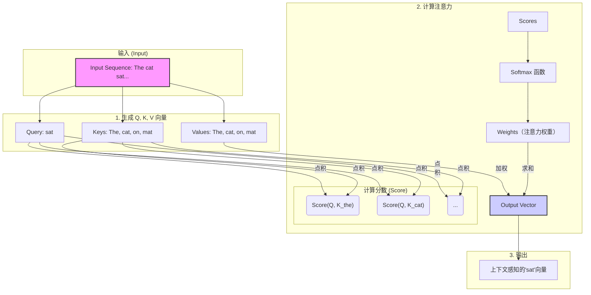
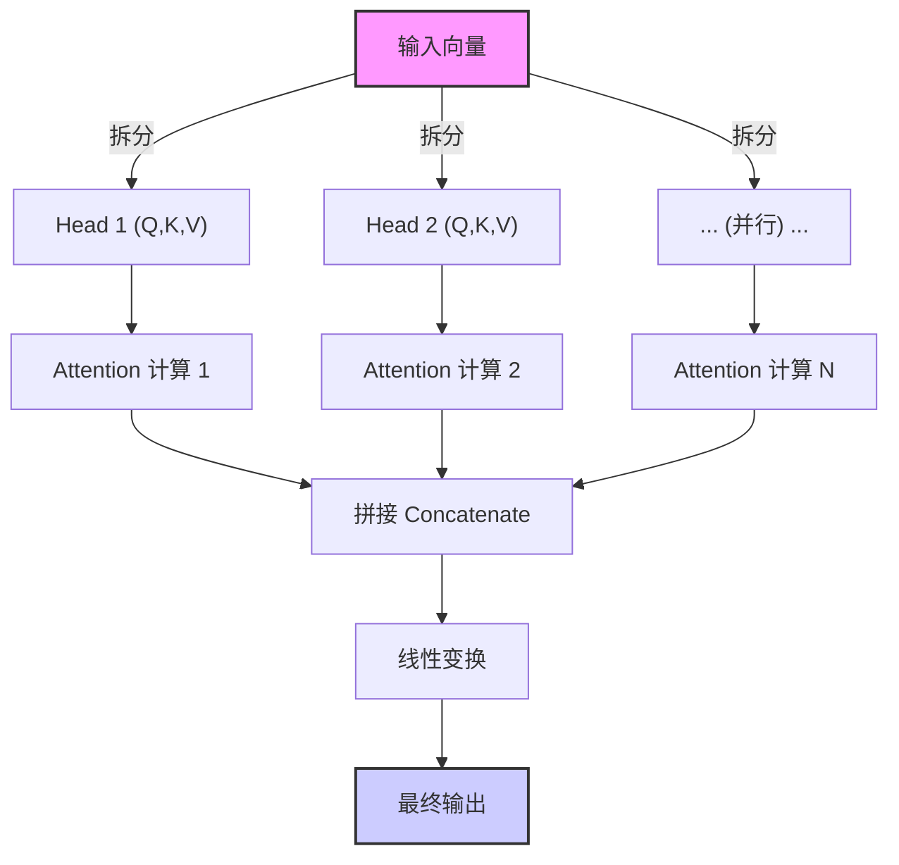
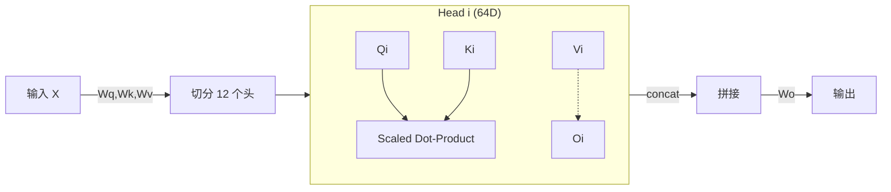
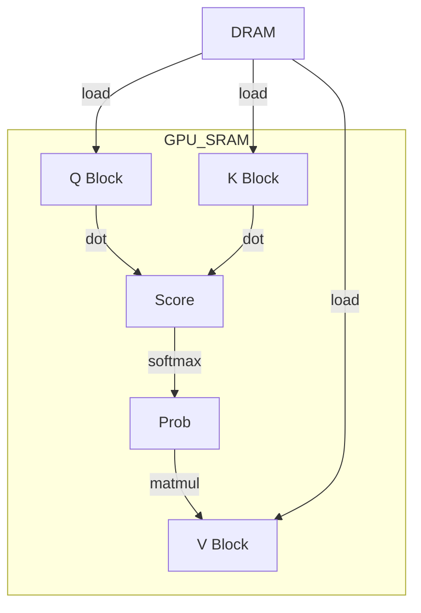
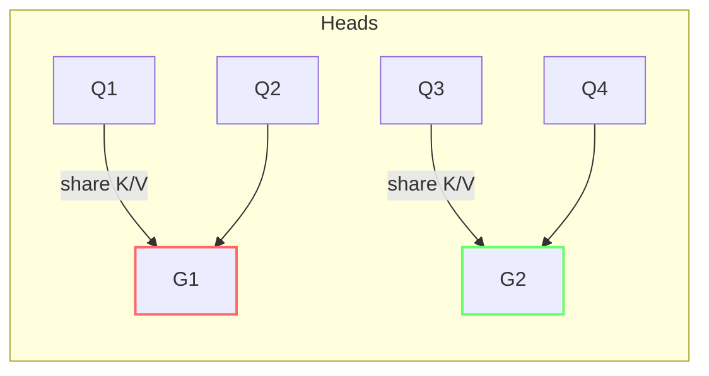

# 从 Attention 到 Multi-Head：Go 工程师也能看懂的大模型注意力机制全解析


你好，Gopher！在我们的世界里，我们用 `goroutine` 和 `channel` 优雅地处理并发，用 `context.Context` 在复杂的调用链中传递信号。我们追求代码的极致性能和资源的高效利用。

当你与 ChatGPT、Claude 或 Gemini 这样的 AI 大模型交互时，你是否曾惊叹于它们如何能准确理解长篇大论的需求，捕捉到对话中那些微妙的上下文关联？比如，当你说“它”的时候，模型如何知道“它”指的是上文提到的“那个新发布的开源库”而不是“你的猫”？

这背后的核心技术，很大程度上归功于一种名为**注意力机制 (Attention Mechanism)** 的强大理念。这篇文章将为你——一位 Golang 程序员——彻底讲透注意力机制。我们将用你熟悉的概念（比如键值存储、缓存命中率）来做类比，并通过图解和案例，让你真正理解它的魅力所在。


## 第一章：从“键值对”到“注意力”——直观理解注意力机制


在 Go 语言中，我们对 `map[string]interface{}` 再熟悉不过了。它是一个简单的键值存储，通过一个 `key`，我们可以精确地查找到对应的 `value`。

现在，让我们把这个简单的概念稍微升级一下，想象一个更智能的“查询”系统。这，就是注意力机制最核心的三个角色：**Query (查询)**、**Key (键)** 和 **Value (值)**，简称 QKV。

- **Query (Q)**: 代表当前需要处理的元素（比如一个单词）发出的“查询请求”。这个请求表达了“我正在寻找与我相关的信息”。
- **Key (K)**: 代表序列中所有可以被关注的元素（包括它自己）所拥有的“键”。它像是在说：“嘿，这是我的标识，你可以通过这个来判断我与你的‘查询’有多相关。”
- **Value (V)**: 代表元素实际包含的“值”或信息。一旦一个 `Key` 被 `Query` 高度关注，它对应的 `Value` 就会被重点“提取”。

**一个简单的例子：**

> The cat sat on the mat. (猫坐在垫子上。)

当模型处理到单词 "sat" (坐) 时，它的 `Query` 可能会问：“这个‘坐’的动作，主语是谁？发生在哪里？”

此时，句子中每个单词的 `Key` 都会响应这个查询：

- "The" 的 `Key` 表示自己是个冠词。
- "cat" 的 `Key` 表示自己是个名词，是个动物。
- "on" 的 `Key` 表示自己是个介词，表位置关系。
- "the" 的 `Key` 再次表示自己是个冠词。
- "mat" 的 `Key` 表示自己是个名词，是个物体。

通过计算 "sat" 的 `Query` 和每个单词 `Key` 之间的“相关性分数”，模型发现 "cat" 和 "mat" 的 `Key` 与 "sat" 的 `Query` 最为相关。因此，它们的 `Value` (即“猫”和“垫子”所代表的深层含义) 就会被赋予最高的权重，从而让模型理解：是“猫”坐在“垫子”上。

这个过程，就像一次**加权的、模糊的键值查询**。它不是返回一个结果，而是返回所有 `Value` 的加权和，权重大小由 `Query` 和 `Key` 的相关性决定。


## 第二章：注意力是怎样炼成的？——深入核心计算


理解了 QKV 的概念，我们来看看这个“相关性分数”和“加权求和”具体是怎么计算的。整个过程分为三步：

1. **计算相关性分数 (Score)**：用每个 `Query` 去和所有的 `Key` 计算一个“相似度”分数。最常见、最高效的方式就是**点积 (Dot Product)**。分数越高，代表 Q 和 K 的相关性越强。
2. **计算权重 (Softmax)**：得到的分数有高有低，需要被“归一化”成一个权重分布。这里使用 `Softmax` 函数，它能将一组任意实数转换成一个和为 1 的概率分布。这就好比将相关性分数，转换成了**“注意力分配比例”**。
3. **加权求和 (Weighted Sum)**：用上一步得到的权重，去乘以每个对应的 `Value`，然后将它们全部相加，得到最终的输出。

我们可以用一个 Mermaid 图来清晰地展示这个流程：





### 关联概念：注意力的“缓存命中率”


对于 Golang 程序员来说，“缓存命中率”是一个衡量性能的关键指标。我们可以用一个类比来理解注意力的权重：

> **注意力的权重 ≈ 缓存命中率**

- **高权重 (High Attention Weight)**: 就像一次**缓存命中 (Cache Hit)**。`Query` 发现了一个高度相关的 `Key`，于是这个 `Key` 对应的 `Value` 被大量“读取”，对最终结果产生巨大影响。
- **低权重 (Low Attention Weight)**: 就像一次**缓存未命中 (Cache Miss)**。`Query` 和某个 `Key` 不相关，于是这个 `Key` 对应的 `Value` 几乎被忽略，权重趋近于零，对结果影响甚微。

通过这种方式，模型在处理每个单词时，都能动态地“命中”上下文中最重要的部分，忽略无关噪声。


## 第三章：进化！从 Self-Attention 到 Multi-Head Attention


我们刚才讨论的，当 Q, K, V 都来源于同一个输入序列时（例如，一句话自己跟自己玩 QKV 游戏），就称为**自注意力机制 (Self-Attention)**。这是像 GPT 这样的解码器模型的核心，它让模型在内部建立起复杂的依赖关系，理解语法、指代和语境。

但这里有个问题：一次注意力计算，可能只能学到一种关系。比如，只学会了“谁做了什么”。但一句话里可能包含多种关系，比如动作的施受者、时态关系、因果关系等等。怎么办？

答案是：**多头注意力机制 (Multi-Head Attention)**。

这个想法非常符合我们 Gopher 的工程思维：**并行化**。

Multi-Head Attention 不做一次大的、复杂的注意力计算，而是把 Q, K, V 向量在维度上切分成多个“头 (Head)”，然后让每个“头”独立地、并行地进行一次完整的 QKV 注意力计算。最后，再把所有“头”的输出结果拼接起来，进行一次线性变换。

**一个绝佳的比喻：**

想象你是一个项目主管，需要评审一份复杂的技术文档。

- **单头注意力**: 你自己从头到尾读一遍，试图理解所有方面（架构、性能、安全、代码风格……）。这很困难，你可能会顾此失彼。

- **多头注意力**: 你找来了几位专家（“头”）：一位架构师，一位性能优化专家，一位安全工程师。你们**并行**阅读文档，每个人都只**关注**自己最擅长的领域。

    - 架构师的“头”会关注服务之间的依赖关系。

    - 性能专家的“头”会关注热点路径和资源消耗。

    - 安全工程师的“头”会关注潜在的漏洞和认证授权。

      最后，你们坐在一起，把各自的发现汇总起来，形成一份全面、深刻的评审报告。

这就是 Multi-Head Attention 的威力。它允许模型从不同子空间、不同角度去理解输入，捕捉到更丰富、更细微的特征。





## 第四章：当注意力遇上大模型：ChatGPT、Gemini 和 KV 缓存


所有现代大语言模型，无论是 OpenAI 的 ChatGPT 系列、Google 的 Gemini，还是 Anthropic 的 Claude，其根基都是一种叫做 **Transformer** 的架构。而 **Multi-Head Attention** 正是 Transformer 架构的心脏。

然而，注意力机制有一个天生的“缺陷”——它的计算复杂度是输入序列长度 `n` 的平方，即 O(n2)。这意味着，当文本越来越长，计算量会爆炸式增长。

在模型进行**推理 (Inference)**，也就是我们聊天时它一个词一个词地生成回答时，这个问题尤为突出。

**场景：** 模型已经生成了 "The cat sat on the..."，现在要预测下一个词。它需要对前面所有的词（The, cat, sat, on, the）进行注意力计算。当它生成了 "mat" 之后，要再预测下一个词，它又需要对（The, cat, sat, on, the, mat）进行计算。

你发现问题了吗？在每一步生成中，对**已经处理过的词**的 `Key` 和 `Value` 向量的计算被**大量重复**了！这对于追求性能的我们来说是不可接受的。

**于是，KV 缓存 (KV Cache) 闪亮登场。**

这是一个**真正**的缓存技术，而不是比喻。它的原理对于 Golang 程序员来说非常容易理解：

> 在自回归生成（一个接一个地生成 token）的过程中，每当一个 token 被处理完，就将其计算出的 `Key` 和 `Value` 向量存储起来（缓存起来）。在下一个时间步，当新的 token（作为 `Query`）需要计算注意力时，它无需为所有历史 token 重新计算 K 和 V，而是直接从缓存中读取它们。

这个简单的优化，极大地提升了 LLM 的推理速度，降低了显存占用，使得长对话和长文生成成为可能。它将每次注意力计算的复杂度从 O(n2) 降低到了 O(n)，因为我们只需要用新的 `Query` 和所有缓存的 `Key` 进行计算。


## 第五章：案例演示：注意力在看哪里？


让我们来看一个更复杂的句子，来感受注意力的威力：

> The robot, which was delivered to the warehouse, quickly charged itself after a long day.
>
> (被运送到仓库的机器人，在劳累了一天后，给自己快速充了电。)

当模型处理到最后一个词 "itself"（它自己）时，它的注意力应该放在哪里？

- **传统模型 (RNN/LSTM)**: 可能会因为距离太远而“遗忘”了主语是“机器人”。它可能会错误地将“itself”与离它更近的“warehouse”（仓库）或“day”（天）关联起来。
- **注意力机制**: "itself" 的 `Query` 会寻找一个可以“自己给自己”做某事的主体。它会扫描整句话的 `Key`，最终发现 "robot" 的 `Key` 与之高度匹配。因此，"robot" 的 `Value` 会获得极高的注意力权重。模型从而清晰地理解，是“机器人”给自己充电，而不是“仓库”或“天”。

这就是注意力机制解决**长距离依赖 (Long-range Dependency)** 问题的能力，也是它相比于旧模型的革命性之处。


## 第六章：多头注意力的内部“解剖”

Multi-Head Attention（MHA）究竟在内部做了些什么？如果把 **Self-Attention** 看作一次 SQL 查询，那 MHA 就像是给同一张表建立了多张索引，每一张索引关注不同的列（特征子空间）。

1. **线性映射切分维度**：假设隐藏维度为 $d_{model}=768$，我们想要 12 个头，每个头的维度就是 $d_{head}=64$。通过三个独立的全连接层把输入 $X$ 投影成 $Q,K,V \in \mathbb{R}^{n\times d_{model}}$，再 reshape 成 $\mathbb{R}^{n\times h \times d_{head}}$。
2. **并行计算注意力**：GPU 会在 batch 维度上 launch kernel，一次性完成 12 个头的点积、Softmax 和加权求和。
3. **Concat + Linear**：把所有头的输出按最后一个维度拼接回 $\mathbb{R}^{n\times d_{model}}$，再经过一个线性层；这一层常被解释为“信息重混（Output Projection）”。



> ⚙️ **工程师视角**：在 HuggingFace Transformers 中，`nn.Linear` 用 `in_features=d_model, out_features=d_model*3` 一次性产出 Q、K、V，然后再 `view(batch, seq_len, n_head, head_dim)`。

---

## 第七章：头太多还是太少？——从显存到效果的全局权衡

| 头数        | 优点                         | 缺点                                     |
| ----------- | ---------------------------- | ---------------------------------------- |
| 少（如 4）  | 显存占用小，推理更快         | 表征能力有限，可能捕捉不到复杂关系       |
| 多（如 32） | 视角丰富，提升收敛速度与效果 | 显存占用指数增加，带宽瓶颈，训练 cost 高 |

1. **显存公式（简化）**：$Memory \propto h \times seq \times d_{head}$。当序列长、头数多时，KV Cache 可能比模型参数还大。
2. **经验法则**：$d_{model} = h \times d_{head}$，保持 $d_{head}$ 介于 32-128 通常最稳妥；超过 128 可能 under-utilize GPU tensor cores。
3. **搜索头数**：在工业界常通过 *神经架构搜索*（NAS）或 *sparsity regularization* 找到冗余头，再做 **Head Pruning**。

> 🛠️ **实战 Tip**：若训练过程中 GPU OOM，可先减少头数再缩短序列；因为缩头对效果影响通常比截断序列小。

---

## 第八章：“闪电”注意力：FlashAttention 的 GPU 性能黑科技

FlashAttention 通过 **Re-ordering + Tiling + Recomputation** 把原本 O(n²) 内存访问、O(n²) 计算的注意力 kernel 优化到 **显存 O(n) 访存、计算几乎无损**。

核心思想：

1. **Block Tiling**：把 Q、K、V 分块放入 GPU SRAM（L2/L1 cache），避免重复读取全序列。
2. **On-Chip Softmax**：分块计算局部最大值与和，在寄存器中归一化，最后合并。
3. **Recompute Trick**：向后传播时不保留完整注意力矩阵，而是 on-the-fly 重新计算局部块，节约显存换算力。



> 🚀 **收益**：在 A100 上序列长度 2K 时，训练吞吐可提升 2-4×，显存下降 50-60%。PyTorch 2.x 已内置 `torch.nn.functional.scaled_dot_product_attention` 调用。

---

## 第九章：KV-Cache 再优化——Multi-Query 与 Grouped-Key 实战

### 9.1 Multi-Query Attention（MQA）

MQA 让 **所有头共享同一个 Key/Value**，只保留独立 Query。显存从 $h\times seq \times d_{head}$ 减到 $seq \times d_{head}$。

- 多用于推理；训练阶段因信息瓶颈对效果有轻微负面。
- 典型模型：OpenAI text-ada-002；Google PaLM v2 Decoder。

### 9.2 Grouped-Query Attention（GQA）

介于 MHA 与 MQA 之间：将头分组，每组共享一份 K/V。设组数 g，则显存系数 $\frac{h}{g}$。

- ChatGPT-turbo、Llama-2 使用 g≈8-16 获得良好平衡。



> 💡 **实战数据**：在 16-B GPU 上，采用 GQA 组数 8，可将 4K context 的 KV Cache 从 6 GB 压到 0.8 GB，并保持 bleu/rouge 损失 <1%。

---

## 第十章：可观测性——如何评估、可视化和裁剪无用 Attention 头

1. **Attention Map 热力图**：`seaborn.heatmap(weights)` 直观展示不同 token 之间的依赖强度。
2. **熵（Entropy）指标**：对每个头计算 softmax 权重的熵，熵高表示分布均匀（信息量低）。
3. **Sensitivity Analysis**：把某个头置零，观察验证集损失或 rouge 变化；若无显著恶化即可裁剪。
4. **L0/L1 Regularization**：训练阶段对每个头引入稀疏化惩罚，让模型自动“关闭”冗余头。

```python
# PyTorch 简易头裁剪示例
for name, module in model.named_modules():
    if isinstance(module, nn.MultiheadAttention):
        important_heads = pick_topk(module.attn_entropy, k=8)
        module.prune_heads(set(range(module.num_heads)) - important_heads)
```

> 📊 **监控平台**：Open-sourced `tensorboard-plugins/profiler` or `weights & biases` 可实时追踪注意力分布演变。

---

## 第十一章：Attention 的未来——State-Space 与 Hyena 正在逼近？

近期研究表明，**State-Space Models (SSM)** 与 **Hyena** 等长序列算子有望以 O(n) 甚至 O(log n) 复杂度替代部分注意力：

| 方法        | 复杂度     | 亮点                                | 挑战                          |
| ----------- | ---------- | ----------------------------------- | ----------------------------- |
| S4 / Mamba  | O(n)       | 串行递推，与 RNN 类似；擅长超长序列 | 并行度低，硬件友好度需提升    |
| Hyena       | O(n log n) | 用卷积核近似长程相关；FFT 加速      | 还未完全超过 Transformer SOTA |
| Mega / RWKV | O(n)       | 将门控与稀疏注意力结合              | 生态仍不成熟                  |

> 🔭 **趋势洞察**：未来工业界或将出现“Hybrid Transformer”，在短依赖使用 FlashAttention，在长依赖使用 SSM/Conv 算子，实现 **Compute-Aware Routing**。

---

## 结论


好了，Gopher！现在我们来总结一下今天的核心要点：

1. **QKV 模型是基石**: 注意力机制通过 Query、Key、Value 三个角色，实现了一次“智能”的、加权的信息检索。
2. **多头注意力是进化**: 通过并行化多个注意力“头”，模型能从不同角度理解文本，捕捉更丰富的上下文信息。这与我们通过并发提升系统吞吐和维度的思想不谋而合。
3. **大模型的动力核心**: Multi-Head Attention 是 Transformer 架构的心脏，驱动着 ChatGPT、Gemini 等所有顶尖大模型。
4. **KV 缓存是性能关键**: 对于我们程序员来说，理解 KV 缓存尤为重要。它是一个简单而高效的工程优化，是让大模型能够在你我面前流畅对话的关键所在。

希望这篇博客能帮你揭开注意力机制的神秘面纱。当你下一次和 AI 对话，或是看到某个 AI 项目宣称支持更长的“上下文窗口”时，你就能会心一笑，因为你已经洞悉了它背后最核心的技术原理和性能关键。