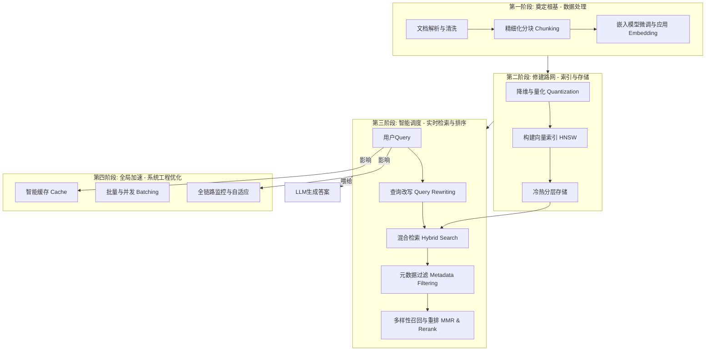
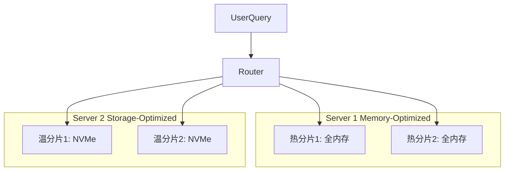

# 从毫秒到真义：构建工业级RAG系统的向量检索优化指南

> **“一个顶级的RAG系统，如同一张精密的高速铁路网。我们的目标不仅是快，更是确保每一位‘信息乘客’都能精准、高效地抵达‘答案站点’。”
**

------

## 场景设定：**一站式企业知识问答系统**

想象一下，你的公司积累了**200万页内外部技术文档**，从产品手册到历史项目复盘。你的任务是构建一个内部知识问答系统，它必须在用户提问后
**1秒内返回精准且有出处的答案**。系统每日需应对**数千次实时查询**，SLA要求**p95延迟低于1.5秒**，而你只有**两台 32vCPU/128GB
RAM/2TB NVMe** 的服务器。

在这样的约束下，**向量检索** 极易成为延迟与成本的双重瓶颈。本文将带你从系统工程的视角出发，分四阶段构建一条“性能卓越、成本可控”的知识高铁。

------

## 总览蓝图：信息乘客的四段旅程

**旅程解读**：

- **第一、二阶段（离线处理）**：决定了铁路网的覆盖范围和质量，是性能的基石。
- **第三、四阶段（在线服务）**：决定了每次查询的效率和答案的精准度，是用户体验的核心。

------

## 第一阶段: 奠定根基 - 数据处理

> **高铁之旅始于乘客与行李的标准化。数据质量决定了RAG效果的上限。**

### 1. 精细化分块 (Chunking)

问题：文档过长，充满了无关噪声；切分太碎，则丢失了上下文。

策略：

- **语义分块 (Semantic Chunking)**：优先按章节、标题、段落等逻辑结构切分。
- **固定大小 + 重叠窗口**：对于无明显结构的长文本，采用固定大小（如中文400-600字）配合 **20%~30%的重叠（Overlap）**，确保上下文连续性。
- **特殊内容特殊处理**：将表格、代码块、图表描述等单独分块，并附上元数据（如`type: "code"`），保留其结构化信息。

### 2. 嵌入模型策略 (Embedding Strategy)

问题：通用Embedding模型在特定技术领域（如金融、医疗、内部术语）表现不佳，语义理解有偏差。

策略：

- **领域微调 (Fine-tuning)**：在200万份专业文档的场景下，**必须对Embedding模型进行微调**
  。利用公司内部的“问题-答案”对、或“标题-正文”对，训练模型使其更懂你的业务语言。
- **选择合适的维度**：并非维度越高越好。优先选择 **128或256维** 的高性能模型。如果微调后语义损失极小，低维模型将带来巨大的性能优势。

------

## 第二阶段: 修建路网 - 索引与存储

> **乘客信息标准化后，我们需要高效的铁轨（索引）和车站（存储），让列车飞速运行。**

### 1. 降维与量化 (Quantization)：为乘客“行李”减负

问题：一个768维的float32向量占用3KB，200万份文档的向量将是天文数字的内存和磁盘开销。

策略：

- **标量量化 (Scalar Quantization)**：将`float32`转为`int8`，存储空间直接压缩**4倍**，且精度损失通常可接受。
- **乘积量化 (PQ)**：更极致的压缩技术，能将存储再压缩**8-16倍**，适合海量数据场景，但会牺牲一定精度。
- **组合拳**：业界常用 **IVF-PQ**（倒排文件+乘积量化）或 **HNSW-PQ** 的组合，在速度和内存占用之间取得最佳平衡。

| 类型              | 单向量存储    | 200万向量总占用  | 性能提升     |
|-----------------|----------|------------|----------|
| 768维 `float32`  | 3KB      | ~6GB       | 基线       |
| **128维 `int8`** | **128B** | **~256MB** | **~24倍** |

**结论**：降维+量化是实现低成本、高性能RAG的**第一关键**。

### 2. 索引结构 (HNSW) 与冷热分层

问题：如何在亿级向量中实现毫秒级近似最近邻（ANN）查找？

策略：

- **HNSW索引**：这是当下的事实标准。把它想象成一个“多层高速公路网”，允许向量查找时从顶层（稀疏）快速“导航”到底层（密集），从而实现极速搜索。
    - **关键参数**：`M`（邻居数）和`ef_construction`（构建时搜索深度）在索引构建时确定。`ef_search`（查询时搜索深度）可动态调整，用以平衡速度与召回率。
- **分片与冷热分层**：
    - **分片 (Sharding)**：按业务线、文档新旧或访问热度，将200万文档向量库切分为4-8个分片。
    - **冷热部署**：
        - **热数据 (Hot)**：近3个月新增、或高频访问的分片，**索引和向量全部加载在内存中**。
        - **温数据 (Warm)**：历史归档、或低频访问的分片，部署在 **NVMe 硬盘**上，仅索引元数据驻留内存。

**效果**：内存成本大幅降低，热数据查询延迟`<20ms`，温数据`<80ms`，整体系统更具弹性。

## 第三阶段: 智能调度 - 实时检索与排序

> **路网建成，现在需要聪明的调度中心，根据乘客需求，规划最快最准的路线。**

### 1. 查询改写 (Query Rewriting)：猜你想问

问题：用户提问往往很口语化，或缺少上下文，直接搜索效果不佳。

策略：

- **HyDE (Hypothetical Document Embeddings)**：让LLM根据用户问题，先生成一个“理想中”的答案，然后用这个**理想答案的向量**
  去搜索。这极大地缓解了问题与答案之间的语义鸿沟。
- **Step-Back Prompting**：引导LLM将一个具体问题（“如何为我的K8s应用配置优雅停机？”）泛化成一个更高层级的问题（“实现优雅停机的通用原理是什么？”），
  **同时搜索两个问题**，扩大召回面。

### 2. 混合检索 (Hybrid Search)：词法与语义的联姻

问题：向量检索擅长理解“意图”（如“优雅停机”），但对关键词（如SIGTERM、preStop）不敏感。

策略：

- **第一阶段召回**：并行执行两种检索：
    - **稀疏检索 (Sparse)**：如**BM25**，基于关键词匹配，保证了对专有名词、代码函数等的高召回。召回Top 50。
    - **稠密检索 (Dense)**：即向量检索，基于语义相似度，负责理解用户真实意图。召回Top 50。
- **结果融合**：合并两路结果，并去重，形成一个约80-100个候选的“大池子”，交给下一步处理。

### 3. 多样性召回与精排 (MMR & Reranking)：优中选优

问题：初步召回的候选集可能存在大量内容相似或冗余的片段。

策略：

- **MMR (Maximal Marginal Relevance)**：在合并后的候选池中，使用MMR算法进行初步筛选。它的目标是**在保证与查询相关性的同时，最大化结果的多样性
  **。避免返回10个几乎一模一样的段落。
- **第二阶段精排 (Reranking)**：
    - **主角**：**Cross-Encoder**。它会把“用户问题”和“每个候选段落”拼接起来，让模型做一次“阅读理解”，输出一个更精准的相关性分数（0到1）。
    - **优势**：效果远超向量检索，能精准识别上下文的细微差别。
    - **用法**：仅对经过MMR筛选后的**Top 10-20个候选**进行精排，因为它计算量大，不适合海量数据。

**比喻**：混合检索是“海选”，MMR是“去除相似选手”，Cross-Encoder则是“总决赛评委”，进行最终打分。

## 第四阶段: 全局加速 - 系统工程优化

> **单次旅途再快，也需整个路网高效协同，应对高峰，保障稳定。**

### 1. 近似语义缓存 (Approximate-Semantic Caching)

思路：对于高频或相似的问题（如“公司报销流程是什么？”），没必要每次都走完昂贵的检索链路。

实现：

- 将用户查询向量化后，与其指纹库进行比对。
- 若**向量余弦相似度 > 0.95**，则判断为命中缓存，直接返回上次的检索+重排结果。
- **效果**：能为 **30%-50%** 的FAQ类查询提供近乎瞬时的响应，极大降低后端压力。

### 2. 批量处理与并发查询 (Batching & Concurrency)

**思路**：积少成多，并行不悖。

- **微批量 (Micro-batching)**：在服务端或客户端，将50ms内到达的多个独立查询，打包成一个批次送入模型/索引，利用GPU/CPU的并行计算能力。
- **并发查询**：同时向多个数据分片（Hot/Warm Shards）发送查询请求，采用“最先返回”策略，有效降低长尾延迟。

### 3. 全链路监控与自适应调整

**思路**：让系统拥有“自愈”和“自适应”能力。

- **监控**：核心指标包括 **p95/p99检索延迟**、**缓存命中率**、**召回率@K (Recall@K)**、**归一化折损累计增益 nDCG@10**
  （衡量精排质量）。
- **自适应**：
    - **高峰期**：当QPS飙升或CPU负载过高时，系统可**自动降低HNSW的`ef_search`参数**（例如从128降到64），牺牲少量精度以换取系统吞吐量和稳定性。
    - **低峰期**：恢复`ef_search`参数，保证答案质量。

## 最终成绩单：一条智能、高效的知识高铁

| 优化阶段      | 核心策略                | 典型量化改善                          |
|-----------|---------------------|---------------------------------|
| **数据与模型** | 微调128维模型 + `int8`量化 | **内存/IO开销降低20-30倍**，领域相关性显著提升   |
| **索引与存储** | HNSW参数调优 + 冷热分层     | **硬件成本降低30-50%**，p95延迟更稳定       |
| **检索与排序** | 查询改写 + 混合检索 + 重排    | **召回率提升10-20%**，答案精准度（nDCG）大幅改善 |
| **系统工程**  | 语义缓存 + 并发批量         | **30%+请求直返缓存**，系统总QPS提升**2-3倍** |

通过这套组合拳，我们不仅能满足1秒内返回答案的严苛SLA，更能构建一个资源利用率极高、可扩展、且答案质量卓越的工业级RAG系统。这不再是一条简单的点对点线路，而是一个能够智能感知、自我优化的庞大知识网络。