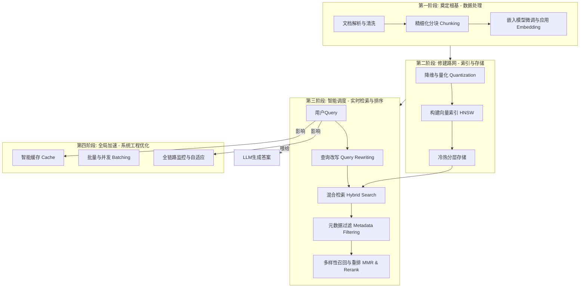
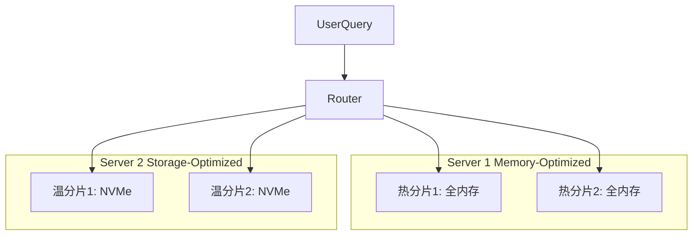

# 从毫秒到真义：构建工业级RAG系统的向量检索优化指南

> **“一个顶级的RAG系统，如同一张精密的高速铁路网。我们的目标不仅是快，更是确保每一位‘信息乘客’都能精准、高效地抵达‘答案站点’。”
**

## 场景设定：**一站式企业知识问答系统**

想象一下，你的公司积累了**200万页内外部技术文档**，从产品手册到历史项目复盘。你的任务是构建一个内部知识问答系统，它必须在用户提问后
**1秒内返回精准且有出处的答案**。系统每日需应对**数千次实时查询**，SLA要求**p95延迟低于1.5秒**，而你只有**两台 32vCPU/128GB
RAM/2TB NVMe** 的服务器。

在这样的约束下，**向量检索** 极易成为延迟与成本的双重瓶颈。本文将带你从系统工程的视角出发，分四阶段构建一条“性能卓越、成本可控”的知识高铁。

## 总览蓝图：信息乘客的四段旅程

**旅程解读**：

- **第一、二阶段（离线处理）**：决定了铁路网的覆盖范围和质量，是性能的基石。
- **第三、四阶段（在线服务）**：决定了每次查询的效率和答案的精准度，是用户体验的核心。

## 第一阶段: 奠定根基 - 数据处理

> **高铁之旅始于乘客与行李的标准化。数据质量决定了RAG效果的上限。**

### 1. 精细化分块 (Chunking)

问题：文档过长，充满了无关噪声；切分太碎，则丢失了上下文。

策略：

- **语义分块 (Semantic Chunking)**：优先按章节、标题、段落等逻辑结构切分。
- **固定大小 + 重叠窗口**：对于无明显结构的长文本，采用固定大小的滑动窗口。重叠比例（Overlap）需根据语言和下游评测结果动态调整，以在保证上下文连续性和减少冗余间取得平衡。该比例应基于语言和评测结果调整，例如中文文档的重叠比例可可为20%～30%，英文文档的重叠比例可适当降低（如10-20%），最终由下游召回效果确定。
- **特殊内容特殊处理**：将表格、代码块、图表描述等单独分块，并附上元数据（如`type: "code"`），保留其结构化信息。

### 2. 嵌入模型策略 (Embedding Strategy)

#### 2a. 嵌入模型微调：如何让模型“懂”你的业务

问题：通用Embedding模型在特定技术领域（如金融、医疗、内部术语）表现不佳，语义理解有偏差。

策略：领域微调 (Fine-tuning)。

如何进行微调？

微调的本质是利用你自己的数据，让预训练好的模型更适应你的领域。核心是构建高质量的训练数据集，常见的数据格式有：

- **（查询，正例）对**：这是最直接的方式。例如，从业务日志中提取的（用户真实问题，点击的文档段落）。
- **（查询，正例，负例）三元组**：效果更好。负例可以是随机抽取的段落，也可以是经过精心挑选的“困难负例”（例如，与查询主题相关但并未回答问题的段落）。
- **（句子1，句子2，相似度得分）对**：更精细的控制，但标注成本高。

**训练过程**：使用这些数据，通过**对比学习（Contrastive Learning）**
的方法进行训练。其目标是：在向量空间中，让“查询”和它的“正例”向量尽可能地靠近，同时和“负例”向量尽可能地远离。像
`sentence-transformers`这样的库为这个过程提供了极大的便利。

> 更本质地看：模型微调到底“调”的是什么？
>
>一个神经网络模型大致包含三类参数：
>
>| **类型**       | **内容**                        | **备注**                  |
>| -------------- | ------------------------------- | ------------------------- |
>| 编码器参数     | 网络层权重（如 Transformer 层） | 表达“语言/图像世界的规律” |
>| 下游任务头参数 | 分类器、检索头等                | 与具体任务高度相关        |
>| 特征空间结构   | 内隐表达（如embedding分布）     | 微调时会重构/迁移         |
>
>微调就是更新这些参数，使模型的内部表示更契合你的目标任务
>
>更本质的说**模型微调就是在保留预训练能力的基础上，进一步优化神经网络中的权重参数，使其在新的输入分布下学到更适合的
embedding 表达。**

#### 2b. 维度选择的艺术：在效果与成本间权衡

问题：我应该选择128维、256维、还是768维？

策略：实验驱动，量化决策。

维度并非越高越好，它是一个典型的**效果-性能权衡**：

- **高维（如768/1024）**：通常能编码更丰富的语义信息，在复杂任务上潜力更大，但计算慢、内存占用高。此外，过高的维度可能引发“维度灾难”，导致距离度量的有效性下降，因此需在语义丰富性和计算效率间权衡。
- **低维（如128/256）**：计算快、内存占用低，检索速度快几个数量级，但可能存在语义信息损失的风险。

**如何选择？**

1. **建立评测基准**：准备一个“黄金标准”评测集，包含上百个有代表性的问题和它们对应的“标准答案”文档ID。
2. **模型与维度组合测试**：选择几款有潜力的基础模型，分别训练出不同维度的版本（例如，`BGE-large`的1024维，微调后的256维，
   `M3E-base`的768维等）。
3. **量化评估**：在评测集上运行每个模型，计算关键指标，如**召回率@K (Recall@K)** 和 **平均倒数排名(MRR)**。
4. **性能压力测试**：同时，测试不同维度向量在目标硬件上的**p99查询延迟**和**内存占用**。
5. **综合决策**：绘制一张图表，横轴是性能（延迟/成本），纵轴是效果（Recall/MRR）。选择那个在满足你业务SLA（如1秒内返回）前提下，效果最好的维度。对于大多数企业应用，一个经过良好微调的
   **256维**模型是性价比极高的选择。

## 第二阶段: 修建路网 - 索引与存储

> **乘客信息标准化后，我们需要高效的铁轨（索引）和车站（存储），让列车飞速运行。**

### 1. 降维与量化 (Quantization)：为乘客“行李”减负

问题：一个768维的float32向量占用3KB，200万份文档的向量将是天文数字的内存和磁盘开销。

策略：

- **标量量化 (Scalar Quantization)**：将`float32`转为`int8`，存储空间直接压缩**4倍**，且精度损失通常可接受。
- **乘积量化 (PQ)**：更极致的压缩技术，能将存储再压缩**8-16倍**，适合海量数据场景，但会牺牲一定精度。
- **组合拳**：业界常用 **IVF-PQ**（倒排文件+乘积量化）或 **HNSW-PQ** 的组合，在速度和内存占用之间取得最佳平衡。

| 类型              | 单向量存储    | 200万向量总占用  | 性能提升     |
|-----------------|----------|------------|----------|
| 768维 `float32`  | 3KB      | ~6GB       | 基线       |
| **128维 `int8`** | **128B** | **~256MB** | **~24倍** |

**结论**：降维+量化是实现低成本、高性能RAG的**第一关键**。

> **💡 技术深潜：什么是乘积量化 (PQ)？**
>
> 想象一下，你要精确记住一个128维的向量（128个小数）非常困难。PQ提供了一种“化整为零”的近似记忆法：
>
> 1. **分割 (Split)**：将128维向量切成8个16维的“子向量”。
> 2. **聚类/建码本 (Codebook Generation)**
     ：对每一组（共8组）的所有训练数据的子向量分别进行聚类（如K-Means），得到256个“代表点”（也叫聚类中心或码字）。这256个代表点就组成了这组子向量的“码本”。
> 3. **编码 (Encode)**：对于一个新的16维子向量，我们不再存储它本身，而是去它的码本里找到最接近的那个代表点，并只记录这个代表点的ID（0-255，正好一个字节）。
> 4. **压缩结果**：最终，一个128维的`float32`向量（512字节）就被转换成了8个字节的ID序列，实现了**64倍**
     的惊人压缩率。计算距离时，也是通过这些ID去查找预计算好的距离表，速度极快。

> **💡 组合拳实战：IVF-PQ索引流程**
>
> `IVF-PQ` 是在离线或磁盘受限场景下的主流方案之一，尤其适合海量数据。相比之下，HNSW-PQ 则更常用于对延迟要求更高的内存检索场景。
>
> 1. **训练阶段 (离线)**：
>    - **粗粒度聚类 (IVF)**：首先，对所有向量进行一次K-Means聚类（比如K=1024），得到1024个“区域中心”。这就像把全国划分为1024个“片区”。每个片区就是一个“倒排列表”。
>
- **计算残差并训练PQ**：对于每个向量，计算它与其所属片区中心之间的“残差向量”（`原始向量 - 片区中心向量`
  ）。然后，用这些残差向量来训练PQ的码本。
> 2. **查询阶段 (在线)**：
     >    - **定位片区 (Probe)**：当一个查询向量来了，先不和所有200万向量比对，而是只和1024个片区中心比对，找到最近的（比如）
     `nprobe=8`个片区。
     >
- **片区内搜索**：系统只进入这8个片区，获取这些片区内的文档ID。然后利用PQ码本快速计算查询向量与这些文档的近似距离。
>
> **效果**：原本需要200万次的比对，现在变成了`1024 + (少量片区内的文档数)`次近似比对，速度提升百倍以上。
>
> **局限性提醒**：IVF-PQ的查询延迟与`nprobe`参数（查询时探索的片区数量）强相关。为了追求高召回率而大幅增加`nprobe`，会导致延迟显著上升，这在需要稳定低延迟的在线服务中是一个重要的权衡点。

### 2. 索引结构 (HNSW) 与冷热分层

问题：如何在亿级向量中实现毫秒级近似最近邻（ANN）查找？

策略：

#### **HNSW索引**

这是当下的事实标准。把它想象成一个“多层高速公路网”，允许向量查找时从顶层（稀疏）快速“导航”到底层（密集），从而实现极速搜索。关键参数调优如下

- **`M` (Max Connections)**：图中每个节点的最大连接数。
    - **影响**：`M`越大，图构建得越密集，节点间的“路”越多，潜在的召回率越高。但同时，**索引占用的内存也越大**，构建速度越慢。
    - **调优建议**：通常设置为**16到64**之间。如果你的应用对召回率要求极高（如法律文档检索），可以尝试更大的值；对于普通问答，32通常是个不错的起点。
- **`ef_construction` (Construction Search Depth)**：构建索引时，为每个新节点寻找邻居的搜索深度。
    - **影响**：值越大，索引构建得越慢，但**索引质量越高**（更优的图结构，最终召回率也更高）。
    - **调优建议**：这是一个**一次性投入**。为了长期的查询性能，建议设置得相对高一些，比如**200到500**
      。更高的值对最终召回率的提升会逐渐饱和，但构建时间会急剧增加。
- **`ef_search` (Query Search Depth)**：查询时的搜索深度。
    - **影响**：这是**最重要的运行时参数**，直接决定了**速度与召回率的平衡**。值越大，搜索范围越广，召回率越高，但**查询延迟也越高
      **。
    - **调优建议**：
        1. 通常建议 `ef_search` 至少设置为 Top K 的 2-4 倍，以保证召回质量。
        2. 以你的SLA为基准进行测试。例如，如果要求p99延迟<50ms，你可以从`ef_search=64`
           开始测试，如果延迟满足要求，再逐步增加到80、128，观察Recall@K的变化。
        3. 找到一个“拐点”，即再增加`ef_search`，延迟上升明显，但召回率提升不大的点。这个点就是你的最佳配置。
        4. 该参数应**动态可调**，高峰期可适当降低以保证系统可用性。

#### **分片与冷热分层**：

- **分片 (Sharding)**：按业务线、文档新旧或访问热度，将200万文档向量库切分为4-8个分片。
- **冷热部署**：
    - **热数据 (Hot)**：近3个月新增、或高频访问的分片，**索引和向量全部加载在内存中**。
    - **温数据 (Warm)**：历史归档、或低频访问的分片，部署在 **NVMe 硬盘**上，仅索引元数据驻留内存。

**效果**：内存成本大幅降低，热数据查询延迟`<20ms`，温数据`<80ms`，整体系统更具弹性。

## 第三阶段: 智能调度 - 实时检索与排序

> **路网建成，现在需要聪明的调度中心，根据乘客需求，规划最快最准的路线。**

### 1. 查询改写 (Query Rewriting)：猜你想问

问题：用户提问往往很口语化，或缺少上下文，直接搜索效果不佳。

策略：

- **HyDE (Hypothetical Document Embeddings)**：让LLM根据用户问题，先生成一个“理想中”的答案，然后用这个**理想答案的向量**
  去搜索。这极大地缓解了问题与答案之间的语义鸿沟。
- **Step-Back Prompting**：引导LLM将一个具体问题（“如何为我的K8s应用配置优雅停机？”）泛化成一个更高层级的问题（“实现优雅停机的通用原理是什么？”），
  **同时搜索两个问题**，扩大召回面。

### 2. 混合检索 (Hybrid Search)：词法与语义的联姻

问题：向量检索擅长理解“意图”（如“优雅停机”），但对关键词（如SIGTERM、preStop）不敏感。

策略：

- **第一阶段召回**：并行执行两种检索：
    - **稀疏检索 (Sparse)**：如**BM25**，它利用词频和文档长度等进行统计建模，而非简单的关键词匹配，能保证对专有名词、代码函数等的高召回。召回Top 50。
    - **稠密检索 (Dense)**：即向量检索，基于语义相似度，负责理解用户真实意图。召回Top 50。
- **结果融合**：合并两路结果，并去重，形成一个约80-100个候选的“大池子”，交给下一步处理。

### 3. 多样性召回与精排 (MMR & Reranking)：优中选优

问题：初步召回的候选集可能存在大量内容相似或冗余的片段。

策略：

#### **MMR (Maximal Marginal Relevance)**：

在合并后的候选池中，使用MMR算法进行初步筛选。它的目标是**在保证与查询相关性的同时，最大化结果的多样性**。避免返回10个几乎一模一样的段落。

> **💡 技术深潜：MMR (最大边际相关性) 如何保证多样性？**
>
> MMR是一种重新排序算法，它的目标是在已经召回的结果中，挑选出一个既与原始查询相关，又与其他已选结果不相似的子集。
>
> **工作流程**：
>
> 1. **开始**：从混合检索返回的Top 100个候选中，直接选择相关性最高的第一名，放入最终结果列表。
>
> 2. 迭代挑选：对于剩下的99个候选，逐一计算它们的“MMR分数”：
     >
     >    MMR_Score = λ * Sim(doc, query) - (1 - λ) * max[Sim(doc, selected_doc)]
     >
     >    - `Sim(doc, query)`：该候选文档与原始查询的相关性（老分数）。
     >    - `max[Sim(doc, selected_doc)]`：该候选文档与**所有已选入最终结果列表**的文档的最大相似度。
     >    - `λ`：一个0到1之间的调节参数。`λ=1`时，MMR退化为纯按相关性排序；`λ=0`时，则只考虑多样性。通常设为**0.5到0.7**。
     >    - **注**：`Sim`函数建议使用归一化的余弦相似度，以确保公式两项处在相同的量纲。
>
> 3. **选择与重复**：在所有候选的MMR分数中，选择分数最高的那个，将它加入最终结果列表，并从候选集中移除。重复第2步，直到选出Top
     K（例如10个）结果。
>
> **效果**：这种机制能有效抑制内容高度相似的文档“霸榜”，让返回结果覆盖更多方面。

### **第二阶段精排 (Reranking)**

- **主角**：**Cross-Encoder**。它会把“用户问题”和“每个候选段落”拼接起来，让模型做一次“阅读理解”，输出一个更精准的相关性分数（0到1）。
- **优势**：由于能够进行深度交互分析，效果远超向量检索，能精准识别上下文的细微差别。
- **用法**：仅对经过MMR筛选后的**Top 10-20个候选**进行精排，因为它计算量大，不适合海量数据。

**比喻**：混合检索是“海选”，MMR是“去除相似选手”，Cross-Encoder则是“总决赛评委”，进行最终打分。

## 第四阶段: 全局加速 - 系统工程优化

> **单次旅途再快，也需整个路网高效协同，应对高峰，保障稳定。**

### 1. 近似语义缓存 (Approximate-Semantic Caching)

思路：对于高频或相似的问题（如“公司报销流程是什么？”），没必要每次都走完昂贵的检索链路。

实现：

- 将用户查询向量化后，与其指纹库进行比对。
- 若**向量余弦相似度**高于某个阈值（经验区间为0.85~0.95，需离线调参确定），则判断为命中缓存，直接返回上次的检索+重排结果。
- **效果**：能为 **30%-50%** 的FAQ类查询提供近乎瞬时的响应，极大降低后端压力。

### 2. 批量处理与并发查询 (Batching & Concurrency)

**思路**：积少成多，并行不悖。

- **微批量 (Micro-batching)**：在服务端或客户端，将50ms内到达的多个独立查询，打包成一个批次送入模型/索引，利用GPU/CPU的并行计算能力。
- **并发查询**：同时向多个数据分片（Hot/Warm Shards）发送查询请求，采用“最先返回”策略，有效降低长尾延迟。

### 3. 全链路监控与自适应调整

**思路**：让系统拥有“自愈”和“自适应”能力。

- **监控**：核心指标包括 **p95/p99检索延迟**、**缓存命中率**、**召回率@K (Recall@K)**、**归一化折损累计增益 nDCG@10**
  （衡量精排质量）。
- **自适应**：
    - **高峰期**：当QPS飙升或CPU负载过高时，系统可**自动降低HNSW的`ef_search`参数**（例如从128降到64），牺牲少量精度以换取系统吞吐量和稳定性。
    - **低峰期**：恢复`ef_search`参数，保证答案质量。

## 前沿策略与避坑指南

> **RAG技术日新月异，了解前沿方向和避免常见错误同样重要。**

### 1. 值得探索的前沿策略

- **多向量表示 (Multi-Vector Representation)**：不要满足于为每个chunk只生成一个向量。可以尝试为同一个chunk生成多个向量，每个向量代表不同方面：
    - 一个向量代表**原文内容**。
    - 一个向量代表这个chunk的**摘要**。
    - 一个向量代表由LLM生成的、这个chunk**可能回答的假设性问题**。
    - 在查询时，可以根据查询类型，融合多个向量的召回结果，提升匹配的鲁棒性。
- **图RAG (Graph RAG)**
  ：当知识本身具有很强的关联性时（如代码库、组织架构、知识图谱），可以将文档chunk作为节点，它们之间的引用或关联关系作为边，构建一个知识图。检索时，不仅查找单个节点，还可以沿着图的边进行扩展（Graph
  Traversal），发现那些没有被直接搜到、但与答案紧密相关的“邻居”信息。
- **代理式/迭代式检索 (Agentic/Iterative RAG)**：将RAG流程从“一次性检索-生成”升级为“多轮循环”。一个智能代理（Agent）首先进行一次检索，如果发现信息不足以回答问题，它可以
  **自主决定生成一个新的、更精确的查询**，进行第二轮、第三轮检索，直到收集到足够的信息为止。这模拟了人类专家解决复杂问题的过程。

### 2. 常见的“反模式”与误区

- **误区一：万事皆用LLM**
    - **反模式**：试图用大型语言模型（如GPT-4）直接对上百个召回的候选文档进行排序。
    - **正解**：LLM作为Reranker虽然效果好，但其延迟和成本极高，不适合处理大量候选。正确的模式是使用轻量级的Cross-Encoder进行精排，最后仅将精排后的Top
      3-5个文档喂给LLM进行答案的综合生成。
- **误区二：忽视Chunking策略**
    - **反模式**：简单粗暴地按固定字符数（如每500个字符）切分文档，完全不考虑句子、段落的完整性。
    - **正解**：这是最常见也最致命的错误之一。断裂的句子会严重破坏语义，导致Embedding质量低下。应始终优先使用基于自然语言边界（句、段）的语义分块方法。
- **误区三：缺少持续评估的“闭环”**
    - **反模式**：上线后就不再关心召回质量，或者只看用户是否“点赞”。
    - **正解**：必须建立一个**自动化的评测流水线**和一套“黄金标准评测集”。每次对分块、模型、索引参数等进行优化后，都应自动在该评测集上运行，生成一份包含Recall@K,
      MRR, nDCG等指标的报告。这能确保你的每一次优化都是**数据驱动、可衡量**的，避免“凭感觉”优化。

## 最终成绩单：一条智能、高效的知识高铁

| 优化阶段      | 核心策略                                | 典型量化改善                          |
|-----------|-------------------------------------|---------------------------------|
| **数据与模型** | 微调256维模型 + 建立评测闭环                   | **内存/IO开销降低20-30倍**，领域相关性显著提升   |
| **索引与存储** | IVF-PQ + HNSW参数调优 + 冷热分层            | **硬件成本降低30-50%**，p95延迟更稳定       |
| **检索与排序** | 查询改写 + 混合检索 + MMR + Cross-Encoder精排 | **召回率提升10-20%**，答案精准度（nDCG）大幅改善 |
| **系统工程**  | 语义缓存 + 并发批量                         | **30%+请求直返缓存**，系统总QPS提升**2-3倍** |
| **策略升级**  | 避免反模式，探索前沿                          | 建立长期迭代优化的科学流程，系统能力持续进化          |

通过这套组合拳，我们不仅能满足1秒内返回答案的严苛SLA，更能构建一个资源利用率极高、可扩展、且答案质量卓越的工业级RAG系统。这不再是一条简单的点对点线路，而是一个能够智能感知、自我优化的庞大知识网络。