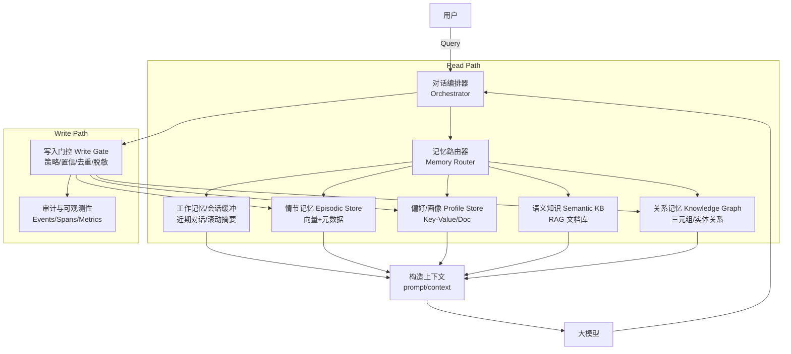
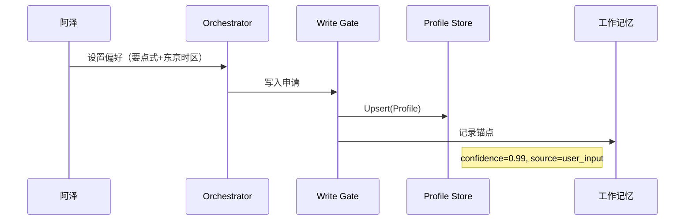
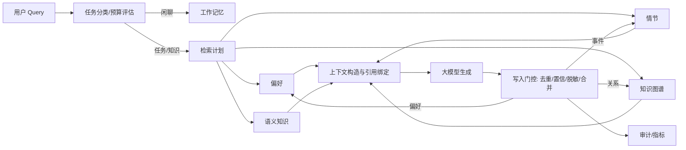

# 从健忘到“会心一笑”：大模型记忆管理设计实战与前瞻

> 写在前面：当我们谈“记忆”，并不是把一切都塞进上下文，而是**在正确的时刻，用最低的成本，取到最有用的那一撮信息**。这既是工程挑战，也是产品哲学。

---

## 1. 背景与痛点故事：一个“健忘”助手的自我修养

还记得你第一次用 AI 助手时的失望吗？  
它明明昨天刚学会你喜欢**美式不加糖**，今天又问一遍；  
你凌晨在东京加班，它却给你**洛杉矶时间**的提醒；  
项目复盘时，它把“上次讨论的决策”讲成了“上上次的想法”。

这些碎裂体验的根源，不是模型不够大，而是**记忆管理不成体系**：

- **上下文窗口昂贵且短视**：一次塞进太多，延迟与成本飙升；塞得太少，又拿不出关键事实。
- **长期记忆漂移**：旧偏好被覆盖、陈旧文件被引用，导致“越用越跑偏”。
- **多端/多人协作混线**：同一人手机+电脑、个人+团队空间，记忆边界模糊。
- **隐私与合规**：哪些应当“记”，哪些必须“忘”，缺乏可验证的策略与审计。
- **可观测性缺失**：出了错只能猜，无法定位是“没取到”还是“取错了”。

本文提出一套**分层记忆架构**与**读写策略**，并用一个真实的用户旅程串起关键细节，帮助你搭建“好记性 + 好脾气”的大模型应用。

---

## 2. 分层记忆架构总览

把大模型当作“会推理的大脑”，我们需要给它配上一整套“海马体 + 前额叶”的工程设施。



### 各层职责一览

| 层级                    | 作用                 | 典型实现                      | 延迟/成本 | 记忆寿命(建议) | 常见风险        |
| ----------------------- | -------------------- | ----------------------------- | --------- | -------------- | --------------- |
| 工作记忆（会话缓冲）    | 维持对话连贯         | 滚动窗口 + 层级摘要           | 低/低     | 短期（会话内） | 摘要丢细节      |
| 偏好/画像               | 个体稳定偏好与属性   | KV/Doc Store（JSON Schema）   | 低/低     | 中长期         | 过度固化/刻板化 |
| 情节记忆（Episodic）    | 事件化的“发生过什么” | 向量检索 + 元数据             | 中/中     | 中期 + 衰减    | 语义重复/漂移   |
| 语义知识（Semantic KB） | 文档/代码/Wiki       | RAG（混合检索）               | 中/中     | 可版本化       | 过期/冲突       |
| 知识图谱（KG）          | 结构化关系与约束     | 三元组/图数据库               | 中/中     | 长期           | 噪声关系        |
| 编排与策略              | 读写路由、门控与审计 | Policy Engine + Observability | 中/低     | 持续           | 黑盒不可观测    |


## 3. 各层记忆架构与关键技术

### 3.1 工作记忆（短期）——“白板与便利贴”

**目的**：维持眼前任务的连贯性与引用稳定。

**技术要点（业界通用，展开讲）**：

- **滚动窗口 + 触发式摘要**：对最近 N 轮对话做“语义要点 + 决策项 + 待办”摘要，遇到“话题切换/会话超时”才刷新摘要。
- **层级摘要（Hierarchical Summary）**：小摘要汇成大摘要，像“会议纪要→项目周报→季度回顾”，控制长度与可追溯性。
- **锚点（Anchored Context）**：将“用户明确的指令/约束”以结构化字段固化为**锚点**，避免摘要稀释，例如：`timezone=Asia/Tokyo`、`pref.coffee=Americano/NoSugar`。
- **引用缓存（Citation Cache）**：当回答引用 KB/代码片段时，把**引用指纹**和**高频片段**短暂缓存，以便后续快速复用和一致性。

> 类比：**白板**上写着今天要做的事（滚动窗口），**便利贴**贴着关键约束（锚点），清洁工每晚来（话题切换）再把白板内容汇总到日志（层级摘要）。


### 3.2 偏好/画像（Declarative/Preference Store）——“设置中心”

**目的**：稳定、可解释、可编辑的用户长期事实与偏好。

**设计建议**：

- **Schema First**：使用 JSON Schema 定义字段、来源、置信度、最后更新人/时间。
- **置信与来源**：`confidence ∈ [0,1]` + `provenance=[user_input|model_infer|import|team_policy]`。
- **显式同意与撤回**：UI 提供“记住/忘记此偏好”，服务端保留“撤回链路”（GDPR 友好）。
- **冲突合并**：当“场景偏好”与“全局偏好”冲突时，优先场景；过期后回落全局。

**示例（片段）**：

```json
{
  "user_id": "u_123",
  "timezone": {"value": "Asia/Tokyo", "confidence": 0.99, "source": "user_input", "updated_at": "2025-07-01"},
  "coffee": {"value": "Americano_NoSugar", "confidence": 0.9, "source": "model_infer"},
  "writing_tone": {"value": ["严谨","类比"], "source": "user_input"}
}
```


### 3.3 情节记忆（Episodic）——“日志与相册”

**目的**：以**事件**为单位记录“发生过什么”，支持跨会话回想与总结。

**关键做法（业界应用广）**：

- **向量检索 + 元数据过滤**：文本事件嵌入到向量库（如 FAISS/Milvus/Pinecone 类），通过`user_id, project_id, time_range, tag`等过滤再召回。
- **时间衰减与强化**：随时间降低权重（decay），被重复引用或用户加星的事件提高权重（reinforcement）。
- **去重与聚簇**：MinHash/SimHash/聚类，将高度相似的事件折叠，避免“语义复读机”。
- **结构化补录**：为每个事件写入`who/when/where/what/decision/artifact_link/citations`，便于审计与可解释。


### 3.4 语义知识（Semantic KB / RAG）——“资料室”

**目的**：为问题提供可验证的外部知识与上下文。

**要点（重点详解）**：

- **混合检索**：BM25（关键词） + 向量检索（语义） + 结构化过滤，提升召回稳健性。
- **分块与锚点**：合理分块（500~1500 tokens），保留标题→小节→段落层级锚点，回答时自动**引用与链接**。
- **新鲜度与版本**：文档带版本与有效期（TTL），过期自动降权；新版本上线触发“知识迁移测试”。
- **事实一致性**：同一事实的多文档冲突时，要求模型给出“多数一致 + 最近更新时间”的解释。


### 3.5 知识图谱（KG）——“关系脑回路”

**目的**：抽取与维护“人-事-物-关系”的结构化网络，用于多跳推理与约束校验。

**做法**：

- 从对话/文档中抽取三元组（`实体A - 关系 - 实体B`），设置阈值与校验器（正则/约束）。
- 将“硬约束”（如“公司 A 禁止开源库 X”）放入 KG，回答前进行**约束检查**。
- 控制规模：只保留高价值关系，防止“图爆炸”。


### 3.6 策略与门控（Policy & Gates）——“守门员”

**读路径（Read Gate）**：

- **任务感知路由**：分类“闲聊/任务/检索/代码/数据分析…”，按任务选择读取层，减少无关记忆干扰。
- **预算感知**：在延迟/成本上限内做最优召回组合（例如先检索偏好→不够再查 KB）。

**写路径（Write Gate）**：

- **三查一记**：**去重**（是否已存在近似事件/偏好）、**置信**（置信低先暂存候选池）、**脱敏**（PII/密钥过滤），再写入。
- **粒度控制**：只写结构化“决策/事实/偏好”，不要把整段对话硬塞进长期库。
- **人机共管**：关键写入（如组织策略变更）需人工确认；提供“撤回/追溯”。


### 3.7 可观测性与评测——“体检单”

- **检索正确率**：`Recall@K、Precision@K、nDCG`（按标签评测）。
- **记忆健康度**：陈旧率、冲突率、孤儿节点比、重复簇大小分布。
- **用户体验指标**：一问即答率、追问次数、修正成本（tokens/秒）。
- **可解释性**：回答附带“证据片段/事件ID/偏好来源”，支持一键定位。


### 3.8 性能与成本

- **分层缓存**：热偏好在边缘/客户端缓存，冷知识走远端检索。
- **近线写入**：写路径异步化，前台先返回；后台去重/聚簇/衰减重排。
- **小模型前置**：用轻量 reranker/分类器做预筛，减少大模型调用。
- **批处理与蒸馏**：离线把长对话蒸馏为“记忆原子”，降低长期存储与召回成本。


## 4. 一个真实用户旅程：阿泽的一周

> 主角：**阿泽**，后端工程师。目标：完成一款出海应用的性能优化，并计划周末短途旅行。  
> 你将看到读/写门控、各层记忆与策略如何**串起来工作**。

### Day 1（周一，09:00）——初始化偏好

- 阿泽说：“以后请用**简洁要点**总结，并以**东京时间**提醒。”
    - **写门控**识别为偏好 → 写入 `Profile Store`（`timezone=Asia/Tokyo`、`summary_style=Bullets`）。
    - **工作记忆**记录为当日锚点。



### Day 2（周二，20:00）——技术问答与资料召回

- 阿泽问：“Go 的 pprof 火焰图怎么看？有我项目的例子吗？”
    - **读路由**：识别为技术任务 → 先查 `Semantic KB`（Go 性能文档）+ `Episodic`（项目事件）。
    - 找到“上周压测报告”和“CPU 热点 PR 记录”，生成答案并**附引用**。
    - **写门控**：把“已合并的优化策略+指标提升幅度”写入 `Episodic`。

### Day 3（周三，12:30）——多端协作与冲突

- 手机端临时说：“午后提醒改 15:00。”与桌面端“默认 14:00”冲突。
    - **策略**：按“**场景优先**”覆盖一次性事件，不改全局偏好。
    - **可观测性**：事件中记录冲突解决理由与来源。

### Day 4（周四，22:00）——旅行计划（知识 + 偏好混用）

- 阿泽：“周末东京近郊徒步，**不要人多**，预算**中等**。”
    - 读：`Profile(预算偏好)` + `Episodic(曾收藏的路线)` + `KB(交通/天气)`。
    - 写：把“最终行程 + 车次 + 预估时长”作为单个**情节事件**记录，便于回放。

### Day 5（周五，17:30）——忘记与合规

- 阿泽：“把我 6 月份的行程全部忘掉。”
    - **写门控**执行**范围删除**：`Episodic@time_range=2025-06-*`，生成**审计记录**与可恢复快照（7 天）。


## 5. 端到端读写流程（精炼）



---

## 6. 工程落地蓝图（接口与策略片段）

### 6.1 记忆接口（伪代码）

```go
type MemoryItem struct {
    ID         string
    UserID     string
    Kind       string   // "pref" | "episodic" | "kb" | "kg"
    Content    string   // 原文或结构化 JSON
    Embedding  []float32
    Meta       map[string]any // {confidence, source, anchors, ttl, version, time_range...}
    CreatedAt  time.Time
    UpdatedAt  time.Time
}

type MemoryStore interface {
    Upsert(ctx context.Context, item MemoryItem) error
    Search(ctx context.Context, query string, k int, filters map[string]any) ([]MemoryItem, error)
    DeleteRange(ctx context.Context, filter map[string]any) (int, error)
}
```

### 6.2 写入门控策略（要点）

- **Dedup**：`cosine_sim > τ1` → 合并；`τ2 < cosine_sim ≤ τ1` → 候选池；否则新建。
- **Confidence**：`source=user_input` 基准更高；`model_infer` 需多轮证据。
- **PII/Secrets**：正则+分类器双保险，命中则**拒写或脱敏**。
- **TTL**：偏好默认无期限；情节 90 天基础 + 引用强化续期；KB 由版本控制。
- **撤回**：所有写入生成 `audit_event_id`，支持 7~30 天回滚窗口。

### 6.3 召回融合（Retrieval Fusion）

- 先取 `Profile` 锚点（低延迟）→ 触发 `Episodic`（k=20）→ `Semantic KB`（k=20）→ 小模型重排（k=8）→ 最终上下文（k=6）。
- 超预算时优先降采 KB，再降采 Episodic。

---

## 7. 常见失败模式与防劣化

- **记忆污染**：把谣言或用户假设写进长期库 → **来源与置信**机制 + 延迟写入复核。
- **过拟合个体偏见**：画像过度强化 → **场景优先 + 减少人格刻板字段**。
- **冷启动沉没成本**：早期无记忆导致体验差 → 设计**引导任务**（Onboarding）快速采集高价值偏好。
- **检索震荡**：不同索引权重不稳 → 定期**offline A/B + 指标看板**校准。

---

## 8. 上线清单（Checklist）

- [ ] JSON Schema 定义画像字段与审计拓扑
- [ ] 写入门控：去重/置信/脱敏/撤回逻辑
- [ ] 向量库 + 混合检索通路与超时保护
- [ ] 层级摘要与锚点机制
- [ ] 冲突优先级（场景 > 全局 > 团队）
- [ ] 观测面板（检索准确、健康度、成本）
- [ ] “忘记我”的范围删除与快照
- [ ] 读写压测与成本上限
- [ ] 用户可控的“记住/忘记”交互

---

## 9. 结语：让记忆成为“生产力的隐形地基”

优秀的大模型应用，**不是记住一切，而是记住关键**；  
不是“越久越好”，而是**恰到好处地更新与忘记**。  
当读写策略、分层架构与可观测性协同起来，你的助手不仅不再健忘，甚至能在关键时刻让你**会心一笑**：  
“放心，这次我记住了。”