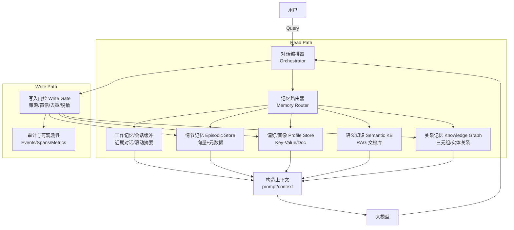
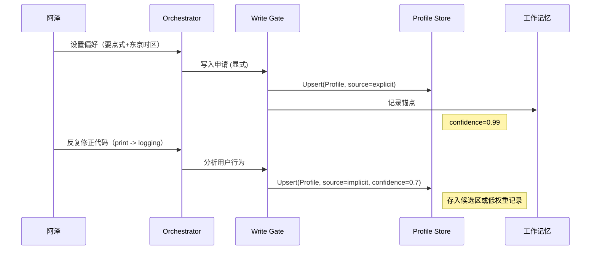
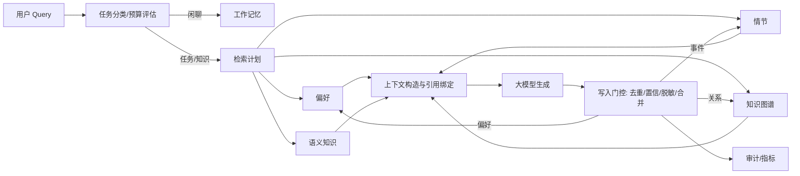

# 从健忘到“会心一笑”：大模型记忆管理设计实战与前瞻

> 写在前面：当我们谈“记忆”，并不是把一切都塞进上下文，而是**在正确的时刻，用最低的成本，取到最有用的那一撮信息**
> 。这既是工程挑战，也是产品哲学。

## 1. 背景与痛点故事：一个“健忘”助手的自我修养

还记得你第一次用 AI 助手时的失望吗？  
它明明昨天刚学会你喜欢**美式不加糖**，今天又问一遍；  
你凌晨在东京加班，它却给你**洛杉矶时间**的提醒；  
项目复盘时，它把“上次讨论的决策”讲成了“上上次的想法”。

这些碎裂体验的根源，不是模型不够大，而是**记忆管理不成体系**：

- **上下文窗口昂贵且短视**：一次塞进太多，延迟与成本飙升；塞得太少，又拿不出关键事实。
- **长期记忆漂移**：旧偏好被覆盖、陈旧文件被引用，导致“越用越跑偏”。
- **多端/多人协作混线**：同一人手机+电脑、个人+团队空间，记忆边界模糊。
- **隐私与合规**：哪些应当“记”，哪些必须“忘”，缺乏可验证的策略与审计。
- **可观测性缺失**：出了错只能猜，无法定位是“没取到”还是“取错了”。

本文提出一套**分层记忆架构**与**读写策略**，并用一个真实的用户旅程串起关键细节，帮助你搭建“好记性 + 好脾气”的大模型应用。

## 2. 分层记忆架构总览

把大模型当作“会推理的大脑”，我们需要给它配上一整套“海马体 + 前额叶”的工程设施。这套系统的核心运转逻辑是：*
*请求进来时，按需读取；响应生成后，按需写入。**

- **读取（Read Path）**：当用户发出一个查询（Query），**对话编排器 (Orchestrator)** 首先会对其进行意图分析。然后，**记忆路由器 (
  Memory Router)** 会根据任务类型、上下文和预设策略，决定需要从哪些记忆层中拉取信息。例如，一个技术问题会优先查询**语义知识库
  **，而一个涉及个人安排的请求则会查询**情节记忆**和**偏好/画像**。所有召回的信息与当前问题一起，被构造成一个丰富的上下文（Prompt），最终送给大模型进行处理。
- **写入（Write Path）**：在大模型生成回答后，**写入门控 (Write Gate)**
  会对这次交互进行分析。它会判断对话中是否产生了新的、有价值的记忆，比如用户明确表达的新偏好、一个重要的决策、或是一个可复用的知识点。通过去重、脱敏和置信度评估后，这些信息才会被分门别类地存入对应的长期记忆库（如偏好、情节或知识图谱），以备将来使用。

整个过程就像一个高效的秘书：先快速翻阅相关资料（读取），然后精准回答问题，最后把新的关键信息整理归档（写入）。



### 各层职责一览

| 层级                | 作用          | 典型实现                          | 延迟/成本 | 记忆寿命(建议) | 常见风险     |
|-------------------|-------------|-------------------------------|-------|----------|----------|
| 工作记忆（会话缓冲）        | 维持对话连贯      | 滚动窗口 + 层级摘要                   | 低/低   | 短期（会话内）  | 摘要丢细节    |
| 偏好/画像             | 个体稳定偏好与属性   | KV/Doc Store（JSON Schema）     | 低/低   | 中长期      | 过度固化/刻板化 |
| 情节记忆（Episodic）    | 事件化的“发生过什么” | 向量检索 + 元数据                    | 中/中   | 中期 + 衰减  | 语义重复/漂移  |
| 语义知识（Semantic KB） | 文档/代码/Wiki  | RAG（混合检索）                     | 中/中   | 可版本化     | 过期/冲突    |
| 知识图谱（KG）          | 结构化关系与约束    | 三元组/图数据库                      | 中/中   | 长期       | 噪声关系     |
| 编排与策略             | 读写路由、门控与审计  | Policy Engine + Observability | 中/低   | 持续       | 黑盒不可观测   |

## 3. 各层记忆架构与关键技术

上一节我们鸟瞰了全貌，现在深入每一层的“齿轮与轴承”，探讨它们如何运转，以及实践中的关键细节。

### 3.1 工作记忆（短期）——“白板与便利贴”

**目的**：维持眼前任务的连贯性与引用稳定，为大模型提供最直接的上下文“快照”。

**运转机制与技术要点**：

- **滚动窗口 + 触发式摘要 (Rolling Window & Triggered Summarization)**：这是最基础的短期记忆。系统会保留最近 N 轮对话的完整记录（例如
  N=10）。当对话超过 N 轮，或出现明显的**话题切换**、**会话暂停超过阈值**（如 15 分钟）时，系统会触发一次**摘要**
  。这个摘要并非简单的文本压缩，而是由一个专门的（或当前）LLM 提炼出“**关键事实、待办事项、核心决策**
  ”，然后将这个摘要放入下一轮的上下文，取代被滚动的旧对话。这种机制在保证连贯性的同时，有效控制了上下文长度和成本。
- **层级摘要（Hierarchical Summary）**：对于超长会话（如持续数小时的分析任务），单次摘要会越来越长。层级摘要将多个“小结”汇集成一个“总结”，再将多个“总结”提炼成一个“精要”，形成
  `摘要的摘要`。这就像从“会议纪要”到“项目周报”，再到“季度回顾”，每一层都保留了追溯到原始对话的链接，实现了信息的无损压缩与索引。
- **锚点（Anchored Context）**：摘要过程有信息丢失的风险。对于用户明确指定的、在当前任务中必须遵守的**核心约束**
  ，我们将其提取为结构化的“锚点”，并固定在上下文的最前端，确保它**永远不会被摘要算法“优化”掉**。
    - *例如*：用户说“请以专业、严谨的口吻回答，并引用所有来源”，系统会提取出
      `{"output_style": {"tone": "professional", "rigor": "high"}, "citation_policy": "all"}` 作为锚点。
- **引用缓存（Citation Cache）**：当 AI 从知识库（KB）或代码库中引用信息时，会将高频使用的**片段原文**或其**唯一标识符（指纹）**
  缓存在工作记忆中。如果用户接着问“你刚才提到的第三点能详细说说吗？”，系统可以直接从缓存中定位，无需重新检索，保证了指代的一致性和响应速度。

> 类比：**白板**上写着今天要做的事（滚动窗口），**便利贴**贴着关键约束（锚点），清洁工每晚来（话题切换）再把白板内容汇总到日志本（层级摘要）。

### 3.2 偏好/画像（Declarative/Preference Store）——“可进化的用户手册”

**目的**：沉淀稳定、可解释、可编辑的用户长期事实与偏好，让 AI 的服务越用越“懂你”。

**运转机制与设计建议**：

- **Schema First 与来源追踪**：所有偏好都应遵循预定义的 JSON Schema，这保证了数据的结构化和可预测性。每个偏好字段都必须包含
  `value`（值）、`confidence`（置信度）和 `provenance`（来源）等元数据。来源至关重要，它记录了这条偏好是 `user_explicit_setting`
  （用户主动设置）、`model_implicit_infer`（模型隐式推断）、`third_party_import`（第三方导入）还是 `team_policy`（团队策略）。
- **隐式偏好提取 (Implicit Preference Extraction)**：这是回答你“偏好是否只能用户设置”的关键。恰恰相反，*
  *大部分有价值的偏好都来自于对用户行为的隐式学习**。
    - **如何实现**：写入门控（Write Gate）会持续分析对话。通过**命名实体识别 (NER)**、**情感分析**和**模式匹配**，它可以发现潜在的偏好。
        - *例 1*：用户多次在周五下午询问“附近有什么新开的咖啡馆？”，系统可以推断出
          `{"habit": {"activity": "exploring_cafe", "trigger": "friday_pm"}, "confidence": 0.7, "source": "model_infer"}`。
        - *例 2*：用户反复修改 AI 生成代码的格式，使其符合 PEP8 规范。系统应学习到
          `{"code_style": {"python": "pep8"}, "confidence": 0.8, "source": "model_infer"}`。
    - **置信度管理**：隐式推断的偏好初始置信度较低。当用户后续行为**验证**了该偏好（例如，直接采纳了推荐的咖啡馆），其置信度会
      **提升**；如果用户**纠正**了 AI（“不，我只是随便问问”），置信度则**下降**或直接删除该偏好。
- **显式同意与控制**
  ：对于模型推断出的高置信度偏好，应在适当时机（如会话结束时）向用户确认：“我注意到您似乎偏爱……，需要我记住吗？”。用户必须拥有一个清晰的“设置中心”，可以查看、修改甚至删除任何一条被记住的偏好，这既是信任的基石，也是合规的要求（如
  GDPR）。
- **冲突解决策略**：当不同来源的偏好冲突时，需要明确的优先级规则。一个健壮的策略是：**场景瞬时偏好 > 用户全局偏好 >
  团队/组织策略 > 模型推断偏好**。例如，用户在项目中要求“用中文沟通”，这会暂时覆盖他“默认用英文”的全局偏好。

**示例（片段）**：

```json
{
  "user_id": "u_123",
  "communication": {
    "language": {
      "value": "en-US",
      "confidence": 0.99,
      "source": "user_explicit_setting"
    },
    "tone": {
      "value": "严谨",
      "confidence": 0.8,
      "source": "model_implicit_infer",
      "updated_at": "2025-07-15"
    }
  },
  "timezone": {
    "value": "Asia/Tokyo",
    "confidence": 0.99,
    "source": "user_explicit_setting",
    "updated_at": "2025-07-01"
  },
  "coffee": {
    "value": "Americano_NoSugar",
    "confidence": 0.9,
    "source": "model_implicit_infer"
  },
  "code_style": {
    "python": {
      "value": "pep8",
      "confidence": 0.85,
      "source": "model_implicit_infer"
    }
  }
}
```

### 3.3 情节记忆（Episodic）——“可检索的事件日志”

**目的**：以**事件**为单位记录“发生过什么”，支持跨会话回想、总结与关联。它回答的是“我们上次聊到哪了？”或“关于 X
项目，我们做过哪些决策？”。

**运转机制与关键做法**：

- **向量检索 + 元数据过滤 (Vector Search + Metadata Filtering)**
  ：这是情节记忆的核心技术。每一次有意义的交互（如一个决策、一次问答、一个文件共享）都会被处理成一个“事件文档”。该文档的*
  *文本内容被编码为向量**，存入向量数据库（如 FAISS, Milvus, Pinecone）。同时，所有**结构化信息**，如 `user_id`, `session_id`,
  `project_id`, `timestamp`, `event_type` (e.g., "decision", "milestone", "q&a"), `tags` 等，作为**元数据**一并存储。
    - **查询过程**：当需要回想时，系统首先根据已知的元数据（如 `project_id`）进行**精确过滤**
      ，大幅缩小检索范围。然后，将用户的自然语言问题转换为查询向量，在过滤后的子集中进行**语义相似度搜索**
      ，从而精准地找到最相关的历史事件。这种“先过滤，后搜索”的混合策略，远比单纯的向量搜索更高效、更准确。
- **时间衰减与强化 (Time Decay & Reinforcement)**：记忆并非同等重要。默认情况下，一条记忆的权重会随着时间流逝而**指数级衰减
  **（`weight = base_weight * exp(-decay_rate * time_delta)`)。但是，如果一条旧记忆被**再次引用、确认或被用户标记为重要**
  （例如，加星），它的权重就会被**重置或提升**，并更新其时间戳。这模拟了人脑“温故而知新”的过程，确保了常用记忆的鲜活度。
- **去重与聚簇 (Deduplication & Clustering)**：为避免记忆库中充斥大量语义重复的“噪音”，写入门控会使用 MinHash、SimHash
  或在线聚类算法。当一个新事件与某个现有事件或簇的相似度超过阈值（如 0.95），系统会选择**合并或更新**现有记忆，而不是创建一个新条目。这能有效防止
  AI 成为“语义复读机”。
- **结构化补录 (Structured Augmentation)**：纯文本的记忆难以精确分析。因此，在存入情节记忆时，系统会用一个模型（或规则）自动为事件打上结构化标签，如
  `who/when/where/what/decision/action_item/artifact_link/citations`。这使得未来的查询不仅能搜“文本”，还能直接问“项目 X
  的所有**决策**是什么？”，极大提升了记忆的可解释性和可用性。

### 3.4 语义知识（Semantic KB / RAG）——“可信的外部资料库”

**目的**：为 AI 提供可验证的、领域专属的外部知识，使其能回答“根据最新的XX文档，……”这类问题，是构建专家系统的基础。

**运转机制与要点**：

- **混合检索 (Hybrid Search)**：单纯的向量检索（语义相似）或关键词检索（如 BM25）都有其盲区。向量检索可能找不到包含精确术语的段落，而关键词检索则无法理解同义词。
  **混合检索**将两者结合，并行执行，然后由一个**重排模型 (Re-ranker)**
  对两路召回的结果进行智能排序。这确保了既能找到“字面完全匹配”的专有名词，也能找到“意思高度相关”的描述性段落，是工业级 RAG
  系统的标配。
- **分块与层级锚点 (Chunking & Hierarchical Anchors)**：将长文档切分为合适的知识块（Chunk）是 RAG 的核心挑战。一个优秀的策略是
  **按语义边界分块**，例如，根据 Markdown 的标题（`#`, `##`, `###`）或代码的函数/类定义来切分。每个块都应**保留其在原文中的层级信息
  **作为元数据（如 `source: "doc.md", section: "3.4", subsection: "分块与锚点"`）。这样做的好处是，当 AI
  引用这个知识块时，它可以自动生成精确的引用来源（“根据文档 3.4 节所述……”），并提供返回原文的链接，极大增强了答案的可信度。
- **新鲜度与版本管理 (Freshness & Versioning)**：知识是会过期的。所有存入 KB 的文档都必须带有**版本号**和**有效期 (TTL)**
  。当一个文档更新时，其旧版本应被标记为“过时”并降低检索权重，新版本则触发重新索引。对于关键知识，新版本上线前应自动运行一套“知识回归测试”，确保它不会与现有重要知识产生冲突或导致错误回答。
- **事实冲突消解 (Fact Consistency Resolution)**-
  当从多篇文档中检索到的知识相互矛盾时，不能简单地全部丢给大模型。一个健壮的系统会：1) **优先选择来源更权威、更新时间更近的知识
  **；2) 将冲突的事实和它们的来源一并呈现给大模型，并要求它“**基于提供的材料，分析并指出其中的不一致性，然后给出一个最可能的结论
  **”。

### 3.5 知识图谱（KG）——“结构化的关系网络”

**目的**：超越文本匹配，理解并存储实体之间的**精确关系**（如“A 是 B 的上级”，“X 框架依赖 Y 库”），用于多跳推理、约束校验和复杂问题的解答。

**运转机制与做法**：

- **三元组抽取 (Triplet Extraction)**：系统会部署一个专门的模型（或基于规则的解析器），从对话、文档和情节记忆中持续抽取*
  *三元组 `(主语, 谓语, 宾语)`**，即 `(Entity A, Relation, Entity B)`。
    - *例如*，从“阿泽上周提交了关于 pprof 优化的 PR”这句话中，可以抽取出 `(阿泽, 提交了, PR_pprof_optimization)` 和
      `(PR_pprof_optimization, 主题是, pprof优化)`。
- **约束即代码 (Constraint as Code)**：知识图谱是实施“硬约束”的理想场所。例如，可以将“公司禁止在生产环境中使用 GPL
  协议的开源库”这一规则存入 KG。当开发者询问“我可以在项目中使用这个库吗？”时，系统会先在 KG 中进行**约束检查**，如果发现该库的
  `license` 是 `GPL`，则可以直接给出否定回答并解释原因，无需调用大模型进行猜测。
- **增量构建与规模控制**：知识图谱的构建是持续和增量的。为了防止“图爆炸”（关系网络过于庞大复杂，导致查询缓慢），需要设定严格的
  **置信度阈值**和**关系白名单**。只有高置信度的、属于预定义类型的关系才会被写入图数据库（如 Neo4j, NebulaGraph）。

### 4 策略与门控（Policy & Gates）——“智能的交通警察”

**目的**：作为记忆系统的“大脑皮层”，负责在读写两端做出智能决策，确保整个系统高效、安全、经济地运行。

**读路径（Read Gate / Router）**：

- **任务感知路由 (Task-Aware Routing)**：这是降低干扰、提升效率的关键。在处理请求前，一个轻量级分类器会先判断其意图。
    - *闲聊/问候* -> 只访问**工作记忆**。
    - *技术问答* -> 路由到**工作记忆 + 语义知识库**。
    - *项目复盘* -> 路由到**工作记忆 + 情节记忆 + 偏好/画像**。
    - *复杂规划* -> 访问**所有相关记忆层**。
      这种精细化路由，避免了在简单问候时去检索庞大的知识库，节省了大量成本和延迟。
- **预算感知融合 (Budget-Aware Fusion)**：在延迟和成本的约束下，动态组合召回结果。系统会有一个预设的“上下文预算”（如 6000
  tokens）。它会按优先级填充内容：首先是**锚点和用户偏好**，然后是**情节记忆**和**语义知识**的 top-K 结果。如果超出预算，会优先
  **截断或降采**相关性较低的知识（通常是语义知识），而不是截断更个人化的情节记忆。

**写路径（Write Gate）**：

- **三查一记 (Check, Check, Check, then Write)**：任何信息在写入长期记忆前，都必须通过三道关卡：
    1. **查重 (Deduplication)**：与现有记忆的语义相似度是否过高？高则合并，而非新增。
    2. **查信 (Confidence Check)**：这条信息的置信度是否足够高？特别是模型推断的偏好或事实，如果置信度低于阈值（如
       0.7），则先放入一个“候选池”，待进一步验证后再正式写入。
    3. **查敏 (Sensitivity Check)**：是否包含 PII（个人身份信息）、密钥、密码等敏感数据？通过正则+ 分类器双重保险进行检测，一旦发现，必须
       **拒写或执行脱敏**（如替换为 `[REDACTED_EMAIL]`）。
- **原子化写入 (Atomic & Granular Write)**：绝不把整段对话原封不动地塞进长期记忆。写入门控负责将对话“蒸馏”为结构化的、独立的“记忆原子”。例如，从一段关于旅行计划的对话中，只提取出
  `{"event": "decision", "destination": "箱根", "budget": "中等", "activity": "徒步"}` 存入情节记忆。
- **人机共管 (Human-in-the-Loop)**：对于关键记忆的写入，如“更新团队的设计规范”，系统可以配置为需要**人工审核**
  后才能生效。同时，所有写入操作都应提供清晰的**撤回（undo）和追溯（trace）**机制。

### 可观测性与评测——“体检单”

- **检索正确率**：`Recall@K、Precision@K、nDCG`（按标签评测）。
- **记忆健康度**：陈旧率、冲突率、孤儿节点比、重复簇大小分布。
- **用户体验指标**：一问即答率、追问次数、修正成本（tokens/秒）。
- **可解释性**：回答附带“证据片段/事件ID/偏好来源”，支持一键定位。

### 性能与成本

- **分层缓存**：热偏好在边缘/客户端缓存，冷知识走远端检索。
- **近线写入**：写路径异步化，前台先返回；后台去重/聚簇/衰减重排。
- **小模型前置**：用轻量 reranker/分类器做预筛，减少大模型调用。
- **批处理与蒸馏**：离线把长对话蒸馏为“记忆原子”，降低长期存储与召回成本。

## 5. 一个真实用户旅程：阿泽的一周

> 主角：**阿泽**，后端工程师。目标：完成一款出海应用的性能优化，并计划周末短途旅行。  
> 你将看到读/写门控、各层记忆与策略如何**串起来工作**。

### Day 1（周一，09:00）——初始化与隐式学习

- 阿泽说：“以后请用**简洁要点**总结，并以**东京时间**提醒。”
    - **写门控**识别为**显式偏好** → 写入 `Profile Store`（`timezone=Asia/Tokyo`, `summary_style=Bullets`），`source` 标记为
      `user_explicit_setting`。
    - **工作记忆**记录为当日锚点。
- 稍后，阿泽反复要求 AI 将代码中的 `print` 改为 `logging.info`。
    - **写门控**通过模式匹配**隐式推断**出一个潜在偏好 → 写入 `Profile Store` 的**候选池**：
      `{"code_style": {"python_logging": "logging.info"}, "confidence": 0.7, "source": "model_implicit_infer"}`。



### Day 2（周二，20:00）——技术问答与资料召回

- 阿泽问：“Go 的 pprof 火焰图怎么看？有我项目的例子吗？”
    - **读路由**：识别为技术任务 → 先查 `Semantic KB`（Go 性能文档）+ `Episodic`（项目事件）。
    - 找到“上周压测报告”和“CPU 热点 PR 记录”，生成答案并**附引用**。
    - **写门控**：把“已合并的优化策略+指标提升幅度”写入 `Episodic`。

### Day 3（周三，12:30）——多端协作与冲突

- 手机端临时说：“午后提醒改 15:00。”与桌面端“默认 14:00”冲突。
    - **策略**：按“**场景优先**”覆盖一次性事件，不改全局偏好。
    - **可观测性**：事件中记录冲突解决理由与来源。

### Day 4（周四，22:00）——旅行计划（知识 + 偏好混用）

- 阿泽：“周末东京近郊徒步，**不要人多**，预算**中等**。”
    - 读：`Profile(预算偏好)` + `Episodic(曾收藏的路线)` + `KB(交通/天气)`。
    - 写：把“最终行程 + 车次 + 预估时长”作为单个**情节事件**记录，便于回放。

### Day 5（周五，17:30）——忘记与合规

- 阿泽：“把我 6 月份的行程全部忘掉。”
    - **写门控**执行**范围删除**：`Episodic@time_range=2025-06-*`，生成**审计记录**与可恢复快照（7 天）。

## 6. 工程落地蓝图



### 6.1 写入门控策略（要点）

- **Dedup**：`cosine_sim > τ1` → 合并；`τ2 < cosine_sim ≤ τ1` → 候选池；否则新建。
- **Confidence**：`source=user_input` 基准更高；`model_infer` 需多轮证据。
- **PII/Secrets**：正则+分类器双保险，命中则**拒写或脱敏**。
- **TTL**：偏好默认无期限；情节 90 天基础 + 引用强化续期；KB 由版本控制。
- **撤回**：所有写入生成 `audit_event_id`，支持 7~30 天回滚窗口。

### 6.2 召回融合（Retrieval Fusion）

- 先取 `Profile` 锚点（低延迟）→ 触发 `Episodic`（k=20）→ `Semantic KB`（k=20）→ 小模型重排（k=8）→ 最终上下文（k=6）。
- 超预算时优先降采 KB，再降采 Episodic。

## 7. 常见失败模式与防劣化

- **记忆污染**：把谣言或用户假设写进长期库 → **来源与置信**机制 + 延迟写入复核。
- **过拟合个体偏见**：画像过度强化 → **场景优先 + 减少人格刻板字段**。
- **冷启动沉没成本**：早期无记忆导致体验差 → 设计**引导任务**（Onboarding）快速采集高价值偏好。
- **检索震荡**：不同索引权重不稳 → 定期**offline A/B + 指标看板**校准。

## 8. . 结语：让记忆成为“生产力的隐形地基”

优秀的大模型应用，**不是记住一切，而是记住关键**；  
不是“越久越好”，而是**恰到好处地更新与忘记**。  
当读写策略、分层架构与可观测性协同起来，你的助手不仅不再健忘，甚至能在关键时刻让你**会心一笑**：  
“放心，这次我记住了。”