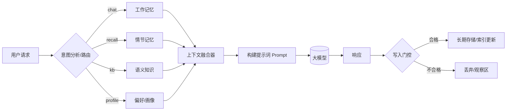

# 从“健忘”到“懂我”：构建新一代AI记忆系统

> 导语：我们追求的不是让AI记住一切，而是在**恰当的时刻，以最低的成本，唤醒最关键的信息**。这不仅是工程的挑战，更是产品设计的哲学。

## 1. 背景与痛点故事：一个“健忘”助手的自我修养

还记得你第一次用 AI 助手时的失望吗？  
它明明昨天刚学会你喜欢**美式不加糖**，今天又问一遍；  
你凌晨在东京加班，它却给你**洛杉矶时间**的提醒；  
项目复盘时，它把“上次讨论的决策”讲成了“上上次的想法”。

这些碎裂体验的根源，不是模型不够大，而是**记忆管理不成体系**：

- **上下文窗口昂贵且短视**：一次塞进太多，延迟与成本飙升；塞得太少，又拿不出关键事实。
- **长期记忆漂移**：旧偏好被覆盖、陈旧文件被引用，导致“越用越跑偏”。
- **多端/多人协作混线**：同一人手机+电脑、个人+团队空间，记忆边界模糊。
- **隐私与合规**：哪些应当“记”，哪些必须“忘”，缺乏可验证的策略与审计。
- **可观测性缺失**：出了错只能猜，无法定位是“没取到”还是“取错了”。

本文将为你揭示如何设计一套分层、动态的AI记忆管理系统，让你的AI应用从一个“健忘的工具”进化成一个“懂你的伙伴”。

## 2. 核心设计理念：分层记忆与读写分离

为了治愈AI的“健忘症”，我们需要借鉴人脑的记忆机制，为其打造一套工程化的“海马体”与“大脑皮层”。

| 层级                | 作用          | 典型实现                      | 延迟/成本 | 记忆寿命(建议) | 常见风险     |
|-------------------|-------------|---------------------------|-------|----------|----------|
| 工作记忆（会话缓冲）        | 维持对话连贯      | 滚动窗口 + 层级摘要               | 低/低   | 短期（会话内）  | 摘要丢细节    |
| 偏好/画像             | 个体稳定偏好与属性   | KV/Doc Store（JSON Schema） | 低/低   | 中长期      | 过度固化/刻板化 |
| 情节记忆（Episodic）    | 事件化的“发生过什么” | 向量检索 + 元数据                | 中/中   | 中期 + 衰减  | 语义重复/漂移  |
| 语义知识（Semantic KB） | 文档/代码/Wiki  | RAG（混合检索）                 | 中/中   | 可版本化     | 过期/冲突    |

1. **分层记忆（Hierarchical Memory）**：将记忆按时效性、用途和抽象程度分为不同层级。正如我们有瞬时的“工作记忆”、关于个人经历的“情节记忆”和包含常识的“语义记忆”，AI也需要类似的结构来高效组织信息。

   **为何选择分层架构？**
   - **对比统一记忆池 (Unified Memory Pool)**：统一池将所有类型记忆（对话、文档、偏好）等同视之，存入同一个向量空间。这种方案看似简单，但在大规模应用中会导致“信息灾难”：高频的瞬时对话数据会“稀释”掉低频但重要的长期偏好；不同类型信息的向量分布差异巨大，导致检索精度下降。
   - **对比平面化存储 (Flat Storage)**：例如，单纯依赖KV存储。这种方案难以进行有效的语义检索，无法回答“上次我们讨论的那个关于性能优化的方案是什么？”这类模糊查询。
   - **分层架构的优势**：通过为不同特性的数据选择最合适的存储和检索方案（如为偏好使用KV，为情节使用向量DB），实现了**成本、延迟和精度的最佳平衡**。它允许系统对不同层级的记忆施加不同的管理策略（如不同的衰减速度、更新频率），是实现精细化、可扩展记忆管理的前提。

2. **读写分离（Read/Write Isolation）**：将“唤醒记忆”（读取）和“形成记忆”（写入）两个过程解耦。
    - **读取路径（Read Path）**：当用户提问时，系统需要智能地判断“应该去哪里找答案？”，并从不同记忆层中组合出最相关的上下文。
    - **写入路径（Write Path）**：当对话结束后，系统要评估“这次交互中有什么值得记住的？”，并经过提炼、验证后存入相应的长期记忆库。

这种设计确保了系统在响应时足够快（只读相关信息），在学习时足够准（只记有价值的信息）。

## 3. 记忆系统架构总览：从查询到记忆的旅程

下面这张图描绘了一个请求在记忆系统中的完整生命周期。

**这个流程的核心步骤是：**

1. **意图分析与路由 (Intent Analysis & Routing)**：当用户发出请求，系统首先像一个聪明的指挥官，快速判断用户的意图。是简单的闲聊，还是需要回忆过去，或是查询专业知识？
2. **并行检索 (Parallel Retrieval)**：根据路由结果，系统会同时在不同的记忆库中进行检索。
    - **工作记忆 (Working Memory)**：存放当前对话的临时信息，保证对话的连贯性。
    - **情节记忆 (Episodic Memory)**：存储“发生过什么”，比如过去的对话、做过的决策。
    - **语义记忆 (Semantic Memory)**：记录外部的文档、知识库等。
    - **偏好记忆 (Preference Memory)**: 沉淀用户的稳定偏好、画像。
3. **上下文融合 (Context Fusion)**：从各个记忆库召回的信息，像拼图一样被组合起来，形成一个丰富、完整的上下文（Prompt），喂给大模型。
4. **写入决策 (Write Gating)**：大模型生成回答后，并非所有内容都会被记住。一个“写入门控”会严格把关，判断哪些信息是新的、有价值的，然后才将其提炼并存入相应的长期记忆库。

接下来，我们将深入探讨读、写路径和核心记忆模块的设计细节。

## 4. 核心记忆模块详解：构建AI的“海马体”与“知识库”

现在，我们来深入探索每个记忆模块的内部构造和运作原理。

### 工作记忆 (Working Memory)——“白板与便利贴”

维持短期对话的连贯性，解决指代消解（如“它怎么样了？”中的“它”）。

**典型实现**：

- **滚动窗口 (Rolling Window)**：保留最近N轮对话的完整记录。

- **触发式摘要 (Triggered Summarization)**：当对话超过N轮，或话题发生明显切换时，由一个轻量级LLM自动生成一段“前情提要”，取代旧的对话历史。这既保留了核心信息，又控制了长度。

  > 这个摘要并非简单的文本压缩，而是由一个专门的（或当前）LLM 提炼出“**关键事实、待办事项、核心决策**
  ”，然后将这个摘要放入下一轮的上下文，取代被滚动的旧对话。这种机制在保证连贯性的同时，有效控制了上下文长度和成本。

- **层级摘要（Hierarchical Summary）**：对于超长会话（如持续数小时的分析任务），单次摘要会越来越长。层级摘要将多个“小结”汇集成一个“总结”，再将多个“总结”提炼成一个“精要”，形成
  `摘要的摘要`。这就像从“会议纪要”到“项目周报”，再到“季度回顾”，每一层都保留了追溯到原始对话的链接，实现了信息的无损压缩与索引。

- **锚点 (Anchors)**：对于用户在当前会话中明确指定的、必须遵守的指令（如“请用德语回答”），系统会将其提取为结构化的“锚点”，固定在上下文的最顶端，确保其绝不会被遗忘或摘要掉。

> 类比：**白板**上写着今天要做的事（滚动窗口），**便利贴**贴着关键约束（锚点），清洁工每晚来（话题切换）再把白板内容汇总到日志本（层级摘要）。

### 情节记忆 (Episodic Memory)——“可检索的事件日志”

以**事件**为单位记录“发生过什么”，支持跨会话回想、总结与关联。它回答的是“我们上次聊到哪了？”或“关于 X 项目，我们做过哪些决策？”。

**向量检索 + 元数据过滤**：这是情节记忆的核心技术。每一次有意义的交互（如一个决策、一次问答、一个文件共享）都会被处理成一个“事件文档”。该文档的
**文本内容被编码为向量**，存入向量数据库（如 FAISS, Milvus, Pinecone）。

同时，所有**结构化信息**，如 `user_id`, `session_id`, `project_id`, `timestamp`, `event_type` , `tags` 等，作为**元数据**
一并存储，同时也提升了记忆的可解释性和可用性。

**查询过程**：采用“先过滤，后搜索”的混合策略。例如，当用户问“上周关于‘苍穹’项目的决策”，系统会先用元数据`project_id='苍穹'`和
`timestamp > last_week`过滤出候选事件，再在小范围内进行向量语义搜索，从而实现精准、高效的回忆。

此外还引入了

- **时间衰减 (Time Decay)**：记忆会随着时间流逝而“褪色”。一条记忆的权重会随时间指数级衰减。但如果它被再次引用或标记为重要，其权重就会被“刷新”和加强，模拟了人脑“温故而知新”的机制。
- **去重与聚簇 (Deduplication & Clustering)**：为避免记忆库中充斥大量语义重复的“噪音”，写入门控会使用 MinHash、SimHash
  或在线聚类算法。当一个新事件与某个现有事件或簇的相似度超过阈值（如 0.95），系统会选择**合并或更新**现有记忆，而不是创建一个新条目。这能有效防止
  AI 成为“语义复读机”。

### 语义记忆 (Semantic Memory)——“可信的外部资料库”

为 AI 提供可验证的、领域专属的外部知识，使其能回答“根据最新的XX文档，……”这类问题，是构建专家系统的基础。

#### 存储

结构化存储外部知识。

对于将长文档切分为合适的知识块（Chunk），一个优秀的策略是**按语义边界分块**，例如，根据 Markdown 的标题（`#`, `##`, `###`
）或代码的函数/类定义来切分。每个块都应**保留其在原文中的层级信息**作为元数据（如
`source: "doc.md", section: "3.4", subsection: "分块与锚点"`）。这样做的好处是，当 AI 引用这个知识块时，它可以自动生成精确的引用来源（“根据文档
3.4 节所述……”），并提供返回原文的链接，极大增强了答案的可信度。

知识是会过期的。所有存入 KB 的文档都必须带有**版本号**和**新鲜度打分**
。当一个文档更新时，其旧版本应被标记为“过时”并降低检索权重，新版本则触发重新索引。对于关键知识，新版本上线前应自动运行一套"
知识一致性校验（Knowledge Regression Check）"，确保它不会与现有重要知识产生冲突或导致错误回答。

#### 事实冲突消解

当从多篇文档中检索到的知识相互矛盾时，不能简单地全部丢给大模型。一个健壮的系统会：1) **优先选择来源更权威、更新时间更近的知识
**；2) 将冲突的事实和它们的来源一并呈现给大模型，并要求它“**基于提供的材料，分析并指出其中的不一致性，然后给出一个最可能的结论
**”。

### 偏好/画像（Declarative/Preference Store）——“可进化的用户手册”

沉淀稳定、可解释、可编辑的用户长期事实与偏好，让 AI 的服务越用越“懂你”。

#### 存储

结构化存储用户的偏好（如`timezone`, `code_style`, `communication_tone`）应以结构化的形式（如JSON）存储，并附带来源（`source`
）和置信度（`confidence`）。来源清晰地记录了该偏好是用户明确设置，还是模型隐式学习的。

#### 隐式偏好提取

这是让AI“懂你”的关键。系统会持续分析用户行为，通过**命名实体识别 (NER)**、**情感分析**和**模式匹配**
，从中发现潜在的偏好。例如，用户反复修改AI生成的代码格式，系统应能学习到其编码风格，并作为一个低置信度的偏好记下。当后续行为验证了该偏好，其置信度会提升。

隐式推断的偏好初始置信度较低。当用户后续行为**验证**了该偏好（例如，直接采纳了推荐的咖啡馆），其置信度会**提升**；如果用户**纠正
**了 AI（“不，我只是随便问问”），置信度则**下降**或直接删除该偏好。

显式同意与控制也很重要，对于模型推断出的高置信度偏好，应在适当时机（如会话结束时）向用户确认：“我注意到您似乎偏爱……，需要我记住吗？”。用户必须拥有一个清晰的“设置中心”，可以查看、修改甚至删除任何一条被记住的偏好，这既是信任的基石，也是合规的要求（如
GDPR）。

#### 冲突解决策略

当不同来源的偏好冲突时，需要明确的优先级规则。一个健壮的策略是：**场景瞬时偏好 > 用户全局偏好 > 团队/组织策略 > 模型推断偏好
**。例如，用户在项目中要求“用中文沟通”，这会暂时覆盖他“默认用英文”的全局偏好。

### 知识图谱的应用：从“事实”到“关系”的跃迁

当记忆系统需要理解实体之间复杂的、结构化的关系时，知识图谱（Knowledge Graph）就派上了用场。它并非一个独立的记忆层，而是构建情节记忆和语义记忆的一种高级手段。

- **作用**：将非结构化的信息（如“阿泽是‘苍穹’项目的负责人”）转化为结构化的三元组 `(阿泽, 担任, ‘苍穹’项目负责人)`。
- **应用场景**：
    - **多跳推理**：回答“负责‘苍穹’项目的工程师的上级是谁？”这类需要关系推理的问题。
    - **约束校验**：将“生产环境禁止使用GPL协议的库”这类规则存入图谱。当开发者提问时，系统可直接检查依赖关系，给出确定性回答。
    - **实体关联**：当用户提到“那个新功能”时，系统可以通过图谱关联到具体的功能模块、相关文档和负责人。

## 5. 记忆读取路径（Read Path）：在正确的时间，获取最对的信息

读取路径的性能和精度，直接决定了AI助手的响应质量和效率。其核心挑战在于：**如何在有限的成本和延迟内，最大化上下文的相关性？**

### 意图分析与路由：聪明的“交通指挥”

这是提升效率的第一道关卡。一个轻量级的分类模型或一套规则引擎，会在请求之初就为其打上“标签”，决定了后续的检索策略。

- **闲聊/问候** (`intent=chat`) → 只访问工作记忆，必要时可回退到偏好记忆。避免在无意义的寒暄中检索庞大的知识库。
- **技术问答** (`intent=qa_technical`) → 优先访问语义记忆（技术文档库）和工作记忆。
- **项目复盘** (`intent=project_review`) → 重点访问情节记忆（查找项目相关的历史对话和决策）和语义记忆、偏好记忆
  （项目参与者的角色和偏好）。
- **个人规划** (`intent=personal_planning`) → 组合访问情节记忆（过去的计划）、语义记忆、偏好记忆（个人习惯）和工作记忆。

这种任务感知的路由机制，极大地减少了不必要的检索开销，让系统“好钢用在刀刃上”。

### 多源融合与预算控制：戴着镣铐跳舞的艺术

各路信息召回后，如何“烹饪”成一道美味的“上下文大餐”？这需要精巧的融合策略和严格的预算管理。

1. 多查询扩展：对用户查询做 *multi-query* 扩展。

   例如同义词改写，更高级的技巧如 HyDE (Hypothetical Document Embeddings)
   ，它并非直接用假设性答案进行匹配，而是先让模型针对原始问题生成一个**假设性的理想答案文档**，然后将这个**文档进行向量化**，再用其 embedding
   去向量数据库中检索最相似的真实文档。这种方法能有效跨越查询和文档之间的“语义鸿沟”。

2. 混合检索：先按 `scope` 与元数据过滤（user_id、project_id、time_range、tags），再结合多种检索技术，取长补短。

    - **稀疏检索 (Sparse Retrieval)**：基于关键词匹配，常用算法如 **BM25**。它擅长处理包含精确术语或实体名的查询，能确保“字面相关”的内容被召回。
    - **稠密检索 (Dense Retrieval)**：基于语义向量，常用方法是计算 **Embedding 的余弦相似度 (Cosine Similarity) 或内积 (Inner Product)**
      。它能理解“概念相关”但“字面不同”的内容，弥补稀疏检索的不足。
    - **时间/新鲜度因子 (Recency Boost)**：这是一个加权项，用于提升近期文档的得分。实现方式通常是在最终排序分 `S` 上叠加上一个关于时间 `t` 的衰减函数，例如 `S_final = S_retrieval + w * exp(-k * (t_now - t_doc))`，其中 `w` 和 `k` 是可调参数，确保新信息更容易被用户看到。

3. 优先级排序：并非所有记忆都生而平等。通常，我们会设定一个优先级顺序：**用户指定的锚点 > 偏好设置 > 工作记忆 > 情节记忆 >
   语义知识**。

4. 结果合并：从不同来源召回的结果需要智能地融合。

   常用的策略包括：RRF (Reciprocal Rank Fusion)，它特别适用于将多个不同检索器（如关键字、向量、图谱）的排名结果进行综合，得出最终排序。

   而在单个检索结果内部，则可以使用 MMR (Maximal Marginal Relevance) 来进行重排，其核心思想是在保证结果相关性的同时，最大化内容的多样性，避免提供一堆内容相似的选项。

5. 重排：初步召回的 Top-K（通常 K=20~100）个候选结果，会经过一个更强大的重排模型进行“精加工”。

   这里通常使用 Cross-Encoder 模型，它能同时审视查询和每个候选文档，给出非常精准的相关性判断。或者，也可以使用更高效的
   双塔（Bi-Encoder）架构重排器（如 BGE-reranker），它在速度和效果之间取得了很好的平衡。最终筛选出 Top-N（通常 N=5~
   20）个结果，具体数量可根据延迟预算动态调整。

6. 预算感知融合：每个模型调用都有一个上下文长度的“天花板”（如8K
   tokens）。融合器会像一个精明的会计，按优先级填充内容。如果超出预算，它会优先“牺牲”相关性较低或信息密度较低的内容（通常是宽泛的语义知识），而不是砍掉关键的个人记忆。

此外引用注入 (Citation Injection)：从知识库或历史对话中引用的信息，必须附带其“出处”（如文档ID、消息链接）。这不仅让答案可追溯，也为后续的追问提供了精确的线索。

## 6. 记忆写入路径（Write Path）：提炼、验证与遗忘的艺术

如果说读取路径决定了AI的“智商”，那么写入路径就决定了它的“品格”。一个好的写入机制，能确保记忆库不被垃圾信息污染，并能做到“该忘的就忘”。

### 写入门控：什么值得记？

在信息写入长期记忆之前，必须经过三道严格的“安检”，其具体实现和阈值设定是关键：

1. **查重 (Deduplication)**：这条信息是否与已有记忆在语义上高度重复？
    - **算法**：对于情节记忆，可以使用 **Embedding 向量余弦相似度**。新记忆的向量与近期（如过去7天）写入的记忆向量进行比较。
    - **阈值**：若相似度大于 `0.95`，则视为高度重复，执行合并或更新操作，而非新增。这个阈值需要根据实际数据分布进行微调。

2. **查信 (Confidence Check)**：这条信息，尤其是模型推断出的事实或偏好，其置信度是否足够高？
    - **算法**：置信度可以是一个 `0` 到 `1` 的浮点数，其评估可以基于**多源信号的加权平均**。例如，`Confidence = w1 * 用户行为信号 + w2 * LLM评估分数`。
        - **用户行为信号**：用户是否明确确认（+0.5）、是否采纳了建议（+0.2）、是否无视（-0.1）、是否纠正（-0.5）。
        - **LLM评估分数**：让一个独立的评估模型判断该条记忆的“事实性”和“重要性”，输出一个分数。
    - **阈值**：初始推断的偏好置信度可能为 `0.4`，当累计分数超过 `0.7` 时，才“转正”为正式记忆。

3. **查敏 (Sensitivity Check)**：是否包含个人身份信息（PII）、密钥等敏感数据？
    - **规则**：主要依赖**正则表达式 (Regex) 和命名实体识别 (NER) 模型**。
        - **Regex**：编写规则库，匹配如身份证号、手机号、邮箱、IP地址、各类 `API_KEY` 格式。
        - **NER**：使用预训练或微调的NER模型，识别更泛化的 `PER` (人名), `ORG` (组织), `LOC` (地点) 等实体。
    - **处理**：一旦匹配，系统应根据预设策略执行**拒写**或**脱敏**（如 `[email protected]` -> `[EMAIL_REDACTED]`）。

### 记忆的生命周期：从形成到衰退

- **原子化写入 (Atomic Write)**：绝不将整段对话原封不动地存入记忆。写入模块负责将其“蒸馏”为独立的、结构化的“记忆原子”（如一个决策、一个偏好）。
- **人机共管 (Human-in-the-Loop)**：对于关键记忆的变更（如“更新团队设计规范”），可配置为需要人工审核后才生效。所有记忆条目都应提供清晰的撤回（undo）和追溯（trace）机制。
- **主动遗忘 (Proactive Forgetting)**：根据合规要求（如GDPR）或用户指令，系统必须能安全、彻底地删除指定范围的记忆，并留下可审计的记录。

## 7. 实践故事：阿泽和AI助手的“进化周记”

让我们回到阿泽的故事，看看一个设计良好的记忆系统如何改变他的体验。

> **主角**：阿泽，后端工程师，负责“苍穹”项目。  
> **AI助手**：一个集成了我们所设计记忆系统的智能伙伴。

**周一：入职与磨合**

- **阿泽**：“你好，我叫阿泽。这周我主攻‘苍穹’项目，请用简洁要点总结，并以东京时间为我安排提醒。”
- **AI写入路径**：
    - `情节记忆`：记录事件 `(阿泽, 自我介绍, '苍穹'项目)`。
    - `偏好记忆`：创建用户画像，写入 `(user_name: 阿泽)`, `(timezone: Asia/Tokyo)`, `(summary_style: bullets)`，来源均为
      `user_explicit_setting`，置信度 `0.99`。

**周二：深度协作**

- **阿泽**：“Go的pprof火焰图怎么分析？最好能结合我们项目的代码。”
- **AI读取路径**：
    1. `意图分析`：识别为 `qa_technical` + `project_related`。
    2. `路由`：查询 `语义记忆` (Go pprof官方文档) + `情节记忆` (筛选 `project_id='苍穹'`)。
    3. `融合`：找到一篇高质量的pprof教程，并从情节记忆中发现“上周阿泽提交过一个关于性能优化的PR”。
- **AI响应**：“分析火焰图主要看顶层的宽度... 正好，上周您提交的 `PR #123` 中有一个典型的CPU热点，我们可以用它作为例子...”
- **AI写入路径**：`情节记忆`中记录本次问答，并与 `PR #123` 建立关联。

**周四：隐式学习与主动确认**

- **阿泽**：（在几次代码评审后）“把这段代码的日志级别从 `INFO` 改为 `DEBUG`。”
- **AI写入路径**：`写入门控`注意到阿泽多次在测试环境中调低日志级别。它在`偏好记忆`中创建了一条**候选偏好**：
  `(code_style: {test_env_logging: 'DEBUG'}, confidence: 0.6, source: model_implicit_infer)`。
- **AI主动交互**：（在会话结束时）“我注意到您似乎倾向于在测试时使用更详细的日志。需要我记住这个习惯，以后自动为您调整吗？”
- **阿泽**：“好主意，记住吧。”
- **AI写入路径**：该偏好的 `confidence` 提升至 `0.95`，`source` 更新为 `user_confirmed`。

**周五：遗忘的权利**

- **阿泽**：“出于合规要求，请删除我六月份所有的项目讨论记录。”
- **AI写入路径**：`写入门控`触发**范围删除**操作，清除`情节记忆`中 `timestamp` 在六月份且与项目相关的记录，并生成一条不可篡改的
  **审计日志**。

通过这一周，AI助手从一个需要反复叮嘱的工具，逐渐“进化”成了一个能理解项目背景、学习个人习惯、并遵守规则的得力伙伴。

## 8. 工程落地蓝图与挑战

将上述设计付诸实践，需要关注以下几个关键点：

- **技术选型**：
    - **记忆存储**：通常采用混合方案。KV数据库（如Redis）用于存储偏好和工作记忆；向量数据库（如Milvus,
      Pinecone）用于情节记忆、语义记忆；图数据库（如Neo4j）用于知识图谱。
    - **服务化**：将记忆系统构建为独立的微服务，通过API与上层应用交互，便于维护和扩展。
- **性能与成本**：
    - **异步写入**：写操作异步化，避免阻塞用户响应。
    - **缓存策略**：在边缘节点或客户端缓存高频访问的偏好数据。
    - **模型选择**：使用轻量级小模型执行意图分类、摘要等任务，只在最终生成时调用昂贵的大模型。
- **评测与防劣化**：
    - **记忆健康度监控**：定期扫描记忆库，检查是否存在冲突、陈旧、重复的记忆。
    - **检索质量评测**：建立评测集，持续追踪检索的准确率（Precision）和召回率（Recall）。
    - **用户反馈闭环**：提供便捷的“赞/踩”和修正机制，将用户的隐式、显式反馈作为模型和策略迭代的重要信号。

## 9. 结语：让记忆成为AI的“第二天性”

一个真正智能的AI助手，其卓越之处不在于能回答多少问题，而在于它能在多大程度上理解你的过去，融入你的现在，并预见你的未来。

构建一套强大的记忆系统，就是为AI注入灵魂的过程。当分层架构、读写策略与持续学习的飞轮转动起来，你的AI将不再是一个健忘的工具，而是一个能与你共同成长、让你在关键时刻“会心一笑”的伙伴。

“放心，这次我记住了。”——这句简单的承诺，背后是无数工程与设计的智慧结晶。