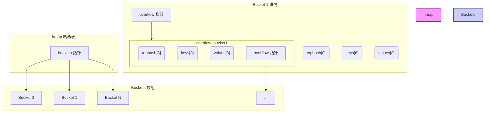
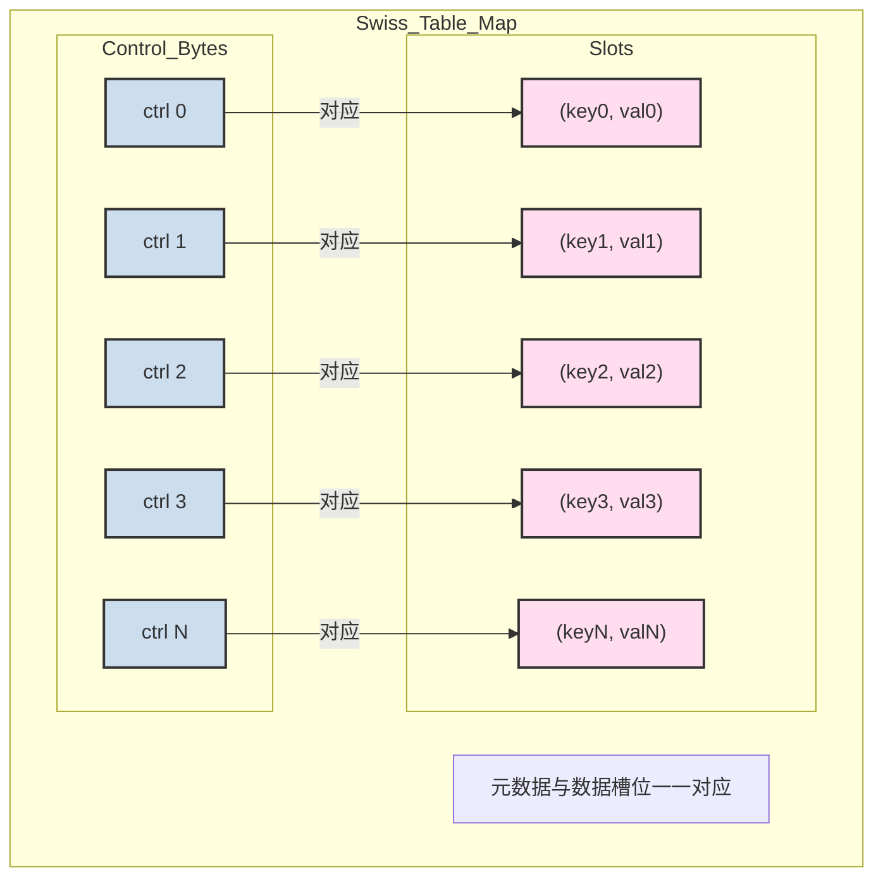
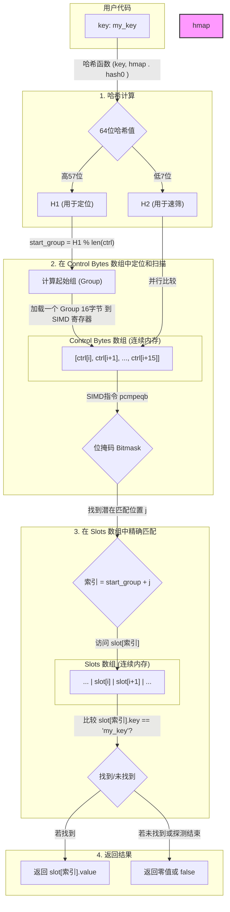
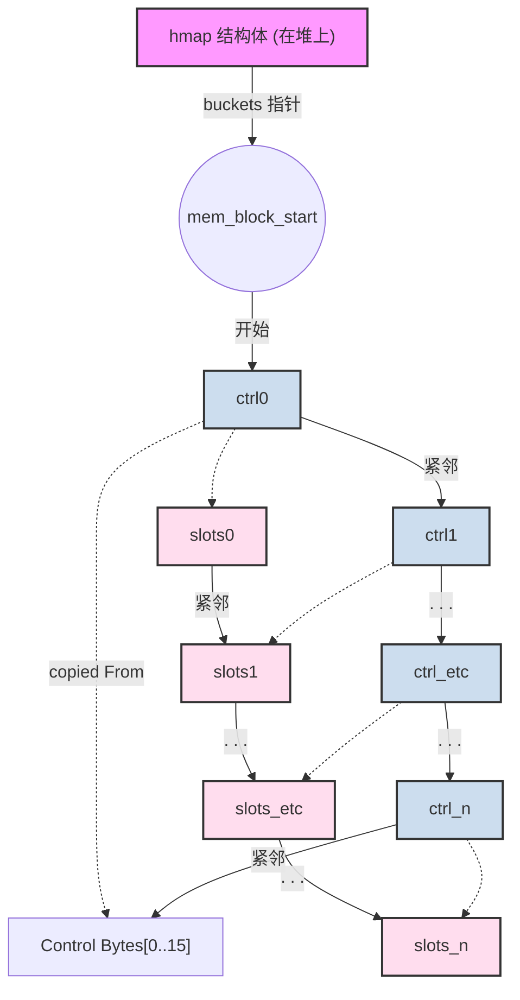

# Go map 的性能革命：深入解析从链表到 Swiss Table 的优化之路

你好，Gopher！`map` 作为 Go 语言中最核心、最常用的数据结构之一，其性能直接影响着我们程序的效率。在 Go 1.20 版本中，`map`
的底层实现迎来了一次意义深远的变革，从沿用多年的“哈希桶+链表”结构，悄然升级为了借鉴 Google C++ Abseil 库设计的 **Swiss
Table**。

这次升级并非简单的修修补补，而是一场彻头彻尾的性能革命。它通过更现代、更 CPU 友好的方式，显著提升了 `map` 的操作效率，并降低了内存开销。

这篇博客将带你深入浅出地探索这场变革。我们将：

1. **回顾“旧时代”**：理解传统 `map` 实现的巧妙之处与性能瓶颈。
2. **拥抱“新纪元”**：揭开 Swiss Table 的神秘面纱，探究其性能飞跃的秘密武器。
3. **对比与总结**：通过直观的对比和案例，让你彻底明白这次优化的核心价值。

无论你是希望提升代码性能的资深开发者，还是对 Go 底层实现充满好奇的学习者，本文都将为你提供一份清晰、详尽的指南。

## 1. 往昔回顾：巧妙但略显沉重的“文件柜”——传统 Go map 实现

在 Go 1.24 之前，`map` 的实现可以比作一个精心设计的“文件柜系统”。每当我们要存入一个键值对，就好比要将一份文件（`value`
）根据其标题（`key`）存放到一个特定的文件柜抽屉里。

这个系统的核心是 `hmap` 和 `bmap` 两个结构体，它们共同构建了一个**基于哈希桶和链表的哈希表**。

### 1.1 数据结构：哈希桶 (bucket) 与溢出链

- **哈希表 (hmap)**：整个 `map` 的“大脑”，它持有一个指向 `buckets` 数组的指针。这个数组的长度通常是 2 的幂次方。
- **哈希桶 (bmap)**：就是我们说的“抽屉”。每个桶（bucket）是一个固定大小的“格子”，可以存放 **8 个** 键值对。此外，每个桶还包含一个
  `tophash` 数组和一个指向“溢出桶”（overflow bucket）的指针。
    - **tophash**：为了在桶内快速筛选，系统会计算每个 `key` 的哈希值，并将其高 8 位存储在 `tophash` 数组中。查找时，可以先快速比较这
      8 位，如果 `tophash` 不匹配，就无需再比较完整的 `key`，这是一种廉价的“预筛选”机制。
    - **溢出桶 (overflow bucket)**：如果一个桶的 8 个槽位都满了，新的键值对就会被放入一个新建的“溢出桶”中，并通过指针与原桶链接起来，形成一条链表。

我们可以用一个 Mermaid 图来形象地展示这个结构：



### 1.2 工作流程与性能痛点

**查找过程**就像在文件柜里找文件：

1. **计算哈希**：根据 `key` 计算出哈希值。

2. **定位桶**：哈希值的低位用于确定它属于哪个主桶（`buckets` 数组的索引）。

3. 桶内查找：

   a. 快速预筛选：遍历桶内的 tophash 数组，与 key 哈希值的高 8 位进行比较。

   b. 精确匹配：如果 tophash 匹配，再完整地比较 key 是否相同。

4. **遍历溢出链**：如果当前桶没找到，就顺着 `overflow` 指针，跳转到下一个溢出桶，重复步骤 3，直到找到或者链表结束。

这个设计在大多数情况下运行良好，但随着 `map` 规模和冲突的增加，其“沉重”的一面也逐渐暴露出来，主要体现在以下几个方面：

- 痛点一：内存访问的“随机跳跃” (Cache Locality 差)

  我们的“文件柜”比喻在这里非常贴切。当一个桶满了，溢出桶是在内存中重新分配的。这意味着它和原始桶的内存地址通常相距甚远。当
  CPU 需要从主桶跳转到溢出桶时，就像我们翻完一个抽屉，却被告知要去大楼另一头的另一个抽屉里继续找。

  这种“指针跳跃”对 CPU 缓存极不友好。CPU 缓存喜欢连续的内存访问（数据局部性），因为它可以一次性加载一大块数据（Cache
  Line）以备后用。频繁的指针跳转会导致 **Cache Miss (缓存未命中)**，CPU 不得不放弃高速的缓存，转而从慢速的主内存中加载数据，性能急剧下降。

- 痛点二：内存分配的“碎片化”与额外开销

  每个键值对除了存储 key 和 value 本身，还有 tophash 的 1 字节开销。更重要的是，大量的溢出桶导致内存分配变得零散，增加了 Go
  垃圾回收器（GC）的管理负担。每个溢出桶指针自身也占用 8 个字节（在 64 位系统上）。

- 痛点三：删除操作的“假性清空”

  map 中的元素被删除后，其占用的槽位只会被标记为“空”，并不会立即被回收或整理。这可能导致 map
  即使在删除了大量元素后，依然持有大量内存和溢出桶，造成空间浪费。

## 2. 新纪元：CPU 的亲密战友——Go Swiss Table 实现

为了解决上述痛点，Go 团队引入了 Swiss Table。这个名字源于其设计者在 Google 苏黎世（Swiss）办公室工作。其核心思想是：*
*将数据尽可能地组织在连续的内存中，并通过一个紧凑的元数据（metadata）数组，利用 SIMD 指令进行超高速扫描，从而最大化 CPU
缓存的效率。**

如果说旧 `map` 是一个需要来回跑动翻找的“文件柜”，那么 Swiss Table 就好比一个**智能酒店的前台系统**。

### 2.1 新的蓝图：元数据与数据分离

Swiss Table 的结构被彻底重构。它不再将元数据（如 `tophash`）和键值对混合存储在同一个桶结构里，而是将它们分离成两个独立的、但逻辑上平行的数组：

1. **控制字节数组 (Control Bytes / Metadata)**：一个非常紧凑的元数据数组。每个字节对应一个数据槽位，记录着该槽位的状态（是空的、已删除、还是已满）以及部分哈希信息。
2. **槽位数组 (Slots)**：一个连续的、巨大的数组，用于存放真正的 `key-value` 对。

让我们用一个更贴切的比喻来理解：

> **酒店前台系统比喻：**
>
> - **槽位数组 (Slots)**：就是酒店的一排排**客房**，每个房间里住着一位客人（`key-value` 对）。
> - **控制字节数组 (Control Bytes)**：就是前台的**电子入住登记表**。这张表非常紧凑，每一行只记录了对应房间的**最关键信息**
    ：房间号、入住状态（空房/已入住/待打扫）、以及客人姓氏的**首字母缩写**（部分哈希）。
>
> 当你想找一位名叫 "John Smith" 的客人时，你不会挨个敲门去问。而是先在前台快速扫一眼登记表，通过姓氏首字母 '
> S'（部分哈希）筛选出几个可能的房间，然后再去这几个房间确认完整的姓名（完整的 `key`）。

这个结构可以用下面的 Mermaid 图表示：



### 2.2 性能飞跃的秘密武器

#### 武器一：控制字节 (Control Byte) 与 H2 哈希

每个控制字节（1 byte）都蕴含着丰富的信息。对于 64 位哈希值将其一分为二：

- **H1 (高 57 位)**：用于定位**起始槽位组**。整个槽位数组被划分为若干个“组”（Group），H1 决定了从哪个组开始探测。
- **H2 (低 7 位)**：作为 `key` 的“指纹”，存储在控制字节中。

一个控制字节的 8 位被这样使用：

- **最高位 (1 bit)**：用于标记特殊状态，如 `空` (empty) 或 `已删除` (deleted, 也称 tombstone)。
- **低 7 位 (7 bits)**：存储哈希值的 `H2` 部分。

| 控制字节值 (二进制) | 状态          | 描述                          |
|-------------|-------------|-----------------------------|
| `11111111`  | Empty（空槽）   | 槽位是空的，遇到即终止探测               |
| `10000000`  | Deleted（墓碑） | 槽位曾有数据但已被删除                 |
| `0xxxxxxx`  | Full（在用）    | 槽位已满，`xxxxxxx` 是 H2 (7 位哈希) |

这种设计使得前台的“登记表”异常紧凑且信息量大。


> 为什么碰到空槽，遇到即终止探测呢？
>
> 1. **插入逻辑保证**：所有 Put() 都在遇到第一个 EMPTY 时停下并写入槽位，不会跳过 *第一个* EMPTY。
> 2. **探测一致性**：查找与插入完全相同的探测顺序，保证若在第 k 步遇到 EMPTY，则当时插入也一定在此终止，故后续槽位不可能保存该键。
> 3. **墓碑不会误判**：DELETED 槽位并非 EMPTY，遇到 0x80 只当作中间态，继续探测直到真正的 EMPTY。

#### 武器二：SIMD——一眼看穿 16 个房间状态

这正是 Swiss Table 最革命性的一点。现代 CPU 支持 **SIMD (Single Instruction, Multiple Data)** 指令，允许在一个指令周期内，对多个数据执行相同的操作。

由于控制字节是连续存储的，当 `map` 需要查找一个 `key` 时，它可以：

1. **加载一个组**：一次性将一个组（例如 16 个）的控制字节加载到 CPU 的一个宽位寄存器（如 128 位 XMM 寄存器）中。
2. **广播 H2**：将要查找的 `key` 的 `H2` 值复制 16 遍，形成一个同样宽度的“目标向量”。
3. **并行比较**：使用一条 SIMD 指令，将这两个向量进行“等于”比较。这条指令会在一个时钟周期内，**同时完成 16 个字节的比较**
   ，并返回一个位掩码（bitmask），用 1 和 0 标示出哪些位置的 `H2` 匹配成功了。

这就像前台服务员拥有了“一目十行”的超能力，他不是一个一个地看登记表，而是一眼扫过去，所有姓氏首字母为 'S' 的房间号瞬间在他脑中标亮！

```
// 概念演示：SIMD 如何工作
// 假设我们要在一个组(16字节)中寻找 H2 = 0x5A

Control Bytes in Register: [0x12, 0x5A, 0x3F, ..., 0x80, 0x5A] (16 bytes)
Target H2 Vector         : [0x5A, 0x5A, 0x5A, ..., 0x5A, 0x5A] (16 bytes)

SIMD Compare Instruction (pcmpeqb)
           |
           V

Result Bitmask           : 0b...100...010  (第 1 位和第 14 位匹配)
```

只有在位掩码显示有匹配项时，`map` 才会去访问 `Slots` 数组中对应的 `key`，进行完整的比较。这意味着绝大多数不匹配的 `key`
，在第一步的元数据扫描中就被光速过滤掉了，**完全没有访问 `key-value` 数据本身**，极大地减少了内存访问和缓存压力。

#### 武器三：开放寻址与线性探测 (Open Addressing)

Swiss Table 放弃了链表，转而使用**开放寻址**来解决哈希冲突。

- **查找/插入流程**：
    1. 通过 `H1` 计算出起始组。
    2. 使用 SIMD 扫描该组的控制字节，寻找匹配的 `H2` 或空槽位。
    3. **如果在本组没找到**：**不会**创建溢出桶，而是简单地**探测下一个相邻的组**，继续扫描。这个过程会一直持续下去，直到找到匹配的
       `key`、找到一个空槽位（用于插入），或者扫描到“空”标记（表示查找失败）。
    4. **删除**：当一个元素被删除，其控制字节会被设置为 `Deleted`（墓碑标记）。这个标记告诉探测过程：“这里曾经有人，请继续往后找”，从而保证了探测链的完整性。

这种线性探测的方式保证了所有数据都紧密地存储在连续的内存中，最大化了 CPU 缓存的命中率。再也没有了代价高昂的指针跳转。

> 为什么是通过 H1 这个位数更多的位进行计算起始组，而不是更小的 H2 呢？
>
> **H1 和 H2 的分工不同，它们一个负责“宏观分布”，一个负责“微观速筛”**。
>
> - **H1 (高 57 位) - 宏观分布**： 哈希表的首要目标是让键尽可能**均匀地散落**在整个数组中，以避免冲突。H1
    拥有巨大的取值范围 (257)，即使 `key` 只有微小的变化，其 H1 值也可能产生巨大差异。使用 H1 来计算**起始组**
    的位置，可以确保从宏观上，不同的 `key` 会被定位到哈希表中非常分散的不同区域。这就像给全国的包裹分配派送区域，我们用精确到“省-市-区”的地址（H1）来做初次分配，确保包裹不会都挤在北京。
> - **H2 (低 7 位) - 微观速筛**： H2 的取值范围很小（只有 27=128 种可能）。如果用它来定位起始组，那么成千上万的 `key` 都会被映射到这
    128 个组中的某一个，导致灾难性的冲突和超长的探测链。因此，H2 的作用被限定在**一个小组（Group）内部**。它就像一个 `key`
    的“指纹”或“姓氏首字母”，当我们用 H1 找到一个具体的“派送点”（组）后，不用逐一开箱检查包裹内容（完整的 `key`），而是用 SIMD
    一眼扫过所有包裹单上的“姓氏首幕”（H2），快速过滤掉绝大多数不相关的包裹。
>
> H1 负责将 `key` 在广阔的哈希表中撒得“**开**”，H2 负责在小范围内把 `key` 查得“**快**”。两者各司其职，缺一不可


为了让这个探测过程快到极致，Go 的实现还用上了一个被称为 **镜像哨兵 (Sentinel Mirroring)** 的技巧。

- **问题**：常规的线性探测，当抵达数组末尾时，需要一个 `if` 判断来决定是否要“绕回”数组开头，这个判断会轻微影响 CPU 流水线效率。
- **解决方案**：在分配控制字节数组时，Go 会在末尾额外分配一个“哨兵”区域，并将数组**开头第一个组**的控制字节**复制**到这个哨兵区域。
- **效果**：现在，当探测过程“跑过”了数组的实际末尾时，它会无缝进入这个与开头一模一样的“镜像”区域。这使得探测循环**无需任何边界检查
  **，代码更简单，执行也更快。就好像在环形跑道的终点线后又铺了一段和起点完全相同的路，让奔跑者可以无感地“跨越”终点，无需减速判断。

以下流程图正好展示了整个探测过程



### 2.3 完整物理内存布局



图解说明

**顶层指针 (`hmap`)**: 一切始于 `hmap` 这个核心结构体。它的 `buckets` 指针并不指向一个指针数组，而是直接指向**一整块巨大、连续的内存
**的起始地址。

**单一、连续的内存块**: 这是性能优化的基石。图中被框起来的整个区域代表一次内存分配 (`malloc`)
的结果。这种布局消除了传统哈希表中因溢出桶而导致的内存碎片化和随机内存访问。

**Group 的内部结构**:

- 内存块被逻辑上切分成 **N** 个 **Group**。每个 Group 在功能上类似于旧版 `map` 的一个桶（bucket）。
- 每个 Group 内部，都是由两部分**紧密相邻**组成的：
    - **`Control Bytes` 数组**：一块非常小（通常是 16 字节）的元数据，用于 SIMD 快速筛选。
    - **`Key-Value Slots` 数组**：紧跟在 `Control Bytes` 后面的，是存放实际数据的 16 个槽位。
- 这种“元数据”+“数据”的打包存放方式，进一步增强了**数据局部性**。当 CPU 因为读取 `Control Bytes` 而加载了一个缓存行（Cache
  Line）时，它极有可能已经将后续需要访问的 `Key-Value` 数据也一并加载到了高速缓存中。

**镜像哨兵 (Sentinel)**:

- 这是图中位于内存块**最末端**的特殊区域。
- 它的内容不是新的数据，而是**完整复制了第一个 Group（Group 0）的 `Control Bytes`**。图中用红色虚线箭头表示了这个复制关系。
- **作用**：它是一个绝妙的性能优化技巧。当线性探测（在一个 Group 中未找到，需要检查下一个 Group）进行到 `Group N-1`
  并且需要继续时，探测逻辑会自然地“溢出”到这个哨兵区域。因为哨兵区和 `Group 0` 的元信息完全一样，所以探测逻辑可以无缝地、无需任何
  `if` 边界判断就衔接回哈希表的开头。这消除了一个潜在的、会影响 CPU 流水线的分支预测，使得探测循环的代码更简洁、执行效率更高。

> 从图中也可以看出，整个过程（除了开放寻址的线性探测）几乎没有指针跳转。从 `Control Bytes` 数组的一个索引到 `Slots`
> 数组的同一个索引，只是一个简单的基地址+偏移量的计算，这正是 CPU 最擅长的操作。

## 3. 新旧对比：一场全方位的胜利

让我们用一个表格来直观地总结这次进化：

| 特性       | 传统 Map (链地址法)                   | Swiss Table (开放寻址法)   | 优化点               |
|----------|---------------------------------|-----------------------|-------------------|
| **核心结构** | 哈希桶 + 溢出链表                      | 控制字节数组 + 键值槽位数组       | 消除指针，数据连续存储       |
| **冲突解决** | 在桶后链接溢出桶                        | 线性探测到下一个可用槽位          | **显著提升缓存局部性**     |
| **查找加速** | `tophash` 逐个比较                  | **SIMD 并行扫描**一组元数据    | 数量级级别的预筛选加速       |
| **内存访问** | 可能频繁跳跃到不连续的溢出桶                  | 绝大多数情况是**连续扫描**       | **最大化 Cache 命中率** |
| **内存开销** | `tophash` + `overflow` 指针 + 碎片化 | 仅 1 字节控制字节开销，内存紧凑     | 更低的内存占用和管理开销      |
| **删除操作** | 标记为空，空间难以复用                     | 标记为“墓碑”，探测时跳过但可被新元素复用 | 更高效的空间再利用         |

### 案例演示：为什么 Swiss Table 更快？

假设一个场景，我们要在一个有 100 万个元素的 `map` 中查找一个 `key`，且该 `key` 发生了多次哈希冲突。

- **旧版 Map 的遭遇**：

    1. 计算哈希，定位到 `Bucket X`。

    2. CPU 加载 `Bucket X` 到缓存。

    3. 在 `Bucket X` 中逐一比较 8 个 `tophash`，都失败。

    4. 发现 `overflow` 指针不为空，CPU 从该指针跳转到内存中一个遥远的位置，加载第一个溢出桶。**(大概率 Cache Miss)**

    5. 在溢出桶中继续逐一比较 8 个 `tophash`，又失败。

    6. 再次跳转到下一个溢出桶... (又一次 Cache Miss)

       这个过程充满了昂贵的、破坏 CPU 流水线的“等待”。

- **Swiss Table 的优雅操作**：

    1. 计算与定位：计算 `key` 的哈希，得到 H1 和 H2。通过 H1 定位到起始 `Group G`。
    2. 加载元数据：CPU 将 `Group G` 的 16 个控制字节加载到 SIMD 寄存器。
    3. 并行速筛：CPU 使用**一条 SIMD 指令**，将这 16 个字节与 `key` 的 H2 值进行并行比较。指令返回一个 16 位的**位掩码 (
       bitmask)**，例如 `0010000010000000`。
    4. 解读掩码：
        - 如果位掩码为 `0`，说明本组没有任何 `H2` 匹配，直接探测下一个组 `Group G+1`，重复步骤 2-3。
        - 如果位掩码**不为 `0`** (如上例)，这代表组内**第 3 位和第 9 位**（从右往左数）的槽位是潜在匹配项。**注意，这只是 H2
          匹配，key 不一定相同**（哈希冲突）。
    5. 精确验证：程序**不会**再检查其他 14 个不匹配的槽位。它会根据位掩码，直接访问 `Slots` 数组中那 2 个潜在匹配的槽位：
        - 访问 `slots[G_start + 3].key`，与我们的目标 `key` 进行**完整比较**。
        - 如果 `key` 相同，太棒了！我们找到了目标，返回 `slots[G_start + 3].value`。查找结束。
        - 如果 `key` 不同（这是一个 H2 冲突），则继续检查下一个潜在匹配项。
        - 访问 `slots[G_start + 9].key`，进行完整比较。如果匹配，则返回 `value`。
    6. 继续探测：如果检查了位掩码指示的所有潜在匹配项后，发现都不是我们要找的 `key`，这意味着本组内的匹配都是 H2
       冲突。此时，程序会继续探测下一个组 `Group G+1`，重复整个过程，直到找到或遇到一个 `Empty` 标记。

## 4. 客观的权衡：墓碑标记的潜在风险

在一些特定且相对极端的场景下，它的性能可能会低于旧版 map。

这主要与它的**删除机制和“墓碑 (tombstone)”标记**有关。

- **墓碑问题**：当 Swiss Table 中的一个元素被删除时，它的控制字节会被设置为 `Deleted`
  状态（即“墓碑”）。这个标记是必需的，因为它告诉探测链：“这里曾经有数据，你不能停下来，请继续往后找”。
- **性能退化场景**：想象一下，你创建了一个巨大的 `map`，然后**删除了其中 90% 的元素**。此时，`Slots` 数组中大部分是空的，但
  `Control Bytes` 数组中却密密麻麻地布满了“墓碑”。
    - **查找一个不存在的 key**：此时，查找过程会非常痛苦。探测链需要越过成百上千的“墓碑”才能最终碰到一个 `Empty` 标记来确认
      `key` 不存在。每一次探测（即使是 SIMD 加速的）都是成本。
    - **对比旧版 map**：在这种情况下，旧版 `map` 可能表现更好。因为它的溢出链可能因为删除而变短或消失，查找一个不存在的
      `key` 可能只需要检查一个桶（8个槽位）就能结束。

**如何缓解？** Go 的设计者早已预见此问题。`map` 的实现会在**扩容**时，将所有“墓碑”自然地清除掉，`map` 会恢复到最紧凑、最高效的状态。此外，当
map 的**负载因子**（包括墓碑在内的非空槽位比例）过高时，即使元素数量没有增加，也可能触发一次等量迁移来清理墓碑。因此，这个问题通常是
**暂时的**，除非你的程序逻辑是“只插入和删除，从不引发扩容”。

另外，截至 Go 1.24，AMD64 架构上使用了 SIMD 硬件指令加速，而 ARM64 等其他平台则使用可移植的位运算技巧来高效模拟，性能同样远超旧版
map，但理论峰值会略低于有硬件加速的环境。

## 5. 结论：无感知的巨变，更强大的 Go

Go `map` 从传统链表到 Swiss Table 的革命性升级，其本质是**从“面向指针的软件逻辑”转向了“拥抱硬件的物理布局”**
。它通过两大核心改进，实现了性能的飞跃：

1. **数据局部性最大化 (Data Locality)**：用一个连续的、平坦的键值数组，彻底消除了旧实现中因“溢出链”而产生的随机内存跳转。这使得
   CPU 缓存能够发挥最大效能，避免了代价高昂的 Cache Miss。
2. **元数据并行处理 (SIMD-Accelerated Metadata)**：设计了紧凑的“控制字节”数组，并利用现代 CPU 的 SIMD
   指令进行并行扫描。这使得一次哈希查找能在一个指令周期内过滤掉绝大多数不匹配的元素，将昂贵的 `key` 比较次数降至最低。

对于我们 Go 开发者来说，`map` 的这次底层革命是**完全透明**的。我们不需要修改任何代码，只需升级到 Go 1.20
或更高版本，就能自动享受到这次优化带来的红利：

- **更快的 map 操作**：无论是插入、查找还是删除，在各种场景下，尤其是高冲突场景下，性能都有显著提升。
- **更低的内存占用**：更紧凑的数据结构和更少的额外开销，让你的程序更“瘦身”。
- **更平滑的 GC 表现**：连续的内存布局和更少的指针，减轻了垃圾回收的压力。

理解 Go `map` 从“链表哈希”到“Swiss Table”的演进，不仅能让我们赞叹 Go 团队在性能优化上的极致追求，更能加深我们对现代计算机体系结构（特别是
CPU 缓存）如何影响软件性能的理解。

下一次，当你轻松地写下 `myMap[key] = value` 时，请记住，其背后正有一个高效、优雅的“智能酒店前台”在为你飞速运转。