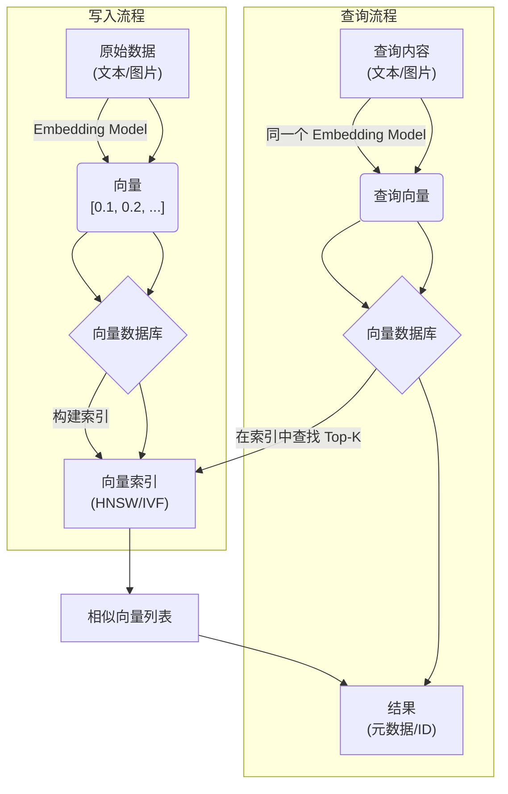

# 从 Redis 和 MySQL 到向量数据库：你的下一代数据存储利器

> 对于熟悉 `WHERE id = ?` 和 `GET user:1` 的后端工程师来说，向量数据库（Vector
> DB）似乎是一个全新的物种。它不追求精确匹配，而是专注于“语义”和“相似性”的查找。这篇文章将为你揭开它的神秘面纱，从原理到实践，让你彻底理解这个
> AI 时代的新宠。

## 1. 核心流程：向量数据库是如何工作的？

想象一下，我们要构建一个“以图搜图”的系统。我们不能直接用 `WHERE image_binary = ?`
来查询，因为即使两张图片只有一个像素不同，二进制层面也是天差地别。我们需要一种更高维度的方式来理解数据——这就是向量。

### 1.1 数据 -> 向量：Embedding 的诞生

万物皆可 Embedding。无论是文本、图片还是音频，我们都可以通过一个深度学习模型（称为 **Embedding Model**
），将其转换成一个由数字组成的向量（Vector）。

这个向量可以被看作是原始数据在数学空间中的一个“坐标”，它捕捉了数据的核心语义。

- **文本**：`"我爱吃苹果"` -> `[0.12, -0.45, 0.89, ...]`
- **图片**：`apple.jpg` -> `[-0.98, 0.23, 0.67, ...]`

关键在于，**语义上相似的内容，其向量在空间中的距离也更近**。比如，“我喜欢吃苹果”和“我爱吃苹果”的向量会非常接近。

### 1.2 向量的存储与索引

拿到向量后，我们将其存入向量数据库。除了向量本身，通常还会附带一个 ID 和一些元数据（Metadata），比如商品 ID、图片 URL 等。

```json
{
  "id": 1001,
  "vector": [
    0.12,
    -0.45,
    0.89,
    ...
  ],
  "metadata": {
    "product_name": "红富士苹果",
    "category": "水果"
  }
}
```

为了能快速检索，数据库会在后台为这些向量建立索引。这和 MySQL 的 B+ 树索引类似，但算法完全不同，我们稍后会讲。

### 1.3 查询流程：大海捞针的艺术

1. **查询预处理**：用户输入查询内容（如文本 "嘎嘣脆的红苹果" 或一张图片）。
2. **生成查询向量**：用**同一个 Embedding Model** 将查询内容转换成一个查询向量。
3. **执行相似性搜索**：数据库拿着这个查询向量，利用索引快速找到与之最相似的 Top-K 个向量。
4. **返回结果**：返回这些相似向量对应的元数据和 ID。

### 1.4 更新与删除：向量世界的 CRUD

- **创建 (Create)**: 即将向量及元数据写入数据库，通常是批量 `Upsert`（如果 ID 已存在则更新，否则插入）。
- **读取 (Read)**: 除了核心的向量搜索，向量数据库也支持通过 ID 直接获取向量和元数据，类似于 KV 存储的 `GET` 操作，但这不是它的主要优势。
- **更新 (Update)**：大多数向量数据库的向量是不可变的（Immutable）。更新一个向量通常意味着：**删除旧向量，然后插入一个新向量**
  。一些现代数据库（如 Qdrant、Milvus）正在优化这个过程，支持对元数据的直接更新。
- **删除 (Delete)**：删除操作通常是“标记删除”（Soft Delete）。系统会先标记某个向量为已删除，在后续的索引合并或重建过程中再进行物理删除。这避免了每次删除都引发昂贵的索引调整。

### 流程图



## 2. 深入底层：向量索引的魔法

如果让你在百万个三维坐标点中找离目标点最近的 10 个，你会怎么做？暴力遍历计算距离？当向量维度成百上千、数据量上亿时，暴力计算是不可接受的。这就是向量索引的用武之地。

### 2.1 什么是向量相似度？

我们说“距离近”，在数学上如何衡量？常用指标有三种：

- **余弦相似度 (Cosine Similarity)**：衡量两个向量在方向上的相似性，与长度无关。值域 `[-1, 1]`，越接近 1 越相似。适用于文本等高维数据。
- **欧氏距离 (Euclidean Distance)**：空间中两点的直线距离。值域 `[0, +∞)`，越小越相似。
- **点积 (Dot Product)**：结合了方向和模长。在向量归一化后，等价于余弦相似度。

### 2.2 精确 vs. 近似：ANN 的智慧

在海量数据中找到**绝对**最近的邻居（k-NN）成本极高。因此，几乎所有高性能向量数据库都采用**近似最近邻（Approximate Nearest
Neighbor, ANN）** 算法。

ANN 的核心思想是：**放弃寻找 100% 精确的最近邻，以换取百倍甚至千倍的查询速度**。它不保证找到绝对最优解，但能以极大概率（例如
99%）找到足够好的结果。这就像在巨大的图书馆里找一本关于“古代天文学”的书，你不需要找到全馆“最”相关的那本，只要图书管理员能快速带你到“天文学”书架，并在那儿找到一本非常相关的即可，这对于搜索和推荐场景完全足够。

### 2.3 常用索引算法

- **Flat (扁平索引)**：
    - **比喻**：**全校点名**。要找一个学生，把全校几千人一个个喊过来问一遍。绝对能找到，但效率极低。
    - **原理**：就是暴力计算，没有任何索引结构。100% 精确，但速度最慢，只适合小数据集或作为其他索引的“对照组”。
- **IVF (Inverted File, 倒排文件)**：
    - **比喻**：**图书馆分区**。先把图书馆的书按“计算机”、“文学”、“艺术”等区域（簇）分开。找书时，先判断你要找的书属于哪个区，然后只去那个区里翻找。
    - **原理**：类似 K-Means 聚类。它先把海量向量分成很多个“簇”（cluster），每个簇有一个中心点。
    - **查询**：查询时，先计算查询向量与所有“簇中心”的距离，找到最近的几个簇，然后只在这几个簇内进行暴力搜索。
    - **权衡**：`nprobe` 参数（要搜索的簇数量）是关键。`nprobe` 越大，访问的“区域”越多，越精确，但越慢。
- **HNSW (Hierarchical Navigable Small World, 层次化可导航小世界)**：
    - **比喻**：**公司通讯录**。找一个具体员工，你不会从公司全员名单里搜。而是先找到 CEO（顶层入口），CEO
      指引你到对应的部门总监（下一层），总监再指引到团队 Leader，最后找到那个人。每一层都帮你缩小了范围。
    - **原理**：HNSW 构建一个多层图结构。搜索时，从顶层（稀疏图）的入口点开始，像开导航一样，在每一层都选择距离目标最近的节点前进，快速定位到目标区域，然后逐层下降，在更密集的图中进行更精确的查找，直到找到最近的邻居。
    - **优点**：查询速度极快，效果好，无需“训练”阶段，支持增量添加。是目前最高性能、最主流的算法之一。
- **PQ (Product Quantization, 乘积量化)**：
    - **比喻**：**信息摘要**。一篇长文章，你把它压缩成几句核心摘要来记。虽然丢失了一些细节，但占用的“脑容量”大大减少。
    - **原理**：一种**有损压缩**技术。它将一个高维向量切成多段，对每一小段分别进行聚类（量化），用聚类中心的 ID
      来代替原始数据，极大地压缩了内存占用。
    - **应用**：通常不单独作为索引，而是与 IVF 或 HNSW 结合使用（如 `IVF_PQ`），在牺牲一定精度的前提下，将内存消耗降低一个数量级。

### 2.4 性能权衡与存储策略

| 索引类型     | 构建时间 | 内存占用 | 查询速度 | 精度   | 是否需训练 |
|:---------|:-----|:-----|:-----|:-----|:------|
| **Flat** | 快    | 非常高  | 非常慢  | 100% | 否     |
| **IVF**  | 慢    | 中    | 快    | 可调   | 是     |
| **HNSW** | 中    | 高    | 非常快  | 高    | 否     |
| **PQ**   | 慢    | 非常低  | 快    | 低-中  | 是     |

- **落盘与内存**：HNSW 等索引主要在内存中工作以保证性能。很多数据库（如 Qdrant）支持将向量和索引快照到磁盘（on-disk），并在启动时加载回内存。
- **增量构建**：HNSW 天然支持增量添加数据而无需完全重建索引，这对实时性要求高的场景至关重要。而 IVF
  在新增数据较多后，可能需要重新训练和构建，以防“簇”的分布不再均匀。

## 3. 与 MySQL / Redis 对比

从传统数据库过来的我们，需要转变哪些思维？这不仅仅是功能有无的问题，更是设计哲学的差异。

### 3.1 CRUD 操作的差异

| 操作         | MySQL / Redis       | 向量数据库                     | 差异与考量                                     |
|:-----------|:--------------------|:--------------------------|:------------------------------------------|
| **Create** | 高吞吐，实时可见            | 吞吐量较低，写入后需构建索引            | 向量数据库的写入是重操作，因为它涉及索引更新，不适合需要极高写入 TPS 的场景。 |
| **Read**   | 极快的点查 (主键/索引)       | 支持通过 ID 点查，但主要为向量搜索服务     | 不要把向量数据库当作高性能 KV 存储来用。ID 点查通常是为了获取元数据。    |
| **Update** | `UPDATE` 命令直接修改行/字段 | 向量不可变，更新=删除+新增            | 频繁更新向量的成本很高。元数据更新相对轻量，但也不是所有系统都支持得很好。     |
| **Delete** | `DELETE` 命令，物理或逻辑删除 | 标记删除 (Soft Delete)，后台异步清理 | 删除不是实时的，已删除的向量可能在一段时间内仍占用空间并可能被搜到，直到索引重建。 |

### 3.2 核心特性的对比

- **主键与索引**：
    - **MySQL**: 拥有强大的主键（Primary Key）和二级索引（B+树），保证了数据的唯一性和快速的精确查找。
    - **向量数据库**: 没有传统意义上的主键索引。它依赖一个外部 ID（通常是 `int64` 或 `UUID`）来唯一标识一个向量。虽然可以根据
      ID 读取，但其核心是为向量相似度搜索服务的 ANN 索引。**ID 的唯一性通常需要用户在应用层保证**。

- **事务与一致性 (ACID)**：
    - **MySQL (InnoDB)**: 提供强大的 ACID 事务，保证了操作的原子性、一致性、隔离性和持久性。
    - **向量数据库**: 绝大多数不提供严格的 ACID 事务。它们通常保证**最终一致性**
      。写入操作是原子的，但多个操作之间没有事务隔离。这意味着你不能依赖它来处理需要强事务的金融级应用。

- **JOIN 操作**：
    - **MySQL**: `JOIN` 是其核心功能，可以轻松进行多表关联查询。
    - **向量数据库**: 没有跨表 JOIN 的概念。业务上需要关联，通常是在拿到向量搜索结果的 ID 后，**再拿着这些 ID 去 MySQL 或
      Redis 中查询详细信息**。这被称为“两阶段查询”。

- **查询语言与过滤**：
    - **MySQL**: 强大的 SQL，支持 `WHERE` 子句进行任意复杂的多条件过滤、聚合。
    - **向量数据库**: 虽然支持对元数据进行过滤（例如 `category = '女装'`），但功能和性能远不如 MySQL。复杂的多条件过滤（特别是
      `OR` 和 `JOIN` 风格的过滤）要么不支持，要么效率低下。它的设计初衷是**先通过向量锁定范围，再做简单过滤**。

- **Schema 灵活性**：
    - **MySQL**: 严格的 Schema-on-Write，写入前必须定义好表结构。
    - **向量数据库**: 通常是 Schema-on-Read 或混合模式。向量维度和距离类型需要预先定义，但元数据（Payload）通常是灵活的 JSON
      结构，可以随时添加新字段，更像 NoSQL。

### 3.3 Redis 数据结构的局限

Redis 很快，但它能做语义检索吗？

- **Hash/Set**：你可以用 `SADD category:fruit product:1001` 来给商品打标签。但这只能做关键词匹配，无法理解“苹果”和“水果”的语义关系。
- **Sorted Set**：无法用于多维向量的排序。`ZADD` 只能基于一个一维的分数（score）排序。
- **Redis Stack (RediSearch)**：提供了向量搜索功能，可以看作是一个轻量级的向量数据库方案。但相比专业的向量数据库，在索引算法、扩展性和生态上仍有差距。

## 4. 案例实战：商品推荐系统

让我们用一个完整的例子，看看如何用 Python 和 Qdrant（一个流行的向量数据库）来搭建一个简单的商品推荐服务。

### 4.1 步骤 1：准备数据和生成向量

首先，我们有一些商品数据。

```python
# 假设我们有这些商品描述
documents = [
    {"id": 1, "description": "高品质无线蓝牙耳机，降噪效果一流", "category": "电子产品"},
    {"id": 2, "description": "舒适透气的运动跑鞋，适合长跑", "category": "服装鞋包"},
    {"id": 3, "description": "主动降噪头戴式耳机，沉浸式音乐体验", "category": "电子产品"},
    {"id": 4, "description": "轻便的休闲帆布鞋，日常穿搭首选", "category": "服装鞋包"},
]

# 使用一个开源的 Embedding 模型 (例如 sentence-transformers)
from sentence_transformers import SentenceTransformer
model = SentenceTransformer('moka-ai/m3e-base') # 一个流行的中文模型

# 生成向量
vectors = model.encode([doc["description"] for doc in documents])
```

### 4.2 步骤 2：写入数据库

使用 Qdrant 的 Python 客户端。

```python
from qdrant_client import QdrantClient, models

# 1. 初始化客户端
client = QdrantClient(":memory:") # 使用内存模式做演示

# 2. 创建一个 Collection (类似 MySQL 的 Table)
client.recreate_collection(
    collection_name="my_products",
    vectors_config=models.VectorParams(size=vectors.shape[1], distance=models.Distance.COSINE),
)

# 3. 写入数据 (向量 + 元数据)
client.upsert(
    collection_name="my_products",
    points=models.Batch(
        ids=[doc["id"] for doc in documents],
        vectors=vectors.tolist(),
        payloads=[{"category": doc["category"]} for doc in documents]
    ),
    wait=True,
)
```

### 4.3 步骤 3：构造向量查询

现在，一个用户想找“带降噪功能的耳机”。

```python
# 1. 生成查询向量
query_text = "带降噪功能的耳机"
query_vector = model.encode(query_text).tolist()

# 2. 执行搜索
hits = client.search(
    collection_name="my_products",
    query_vector=query_vector,
    limit=2, # 返回最相似的 2 个
)

# 打印结果
for hit in hits:
    print(f"商品 ID: {hit.id}, 相似度得分: {hit.score}, 元数据: {hit.payload}")
```

### 4.4 步骤 4：解释和使用输出

输出会是这样：

```
商品 ID: 1, 相似度得分: 0.95, 元数据: {'category': '电子产品'}
商品 ID: 3, 相似度得分: 0.92, 元数据: {'category': '电子产品'}
```

- **解释**：系统认为商品 1（高品质无线蓝牙耳机...）和商品 3（主动降噪头戴式耳机...）与用户的查询最相关。
- **使用**：前端拿到这些商品 ID，就可以去调用商品详情接口，渲染出推荐列表给用户。

## 5. 补充说明：你需要知道的更多

### 5.1 主流向量数据库

- **Milvus**：一个非常流行强大的开源向量数据库，功能全面，社区活跃，支持多种索引和高可用部署。
- **Qdrant**：用 Rust 编写，以性能和内存安全著称。API 设计友好，支持丰富的元数据过滤。
- **Weaviate**：提供 GraphQL API，内置了 Embedding 模型，可以做到“开箱即用”，非常方便。

### 5.2 查询语言的友好性

开发者不再需要手写复杂的 SQL。大多数数据库提供了直观的 SDK：

- **Qdrant/Milvus**：提供各种语言的 SDK (Python, Go, Java...)，调用方式如 `client.search(...)`，非常面向对象。
- **Weaviate**：独特的 GraphQL 查询语言，允许在一个查询中完成向量搜索、过滤和关联数据的获取。

### 5.3 当前的限制与挑战

向量数据库并非银弹，它也有自己的“阿喀琉斯之踵”：

- **索引重建**：虽然 HNSW 支持增量添加，但当数据分布发生巨大变化或大量删除后，索引性能可能会下降，需要定期重建（Rebuild/Optimize），这通常是资源密集型操作。
- **向量漂移 (Vector Drift)**：当你的 Embedding
  模型更新后，新生成的向量与旧向量就不在同一个“语义空间”了。这意味着你需要用新模型重新计算所有历史数据的向量（Backfill），这是一个巨大的工程挑战。
- **写入效率**：相比于 MySQL/Redis 的高 TPS，向量数据库的写入（尤其是构建索引）通常更慢，它更偏向于一个“读多写少”的分析型系统。
- **成本**：高性能的向量搜索依赖大量内存，因此硬件成本相对较高。

## 结论

向量数据库不是要取代 Redis 或 MySQL，而是作为它们强大的补充，专门解决在 AI 时代日益重要的**非结构化数据**和**语义理解**
问题。它为推荐系统、聊天机器人、多模态搜索等应用打开了新的大门。

对于后端工程师而言，理解其核心思想——**用向量表征万物，用 ANN 加速查找**——并掌握其与传统数据库的边界和协作方式，将是在未来构建智能应用的关键。现在，就开始你的向量之旅吧！
