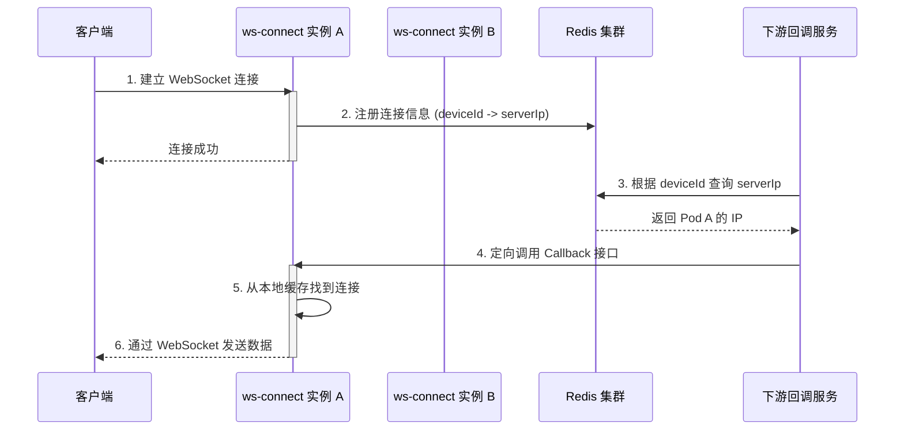
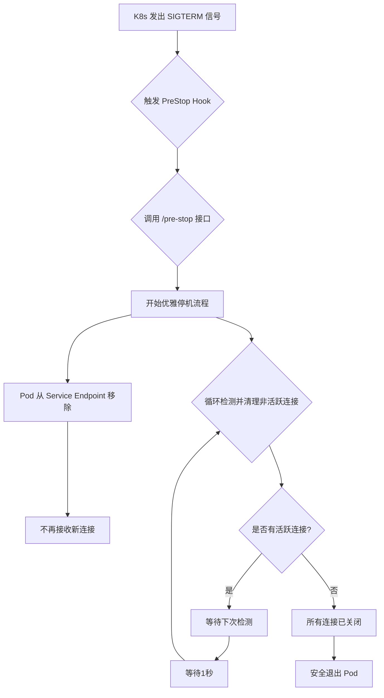

# 核心架构：高可用 WebSocket 连接管理与优雅停机

本文档旨在深入剖析 `ws-connect` 项目在分布式环境下，如何实现高可用的 WebSocket 连接管理、多实例间的一致性以及在 Kubernetes 环境下的优雅停机策略。

## 1. 分布式 WebSocket 连接管理与多实例一致性

在多实例（Pod）部署的场景下，必须确保系统能够正确地管理和路由来自客户端的长连接。本项目通过结合本地缓存和 Redis 分布式存储，巧妙地解决了这个问题。

### 流程图

### 详细步骤说明

1.  **客户端连接与注册**:
    *   客户端向 `ws-connect` 服务发起 WebSocket 连接，经过负载均衡，请求被路由到某个实例（例如 **Pod A**）。
    *   `internal/service/websocket.go` 的 `Connect` 方法处理连接请求。
    *   在 `internal/biz/websocket.go` 的 `ClientRegister` 方法中，执行以下关键操作：
        1.  **本地存储**：将 `deviceId` 和 WebSocket 连接实例的映射关系存入当前 Pod 的本地内存 (`sync.Map`)，由 `localSessionStoreRepo` 管理。
        2.  **分布式存储**：将连接的元数据，包括 `deviceId`、当前 Pod 的 IP (`serverIp`)、以及一个唯一的 `traceId`，存入 Redis，由 `onlineSessionStoreRepo` 管理。这使得任何一个 Pod 都能知道哪个 Pod 持有特定的客户端连接。

2.  **处理跨实例回调 (服务发现与定向调用)**:
    *   当下游服务（`CallbackService`，例如 `ws-voice-consumer`）需要通过 HTTP 回调给客户端发送数据时，它不会随机请求 `ws-connect` 集群。
    *   **关键逻辑**：`CallbackService` 首先从它要处理的消息中获取 `deviceId`。
    *   然后，它会**主动查询 Redis**，使用 `deviceId` 作为键，获取到当前正持有该客户端连接的 `ws-connect` 实例的 IP 地址（例如，查询到 **Pod A** 的 IP）。
    *   获取到精确的 IP 地址后，`CallbackService` 会向该特定 IP 的 `CallBack` 接口发起一个 HTTP POST 请求。
    *   请求被精确地路由到 **Pod A**。Pod A 在其本地内存中成功找到连接，并通过 WebSocket 将数据发送给客户端。

通过这种 **服务注册 (Redis) + 服务发现 (CallbackService主动查询) + 定向调用** 的机制，项目高效地解决了分布式环境下 WebSocket 连接的路由问题，避免了不必要的网络跳转和请求失败，实现了高可用和高可靠的消息投递。

## 2. Kubernetes 优雅停机与 WebSocket 长连接处理

在 Kubernetes 环境中，当 Pod 需要更新或缩容时，如何保证已经建立的长连接不被粗暴中断，从而避免影响用户体验，是一个核心挑战。本项目通过实现 `PreStop` Hook，确保了服务的优雅停机。

### 流程图

### 详细步骤说明

1.  **触发停机流程**:
    *   当 Kubernetes 决定终止一个 Pod 时，它会先从服务的 Endpoint 中移除该 Pod，使其不再接收新的流量。
    *   紧接着，K8s 会执行 Pod 定义的 `PreStop` Hook。在本项目中，该 Hook 配置为调用 `/pre-stop` HTTP 接口。
    *   `internal/service/websocket.go` 中的 `PreStop` 方法被触发，开始执行优雅停机逻辑。

2.  **非活跃连接清理**:
    *   `PreStop` 方法会调用 `sv.wsBiz.ClearInActiveDevice(ctx, interval)`。此方法的核心思想是：**优先关闭那些已经没有数据交互的 "僵尸" 连接**。
    *   它会遍历当前 Pod 持有的所有本地 WebSocket 连接。
    *   通过比较 `time.Now()` 和连接的 `dataTime` (上次数据传输时间)，来判断连接是否在指定的 `interval` (例如3秒) 内有过活动。
    *   如果连接被判定为**非活跃**，则调用 `websocketClient.Close(ctx)` 主动将其关闭。

3.  **循环等待与超时**:
    *   为了给活跃连接留下处理时间，`PreStop` 的清理逻辑在一个**循环**中执行（最多20次，总时长约20秒）。
    *   每次循环后，它会检查是否还存在活跃连接。
    *   如果所有连接都已关闭（即活跃连接数为0），则循环提前终止，Pod 可以安全退出。
    *   如果循环20次后仍有活跃连接，停机逻辑结束，剩余的连接将由 K8s 的 `terminationGracePeriodSeconds` 机制强制终止。这为绝大多数正常通信的客户端提供了充足的断开和重连时间。

4.  **资源释放**:
    *   在连接关闭的 `Close` 方法 (`internal/pkg/ws/extension.go`) 中，会触发 `disconnectCallBack` 回调。
    *   该回调会执行 `ClientUnRegister` 逻辑，从 Redis 和本地缓存中清理连接信息，确保分布式状态的最终一致性。

通过这套优雅停机机制，`ws-connect` 在保证服务快速迭代部署的同时，最大限度地降低了对存量用户连接的冲击，提升了系统的稳定性和用户体验。