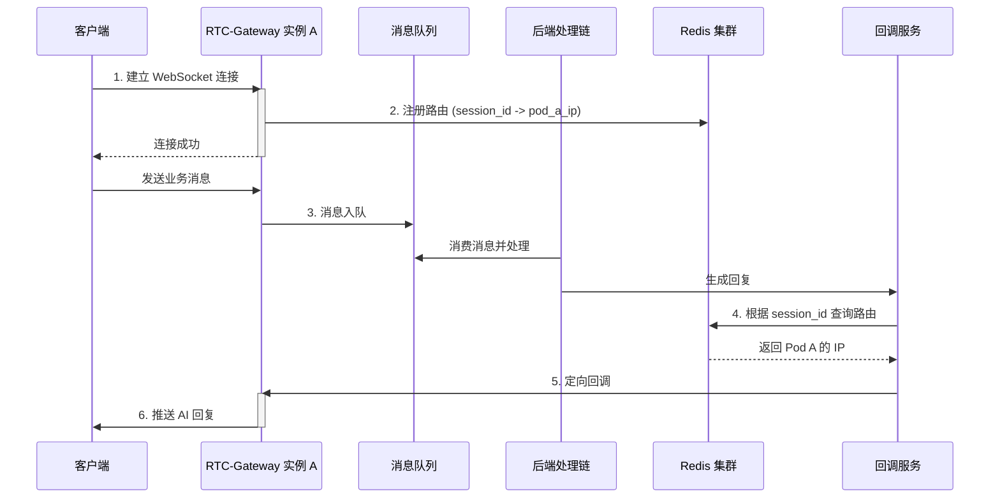
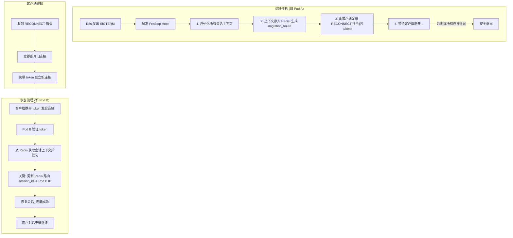

# 架构演进：为“AI语音伴侣”构建永不中断的实时通信网关

在构建如“AI语音伴侣”这类实时交互应用时，我们面临一个统一的核心挑战：**如何在动态变化的分布式环境中，构建一个能支持服务平滑更新、同时保障用户会话连续性与状态完整性的分布式实时网关？**

这意味着网关不仅要能将后端的 AI 响应精确路由到连接在任意服务器实例上的用户，还必须能在服务更新、扩缩容导致服务器实例生灭时，让用户的对话无缝迁移，不丢失任何上下文，实现真正的“永不中断”服务。

本文将以 `RTC-Gateway` (Real-Time Communication Gateway) 为例，沿着一条清晰的方案演进路径，层层递进，最终解决这个核心挑战。

## 第一阶段：实现基础的分布式路由

想象一下，用户 A 的 WebSocket 连接被负载均衡到了服务器 **Pod A**。用户通过这个连接发送的语音或文本消息，并不会由网关直接处理，而是被投递到一个**消息队列（如 Kafka 或 RabbitMQ）**中。后端一系列复杂的处理服务（如 ASR 语音识别、NLP 理解、AI 大脑决策）构成了一个**处理链**，它们消费队列中的消息并协同工作。

当处理链最终生成一句回复后，它面临一个问题：这句回复该如何准确地通过网关集群，发送给正连接在 **Pod A** 上的用户 A 呢？处理链本身是无状态的，它不知道用户具体连接在哪一个网关实例上。

### 方案：基于 Redis 的服务注册与发现

我们引入 Redis 作为“连接路由注册中心”。任何一个网关实例，在与客户端成功建立 WebSocket 连接后，都会获得一个唯一的 `session_id`，并在 Redis 中记录一条映射：`session_id -> pod_ip`。

**详细说明：**

1.  **注册**：当一个客户端与 `Pod-A` (IP: `10.0.0.1`) 建立连接后，`Pod-A` 会立即向 Redis 写入一条记录，例如 `SET session:Sess-abc-123 "10.0.0.1"`。这个 `session_id` 在会话期间是唯一的。
2.  **查询**：当**后端回调服务**（处理链的最后一环）需要向这个会话发送消息时，它首先向 Redis 查询 `GET session:Sess-abc-123`，得到 `Pod-A` 的 IP 地址 `10.0.0.1`。
3.  **推送**：**回调服务**直接向 `10.0.0.1` 发起请求，`Pod-A` 收到请求后，从其内存中的连接列表里找到 `Sess-abc-123` 对应的 WebSocket 连接，并将消息推送出去。

#### 流程图

## 第二阶段：直面“停机更新”的难题

基础路由方案看似可行，但它隐含了一个致命的假设：**Pod 是永远稳定运行的**。在云原生环境中，服务为了迭代、修复或缩容，Pod 的关闭和启动是常态。

当 Pod A 需要更新时，它会被关闭。此时，所有连接在 Pod A 上的用户会话都会被强制中断。更糟糕的是，根据基础路由方案，Redis 中还存储着指向 Pod A 的“脏”路由数据。后续的 AI 回调请求仍会被错误地发往已死的 Pod A，导致消息石沉大海。

这显然无法满足“永不中断”的目标。我们必须设计一个优雅的停机机制。

## 第三阶段：探讨停机方案

### 备选方案：基于“超时”的被动清理

一个看似更合理的想法是：为每个会话定义“最长交互间隔”和“最长生命周期”。在 Pod 关闭前，我们不再接收新连接，然后等待一段时间，被动地清理连接。

**具体流程：**
1.  Pod 进入“优雅停机”模式，不再接受新连接。
2.  为存量连接设置一个“最长等待时间”（例如 5 分钟）。
3.  在此期间，如果某个连接的“空闲时间”（自上次双向收发消息后）超过了预设的“最长交互间隔”（例如 1 分钟），则主动关闭该连接。
4.  若达到“最长等待时间”后仍有连接存在，则强制全部关闭。

**优点：**
*   实现相对简单，不依赖客户端进行复杂的配合。
*   在很多业务场景下，例如非核心的通知、无状态的轮询等，这种方式简单有效，可以处理掉大部分“空闲”连接，减少硬中断的影响。

**致命缺陷：**
这种方案看似智能，但其根基是“猜测”用户是否还需要这个会话，这在强状态交互场景下是不可靠的。
1.  **“非活跃”不等于“可丢弃”**：这是最核心的问题。用户可能正在倾听 AI 的长篇回复，或者在应用界面上思考，这些情况下客户端没有数据上行，但会话必须保持。任何基于“空闲”的判断都可能错误地中断一个正在进行中的、有价值的会话。用户的体验是“对话莫名其妙断了”。
2.  **心跳机制的悖论**：为了维持 WebSocket 不被中间网络设备（如 NAT、防火墙）中断，客户端通常会定期发送心跳包。心跳的存在使得连接在服务端看来永远是“活跃”的，直接让“最长交互间隔”的设定失效。最终，所有连接都会等到“最长等待时间”耗尽后被强制终止，优雅停机机制名存实亡。
3.  **无法保存会话状态**：此方案的本质是“清理”而非“迁移”。连接一旦关闭，其中承载的所有上下文（如对话历史、AI当前的思考状态）都会丢失。用户下一次连接时，将是一个全新的会话，无法继续之前的交流，这违背了“AI语音伴侣”的核心产品体验。

因此，尽管被动清理方案在某些弱状态或无状态场景下堪用，但对于追求无缝、连续交互体验的强状态应用，它是完全不可行的。

## 第四阶段：最终方案：基于“会话迁移”的主动通知

真正的优雅停机，核心在于**保存并主动迁移会话**。我们必须让客户端在无感知的情况下，换到一个新的服务器上，并恢复之前的对话。这需要服务端、客户端和路由中心三方协同。

#### 完整流程：通知、迁移、恢复与路由更新

#### 详细步骤说明

1.  **通知与迁移准备 (旧 Pod A)**:
    *   当 `PreStop` Hook 被触发，Pod A 立刻从负载均衡中移除，不再接收新连接。
    *   它遍历当前所有连接，执行**会话序列化**：将每个用户的对话历史、状态等内存中的上下文数据，打包成一个可序列化的对象。
    *   将这个上下文对象存入 Redis，并生成一个唯一的、有短暂 TTL 的 `migration_token` 作为 Key。
    *   向客户端发送一个包含此 `token` 的自定义指令：`{"type": "RECONNECT", "migration_token": "xyz123"}`。

2.  **客户端主动重连**:
    *   一个设计良好的客户端，在收到 `RECONNECT` 指令后，会立即关闭当前连接，并携带 `migration_token` 发起一个新的连接请求。
    *   由于 Pod A 已不在服务列表中，新连接会被自然地路由到健康的 **Pod B** 上。

3.  **会话恢复与路由更新 (新 Pod B)**:
    *   Pod B 收到新连接，发现请求中带有 `migration_token`。
    *   Pod B 使用该 `token` 从 Redis 中获取之前存储的会话上下文数据，并在内存中**反序列化**，重建用户的对话场景。
    *   **这是最关键的一步**：会话恢复后，Pod B 必须立即**更新 Redis 中的路由表**，将该 `session_id` 的映射从旧的 Pod A IP 地址，更新为自己的 IP 地址。`SET session:Sess-abc-123 "10.0.0.2"`。
    *   至此，会话迁移与路由更新的闭环全部完成。客户端的感受仅仅是一次微小的、几乎无法感知的“网络抖动”，而对话状态完全没有丢失。

### 方案健壮性分析

这个统一的方案还顺便解决了基础路由中的其他问题：

*   **数据一致性**：在迁移流程中，旧 Pod 的路由信息被新 Pod 主动覆盖。而对于异常崩溃的 Pod，我们可以为其在 Redis 中注册的路由信息设置一个较短的 TTL（租约机制），并由 Pod 后台任务定期续约。如果 Pod 宕机，无法续约，路由信息便会自动过期删除，保证了系统的自愈能力。
*   **Redis 单点故障**：部署高可用的 Redis 集群（如 Redis Sentinel 或 Redis Cluster）来确保注册中心的稳定性。

## 结论

通过将 **基于租约的 Redis 服务发现** 与 **基于主动会话迁移的优雅停机** 无缝结合，我们为“AI语音伴侣”这类强状态依赖的实时应用，构建了一个既能水平扩展、又能保证服务连续性的强大后端网关。

其核心思想是：**在分布式系统中，我们不应惧怕节点的生灭，而应通过精巧的协议和状态管理，让会话的生命周期超越单个服务器的生命周期，并确保路由信息与会话位置的实时同步。**