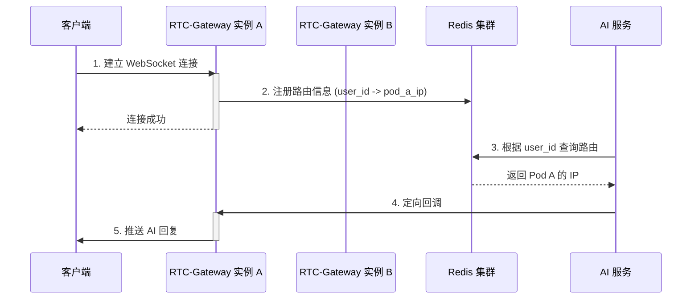
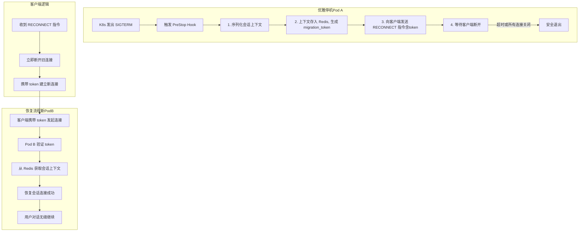

# 架构演进：为“AI语音伴侣”构建永不中断的实时通信网关

在构建如“AI语音伴侣”这类实时交互应用时，我们面临一个核心挑战：如何承载海量的 WebSocket 长连接，并在服务频繁迭代更新时，保证用户与AI的对话**上下文永不丢失**，实现真正的“永不中断”服务？

本文将以 `RTC-Gateway` (Real-Time Communication Gateway) 为例，以“AI语音伴侣”为核心场景，层层递进，探讨其背后的架构设计，并着重解决两大难题：
1.  **分布式路由**：在多服务器实例下，如何精确地将 AI 的响应送达指定用户？
2.  **无感停机**：当服务更新或缩容时，如何实现用户会话的无缝迁移，避免对话中断？

## 1. 核心挑战：在分布式集群中找到“正在对话的你”

想象一下，用户 A 正在与 AI 语音伴侣愉快地聊天。他的 WebSocket 连接被负载均衡到了服务器 **Pod A**。当后端的 AI 大脑生成一句回复后，它该如何准确地将这句回复通过网关集群，发送给正连接在 **Pod A** 上的用户 A 呢？

### 方案：基于 Redis 的服务注册与发现

我们引入 Redis 作为“连接路由注册中心”，让集群中的任何一个节点，都能查询到任意用户当前连接在哪一台具体的服务器上。

#### 流程图

### 利弊分析与优化

只提出方案是不够的，我们必须审视其潜在风险：

1.  **性能瓶颈**：每次回调都需要查询一次 Redis，在高频交互场景下，Redis 的网络延迟和 QPS 压力会成为瓶颈。
    *   **优化**：在 `AIService` 侧增加本地缓存（如 Caffeine/Ristretto）。当查询到用户路由后，在本地缓存一小段时间（如 5-10 秒）。后续回调优先查找本地缓存，缓存未命中再查询 Redis，从而大幅降低 Redis 的压力。

2.  **数据一致性**：如果 Pod A 异常崩溃，没来得及从 Redis 清理自己的路由信息，就会产生“脏数据”。后续请求仍会被错误地路由到已宕机的 Pod A，导致消息丢失。
    *   **优化**：采用 **Lease（租约）机制**。Pod A 在 Redis 注册路由时，设置一个较短的 TTL（如 60 秒）。然后由 Pod A 的一个后台 goroutine 定期（如每 30 秒）“续租”，刷新该 TTL。如果 Pod A 宕机，无法续租，该路由信息会在 TTL 到期后被 Redis **自动删除**，保证了系统的自愈能力。

3.  **Redis 单点故障**：如果 Redis 集群本身发生故障，整个路由系统将瘫痪。
    *   **优化**：部署高可用的 Redis 集群（如 Redis Sentinel 或 Redis Cluster），确保注册中心的稳定性。

## 2. 终极考验：如何在“飞行中为飞机更换引擎”？

“AI语音伴侣”需要快速迭代。但每次发布，都意味着关闭旧 Pod，启动新 Pod。如果处理不当，用户与 AI 的对话将被强制中断，之前的对话上下文全部丢失——这是毁灭性的用户体验。

### 错误方案：基于“空闲”的被动清理

一个常见的错误想法是：在 Pod 关闭前，清理那些“一段时间没有数据交互”的连接。

**此方案完全无效**，原因在于：
1.  **“非活跃”不等于“可丢弃”**：用户可能正在倾听 AI 的长篇回复，长时间没有说话，但会话必须保持。
2.  **心跳机制的悖论**：为了维持连接，客户端会定期发送心跳，导致连接永远不会“非活跃”。最终，所有连接都会被强制终止，优雅停机形同虚设。

### 正确方案：基于“会话迁移”的主动通知

真正的优雅停机，核心在于**保存并迁移会话上下文**。我们必须让客户端在无感知的情况下，换到一个新的服务器上，并恢复之前的对话。

#### 新的优雅停机流程：通知、迁移与恢复

#### 详细步骤说明

1.  **通知与迁移准备 (旧 Pod)**:
    *   当 `PreStop` Hook 被触发，Pod A 立刻从负载均衡中移除，不再接收新连接。
    *   它遍历当前所有连接，执行**会话序列化**：将每个用户的对话历史、状态等内存中的上下文数据，打包成一个可序列化的对象。
    *   将这个上下文对象存入 Redis，并生成一个唯一的、有短暂 TTL 的 `migration_token` 作为 Key。
    *   向客户端发送一个包含此 `token` 的自定义指令：`{"type": "RECONNECT", "migration_token": "xyz123"}`。

2.  **客户端主动重连**:
    *   一个设计良好的客户端，在收到 `RECONNECT` 指令后，会立即关闭当前连接，并携带 `migration_token` 发起一个新的连接请求。
    *   由于 Pod A 已不在服务列表中，新连接会被自然地路由到健康的 **Pod B** 上。

3.  **会话恢复 (新 Pod)**:
    *   Pod B 收到新连接，发现请求中带有 `migration_token`。
    *   Pod B 使用该 `token` 从 Redis 中获取之前存储的会话上下文数据。
    *   **反序列化**上下文，在 Pod B 的内存中重建用户的对话场景。
    *   至此，会话迁移完成。客户端的感受仅仅是一次微小的、几乎无法感知的“网络抖动”，而对话状态完全没有丢失。

4.  **处理“顽固”客户端**:
    *   如果某个客户端在收到通知后，由于网络或自身原因没有及时重连，怎么办？
    *   我们不必永远等待。旧 Pod A 在发送完通知后，会等待一段合理的时间（如 `terminationGracePeriodSeconds` 的 80%）。之后，它会关闭所有剩余的连接并退出。
    *   但用户的会话数据因为有 TTL，仍在 Redis 中保留了一小段时间。如果用户稍后重新打开 App，客户端仍然可以尝试用旧的 `token` 恢复会话，为用户提供最后一次挽救机会。

## 结论

通过将 **基于租约的 Redis 服务发现** 与 **基于会话迁移的优雅停机** 相结合，我们为“AI语音伴侣”这类强状态依赖的实时应用，构建了一个既能水平扩展、又能保证服务连续性的强大后端网关。其核心思想是：**在分布式系统中，我们不应惧怕节点的生灭，而应通过精巧的协议和状态管理，让会话的生命周期超越单个服务器的生命周期。**