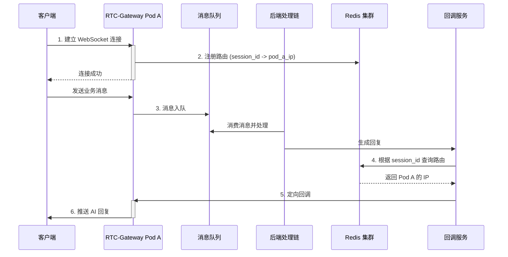
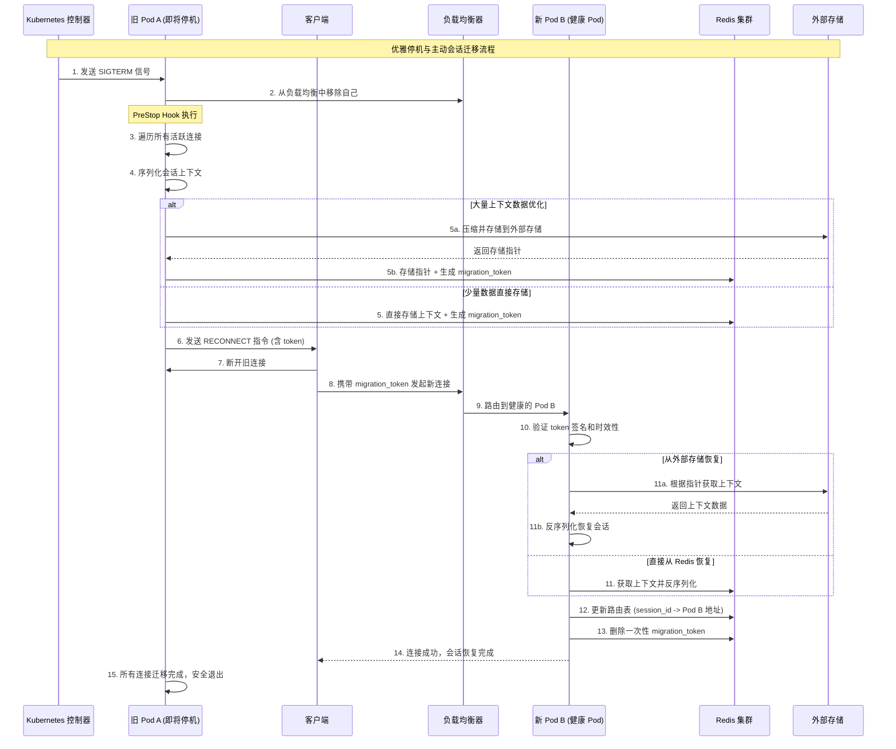
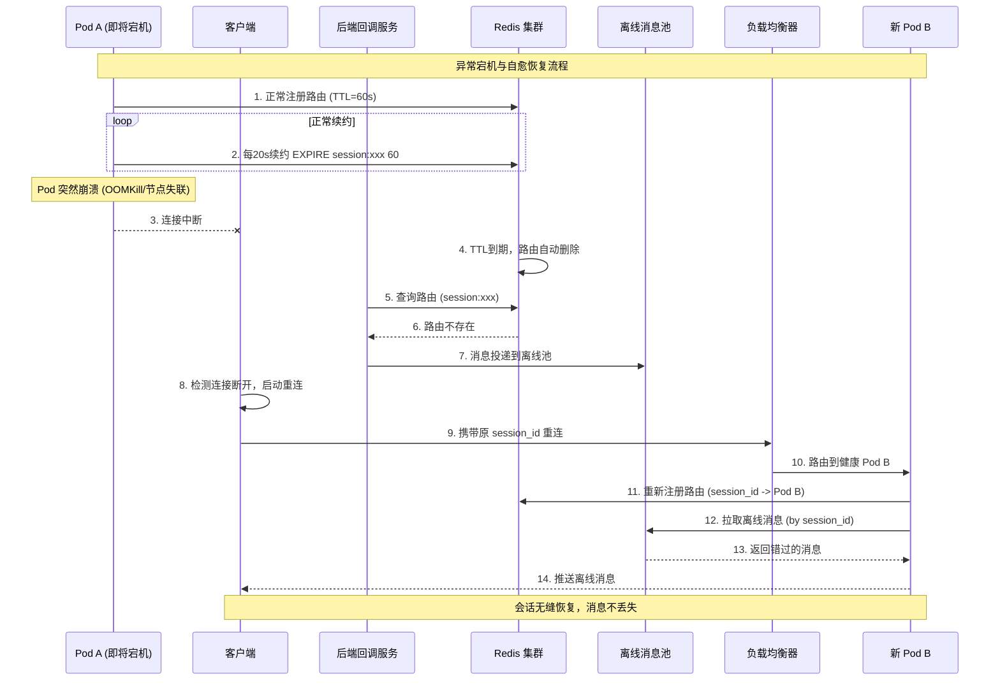

# 架构演进：为“AI语音伴侣”构建永不中断的实时通信网关

在构建如“AI语音伴侣”这类实时交互应用时，我们面临一个统一的核心挑战：**如何在动态变化的分布式环境中，构建一个能支持服务平滑更新、同时保障用户会话连续性与状态完整性的分布式实时网关？**

这意味着网关不仅要能将后端的 AI 响应精确路由到连接在任意 Pod（Kubernetes 最小部署单元）上的用户，还必须能在服务更新、扩缩容导致 Pod 实例生灭时，让用户的对话无缝迁移，不丢失任何上下文，实现真正的“永不中断”服务。

本文将以 `RTC-Gateway` (Real-Time Communication Gateway) 为例，沿着一条清晰的方案演进路径，层层递进，最终解决这个核心挑战。

## 第一阶段：实现基础的分布式路由

想象一下，用户 A 的 WebSocket 连接被负载均衡到了 Pod **Pod A**。用户通过这个连接发送的语音或文本消息，并不会由网关直接处理，而是被投递到一个**消息队列（如 Kafka 或 RabbitMQ）**中。后端一系列复杂的处理服务（如 ASR 语音识别、NLP 理解、AI 大脑决策）构成了一个**处理链**，它们消费队列中的消息并协同工作。

当处理链最终生成一句回复后，它面临一个问题：这句回复该如何准确地通过网关集群，发送给正连接在 **Pod A** 上的用户 A 呢？处理链本身是无状态的，它不知道用户具体连接在哪一个 Pod 上。

### 方案：基于 Redis 的服务注册与发现

我们引入 Redis 作为“连接路由注册中心”。当网关实例与客户端成功建立 WebSocket 连接时，会生成或分配一个唯一的 `session_id`。该 `session_id` 可以采用 UUID、时间戳+随机数、或基于连接信息的哈希值等方式生成，确保全局唯一性。随后，网关实例会在 Redis 中记录一条映射：`session_id -> pod_ip`。

**详细说明：**

1.  **注册**：当一个客户端与 `Pod-A` (IP: `10.0.0.1`) 建立连接后，`Pod-A` 会立即向 Redis 写入一条记录，例如 `SET session:Sess-abc-123 "10.0.0.1"`。这个 `session_id` 在会话期间是唯一的。
2.  **查询**：当**后端回调服务**（处理链的最后一环）需要向这个会话发送消息时，它首先向 Redis 查询 `GET session:Sess-abc-123`，得到 `Pod-A` 的 IP 地址 `10.0.0.1`。
3.  **推送**：**回调服务**直接向 `10.0.0.1` 发起请求，`Pod-A` 收到请求后，从其内存中的连接列表里找到 `Sess-abc-123` 对应的 WebSocket 连接，并将消息推送出去。

#### 流程图

## 第二阶段：问题暴露——停机更新带来的挑战

基础路由方案看似可行，但它隐含了一个致命的假设：**Pod 是永远稳定运行的**。在云原生环境中，服务为了迭代、修复或缩容，Pod 的关闭和启动是常态。

当 Pod A 需要更新时，它会被关闭。此时，所有连接在 Pod A 上的用户会话都会被强制中断。更糟糕的是，根据基础路由方案，Redis 中还存储着指向 Pod A 的“脏”路由数据。后续的 AI 回调请求仍会被错误地发往已死的 Pod A，导致消息石沉大海。

这显然无法满足“永不中断”的目标。我们必须设计一个优雅的停机机制。

## 第三阶段：停机方案的权衡与选择

### 3.1 备选方案：基于“超时”的被动清理

一个看似更合理的想法是：为每个会话定义“最长交互间隔”和“最长生命周期”。在 Pod 关闭前，我们不再接收新连接，然后等待一段时间，被动地清理连接。

**具体流程：**
1.  Pod 进入“优雅停机”模式，不再接受新连接。
2.  为存量连接设置一个“最长等待时间”（例如 5 分钟）。
3.  在此期间，如果某个连接的“空闲时间”（自上次双向收发**业务**消息后）超过了预设的“最长交互间隔”（例如 1 分钟），则主动关闭该连接。
4.  若达到“最长等待时间”后仍有连接存在，则强制全部关闭。

**优点：**
*   实现相对简单，不依赖客户端进行复杂的配合。
*   在很多业务场景下，例如非核心的通知、无状态的轮询等，这种方式简单有效，可以处理掉大部分“空闲”连接，减少硬中断的影响。

### 3.2 被动方案的局限性
这种方案看似智能，但其根基是“猜测”用户是否还需要这个会话，这在强状态交互场景下是不可靠的。

1.  **“非活跃”不等于“可丢弃”**：这是最核心的问题。用户可能正在倾听 AI 的长篇回复，或者在应用界面上思考，这些情况下客户端没有数据上行，但会话必须保持。任何基于“空闲”的判断都可能错误地中断一个正在进行中的、有价值的会话。用户的体验是“对话莫名其妙断了”。
2.  **心跳机制的悖论**：为了维持 WebSocket 不被中间网络设备（如 NAT、防火墙）中断，客户端通常会定期发送心跳包。
    *   **问题**：如果仅判断 TCP 流量，心跳的存在使得连接在服务端看来永远是“活跃”的，直接让“最长交互间隔”的设定失效。最终，所有连接都会等到“最长等待时间”耗尽后被强制终止，优雅停机机制名存实亡。
    *   **改进**：虽然可以设计**应用层心跳**，区分“维持连接的心跳 Ping/Pong”和“真实的业务数据包”，并基于后者来判断业务空闲。但这依然无法解决上述第 1 点的核心矛盾。
    *   **标准说明**：WebSocket 协议本身支持 Ping/Pong 控制帧作为心跳机制。标准做法是每 20 秒发送一次 Ping 帧，期望在 20 秒内收到 Pong 响应。应用层可进一步区分协议层心跳与业务层心跳，后者用于判断会话活跃度。详见 [WebSocket Keepalive](https://websockets.readthedocs.io/en/stable/topics/keepalive.html)、[Scaling WebSockets](https://dev.to/ably/challenges-of-scaling-websockets-3493)。
3.  **无法保存会话状态**：此方案的本质是“清理”而非“迁移”。连接一旦关闭，其中承载的所有上下文（如对话历史、AI当前的思考状态）都会丢失。用户下一次连接时，将是一个全新的会话，无法继续之前的交流，这违背了“AI语音伴侣”的核心产品体验。
4.  **行业实践对比**：像 WhatsApp、Slack 这类需要极高在线连续性的即时通讯应用，在进行服务滚动更新时，也早已超越了被动等待的模式。它们通常采用更主动的连接迁移策略，确保用户在服务升级时几乎无感。这进一步说明，对于强状态的实时应用，“被动超时”方案作为主要策略是不可行的。

因此，对于追求无缝、连续交互体验的强状态应用，单纯依赖被动清理方案是不可行的。它无法保证会话的连续性，这是其核心缺陷。**然而，这并不意味着被动清理毫无价值。在一个设计精良的系统中，它可以作为主动迁移策略的必要补充和兜底机制，形成“主动迁移为主，被动清理为辅”的混合策略。**

## 第四阶段：最终方案：基于“会话迁移”的主动通知

真正的优雅停机，核心在于**保存并主动迁移会话**。我们必须让客户端在无感知的情况下，换到一个新的服务器上，并恢复之前的对话。这需要服务端、客户端和路由中心三方协同。

#### 完整流程：通知、迁移、恢复与路由更新

**A. 优雅停机场景（滚动更新）**

**B. 异常宕机场景**

#### 详细步骤说明

**A. 优雅停机与会话迁移**

1.  **通知与迁移准备 (旧 Pod A)**：
    *   1️⃣ 当 `PreStop` Hook 被触发，Pod A 立刻从负载均衡中移除，不再接收新连接。
        > **流程完整性说明**：这一步通常是 Kubernetes **滚动发布（Rolling Update）**的一部分。控制器会逐个 `drain` 旧 Pod，确保一个 Pod 完全迁移成功后，再启动对应的新 Pod，从而保证整个集群的服务容量稳定。
    *   2️⃣ 遍历当前所有连接，执行**会话序列化**：将每个用户的对话历史、状态等内存中的上下文数据，打包成一个可序列化的对象。
    *   3️⃣ 将这个上下文对象存入 Redis，并生成一个唯一的、有短暂 TTL 的 `migration_token` 作为 Key。
        > **技术严谨性说明 #1 (存储)**：对于 KB 到 MB 级的复杂会话上下文，直接存入 Redis 会消耗大量内存并可能影响性能。更优的策略是：
        > 1.  **压缩**：使用 Snappy 或 Gzip 压缩上下文数据。
        > 2.  **外部存储**：将序列化后的上下文存入**对象存储（如 S3、MinIO）**或**分布式 KV 存储（如 TiKV）**，仅将返回的存储 Key/指针作为 `migration_token` 的一部分存入 Redis。
    *   4️⃣ 向客户端发送一个包含此 `token` 的自定义指令：`{"type": "RECONNECT", "migration_token": "xyz123"}`。
        > **技术严谨性说明 #2 (安全)**：`migration_token` 必须保证安全。
        > 1.  **签名防篡改**：使用 HMAC-SHA256 等算法对 `token` 内容（如 `session_id`、过期时间戳）进行签名。
        > 2.  **防重放**：`token` 必须是一次性的，在新 Pod 成功恢复会话后，应立即从 Redis 中删除该 `token`。
    *   5️⃣ **等待并清理**：启动一个倒计时（略短于 `terminationGracePeriodSeconds`），等待客户端断开连接。
        > **技术严谨性说明 #3 (混合策略与优雅停机超时)**：这正是“主动迁移为主，被动清理为辅”混合策略的体现。
        > 1.  **主动迁移期**：在 `PreStop` Hook 的大部分时间里（例如 `terminationGracePeriodSeconds` 的前 80%），我们信任并等待客户端收到 `RECONNECT` 指令后主动重连。这是理想路径。
        > 2.  **被动清理期（针对无响应客户端）**：总会有客户端因为网络延迟、应用后台、代码 Bug 等原因未能及时响应。在倒计时的最后阶段，对于仍然存在的连接，服务器别无选择，只能主动关闭它们。这是一种必要的**被动清理**，作为兜底机制，确保 Pod 能在规定时间内退出。
        > 3.  **应急强制清理**：如果倒计时结束，Pod 必须退出，此时会强制关闭所有剩余连接。
        >
        > Kubernetes 的 `terminationGracePeriodSeconds`（默认 30s）必须被设置为一个足够长（如 2-5 分钟）的值，为这个分阶段的、刚柔并济的流程提供充足的时间窗口。
        >
        > **注**：Kubernetes 理论上支持很大的 terminationGracePeriodSeconds（最大为 int64），但实际生产环境建议不超过 24 小时，部分云服务（如 GKE Autopilot）限制为 10 分钟。

2.  **客户端主动重连**：
    *   6️⃣ 一个设计良好的客户端，在收到 `RECONNECT` 指令后，会立即关闭当前连接，并携带 `migration_token` 发起一个新的连接请求。
    *   7️⃣ 新连接会被负载均衡器路由到健康的 Pod B 上。负载均衡器应采用轮询或最少连接数算法分配请求，避免使用 IP 哈希等会话粘性算法，以确保会话迁移顺利进行。详见 [负载均衡算法综述](https://www.geeksforgeeks.org/system-design/load-balancing-algorithms/)、[算法对比](https://deploy.equinix.com/blog/comparing-load-balancing-algorithms/)、[技术解读](https://kemptechnologies.com/load-balancer/load-balancing-algorithms-techniques)。

3.  **会话恢复与路由更新 (新 Pod B)**:
    *   Pod B 收到新连接，发现请求中带有 `migration_token`。
    *   Pod B 验证 `token` 的签名和时效性，然后使用该 `token` 从 Redis 或外部存储中获取会话上下文数据，并在内存中**反序列化**，重建用户的对话场景。
    *   **这是最关键的一步**：会话恢复后，Pod B 必须立即**更新 Redis 中的路由表**，将该 `session_id` 的映射从旧的 Pod A 地址，更新为自己的地址。`SET session:Sess-abc-123 "pod-b.rtc-gateway-svc.default.svc.cluster.local:8080"`。
    *   至此，会话迁移与路由更新的闭环全部完成。客户端的感受仅仅是一次微小的、几乎无法感知的“网络抖动”，而对话状态完全没有丢失。

**B. 异常宕机与自愈恢复**

对应上文 **B. 异常宕机场景** 流程图，此场景下的自愈恢复依赖以下关键机制的组合：

1.  **路由自动过期**：Pod A 突然崩溃（如 OOMKilled 或节点失联），它将停止对 Redis 中路由记录的续约。该路由会在 TTL 到期后被 Redis 自动删除。
2.  **离线消息池**：在此期间，若后端的回调服务查询不到路由，它不会丢弃消息，而是将该消息投递到一个**“离线消息池”**（例如，一个以 `session_id` 为 Key 的 Redis List）。
3.  **客户端自动重连**：客户端的网络连接会因 Pod 宕机而中断。一个健壮的客户端在发现连接断开后，会启动**自动重连**逻辑。
4.  **携带 `session_id` 重建会话**：
    *   **关键点**：客户端重连时，**必须携带上一次成功连接时使用的 `session_id`**。这个 `session_id` 应由客户端在本地持久化，代表一个逻辑会话，其生命周期长于单次的物理连接。
    *   客户端的新连接会被负载均衡到健康的 Pod B 上。Pod B 收到带有 `session_id` 的连接请求后，会立即用这个 `id` 在 Redis 中注册自己的地址，完成路由重建。
5.  **拉取离线消息**：路由重建后，Pod B 会主动去“离线消息池”中，拉取所有属于该 `session_id` 的历史消息，并推送给客户端。

通过这个**“客户端携带 `session_id` 重连 + 服务端离线消息池”**的闭环设计，我们确保了即使在 Pod 实例突然崩溃的极端情况下，用户的会话状态和消息也能够被恢复，实现了更高层次的“永不中断”。

### 方案健壮性分析

*   **数据一致性与节点异常**：
    *   **正常迁移**：在优雅停机（滚动更新）的场景下，旧 Pod 的路由信息被新 Pod 主动、平滑地覆盖。
    *   **租约机制**：对于所有路由记录，我们采用**租约机制**来保证其时效性。具体实现为：Pod 在注册路由时使用 `SET session:xxx ... EX 60` 设置一个较短的 TTL（如 60 秒），然后由 Pod 内的后台任务（如 Go 的 goroutine）每隔 20 秒定期执行 `EXPIRE session:xxx 60` 为其续约。
    *   **异常宕机与消息恢复**：此方案是对方案鲁棒性的关键考验。通过“客户端携带 `session_id` 重连”与“服务端离线消息池”的闭环设计，确保了在服务实例突然崩溃的极端情况下，用户的会话状态和消息也能够被恢复。详细流程见 **B. 异常宕机与自愈恢复**。
*   **Redis 单点故障**：部署高可用的 Redis 集群（如 Redis Sentinel 或 Redis Cluster）来确保注册中心的稳定性。

## 结论

通过将 **基于租约的 Redis 服务发现** 与 **基于主动会话迁移的优雅停机** 无缝结合，我们为“AI语音伴侣”这类强状态依赖的实时应用，构建了一个既能水平扩展、又能保证服务连续性的强大后端网关。

其核心思想是：**在分布式系统中，我们不应惧怕节点的生灭，而应通过精巧的协议和状态管理，让会话的生命周期超越单个服务器的生命周期，并确保路由信息与会话位置的实时同步。**