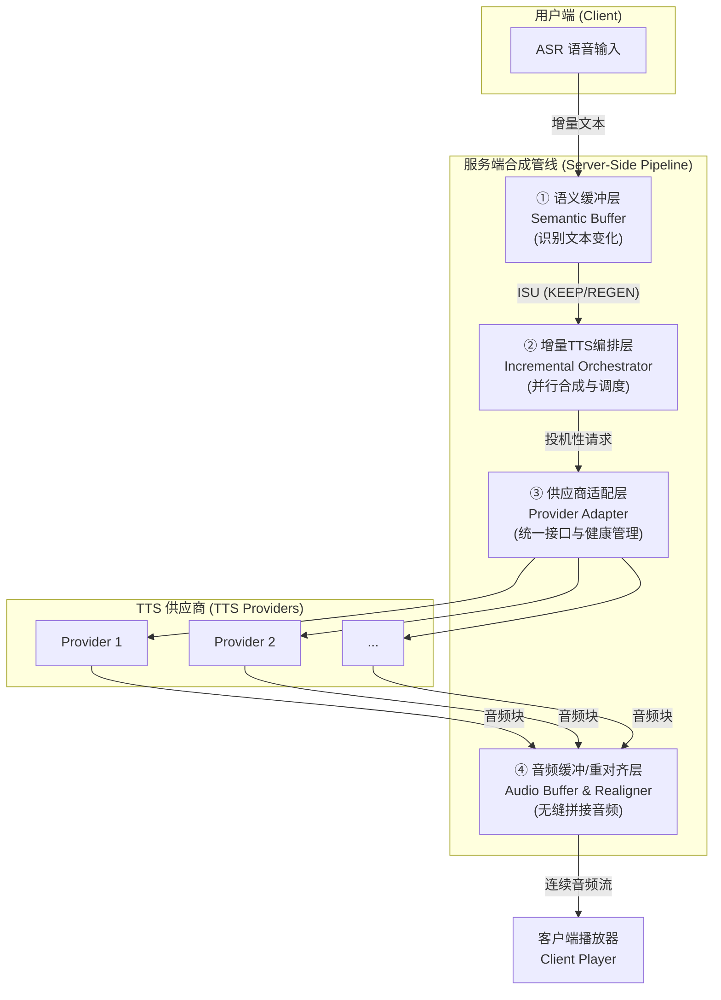
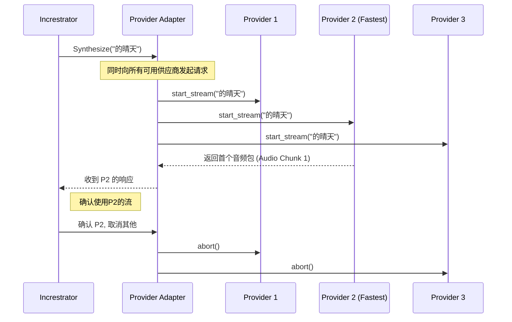
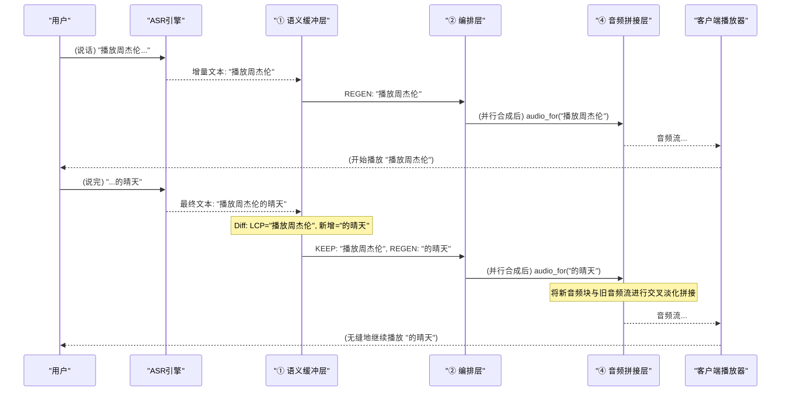

# 高并发流式语音合成管线：分片、调度与秒级响应

## 前言：当「实时交互」成为刚需，我们面临什么挑战？

想象一下你在车里说：“你好SiriCar，播放周杰伦的《晴天》”。

一个糟糕的体验是：你说完，等了三四秒，然后完整的音频才“哐当”一下播放出来。而一个理想的体验是：你刚说到“你好SiriCar”，系统就已经开始响应，几乎在你话音落下的瞬间，合成的音频流就开始推送，实现了真正的“边听边说边播”。

这种理想体验的背后，对我们工程师提出了三大核心挑战：

- **挑战一：应对「增量文本」的复杂性。** 用户的输入并非一次性给全。ASR（语音识别）引擎会先返回一个初步结果（如“播放周杰伦”），几百毫秒后修正并补全为“播放周杰伦的晴天”。我们的TTS（文本转语音）系统必须能处理这种“碎片化”和“持续修正”的文本流，并平滑地合成音频。更有甚者，如果初步结果为“播放周杰伦”，而后修正发现是“伯父周杰伦”，又该如何处理呢？

- **挑战二：苛刻的「低延迟」要求。** 行业标准是“首包延迟”必须在500ms以内。也就是说，从收到第一个文本片段到用户端开始播放第一个音频包，整个链路的时间不能超过半秒。这对系统的处理效率是巨大的考验。

- **挑战三：高并发与多供应商的「管理与兼容」。** 在生产环境中，系统需要同时服务成千上万的用户。此外，为了保证服务的稳定性和成本效益，我们通常会接入多家TTS供应商。如何高效地调度、监控这些供应商，并在它们之间实现动态降级与无缝切换，是一个复杂的工程问题。

为了攻克这些难题，我们设计并实现了一套**基于差分感知（Diff-Aware）的四层流式语音合成管线**。它将「增量文本处理」、「低延迟」和「多供应商管理」三个核心挑战解耦，通过分层治理的思想，实现了稳定、高效、低延迟的实时语音交互体验。

## 顶层设计：Diff-Aware 四层架构

我们的核心思想是：将复杂的语音合成任务拆解为四个独立的、专注的层次。每一层都解决一个核心问题，并通过一个统一的数据原语——**增量语音单元（Incremental Speech Unit, ISU）**在层间流转。

这四层各司其职：
1.  **语义缓冲层 (Semantic Buffer)**：接收ASR的增量文本，通过Diff算法精准计算出“什么变了”，并将变化标记为“保留(KEEP)”或“重新生成(REGEN)”，最大化复用已合成的音频。
2.  **增量TTS编排层 (Incremental Orchestrator)**：负责“冲刺”首包延迟。它根据上一层的指令，对需要重新生成的部分发起投机性并行合成，并管理缓存策略。
3.  **供应商适配层 (Provider Adapter)**：作为“外交官”，用统一的接口屏蔽多家TTS供应商的差异，并监控它们的健康状况，进行动态路由和熔断降级。
4.  **音频缓冲/重对齐层 (Audio Buffer & Realigner)**：是“音频魔术师”，负责将来自不同时间、不同供应商的音频小块，通过交叉淡入淡出等技术，无缝拼接成一段听起来完全自然的音频流。

接下来，我们将深入每一层，探究其工作原理和技术细节。

## 第一层：语义缓冲层 - 精准识别，最小化“重绘”

这一层的核心目标是：**只重新合成绝对必要的部分**。

### Token Buffer 与版本控制 (Streamed Token Buffer)

在高并发场景下，我们并不会一次性拿到完整的文本，而是**源源不断的 token 流**。因此语义缓冲层内部维护了一个 **流式 Token Buffer**：

- **Token 列表**：将 ASR partial 结果拆分为 token，并记录其先后顺序；
- **版本号 rev**：每一次 partial 结果都会递增 rev，方便后续 Diff 与回滚；
- **最长公共前缀 (LCP)**：通过 LCP 快速判断可复用前缀，减少重合成范围。

利用「token + rev」的双索引，我们可以**在毫秒级定位可复用音频**，并把重合成控制在最小声学单元。

### 方案A：最长公共前缀 (Longest Common Prefix, LCP)

这是一个简单有效的策略。
- **场景1：追加文本**
  - `v1`: "播放周杰伦"
  - `v2`: "播放周杰伦的晴天"
  - **LCP**: "播放周杰伦"。
  - **决策**: 保留 "播放周杰伦" 的音频，只需向TTS请求合成新增的 "的晴天" 部分。合成成本只与增量 `Δ` 成正比。

- **场景2：修正文本**
  - `v1`: "播放周杰伦"
  - `v2`: "伯父周杰伦"
  - **LCP**: 空。
  - **决策**: LCP长度为0，意味着两个版本毫无关系。必须丢弃 `v1` 的全部音频，重新合成 "伯父周杰伦" 整句。

### 方案B：基于Diff的声学影响范围分析

LCP在修正场景下表现不佳。更精细的方案是引入字符级的Diff算法（如 Myers Diff），并结合声学模型（可选）来判断影响范围。

ISU (增量语音单元) 的设计就派上了用场：
`ISU = {text_id, seq_no, text_delta, confidence, is_final, operation}`

`text_delta` 描述了具体的文本变化，而 `operation` 字段则会被标记为 `KEEP` 或 `REGEN`。

**案例分析: `播放周杰伦` -> `伯父周杰伦`**
1.  **Diff计算**: 算法识别出 `v1` 的 "播放" 被 `v2` 的 "伯父" 替换了。
2.  **影响分析**: 系统判断 "播放" 和 "伯父" 的发音完全不同，因此 "播放" 对应的音频必须废弃。而 "周杰伦" 部分未变，其音频可以保留。
3.  **生成指令**:
    - ISU 1: `{ text: "伯父", operation: REGEN }` -> 发给下一层去合成。
    - ISU 2: `{ text: "周杰伦", operation: KEEP }` -> 指示音频层直接复用。

通过这种方式，即使是句首的修正，我们也能最大程度地复用音频，避免不必要的重合成。

## 第二层：增量TTS编排层 - 为速度而生的“百米冲刺”

这一层的唯一目标就是：**快！想尽一切办法降低首包延迟**。它采用了多种策略来赢得这场与时间的赛跑。

### 1. 投机性并行请求 (Speculative Requests)

当收到一个 `REGEN` 指令时，我们不知道哪个TTS供应商此刻最快。与其猜测，不如全部都试一遍。

编排层会同时向多个供应商发起合成请求，然后采用第一个返回合法音频包的供应商。其余的请求则被立即取消。这种“赛马”机制，能有效对抗单个供应商的网络抖动或瞬时高负载，将整体首包延迟控制在所有供应商中最低的水平。

### 2. 预合成缓存 (Pre-synthesis Cache)

对于交互中的高频词汇，如“播放”、“打电话给”、“天气”等，我们可以提前将它们合成各种音色的短音频，并缓存起来。当请求命中缓存时，首包延迟可以降至几乎为0，音频可以直接从缓存中取出并送入拼接层。

### 3. 智能分块策略 (Intelligent Chunking)

为了让TTS引擎尽快开始工作，我们不会等用户说完一整句再提交。
- **200ms 触发周期**: 每隔200ms，检查缓冲区是否有新增的、待合成的文本，如果有，立即触发一次合成任务。
- **20 token 上限**: 如果累积的待合成token超过20个，也立即触发合成，避免单次请求文本过长导致处理缓慢。

这种“小步快跑”的策略，确保了每次TTS请求都是轻量级的，能够被快速处理。

### 4. 输出队列管理 (Output Queue Management)

生成音频之后，还需要高效、稳定地**发送**给客户端。我们将服务器侧的音频帧队列抽象为：

| 队列块 | 作用 |
| ------ | ---- |
| **已确认块 (Committed)** | 位于文本稳定前缀，对应的音频已被客户端播放或缓存，可安全前推。 |
| **Shadow 块** | 位于变化尾部，若下一次 ASR 修订，需要整体替换。 |

RTP/序列号始终基于 **已确认块 + Shadow 块** 单调递增，客户端即使替换尾块，也不会感觉到时间线倒退或跳变，确保连贯播放体验。

## 链路级低延迟优化：协议、编码与网络

除了服务端的并行调度，我们还需要从 **协议选型、音频编码、网络传输** 等方面系统性压缩端到端延迟。

### 1. 协议选择

* **WebSocket**：持久化双向通道，避免 HTTP 握手往返，适合浏览器与移动端。
* **gRPC Streaming**：基于 HTTP/2，多路复用 + 二进制帧，适合作为微服务内部链路。

### 2. 音频编码：Opus

Opus 支持 **2.5 ms – 60 ms** 可变帧长，低延迟且压缩率高（16-32 kbps 仍保持良好音质），在弱网环境尤为友好。

### 3. 网络侧优化

- **Jitter Buffer**：客户端动态调整抖动缓冲，吸收时延抖动；
- **0-RTT & 连接复用**：服务端保持长连接，减少握手，HTTP/3 进一步压缩 RTT；
- **零拷贝 / CPU 亲和**：在发送链路避免多次内存 copy，并绑定音频 I/O 到固定核心，提升缓存命中率与上下文切换效率。

这些链路层优化叠加在一起，可再为首包延迟节省约 **50-100 ms**，为严苛的 500 ms 红线争取宝贵空间。

## 第三层：供应商适配层 - 驾驭多方混沌的“外交官”

在真实的业务场景中，我们可能同时使用多家云厂商或自研的TTS服务。它们接口各异、性能不同、稳定性也时好时坏。适配层的职责就是**屏蔽底层差异，提供一个统一、可靠的服务视图**。

### 1. 统一抽象接口

无论底层API是gRPC、WebSocket还是HTTP，适配层都将其统一为三个核心方法：
- `start_stream(text_delta, voice_config)`: 开始一个新的流式合成任务。
- `recv_audio()`: 从流中接收一个音频块。
- `abort()`: 放弃当前任务。

任何新的供应商，只要实现了这套接口，就可以被无缝地接入系统。

### 2. 运行时健康监控与动态策略

适配层会像一个调度中心一样，实时监控每个供应商的核心指标：
- **P99首包延迟**: 99%的请求的首包返回时间。
- **错误率**: 请求失败的比例。
- **RTF (Real-Time Factor)**: 合成1秒音频所需的真实时间。

基于这些数据，我们可以实现复杂的动态策略：
- **自动降级**: 如果一个供应商的P99延迟在30秒内持续高于400ms，或者错误率超过2%，系统会自动降低其权重，甚至暂时将其移出可用池。
- **熔断机制**: 如果错误率飙升（如>5%），则立即熔断60秒，避免向故障节点发送更多请求。
- **A/B测试**: 可以通过用户ID的哈希值，将流量按比例分配给不同供应商，方便进行效果评估。

一个有趣的想法是，将这些动态策略编写为 **WASM 插件**，这样就可以在不重启服务的情况下，实现策略的热更新。

## 第四层：音频缓冲/重对齐层 - 巧夺天工的无缝拼接艺术

这是用户能直接“听”到其工作成果的一层。它的任务是把来自不同时间点、甚至不同供应商的、零碎的音频块（PCM数据），拼接成一段听感上完全平滑、自然的音频流。

直接拼接音频块会在接缝处产生“咔哒”声（Pop Noise）。为了解决这个问题，需要用到专业的音频处理技术。

### 1. 交叉淡入淡出 (Crossfading)

这是最核心的拼接技术。在拼接点，旧音频块的末尾和新音频块的开头会有一个短暂的（约10-30毫秒）重叠区域。

- **淡出 (Fade Out)**: 在重叠区域内，将旧音频块的音量从100%线性降低到0%。
- **淡入 (Fade In)**: 同时，将新音频块的音量从0%线性增加到100%。

这样一来，能量的过渡就变得平滑，人耳完全无法察觉到拼接的存在。

### 2. 音频能量对齐 (RMS Normalization)

不同供应商或不同批次合成的音频，响度（音量）可能会有细微差别。直接拼接会导致声音忽大忽小。在拼接前，我们会快速计算两个音频块接头处小段时长（如30ms）的均方根（RMS）能量，如果差异较大，会对新音频块进行微小的增益调整，以匹配旧音频块的响度。

## 端到端流程：一次完整的实时交互

让我们通过一个完整的案例，回顾这四层架构是如何协同工作的。

整个过程，从ASR吐出第一个字到用户听到声音，可以在200-300ms内完成；后续的修正和追加，用户几乎无感知，实现了极致的实时交互体验。

## 总结：构建下一代语音交互体验

高并发、低延迟的流式语音合成系统，并非由单一技术突破实现的，而是一个精密的、分层解耦的工程体系。它的核心在于：

1.  **差分思想 (Diff-Awareness)**：通过精确识别文本变化，从源头上减少不必要的计算和传输，这是实现高效的基础。
2.  **极致并行 (Aggressive Parallelism)**：在关键路径上采用“赛马”机制，用冗余换时间，是达成低延迟目标的关键策略。
3.  **抽象与分层 (Abstraction & Layering)**：将复杂问题拆解为独立、可控的模块，每个模块只做一件事并做到极致，保证了系统的可维护性和扩展性。
4.  **无缝体验 (Seamless Experience)**：在最终呈现给用户的一环，通过精细的音频处理技术，将技术的复杂性隐藏在幕后，提供自然流畅的听感。

通过这套架构，我们成功地将语音交互从“请求-等待-响应”的模式，带入了“边听-边说-边播”的实时流媒体时代，为更智能、更自然的下一代人机交互奠定了坚实的基础。
