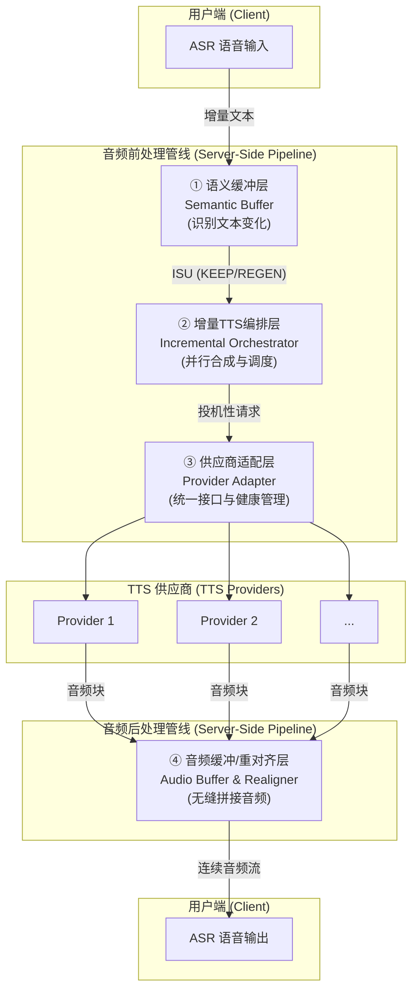

# 高并发流式语音合成管线：分片、调度与秒级响应

## 前言：当「实时交互」成为刚需，我们面临什么挑战？

想象一下你在车里说：“你好SiriCar，播放周杰伦的《晴天》”。

一个糟糕的体验是：你说完，等了三四秒，然后完整的音频才“哐当”一下播放出来。而一个理想的体验是：你刚说到“你好SiriCar”，系统就已经开始响应，几乎在你话音落下的瞬间，合成的音频流就开始推送，实现了真正的“边听边说边播”。

这种理想体验的背后，对我们工程师提出了三大核心挑战：

- **挑战一：应对「增量文本」的复杂性。** 用户的输入并非一次性给全。现代ASR（Automatic Speech Recognition，语音识别）为了追求实时性，会采用“流式识别”模式，即边听边识别。它会先返回一个临时的、可能不准确的**中间结果（Partial Result）**，例如用户说了“播放周杰伦的晴天”，ASR可能在第1秒返回`partial: "播放周"`，第1.5秒返回`partial: "播放周杰伦"`，最后在第2秒返回一个**最终结果（Final Result）** `final: "播放周杰伦的晴天"`。我们的TTS（文本转语音）系统必须能处理这种“碎片化”和“持续修正”的文本流，并平滑地合成音频。更有甚者，如果中间结果为“播放周杰伦”，而后修正发现是“伯父周杰伦”，又该如何处理呢？

- **挑战二：苛刻的「低延迟」要求。** 行业标准是“首包延迟”必须在500ms以内。也就是说，从收到第一个文本片段到用户端开始播放第一个音频包，整个链路的时间不能超过半秒。这对系统的处理效率是巨大的考验。

- **挑战三：高并发与多供应商的「管理与兼容」。** 在生产环境中，系统需要同时服务成千上万的用户。此外，为了保证服务的稳定性和成本效益，我们通常会接入多家TTS供应商。如何高效地调度、监控这些供应商，并在它们之间实现动态降级与无缝切换，是一个复杂的工程问题。

为了攻克这些难题，我们设计并实现了一套**基于差分感知（Diff-Aware）的四层流式语音合成管线**。它将「增量文本处理」、「低延迟」和「多供应商管理」三个核心挑战解耦，通过分层治理的思想，实现了稳定、高效、低延迟的实时语音交互体验。

## 顶层设计：Diff-Aware 四层架构

我们的核心思想是：将复杂的语音合成任务拆解为四个独立的、专注的层次。每一层都解决一个核心问题，并通过一个统一的数据原语——**增量语音单元（Incremental Speech Unit, ISU）**在层间流转。

这四层各司其职：
1.  **语义缓冲层 (Semantic Buffer)**：接收ASR的增量文本，通过Diff算法精准计算出“什么变了”，并将变化标记为“保留(KEEP)”或“重新生成(REGEN)”，最大化复用已合成的音频。
2.  **增量TTS编排层 (Incremental Orchestrator)**：负责“冲刺”首包延迟。它根据上一层的指令，对需要重新生成的部分发起投机性并行合成，并管理缓存策略。
3.  **供应商适配层 (Provider Adapter)**：作为“外交官”，用统一的接口屏蔽多家TTS供应商的差异，并监控它们的健康状况，进行动态路由和熔断降级。
4.  **音频缓冲/重对齐层 (Audio Buffer & Realigner)**：是“音频魔术师”，负责将来自不同时间、不同供应商的音频小块，通过交叉淡入淡出等技术，无缝拼接成一段听起来完全自然的音频流。

接下来，我们将深入每一层，探究其工作原理和技术细节。

## 第一层：语义缓冲层 - 精准识别，最小化“重绘”

这一层的核心目标是：**只重新合成绝对必要的部分**。

### Token Buffer 与版本控制 (Streamed Token Buffer)

在高并发场景下，我们并不会一次性拿到完整的文本，而是**源源不断的 token 流**。因此语义缓冲层内部维护了一个 **流式 Token Buffer**：

- **Token 列表**：将 ASR partial 结果拆分为 token，并记录其先后顺序；
- **版本号 rev**：每一次 partial 结果都会递增 rev，方便后续 Diff 与回滚；
- **最长公共前缀 (LCP)**：通过 LCP 快速判断可复用前缀，减少重合成范围。

利用「token + rev」的双索引，我们可以**在毫秒级定位可复用音频**，并把重合成控制在最小声学单元。

### 方案A：最长公共前缀 (Longest Common Prefix, LCP)

这是一个简单有效的策略。
- **场景1：追加文本**
  - `v1`: "播放周杰伦"
  - `v2`: "播放周杰伦的晴天"
  - **LCP**: "播放周杰伦"。
  - **决策**: 保留 "播放周杰伦" 的音频，只需向TTS请求合成新增的 "的晴天" 部分。合成成本只与增量 `Δ` 成正比。

- **场景2：修正文本**
  - `v1`: "播放周杰伦"
  - `v2`: "伯父周杰伦"
  - **LCP**: 空。
  - **决策**: LCP长度为0，意味着两个版本毫无关系。必须丢弃 `v1` 的全部音频，重新合成 "伯父周杰伦" 整句。

### 方案B：基于Diff的声学影响范围分析

LCP在修正场景下表现不佳。更精细的方案是引入字符级的Diff算法（如 Myers Diff），并结合声学模型（可选）来判断影响范围。

ISU (增量语音单元) 的设计就派上了用场：
`ISU = {text_id, seq_no, text_delta, confidence, is_final, operation}`

`text_delta` 描述了具体的文本变化，而 `operation` 字段则会被标记为 `KEEP` 或 `REGEN`。

**案例分析: `播放周杰伦` -> `伯父周杰伦`**
1.  **Diff计算**: 算法识别出 `v1` 的 "播放" 被 `v2` 的 "伯父" 替换了。
2.  **影响分析**: 系统判断 "播放" 和 "伯父" 的发音完全不同，因此 "播放" 对应的音频必须废弃。而 "周杰伦" 部分未变，其音频可以保留。
3.  **生成指令**:
    - ISU 1: `{ text: "伯父", operation: REGEN }` -> 发给下一层去合成。
    - ISU 2: `{ text: "周杰伦", operation: KEEP }` -> 指示音频层直接复用。

通过这种方式，即使是句首的修正，我们也能最大程度地复用音频，避免不必要的重合成。

## 第二层：增量TTS编排层 - 为速度而生的“百米冲刺”

这一层的唯一目标就是：**快！想尽一切办法降低首包延迟**。它采用了多种策略来赢得这场与时间的赛跑。

### 1. 投机性并行请求 (Speculative Requests)

当收到一个 `REGEN` 指令时，我们不知道哪个TTS供应商此刻最快。与其猜测，不如全部都试一遍。

编排层会同时向多个供应商发起合成请求，然后采用第一个返回合法音频包的供应商。其余的请求则被立即取消。这种“赛马”机制，能有效对抗单个供应商的网络抖动或瞬时高负载，将整体首包延迟控制在所有供应商中最低的水平。

#### 成本与性能的权衡：智能“赛马”

“全量并行”的策略虽然能最大化降低延迟，但也会带来数倍的API调用成本，因为一次合成请求会实际消耗多家供应商的资源。在实际应用中，我们需要更精细的成本控制策略：

- **主备+竞速模式 (Primary + Fallback Racing)**：选择一家综合表现最好的供应商作为“主力”，其余作为“备选”。请求优先发给主力，如果在一定时间窗口内（例如150ms）没有收到响应，则立即将请求“竞速”给所有备选供应商。这在大部分情况下只消耗单次成本，仅在主力抖动时才增加开销。
- **基于历史性能的动态选择**：编排层可以持续学习每个供应商在不同时间段（如高峰、平峰）的P99延迟。发起请求时，不再是盲目地全量并行，而是选择历史数据表明当前最可能快速响应的Top-N（例如N=2）家供应商进行投机请求，实现成本和延迟的动态平衡。

### 2. 预合成缓存 (Pre-synthesis Cache)

对于交互中的高频词汇，如“播放”、“打电话给”、“天气”等，我们可以提前将它们合成各种音色的短音频，并缓存起来。当请求命中缓存时，首包延迟可以降至几乎为0，音频可以直接从缓存中取出并送入拼接层。

### 3. 智能分块策略 (Intelligent Chunking)

为了让TTS引擎尽快开始工作，我们不会等用户说完一整句再提交，而是要把长文本“切”成适合流式合成的短片。一个优秀的切分策略直接影响合成的自然度。

- **基于时间的切分 (Time-based Chunking)**：每隔一个固定的时间窗口（如200ms），检查缓冲区是否有新增的、待合成的文本。这保证了响应的及时性。
- **基于长度的切分 (Length-based Chunking)**：如果累积的待合成token超过一个阈值（如20个），也立即触发合成，避免单次请求文本过长导致TTS引擎处理缓慢。
- **基于标点的切分 (Punctuation-based Chunking)**：在满足以上两个条件的基础上，切分点应优先选择在自然语义边界上，如逗号、句号、问号等。在这些地方断开，TTS引擎能更好地处理句子的韵律和停顿，生成的音频拼接起来也更自然，避免在句子中间出现不自然的停顿。

这种“小步快跑”且“精准切分”的策略，确保了每次TTS请求都是轻量级且上下文完整的，能够被快速、高质量地处理。

### 4. 输出队列管理 (Output Queue Management)

生成音频之后，还需要高效、稳定地**发送**给客户端。我们将服务器侧的音频帧队列抽象为：

| 队列块 | 作用 |
| ------ | ---- |
| **已确认块 (Committed)** | 位于文本稳定前缀，对应的音频已被客户端播放或缓存，可安全前推。 |
| **Shadow 块** | 位于变化尾部，若下一次 ASR 修订，需要整体替换。 |

RTP/序列号始终基于 **已确认块 + Shadow 块** 单调递增，客户端即使替换尾块，也不会感觉到时间线倒退或跳变，确保连贯播放体验。

## 链路级低延迟优化：协议、编码与网络

除了服务端的并行调度，我们还需要从 **协议选型、音频编码、网络传输** 等方面系统性压缩端到端延迟。

### 1. 协议选择

* **WebSocket**：持久化双向通道，避免 HTTP 握手往返，适合浏览器与移动端。
* **gRPC Streaming**：基于 HTTP/2，多路复用 + 二进制帧，适合作为微服务内部链路。

### 2. 音频编码：Opus

Opus 支持 **2.5 ms – 60 ms** 可变帧长，低延迟且压缩率高（16-32 kbps 仍保持良好音质），在弱网环境尤为友好。

### 3. 网络侧优化

- **Jitter Buffer**：客户端动态调整抖动缓冲，吸收时延抖动；
- **0-RTT & 连接复用**：服务端保持长连接，减少握手，HTTP/3 进一步压缩 RTT；
- **零拷贝 / CPU 亲和**：在发送链路避免多次内存 copy，并绑定音频 I/O 到固定核心，提升缓存命中率与上下文切换效率。

这些链路层优化叠加在一起，可再为首包延迟节省约 **50-100 ms**，为严苛的 500 ms 红线争取宝贵空间。

## 第三层：供应商适配层 - 驾驭多方混沌的“外交官”

在真实的业务场景中，我们可能同时使用多家云厂商或自研的TTS服务。它们接口各异、性能不同、稳定性也时好时坏。适配层的职责就是**屏蔽底层差异，提供一个统一、可靠的服务视图**。

### 1. 统一抽象接口

无论底层API是gRPC、WebSocket还是HTTP，适配层都将其统一为三个核心方法：
- `start_stream(text_delta, voice_config)`: 开始一个新的流式合成任务。
- `recv_audio()`: 从流中接收一个音频块。
- `abort()`: 放弃当前任务。

任何新的供应商，只要实现了这套接口，就可以被无缝地接入系统。

### 2. 运行时健康监控与动态策略

适配层会像一个调度中心一样，实时监控每个供应商的核心指标：
- **P99首包延迟**: 99%的请求的首包返回时间。
- **错误率**: 请求失败的比例。
- **RTF (Real-Time Factor)**: 合成1秒音频所需的真实时间。

基于这些数据，我们可以实现复杂的动态策略：
- **自动降级**: 如果一个供应商的P99延迟在30秒内持续高于400ms，或者错误率超过2%，系统会自动降低其权重，甚至暂时将其移出可用池。
- **熔断机制**: 如果错误率飙升（如>5%），则立即熔断60秒，避免向故障节点发送更多请求。
- **A/B测试**: 可以通过用户ID的哈希值，将流量按比例分配给不同供应商，方便进行效果评估。

一个有趣的想法是，将这些动态策略编写为 **WASM 插件**，这样就可以在不重启服务的情况下，实现策略的热更新。

## 第四层：音频缓冲/重对齐层 - 巧夺天工的无缝拼接艺术

这是用户能直接“听”到其工作成果的一层。它的任务是把来自不同时间点、甚至不同供应商的、零碎的音频块（PCM数据），拼接成一段听感上完全平滑、自然的音频流。

直接拼接音频块会在接缝处产生“咔哒”声（Pop Noise）。为了解决这个问题，需要用到专业的音频处理技术。

### 1. 交叉淡入淡出 (Crossfading)

这是最核心的拼接技术。在拼接点，旧音频块的末尾和新音频块的开头会有一个短暂的（约10-30毫秒）重叠区域。无论是拼接连续生成的音频，还是在ASR修正后替换“Shadow块”音频，都使用此技术来确保过渡的平滑。

- **淡出 (Fade Out)**: 在重叠区域内，将旧音频块的音量从100%线性降低到0%。
- **淡入 (Fade In)**: 同时，将新音频块的音量从0%线性增加到100%。

这样一来，能量的过渡就变得平滑，人耳完全无法察觉到拼接的存在。

### 2. 音频能量对齐 (RMS Normalization)

不同供应商或不同批次合成的音频，响度（音量）可能会有细微差别。直接拼接会导致声音忽大忽小。在拼接前，我们会快速计算两个音频块接头处小段时长（如30ms）的均方根（RMS）能量，如果差异较大，会对新音频块进行微小的增益调整，以匹配旧音频块的响度。

### 3. 音色与韵律对齐 (Timbre and Prosody Alignment)

这是一个更棘手的挑战：不同供应商的音色、语速、甚至情感风格都可能不同。如果在一个会话中频繁切换供应商，会导致听感上的“人格分裂”。解决方案包括：

- **会话级供应商锁定 (Session-level Provider Stickiness)**：一旦为某个会话选择了供应商（例如，通过初次的“赛马”），后续的合成请求都优先甚至强制使用该供应商，除非它变得不可用。这保证了单一交互过程中的听感一致性。
- **基于音色特征的智能路由 (Timbre-aware Routing)**：在适配层，可以预先对每个供应商的音色进行特征提取和分类（例如，是“甜美女声”还是“沉稳男声”）。路由时，尽量在同类音色的供应商之间进行切换和降级。
- **前瞻性技术**：更前沿的方案是引入Voice Conversion（VC）模型，在音频拼接前，将来自不同源的音频转换为统一的目标音色，但这会引入额外的延迟和计算成本，需要仔细权衡。

## 端到端流程：一次完整的实时交互

让我们通过一个完整的案例，回顾这四层架构是如何协同工作的。

整个过程，从ASR吐出第一个字到用户听到声音，可以在200-300ms内完成；后续的修正和追加，用户几乎无感知，实现了极致的实时交互体验。

## 健壮性设计：处理无处不在的异常

一个生产级的系统，必须能优雅地处理各种异常情况。

### 1. ASR 链路异常
如果 ASR 引擎的流中断或超时，语义缓冲层会停止接收新的文本。此时，系统应根据已有的稳定文本，完成最后的合成，并正常结束会话，而不是直接报错中断。

### 2. TTS 合成失败
供应商适配层已经内置了健康监控和熔断降级机制。当一个TTS请求失败时（例如超时、返回错误码），编排层会立刻从可用池中选择另一家供应商进行重试。如果所有供应商都失败了，可以根据预设策略，向客户端返回一个预制的“系统繁忙”的提示音，保证用户有明确的反馈。

### 3. 网络抖动与客户端播放
服务端和客户端之间的网络是不稳定的。
- **服务端**：在发送音频时，如果检测到TCP缓冲区满，说明下行网络拥堵，可以适当降低发送速率，甚至丢弃一些非关键的音频帧（如果编码支持）。
- **客户端**：播放器侧的 Jitter Buffer 是对抗网络抖动的最后一道防线。它会缓存一小段时间的音频（如200-500ms），平滑掉网络包到达时间的波动，防止因单个音频包延迟到达而导致的播放卡顿。

## 总结：构建下一代语音交互体验

高并发、低延迟的流式语音合成系统，并非由单一技术突破实现的，而是一个精密的、分层解耦的工程体系。它的核心在于：

1.  **差分思想 (Diff-Awareness)**：通过精确识别文本变化，从源头上减少不必要的计算和传输，这是实现高效的基础。
2.  **极致并行 (Aggressive Parallelism)**：在关键路径上采用“赛马”机制，用冗余换时间，是达成低延迟目标的关键策略。
3.  **抽象与分层 (Abstraction & Layering)**：将复杂问题拆解为独立、可控的模块，每个模块只做一件事并做到极致，保证了系统的可维护性和扩展性。
4.  **无缝体验 (Seamless Experience)**：在最终呈现给用户的一环，通过精细的音频处理技术，将技术的复杂性隐藏在幕后，提供自然流畅的听感。

通过这套架构，我们成功地将语音交互从“请求-等待-响应”的模式，带入了“边听-边说-边播”的实时流媒体时代，为更智能、更自然的下一代人机交互奠定了坚实的基础。

## 尾声：让我们回到那个美好的场景

还记得文章开头提到的那个场景吗？想象一下，你正坐在车里，对着智能助手说：“你好SiriCar，播放周杰伦的《晴天》”。

现在，让我们以这个简单的指令为例，看看我们的四层架构是如何在毫秒级的时间内，将这个语音指令转化为流畅的音频响应的。

### 第一幕：ASR的实时识别

你开始说话的那一刻，ASR引擎就已经开始工作了。它不会等你把整句话说完，而是边听边识别：

- **第0.3秒**：你刚说完"你好"，ASR就返回了第一个中间结果：`partial: "你好"`
- **第0.8秒**：你说到"SiriCar"，ASR更新为：`partial: "你好SiriCar"`
- **第1.2秒**：你开始说"播放"，ASR继续：`partial: "你好SiriCar，播放"`
- **第1.8秒**：你说到"周杰伦"，ASR：`partial: "你好SiriCar，播放周杰伦"`
- **第2.5秒**：你继续说"的晴天"，ASR：`partial: "你好SiriCar，播放周杰伦的晴天"`
- **第3.0秒**：你话音落下，ASR确认最终结果：`final: "你好SiriCar，播放周杰伦的《晴天》"`

### 第二幕：语义缓冲层的智慧判断

我们的语义缓冲层就像一个聪明的秘书，它接收着ASR源源不断送来的文本片段，并快速做出判断：

当收到第一个`partial: "你好"`时，它立即生成一个ISU指令：`{text: "你好", operation: REGEN}`，告诉下一层"这个需要合成"。

当ASR更新为`"你好SiriCar"`时，缓冲层通过Diff算法发现：新增了"SiriCar"。它生成：`{text: "SiriCar", operation: REGEN}`，同时标记"你好"为KEEP状态。

这个过程持续进行，每次ASR的更新都会触发一次精确的差分分析，确保只重新合成真正变化的部分。

**更有趣的是修正场景**：假设ASR最初识别为"播放周杰伦"，但后来修正为"伯父周杰伦"。语义缓冲层会通过Diff算法精确计算出：
- "播放"被"伯父"替换了（发音完全不同，必须重新合成）
- "周杰伦"保持不变（可以复用已有音频）

于是它生成两个指令：
- `{text: "伯父", operation: REGEN}` - 需要重新合成
- `{text: "周杰伦", operation: KEEP}` - 直接复用

### 第三幕：编排层的"百米冲刺"

增量TTS编排层就像一个经验丰富的调度员，它收到"REGEN"指令后，立即启动了它的"赛马"机制：

假设我们有三个TTS供应商：阿里云、腾讯云、百度云。编排层同时向这三家发起合成请求："请合成'你好'"。

- **阿里云**：150ms后返回第一个音频包
- **腾讯云**：180ms后返回第一个音频包  
- **百度云**：200ms后返回第一个音频包

编排层立即确认使用阿里云的流，并取消其他两家的请求。这样，我们只用了150ms就获得了第一个音频包，而不是等待最慢的200ms。

**智能分块的智慧**：编排层不会傻等用户说完一整句话。它采用了"小步快跑"的策略：
- 每隔200ms检查一次缓冲区，有新增文本就立即触发合成
- 如果累积的token超过20个，也立即触发，避免单次请求过长
- 更重要的是，它会在自然的语义边界切分，比如在"你好SiriCar，"这个逗号处断开，让TTS引擎能更好地处理句子的韵律和停顿

### 第四幕：供应商适配层的"外交官"工作

供应商适配层就像一个精明的外交官，它用统一的接口与各家TTS供应商打交道。当编排层说"我要合成'你好'"时，适配层会：

- 将请求转换为阿里云API的格式
- 监控响应时间和质量
- 如果阿里云出现问题，立即切换到备选供应商

**成本控制策略**：为了平衡延迟和成本，适配层采用了"主备+竞速"模式。它优先使用表现最好的供应商，只有在150ms内没有响应时，才会启动"赛马"机制，避免不必要的API调用浪费。

### 第五幕：音频拼接层的"魔术表演"

音频缓冲/重对齐层就像一个技艺精湛的音频魔术师。它接收着来自不同时间点、不同供应商的音频块，并将它们无缝拼接：

当"你好"的音频块到达时，它立即开始播放。当"SiriCar"的音频块到达时，它使用交叉淡入淡出技术，在"你好"的末尾和"SiriCar"的开头之间创建一个平滑的过渡，听起来就像是一个人一口气说出来的。

**修正时的无缝替换**：当ASR修正文本时（比如从"播放周杰伦"修正为"伯父周杰伦"），音频拼接层会收到新的"伯父"音频块。它会：
1. 保留"周杰伦"的音频（因为标记为KEEP）
2. 将新的"伯父"音频与保留的"周杰伦"音频进行交叉淡入淡出拼接
3. 确保用户听不到任何卡顿或重复

**音色一致性保证**：为了避免不同供应商的音色差异，系统会在整个会话中锁定同一个供应商，确保听感的一致性。

### 第六幕：用户端的完美体验

从你开始说话到听到第一个音频包，整个过程只用了约200-300毫秒。你几乎感觉不到任何延迟，就像在和真人对话一样。

更重要的是，当ASR后续修正文本时（比如从"播放周杰伦"修正为"播放周杰伦的《晴天》"），系统会智能地只重新合成变化的部分，保持音频流的连续性，你完全感觉不到任何卡顿或重复。

### 第七幕：异常情况的优雅处理

当然，现实世界并不总是完美的。如果某个TTS供应商突然变得很慢，系统会自动切换到更快的供应商。如果网络出现抖动，客户端的Jitter Buffer会平滑掉这些波动，确保播放的流畅性。

### 结语：技术让体验更自然

这就是我们的四层流式语音合成管线。它不是一个冰冷的系统，而是一个有温度、有智慧的伙伴。它理解你的意图，预测你的需求，并以最自然的方式回应你。

当你下次在车里说"你好SiriCar，播放周杰伦的《晴天》"时，也许你会想起这篇文章，想起背后那些默默工作的工程师们，他们用智慧和汗水，让每一次语音交互都变得如此自然、如此美好。

技术，本该如此温暖。
