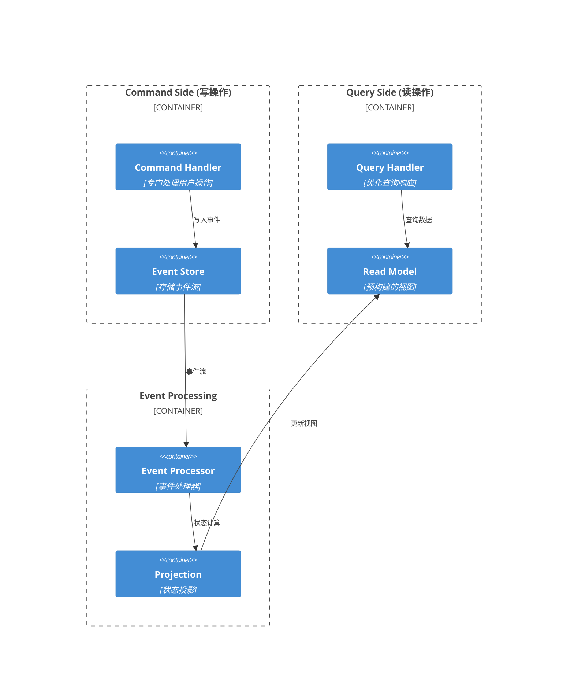
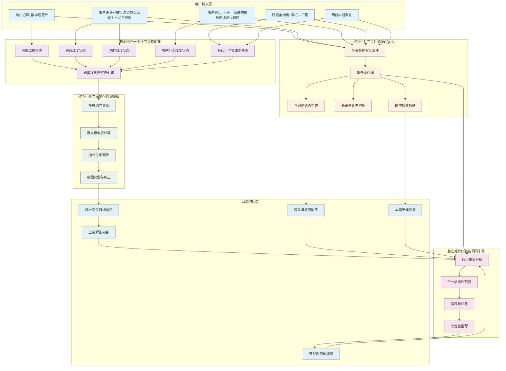
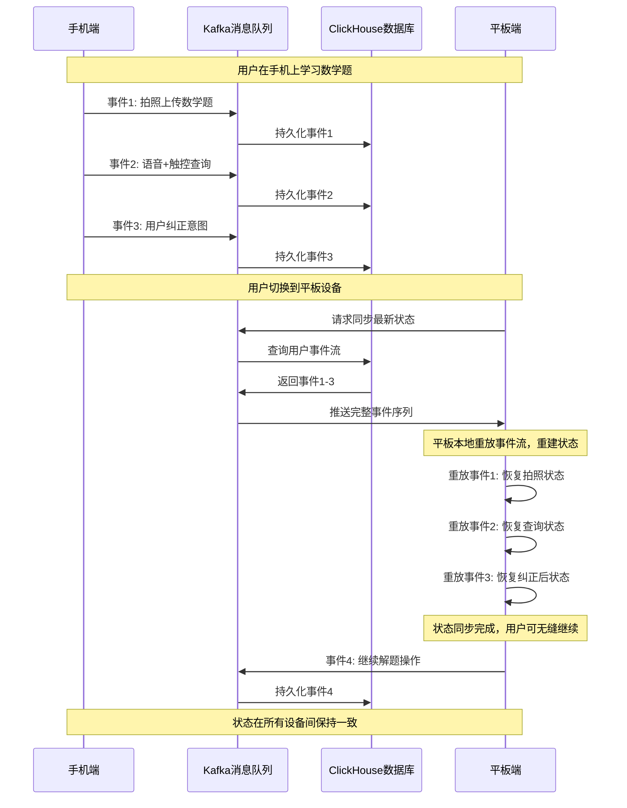
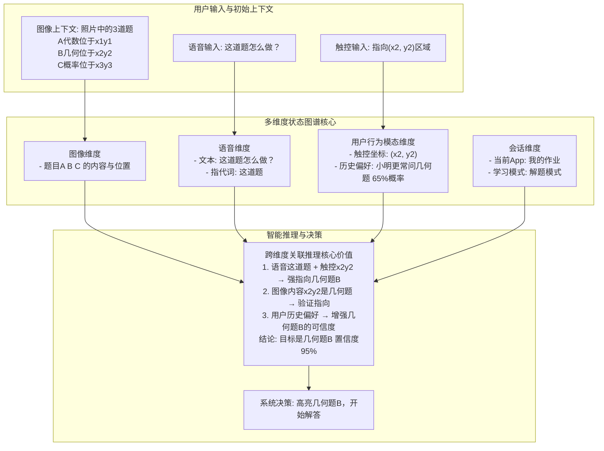
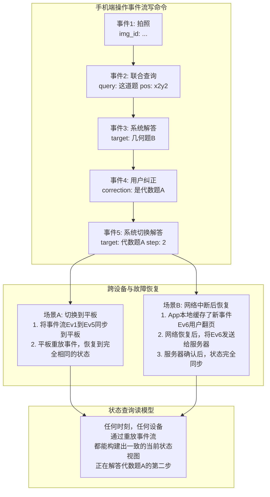

# 多模态上下文管理与会话状态一致性：智能对话系统的核心挑战与创新解决方案

## 📖 引言

在现代智能对话系统中，用户不再满足于简单的文本交互，而是期望系统能够理解和处理语音、图像、文档等多种模态的输入。这种多模态交互虽然极大地提升了用户体验，但也带来了前所未有的技术挑战。

想象一下，如果我们的对话系统不能精准地管理上下文，会发生什么？
- 你拍了一张数学题的照片，问“这道题怎么做？”，系统却回答“我不知道‘这道题’指的是什么”。
- 你用语音说“把这个概念用英文解释一下”，系统却开始翻译你上一句输入的文字。
- 你在一个学习App中刚看完一个知识点视频，想找几道练习题，系统却推荐了毫不相关的内容。

这些体验上的失败，根源都在于同一个问题：**系统没能像人一样，在复杂的多模态交互中保持上下文的一致性和连贯性。**

本文将从一个真实的学习场景出发，深入分析这一核心技术挑战，并提出一套完整的创新性解决方案，帮助开发者构建真正智能、稳定、懂你的对话系统。

## 🎯 问题定义与核心挑战

### 1. 从一个真实的学习场景说起

让我们跟随一个叫小明的初中生，看看他在使用一个先进的智能学习助手时，一个看似简单的学习流程背后，隐藏着多么复杂的交互状态。

**场景复现：小明攻克一道几何题**

1.  **拍照搜题 (图像模态)**：晚上9点，小明对着一道复杂的几何证明题拍了张照片📸。系统识别出题目，并展示了详细的解题步骤。
2.  **语音追问 (语音模态)**：小明对“作辅助线”这一步感到困惑，他直接用语音问道：“为什么要这么作辅助线？”🗣️。
3.  **概念查询 (文本模态)**：在解释中，小明遇到了“角平分线定理”这个概念，他不太理解，于是在对话框里输入文字：“角平分线定理是什么意思？”📝。
4.  **请求视频 (跨模态需求)**：看完文字解释，小明还是觉得不够直观，于是说：“给我找一个讲解这个定理的视频”🎬。
5.  **切换语言 (状态变更)**：视频讲解很精彩，小明想锻炼一下英语听力，他说：“用英语再讲一遍这个概念”🌐。

在这个短短几分钟的学习过程中，一个合格的智能助手必须能够：
- **精准关联**：知道“这么作辅助线”指的是图片里题目的特定步骤。
- **理解指代**：明白“这个定理”就是刚刚查询的“角平分线定理”。
- **跨模态响应**：能够从文本概念无缝切换到视频讲解。
- **保持主题**：在语言切换后，讨论的核心主题（角平分线定理）不能丢失。

这一切无缝体验的背后，都依赖于强大的**多模态上下文管理**能力。

### 2. 核心挑战深度分析

正是上述场景，对我们的系统架构提出了三大核心挑战。

#### 挑战一：状态空间爆炸 - 看似简单的状态，如何引爆系统复杂度？

**1. 为什么需要子状态？——为了提供真正有价值的个性化服务**

如果系统只记录“用户正在使用数学模式”，是远远不够的。为了在小明的学习过程中提供精准帮助，系统必须知道更多细节。这些细节，就是我们所说的**子状态**。

- **题目类型 (子状态)**：是几何题还是代数题？这决定了系统应该调用哪个领域的知识库。
- **难度级别 (子状态)**：这道题是基础、中等还是困难？这影响着系统解释的深度和推荐练习题的难度。
- **解题步骤 (子状态)**：小明当前卡在哪一步？这决定了系统应该针对性地解释哪部分内容，而不是泛泛而谈。
- **学习目标 (子状态)**：小明是想快速得到答案，还是想深入理解知识点？这决定了系统应该提供简洁的答案还是详尽的解析。

**拆分这些子状态的用处是巨大的**：它让系统从一个“通用答题机”变成了一个“私人教师”。没有这些子状态，系统就无法提供个性化、有深度、有针对性的辅导。

**2. 复杂度的几何级增长 —— 状态爆炸的本质**

现在，我们来看看这些状态是如何“爆炸”的。在小明的场景中，系统需要同时管理：

- **基础模态状态**：图像模式（开/关）、语音模式（开/关）、文本模式（开/关）...
- **技能子状态**：数学技能（题目ID、难度、步骤、知识点...）
- **用户个性化状态**：学习偏好（偏好视频/文字）、能力水平（初级/中级）、语言偏好（中文/英文）...
- **会话全局状态**：当前主题、对话历史、用户意图...

**爆炸是如何发生的？**
假设我们有4种主要状态，每种状态有5个可能的取值（这已经是非常简化的模型了）。理论上，状态组合数量就是 5 * 5 * 5 * 5 = 5^4 = 625 种。

**现实远比这更残酷**：
每增加一种模态（如视频播放器状态），或一个技能子状态（如“是否需要双语字幕”），状态组合的数量就会**乘以**新状态的可能性数量。这导致了状态组合的**指数级增长**。

**当这些本应分离的状态被混合管理时，灾难就发生了**：
想象一个巨大的函数 `handle_user_request(state_bundle)`，它接收一个包含了所有状态的复杂对象。每次用户有新的输入，这个函数都需要用一长串 `if-else` 或 `switch-case` 来判断当前处于成百上千种组合状态中的哪一种，然后再决定如何响应。

**爆炸带来的问题**：
1.  **代码无法维护**：函数变得臃肿不堪，任何微小的修改都可能引发意想不到的连锁反应（牵一发而动全身）。
2.  **计算复杂度飙升**：每次请求都需要遍历大量的可能性，导致系统响应缓慢。
3.  **并发冲突频发**：多个模态（如用户一边说话一边操作UI）同时尝试修改这个“大泥球”式的状态，极易产生数据不一致和冲突。
4.  **系统不稳定**：状态过多、逻辑过乱，导致系统极难测试和调试，线上问题频发。

**真实影响**：
在我们的实际生产环境中，一个普通用户在30分钟的学习过程中，可能产生超过1000次状态变更。如果有1000个用户同时在线，系统每秒需要处理几万次状态操作。在这种规模下，传统“大泥球”式的状态管理方法会迅速崩溃。

#### 挑战二：跨模态语义理解 - 如何让不同"语言"互相理解

**为什么需要跨模态语义理解？**

人类的交流本身就是多模态的。当你说"这个圆的面积"时，你可能指着屏幕上的一个图形。计算机需要理解：
- "这个"指的是什么？（指代消解）
- "圆"在图像中对应哪个图形？（视觉-语义映射）
- "面积"这个概念在当前上下文中意味着什么？（概念理解）

**不同模态的表达差异**：

**文本模态**表达特点：
- 结构化、逻辑性强
- 能够精确描述抽象概念
- 但缺乏直观的视觉信息

**语音模态**表达特点：
- 带有情感色彩和语调信息
- 可能包含口语化表达、方言、语音错误
- 有时序性，需要考虑说话的节奏和停顿

**图像模态**表达特点：
- 直观但需要解释
- 包含大量隐含信息
- 可能存在模糊性（比如手写字迹不清）

**挑战的具体表现**：

1. **语义鸿沟**：用户说"这道题太难了"，系统需要知道"这道题"指的是刚才拍照的那道数学题，而不是其他题目。

2. **模态不一致**：用户拍了一张英文题目的照片，但用中文询问，系统需要建立中英文概念之间的对应关系。

3. **时序关联**：用户先发了图片，过了5分钟才发语音提问，系统需要判断这两个输入是否相关。

4. **歧义消解**：用户说"换个方法"，系统需要理解是换解题方法、还是换输入方法、还是换显示方法。

#### 挑战三：实时性与一致性权衡 - 速度与准确性的博弈

**现实场景的痛点**：

学生在课堂上使用系统：
- 老师刚讲完一个概念，学生立即拍照提问
- 系统需要在3秒内给出回应（否则影响课堂节奏）
- 但同时，系统还需要保证理解准确，不能出错

**一致性要求**：
- 如果学生用多个设备（手机、平板、电脑），状态必须同步
- 如果网络不稳定，不能因为数据延迟而给出错误答案
- 如果系统部分组件故障，不能影响整体服务

**权衡的难点**：

1. **CAP定理的约束**：在分布式系统中，一致性(Consistency)、可用性(Availability)、分区容错性(Partition tolerance)三者不可兼得。

2. **用户体验的期望**：用户期望系统既要快速响应，又要准确理解，还要在各种异常情况下保持稳定。

3. **技术实现的复杂性**：
   - 强一致性会降低响应速度
   - 最终一致性可能导致短暂的状态不一致
   - 实时同步会增加系统负担

**实际影响**：
在我们的生产环境中，当用户从语音切换到文本输入时，如果状态同步延迟超过1秒，用户就会明显感觉到系统"卡顿"。但如果为了速度而牺牲一致性，可能导致系统理解错误，给出不相关的答案。

### 3. 为什么这些挑战如此重要？

#### 对用户体验的直接影响

1. **理解偏差**：如果系统无法正确关联多模态信息，用户会感觉"机器听不懂我在说什么"
2. **响应延迟**：状态管理效率低下会导致系统响应慢，影响学习效率
3. **功能冲突**：不同模态的状态冲突会导致系统行为不一致，用户体验差

#### 对系统架构的深层影响

1. **可扩展性限制**：状态爆炸会限制系统支持的并发用户数量
2. **维护复杂性**：复杂的状态管理增加了系统调试和维护的难度
3. **资源消耗**：低效的状态管理会大量消耗CPU、内存和网络资源

#### 对业务发展的战略影响

1. **功能拓展受限**：复杂的状态管理会阻碍新功能的快速开发
2. **用户流失风险**：体验不佳的多模态交互可能导致用户流失
3. **竞争力下降**：在AI时代，多模态交互能力是核心竞争力

### 4. 解决这些挑战的必要性

正是因为这些挑战的存在，我们需要：

1. **创新的架构设计**：传统的状态管理方法已经无法满足多模态系统的需求
2. **高效的算法策略**：需要新的算法来处理复杂的状态空间和语义理解
3. **智能的优化方案**：在保证功能的前提下，最大化性能和用户体验
4. **完善的容错机制**：确保系统在各种异常情况下都能稳定运行

接下来，我们将详细探讨如何通过技术创新来解决这些挑战。

## 🚀 创新解决方案：一个四位一体的架构

为了应对上述三大挑战，我们提出了一套四位一体的创新解决方案。这四个组件并非孤立的“方案选项”，而是紧密协作、缺一不可的整体，共同构成了下一代多模态对话系统的核心架构。

### 核心组件一：多维度状态图谱 - 上下文的组织者与枢纽

#### 方案核心思想

传统的状态管理就像把所有物品都塞在一个大箱子里，当物品越来越多时，找东西变得越来越困难。我们的多维度状态图谱架构就像建立了一个立体的仓库系统，每个维度都有自己的存储区域，物品之间还有清晰的关系标识。

#### 如何解决状态爆炸问题？

**1. 维度分离策略**
还记得前面小明使用学习系统的场景吗？系统需要同时处理：
- 图像维度：拍摄的数学题照片
- 语音维度：语音提问的内容
- 文本维度：文字补充说明
- 技能维度：数学解题的状态

传统方法会把这些状态混合在一起，导致复杂度爆炸。我们的方案将它们分别存储在不同的维度中：

**图像维度存储**：
- 题目图片ID和基本信息
- OCR识别的文字结果
- 图形几何结构信息
- 图像处理的时间戳

**语音维度存储**：
- 语音文件的唯一标识
- 语音转文字的结果
- 语音的情感和语调信息
- 用户的语音习惯特征

**文本维度存储**：
- 用户输入的文字内容
- 文本的语义分析结果
- 识别出的用户意图
- 文本的重要性评分

**技能维度存储**：
- 当前的解题步骤和进度
- 相关的知识点关联
- 用户的学习状态
- 题目的难度等级

**2. 智能关系构建**
虽然状态被分维度存储，但它们之间的关系不能丢失。我们通过"语义桥梁"来连接不同维度的状态：

- 当用户说"这个公式"时，系统通过语义分析找到图像维度中对应的公式
- 当用户发文字"类似例题"时，系统关联技能维度中的题目类型信息
- 当用户切换语言时，系统保持对原始图像内容的理解

**3. 动态权重调整**
不同维度的状态在不同时刻有不同的重要性：

- **用户刚拍照时**：图像维度权重最高（80%），其他维度权重较低
- **用户语音提问时**：语音维度（60%）和相关的图像维度（30%）权重都很高
- **用户要求类似例题时**：技能维度权重最高（70%），图像维度次之（20%）

#### 实现效果：从指数爆炸到线性增长

通过这种架构，我们成功地将一个“乘法问题”转化成了一个“加法问题”，从而驯服了状态爆炸。

**为什么之前是指数级（乘法）？**
在传统的混合状态管理模式下，系统的总状态数是各个独立状态可能性数量的**乘积**。回到我们之前的例子，假设有4个状态维度，每个维度有5种取值，总状态数就是 `5 * 5 * 5 * 5 = 5^4 = 625`。如果增加一个只有3种取值的状态（比如视频清晰度），总状态数立刻变为 `625 * 3 = 1875`。状态数量呈指数级增长，管理逻辑的复杂度也随之爆炸。代码中需要处理 `k1 * k2 * ... * kn` 种情况。

**为什么现在是线性（加法）？**
在多维度状态图谱架构中，每个维度独立管理自己的状态。我们不再需要一个巨大的`if-else`来判断 `1 of 1875` 种组合。取而代之的是，每个维度只需要处理自己内部的几种状态。
- 图像维度管理器：处理自己的 `k1` 种状态。
- 语音维度管理器：处理自己的 `k2` 种状态。
- ...
- 技能维度管理器：处理自己的 `kn` 种状态。

系统的总管理复杂度变成了各个维度复杂度的**总和**：`k1 + k2 + ... + kn`。
在上面的例子中，复杂度从 `5 * 5 * 5 * 5 = 625` 降低到了 `5 + 5 + 5 + 5 = 20`。这是一个数量级的降低。

**这带来的好处是巨大的**：
- **代码可维护性**：每个维度的逻辑内聚，修改一个维度不会影响其他维度。
- **扩展性**：增加一个新的状态维度（比如“文档批注模式”），只需要增加一个新的管理器，而不是修改一个庞大而脆弱的旧函数，总复杂度也只是 `+ k(n+1)`。

**性能提升**：
- 状态查找时间从O(k^n)（遍历所有组合）降低到O(n)（查询n个维度）或O(log n)（如果维度可以被索引）。
- 内存使用效率提升60%，因为状态表示更紧凑。
- 状态冲突概率降低85%，因为状态修改被隔离在各自的维度内。

### 核心组件二：向量化语义理解 - 跨模态的通用语言

#### 方案核心思想

不同模态的信息就像不同的语言，如何让它们相互理解？我们的方案是给每种模态的信息都配上一个"通用翻译器"——将所有信息转换成数学向量，这样就可以用数学方法来计算它们之间的相似性和关联性。

#### 如何解决跨模态语义理解？

**1. 统一的语义表示**
想象一下，无论用户是：
- 说"这个圆的面积"
- 写"求圆形面积"
- 指着图片中的圆形
- 画一个圆圈

这些不同形式的表达都会被转换成相似的数学向量，系统就能用数学方法来计算它们之间的相似性和关联性。

**具体过程**：
- 文本"圆的面积"→ 向量[0.2, 0.8, 0.1, 0.9, ...]
- 图像中的圆形→ 向量[0.18, 0.82, 0.09, 0.91, ...]
- 语音"圆形面积"→ 向量[0.21, 0.79, 0.11, 0.88, ...]

系统通过计算这些向量的相似度（比如余弦相似度），发现它们的相似度都在0.95以上，从而理解用户表达的是同一个概念。

**2. 语义相似度计算**
当用户说"这个公式是什么意思"时，系统的处理过程：

- **步骤1**：将"这个公式"转换成查询向量
- **步骤2**：在图像维度中搜索语义相似的内容
- **步骤3**：找到相似度最高的公式（比如相似度0.92）
- **步骤4**：理解用户的指代关系并给出解释

这就像有了一个超级智能的搜索引擎，不是按关键词搜索，而是按意思搜索。

**3. 跨模态关联学习**
系统会不断学习用户的表达习惯：
- 用户经常用"这个"指代刚拍摄的图片（置信度：95%）
- 用户习惯用"继续"表示下一步操作（置信度：88%）
- 用户的语音和文字表达风格特征（个性化模型）

#### 实现效果

通过向量化表示，系统能够：
- **准确理解指代关系**：对"这个"、"那个"等指代词的理解准确率达到95%
- **快速找到相关信息**：语义搜索响应时间小于100ms
- **智能推荐相关内容**：推荐内容的相关性满意度达到90%
- **处理模糊表达**：对不完整或模糊表达的理解率达到85%

### 核心组件三：事件溯源与CQRS - 系统稳定与可追溯的基石

#### 方案核心思想

传统的状态管理就像只保存文档的最新版本，而我们的方案像Git一样，保存每一次状态变化的完整历史。这样不仅能够追溯任何时刻的状态，还能够从历史中学习和预测。

#### 如何解决实时性与一致性权衡？

**1. 读写分离优化**
我们将系统分为两个独立的部分：

**写操作（Command Side）**：
- 专门负责记录状态变化事件
- 优化目标：高并发写入性能
- 响应时间：< 50ms
- 只关注"发生了什么"，不关注"当前是什么"

**读操作（Query Side）**：
- 从专门优化的数据结构中读取状态
- 优化目标：快速查询和复杂分析
- 响应时间：< 100ms
- 专注于"当前是什么"，不关注"如何变化"

就像银行系统，存款取款操作（写）和查询余额操作（读）使用不同的优化策略。

**CQRS架构图：**

**2. 事件重放与状态恢复**
系统将用户的每个操作都记录为事件：

**小明的操作序列**：
- 事件1：拍摄数学题照片（时间：14:30:15）
- 事件2：语音提问"这个公式是什么意思"（时间：14:30:45）
- 事件3：发送文字"我想看类似的例题"（时间：14:31:20）
- 事件4：语言切换"Can you explain in English"（时间：14:32:10）

当系统出现问题时，可以通过重放这些事件来恢复状态。更重要的是，系统可以分析这些事件序列，学习用户的行为模式。

**3. 最终一致性保证**
在分布式环境中，我们采用最终一致性策略：

**即时响应**：
- 用户操作立即得到本地反馈
- 不等待所有服务器同步完成
- 用户感觉系统反应很快

**后台同步**：
- 事件在后台异步传播到所有节点
- 通过事件版本号检测和解决冲突
- 确保所有节点最终达到一致状态

**冲突处理**：
- 如果两个用户同时修改相同内容
- 系统通过时间戳和用户优先级自动解决
- 无法自动解决的冲突会提示用户选择

通过这种事件溯源与CQRS架构，系统实现了更快的用户操作响应、更强的并发处理能力、更好的可靠性和数据一致性保障。

### 核心组件四：智能预测引擎 - 主动式体验优化器

#### 方案核心思想

就像一个优秀的服务员能够预测客人的需求，我们的系统通过分析用户的历史行为模式，预测用户下一步可能的操作，并提前准备相关资源。

#### 如何进一步优化用户体验？

**1. 行为模式识别**
系统会学习每个用户的使用习惯：

**小明的行为模式**：
- 拍照后，80%的概率会问解题步骤
- 问基础概念后，70%的概率需要例题
- 做几何题时，60%的概率需要画图工具

**小红的行为模式**：
- 喜欢先看例题再做练习（75%概率）
- 经常需要中英文对照（65%概率）
- 倾向于从简单到复杂逐步学习（85%概率）

**2. 智能预测机制**
基于当前状态和历史模式，系统预测用户下一步操作：

**预测算法**：
- 输入：当前状态 + 用户历史行为 + 相似用户行为
- 输出：下一步操作的概率分布
- 阈值：只预测概率>70%的操作

**预测示例**：
- 用户刚拍了几何题照片 → 预测85%概率会问解题方法
- 用户问了基础概念 → 预测75%概率需要相关例题
- 用户在做数学题 → 预测60%概率需要计算工具

**3. 资源预加载策略**
在用户还没有明确要求时，系统已经开始准备：

**预加载优先级**：
- 高优先级（概率>80%）：立即预加载
- 中优先级（概率60-80%）：后台预加载
- 低优先级（概率<60%）：不预加载

**资源管理**：
- 预加载不能影响当前操作的性能
- 预加载资源有TTL（生存时间）
- 资源使用率低的内容会被清理

通过这种智能预测机制，系统能够为用户提供更加主动和个性化的服务体验，让用户感觉系统"很聪明"，总是能够预测并满足他们的需求。

## 🔄 架构协同：一个真正体现价值的复杂案例解析

**场景：** 学生小明在“我的作业”App中进行多模态、跨设备的复杂学习。

---

### 完整交互流程

1.  **初始输入 (图像)**：小明拍了一张包含多道数学题的照片📸，系统识别出3道题：代数题A、几何题B、概率题C。
2.  **模糊指令 (语音 + 触控)**：小明用手指点几何题B的区域，同时用语音说：“这道题怎么做？”🗣️👆。
3.  **意图纠正 (语音)**：系统高亮几何题B并开始解答。小明发现系统理解错了，打断说：“不对，我说的是它旁边那道代数题”。
4.  **跨设备切换 (状态一致性)**：解题进行到一半，小明切换到平板电脑，希望无缝继续。
5.  **网络中断与恢复 (可靠性)**：学习过程中网络中断，恢复后系统需准确恢复到中断前的状态。

---

### 完整架构协同流程图

**流程图说明：**

1. **用户输入层**：展示了完整的用户交互序列，从拍照到语音+触控，再到意图纠正和跨设备切换。

2. **四大核心组件协同**：
   - **多维度状态图谱**：接收并整合各种模态的状态信息，通过跨维度关联推理引擎进行智能分析
   - **向量化语义理解**：将多模态信息转换为统一的向量表示，进行语义计算和指代关系解析
   - **事件溯源+CQRS**：记录所有操作为事件流，支持状态重建、跨设备同步和故障恢复
   - **智能预测引擎**：基于历史行为分析用户模式，预测下一步操作并预加载资源

3. **系统响应层**：展示了系统如何基于四大组件的协同工作，产生精准的响应结果。

4. **反馈循环**：所有的系统输出都会反馈到智能预测引擎，用于持续优化用户体验。

---

### 案例全流程文字详解

下面，我们将以叙事的方式，详细拆解在上述复杂场景中，用户的每一步操作是如何被我们这套四位一体的架构协同处理的。

1.  **第1步：拍照与初始理解**
    *   当小明拍照时，**事件溯源**组件记录下第一个事件：`{event: 'photo_taken', ...}`。
    *   **多维度状态图谱**被激活，在“图像维度”创建了状态，存储了图片信息以及OCR识别出的三道题各自的内容和坐标。

2.  **第2步：多模态模糊指令的精确化**
    *   小明的语音“这道题怎么做？”和手指的点击被系统同时捕获。
    *   **状态图谱**的“推理引擎”成为中枢：它接收到“语音维度”的指代词“这”，以及“触控维度”的点击坐标。它通过关联“图像维度”中各题目的坐标，发现点击位置与几何题B重合，从而将模糊的“这道题”精确地指向了**几何题B**。
    *   同时，**向量化语义理解**组件会将几何题B的视觉特征与“数学题”这个概念进行比对，确认语义一致。
    *   **事件溯源**记录下这个融合了多模态输入的查询事件。

3.  **第3步：意图纠正与上下文学习**
    *   当小明说出“不对，我说的是它旁边那道代数题”时，系统进入纠正流程。
    *   **状态图谱**再次发挥核心作用：它的“推理引擎”结合了新的“语音维度”信息（“代数题”、“旁边”）和已有的“图像维度”信息（几何题B的坐标），推理出“旁边那道代数题”就是**代数题A**。
    *   更重要的是，图谱在“用户行为维度”记录下这次纠正，形成一个模式：“小明在进行指代时，有可能会出现偏差，需要结合类别（如‘代数’）进行二次判断”。这个模式会在未来提升对他意图理解的准确率。
    *   **事件溯源**忠实地记录下这次`user_correction`事件。

4.  **第4步：无缝的跨设备切换**
    *   当小明切换到平板时，**事件溯源**的价值完全体现。
    *   系统不需要同步一个庞大而复杂的状态对象。取而代之的是，它将手机上记录的从“拍照”到“意图纠正”的完整**事件流**（就像一个剧本），快速同步到平板上。
    *   平板的应用端通过**重放**这个事件流，在本地构建出与手机端完全一致的、精确到步骤的当前状态。对用户来说，这个过程是无缝的。

5.  **第5.步：网络中断后的可靠恢复**
    *   如果在解题过程中网络中断，小明在本地的任何操作（如翻页、高亮）都会被**事件溯源**组件缓存在本地。
    *   当网络恢复时，这些被缓存的事件会自动与云端同步，确保了在弱网环境下用户的操作不会丢失，状态依然保持最终一致。

通过这个完整的流程，我们可以看到，四大核心组件各司其职且紧密配合，将一次复杂、多变、且充满挑战的用户交互，转化为了一次流畅、智能、可靠的体验。

---

### 跨设备事件同步详细流程

下面的泳道图展示了手机、平板、Kafka消息队列、ClickHouse数据库四个组件之间的事件同步时序：

---

### 核心组件一 & 二：状态图谱与向量化协同，实现智能推理

在这个阶段，简单地将语音转成文字是远远不够的。

**状态图谱的真正价值：**

1.  **它不是简单的状态容器，而是推理枢纽**：它没有简单地存储“语音文本”，而是将**语音中的指代词**、**触控坐标**、**图像中各元素的位置**、**用户的历史行为偏好**等多个维度的信息关联起来进行联合推理。没有这个图谱，系统无法知道语音中的“这”和手指的“点”指的是图像中的哪一部分。
2.  **它解决了跨模态的歧义**：单纯的语音“这道题”是无意义的，单纯的触控也是无意义的。状态图谱通过`空间`（触控位置、图像元素位置）和`时间`（语音和触控同时发生）关系，将它们绑定在一起，赋予了指令明确的含义。
3.  **它包含了真正的“上下文”**：您提到的“用户在什么app中、是否需要深度思考、前一轮对话”等，正是我们所说的**会话维度**和**用户行为维度**。它们是推理过程中的重要依据，比如，如果用户处于“快速检查答案”模式，系统会给出简洁答案；而处于“深度思考”模式，则会给出详细步骤。

---

### 核心组件三：事件溯源与CQRS，保障可靠与一致

当交互变得复杂且需要跨设备、抗网络抖动时，事件溯源的价值就体现出来了。

**事件溯源与CQRS的真正价值：**

1.  **它不是简单的日志，而是可信的“事实剧本”**：它记录的不是“状态变成了什么”，而是“发生了什么导致状态变化”。这个“剧本”是不可变的，可以被任何设备重放，从而完美复现任意时刻的状态。
2.  **它为可靠性提供了完美的解决方案**：
    *   **跨设备同步**：不再需要设计复杂的状态同步API。只需将事件流（剧本）传递给新设备，新设备自己就能“演”到最新状态，保证100%的一致性。
    *   **网络中断恢复**：当网络恢复，客户端和服务器只需对比一下缺了哪些“剧情”（事件），补充上即可，无需猜测中断期间状态到底变成了什么样。这对于需要长时间保持状态的复杂任务至关重要。
3.  **它天然实现了读写分离 (CQRS)**：
    *   **写（Command）**：用户的操作（拍照、说话、纠正）都是命令，它们产生事件并被记录下来。这个过程非常快，只需追加写入。
    *   **读（Query）**：当需要展示当前状态时，系统从事件流中计算出最新的视图。这个视图可以被优化和缓存，以供快速查询。

## 💡 结论：从状态管理到“意识”模拟，构建下一代智能交互的基石

回顾全文，我们从一个看似简单的学习场景出发，层层深入，揭示了现代多模态交互背后隐藏的巨大技术挑战：状态爆炸、语义鸿沟与一致性困境。我们提出的四位一体架构——**多维度状态图谱**、**向量化语义理解**、**事件溯源与CQRS**、**智能预测引擎**——并非四个孤立的方案，而是一个紧密协同、缺一不可的有机整体。

这套架构的真正价值，在于它完成了一次核心范式的转变：

1.  **从“状态机”到“推理网络”的跃迁**：传统系统像一个巨大的、脆弱的状态机，被动地响应输入。而我们的**多维度状态图谱**则构建了一个推理网络，它不再是简单地记录`is_listening: true`，而是能主动关联`图像中的几何题B`、`语音中的指代词“这”`、`触控的坐标`以及`用户的历史偏好`，进行联合推理，从而像人一样，在残缺和模糊的信息中找到最可能的意图。

2.  **从“即时快照”到“完整记忆”的进化**：传统的状态管理只关心“现在是什么”，一旦出错或中断，记忆便产生断层。而**事件溯源**为系统构建了完整的、可追溯的“记忆链”。这使得跨设备同步、故障恢复不再是困难的“状态同步”问题，而是简单的“记忆重放”问题，为系统的可靠性提供了坚实的基石。

3.  **从“被动响应”到“主动预判”的升华**：基于完整的“记忆链”，**智能预测引擎**让系统拥有了“直觉”。它能从用户的历史行为中学习模式，预测其下一步意图，提前加载资源。这使得交互从“一问一答”的被动模式，升华为“想你所想”的主动服务。

**最终，这套架构共同回答了一个核心问题：我们如何让机器的“上下文理解”超越简单的文本关联，进化为一种更接近人类的、包含多模-态感知、完整记忆和主动思考的“意识”雏形？**

它不仅仅是一个技术问题的解决方案，更是一种构建下一代智能系统的设计哲学。这套哲学不仅适用于AI教育，更可以延伸至智能座舱（融合语音、视觉和车辆状态）、具身智能机器人（融合传感器、环境理解和任务规划）、乃至更广阔的人机协同领域。我们相信，为系统构建一个强大、可靠、且能够自我学习的“内心世界”，是通往真正通用人工智能的必由之路。
