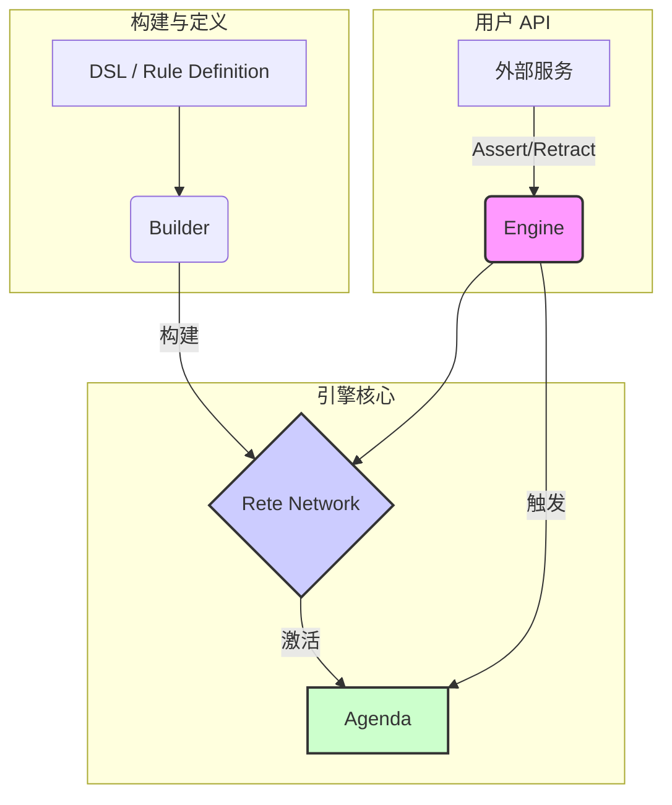
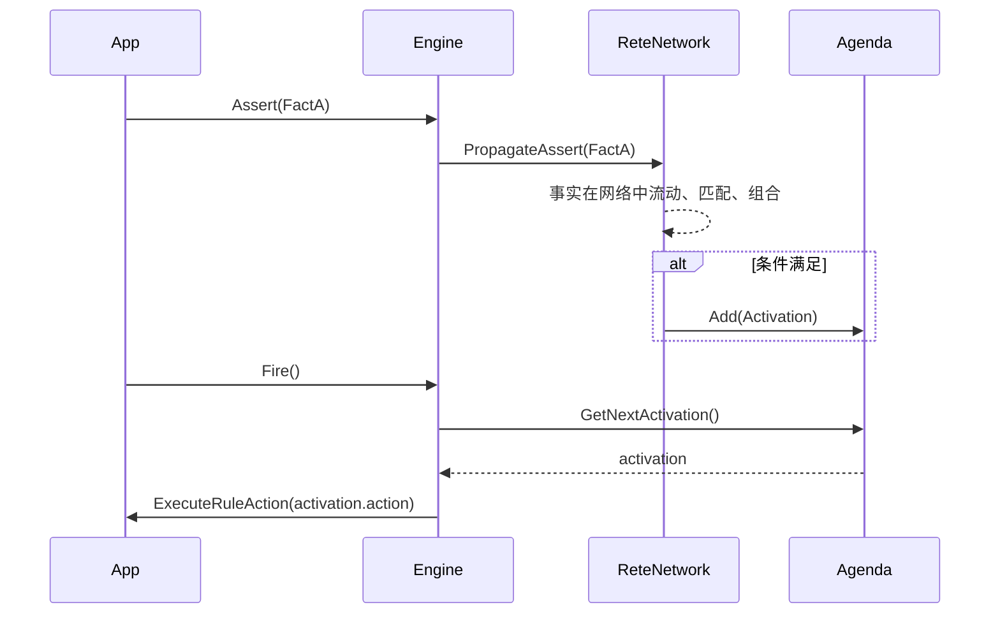
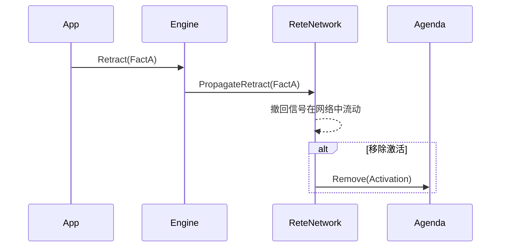

# Go 企业级 Rete 规则引擎设计文档

**版本**: 1.1 (最后更新: 2025-08-06)

> 本文档旨在深入阐述一个用 Go 实现的企业级 Rete 规则引擎的核心设计与实现细节。它将伴随代码库的演进实时更新，确保设计与实现同步。

---

## 1. 核心设计原则

我们的目标是构建一个 **高性能、可扩展且易于理解** 的规则引擎，遵循以下原则：

1.  **性能优先**: 采用经典的 Rete 算法，通过**增量计算**和**记忆化**，确保在大规模规则和事实集下依然能高效匹配。
2.  **精确的逻辑语义**: 支持完备的逻辑操作（如 `AND`, `NOT`, `EXISTS`, `AGGREGATE`），并通过精确的**撤回 (Retraction)** 机制保证动态场景下的逻辑正确性。
3.  **高度可读性**: 代码即文档。通过清晰的模块划分、详尽的注释和一致的命名规范，使引擎的内部工作原理对开发者透明。
4.  **面向扩展**: 设计松耦合的节点和可插拔的组件（如 DSL Builder、冲突解决策略），为未来的功能扩展奠定基础。

---

## 2. 架构概览

### 2.1 模块职责

-   **Engine (外观层)**: 引擎的统一入口，封装了所有内部复杂性。对外提供 `Assert(fact)`、`Retract(fact)` 和 `Fire()` 等核心 API。
-   **Rete Network (匹配核心)**: 由一系列相互连接的节点组成，是规则匹配算法的物理实现。每个节点都负责一种特定的逻辑运算。
-   **Agenda (议程)**: 存放所有被**激活**但尚未执行的规则。它通过可配置的**冲突解决策略**（如优先级）决定下一个要触发的规则。
-   **Builder (构建器)**: 负责将用户定义的规则（如 YAML 或代码）**编译**成 Rete 网络。

### 2.2 Rete 网络节点详解

Rete 网络是引擎的心脏。事实 (Fact) 和事实的组合 (Token) 在网络中流动，每经过一个节点，都会被过滤或转换。

#### 核心接口：`rete.Node`

所有节点都实现了此接口，具备处理**断言 (Assert)** 和 **撤回 (Retract)** 的能力。

| 方法             | 描述                                     |
| ---------------- | ---------------------------------------- |
| `AssertFact(f)`  | 处理一个新进入网络的事实。               |
| `RetractFact(f)` | 处理一个从网络中移除的事实。             |
| `AssertToken(t)` | 处理一个上游节点传递下来的事实组合。     |
| `RetractToken(t)`| 处理一个需要被撤回的事实组合。           |

#### 节点类型

-   **AlphaNode**:
    -   **职责**: 对**单个事实**进行条件过滤。
    -   **输入**: `Fact`
    -   **输出**: `Fact` + `Token` (单元素)
    -   **工作流**: 接收事实，若满足条件，则存入其内部的 `AlphaMemory` 并向下游传播。撤回时则反向操作。

-   **BetaNode (JoinNode)**:
    -   **职责**: 对**两种输入**（左侧的 `Token` 和右侧的 `Fact`）进行连接 (Join)。
    -   **输入**: 左: `Token`, 右: `Fact`
    -   **输出**: `Token` (组合后)
    -   **工作流**: 当一侧输入到达时，会与另一侧内存中存储的所有元素进行匹配。成功匹配则创建新 Token 并传播。撤回时则传播对组合 Token 的撤回。

-   **NotNode**:
    -   **职责**: 实现 `NOT` 逻辑。
    -   **输入**: 左: `Token`, 右: `Fact`
    -   **输出**: `Token` (原始左侧)
    -   **工作流**: 使用内部**计数器**跟踪每个左侧 Token 的匹配数。仅当匹配数为 **0** 时，才传播该 Token。当匹配数从 `1` 降至 `0`（因右侧事实被撤回）或从 `0` 增至 `1`（因右侧新事实匹配）时，会触发相应的断言或撤回。

-   **ExistsNode**:
    -   **职责**: 实现 `EXISTS` 逻辑。
    -   **输入**: 左: `Token`, 右: `Fact`
    -   **输出**: `Token` (原始左侧)
    -   **工作流**: 同样使用计数器。仅当一个 Token 的匹配数 **大于 0** 时，它才会被传播。状态转变点（`0 -> 1` 或 `1 -> 0`）触发断言与撤回。

-   **AggregateNode**:
    -   **职责**: 对事实进行**分组聚合**（如 `count`, `sum`）。
    -   **输入**: `Fact`
    -   **输出**: `Fact` (特殊的聚合结果事实)
    -   **工作流**: 根据 `groupBy` 函数对事实进行分组计数。当一个组的计数值**首次**达到阈值时，生成一个 `AggregateResult` 事实并传播。

-   **TerminalNode**:
    -   **职责**: 网络的终点，代表一条规则的**所有条件均已满足**。
    -   **输入**: `Token`
    -   **输出**: 无 (将激活项送入 Agenda)
    -   **工作流**: 每当接收到一个 Token，就创建一个**激活项 (Activation)** 并将其添加到 Agenda 中，等待被触发。

---

## 3. 关键概念与数据结构

-   **Fact**: 表示一个业务实体或事件，是规则引擎处理的基本单元。必须实现 `Key() string` 接口以保证唯一性。

-   **Token**: 在 Beta 网络中流动的数据结构，它代表一个**满足了部分规则条件的事实组合**。本质上是一个 `Fact` 的有序列表。

-   **Memory (Alpha/Beta)**: 每个 AlphaNode 和 BetaNode 都拥有自己的内存，用于**记住**已经过验证的事实或 Token。这是 Rete 算法高性能的关键，避免了重复计算。

-   **撤回 (Retraction)**: 当一个事实从工作内存中移除时，引擎必须精确地撤销由该事实引发的所有后续匹配。撤回信号会沿着 Rete 网络反向传播，清理所有相关的内存和激活项，确保引擎状态的**一致性**。

---

## 4. 核心流程时序图

### 4.1 断言 (Assert)

### 4.2 撤回 (Retract)

---

## 5. 实施计划与进度

| 序号 | 任务                                      | 状态 |
|----|-----------------------------------------|----|
| 1  | 生成 `ruleengine` 包目录与空文件                 | ✅  |
| 2  | 实现核心数据结构 (Fact / Token / Memory)        | ✅  |
| 3  | 完成 AlphaNode / BetaNode，打通简单 Join 流程    | ✅  |
| 4  | 接入 TerminalNode + Agenda，能够触发 Action    | ✅  |
| 5  | **[当前]** 扩展 NotNode / ExistsNode / AggregateNode (含撤回) | ✅  |
| 6  | Builder 支持极简 YAML DSL，映射到网络             | ⏳  |
| 7  | 提供演示用例：反欺诈场景，全流程演示增量更新                  |    |
| 8  | 增加热加载 Rule、并发安全优化、Metrics               |    |

> 说明：⏳ 表示当前正在进行；✅ 表示已完成；空白表示未开始。
