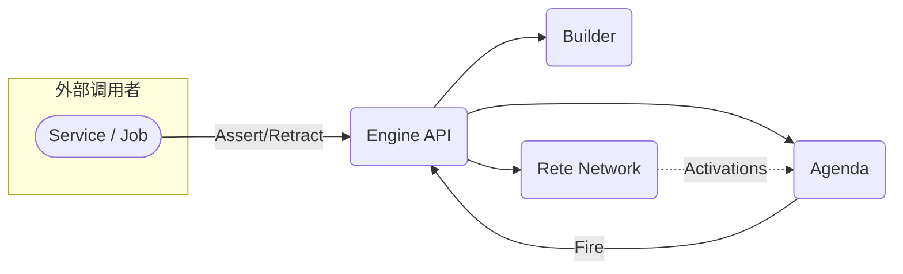
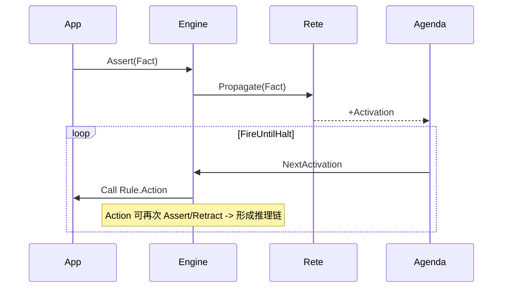

# Go 企业级 Rete 规则引擎设计文档

**更新时间**: 2025-08-06

> 本文将伴随代码实现实时更新。每完成一个实施步骤，都会在「实施计划」章节打✅。

---

## 1. 设计目标

1. 支持 **高性能增量匹配**：采用 Rete 网络记忆化 + 局部传播，确保在百万级事实 & 规则规模下依旧可接受的延迟。
2. **可插拔 DSL**：允许使用 YAML/JSON/代码链式 API 描述规则，并支持运行时热加载、增删改。
3. **推理链 & 规则互触发**：规则执行可产生新事实并继续匹配（Forward-Chaining）。
4. **企业级可运维性**：内置监控指标、日志追踪，支持 Goroutine-safe 调度与批量事务。

---

## 2. 模块职责与交互

### 2.1 `ruleengine`（外观层）

* **Engine**：聚合 Builder、Rete Network、Agenda；对外暴露 `Assert` / `Retract` / `Fire` / `FireUntilHalt` 接口。
* **WorkingMemory**：存储当前事实，维护版本号，用于并发控制。

### 2.2 `builder`

* 负责将 DSL => Rete 网络
    * 词法/语法解析 -> AST
    * 节点拆分与共享
    * Salience / Metadata 绑定至 TerminalNode

### 2.3 `rete`

* **节点体系**
    * `AlphaNode`  —— 单 Fact 过滤
    * `BetaNode`   —— 二元 Join，跨 Fact 关联
    * `NotNode` / `ExistsNode` —— 逻辑否定与存在性
    * `AggregateNode` —— 计数 / 求和 / 分组聚合
    * `TerminalNode` —— 规则终点，生成 Activation
* **内存体系**
    * `AlphaMemory`：map[key]Fact
    * `BetaMemory` ：map[hash]Token
    * 引入 **LRU 驱逐策略**（可选），避免 Memory 无限膨胀
* **Token**：串联 Facts 链，用于 Beta 网络传播与匹配去重。

### 2.4 `agenda`

* **Activation**：包含 Rule 引用 + Token + 时间戳。
* **ConflictResolver**：一组策略（Salience > Recency > Insertion）可配置组合。
* **AgendaLoop**：支持 `Fire(n)` / `FireUntilHalt()`，期间可释放读锁减少阻塞。

### 2.5 `model`

* **Fact** 接口：`Key() string` 唯一标识；业务结构体通过包装器实现该接口。
* **Condition / Rule**：承载 DSL 解析结果，供 Builder 使用。

### 2.6 `util`

* 并发安全 Map / Set
* 轻量 logger, metrics helper

---

## 3. 核心数据结构

| 结构          | 关键字段            | 说明            |
|-------------|-----------------|---------------|
| Fact        | Key, Value(any) | 工作内存元素，需唯一标识  |
| Token       | Facts[]、Hash    | Beta 链路上的事实组合 |
| AlphaMemory | map[key]Fact    | 单 Fact 条件缓存   |
| BetaMemory  | map[hash]Token  | Join 结果缓存     |
| Activation  | Rule, Token, Ts | Agenda 中待执行项  |

---

## 4. 主要时序

---

## 5. 并发 & 事务处理

* **读多写少**：`Assert` / `Retract` 用写锁；`Fire` 获取读锁，可在长时间执行期间释放再抢占。
* **Batch Session**：`engine.Tx()` 返回 session 对象，结束时一次性 commit，减少锁竞争。

---

## 6. 实施计划与进度

| 序号 | 任务                                      | 状态 |
|----|-----------------------------------------|----|
| 1  | 生成 `ruleengine` 包目录与空文件                 | ✅  |
| 2  | 实现核心数据结构 (Fact / Token / Memory)        | ✅  |
| 3  | 完成 AlphaNode / BetaNode，打通简单 Join 流程    | ✅  |
| 4  | 接入 TerminalNode + Agenda，能够触发 Action    | ✅  |
| 5  | 扩展 NotNode / ExistsNode / AggregateNode | ✅  |
| 6  | Builder 支持极简 YAML DSL，映射到网络             |    |
| 7  | 提供演示用例：反欺诈场景，全流程演示增量更新                  |    |
| 8  | 增加热加载 Rule、并发安全优化、Metrics               |    |

> 说明：⏳ 表示当前正在进行；✅ 表示已完成；空白表示未开始。
