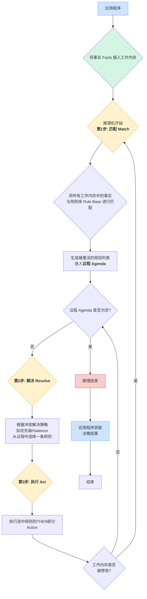
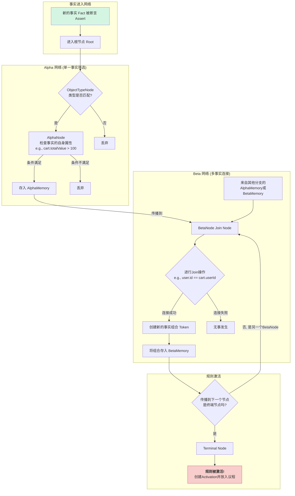

## 【硬核拆解】你的代码还在 `if-else` 走天下？是时候深入规则引擎了！


你好，未来的技术大神们！

你一定写过成百上千行的 `if-else`，它们像砖石一样，构筑了程序的逻辑骨架。但你是否曾遇到过这样的场景：

- 一个电商平台的促销活动，运营同学一天要改三次规则：“新用户满99减20”、“老用户拼单打八折”、“下午两点到四点，钻石会员额外赠送优惠券”……你的代码在无尽的 `if-else if-else` 中变得臃肿不堪，每次修改都心惊胆战，生怕“牵一发而动全身”。
- 一个金融风控系统，需要根据用户的年龄、收入、征信记录、行为数据等几十个维度来判断一笔贷款申请的风险等级。这些逻辑如果用代码硬编码，将是一场维护的噩梦。

当你为这些场景感到头疼时，一个强大的工具——**规则引擎（Rule Engine）**，正等待着你来解锁。这篇博客将带你深入其内部，从运作逻辑到核心算法，再到业界主流产品的实现，彻底搞懂规则引擎的“底层密码”。


### 一、 告别 `if-else` 泥潭：规则引擎为何存在？

在最朴素的认知里，规则引擎就是一个“`if-then`”的执行器。但它的核心价值远不止于此。它是一种将**业务决策逻辑**从**应用程序代码**中分离出来的组件。

想象一下，没有规则引擎，业务逻辑是这样的：

```java
// 硬编码在应用程序中的业务逻辑
public class OrderService {
    public void applyDiscount(Order order) {
        if (order.getUser().isNewUser() && order.getTotalPrice() > 99) {
            order.setDiscount(20);
        } else if (order.getUser().isVip() && order.isGroupBuy()) {
            order.setDiscount(order.getTotalPrice() * 0.2);
        }
        // ... 无尽的 else if ...
    }
}
```

这种代码的**痛点**显而易见：

1. **高耦合**：业务逻辑和程序代码紧紧绑在一起。
2. **难维护**：每次规则变更，都需要修改代码、测试、重新部署上线，流程繁琐且风险高。
3. **响应慢**：市场变化快，但技术流程跟不上，无法做到“业务随时调整，系统实时生效”。
4. **透明度差**：程序员写的代码，业务人员（如产品经理、运营）看不懂，沟通成本极高。

而引入规则引擎后，架构变成了这样：

应用程序在需要做决策时，不再自己判断，而是把相关的数据（我们称之为 **Fact**）“喂”给规则引擎，然后取回决策结果。规则本身则存放在一个独立的**规则库（Rule Base）**中，可以由业务人员通过专门的界面进行管理。

**规则引擎的核心价值**：

- **解耦**：实现业务逻辑与技术实现的彻底分离。
- **敏捷**：业务规则可动态修改、热插拔，无需重启服务，大大提高业务响应速度。
- **透明**：规则以更接近自然语言的方式（如 DRL 文件或决策表）存储，业务人员也能理解和维护。


### 二、 规则引擎的“心跳”：运作逻辑探秘

规则引擎的内部运作可以概括为一个不断循环的**“匹配-解决-执行”（Match-Resolve-Act）**周期。这个周期的核心组件包括：

- **事实（Fact）**：你的应用程序传入的，用于规则判断的业务数据对象。例如，一个 `Order` 对象、一个 `User` 对象。
- **规则库（Rule Base）**：包含所有业务规则的集合。每条规则都遵循 `WHEN-THEN` 的结构：
    - **WHEN (LHS - Left Hand Side)**：规则的条件部分，定义了匹配该规则所需满足的条件。
    - **THEN (RHS - Right Hand Side)**：规则的结果部分，即条件满足后需要执行的操作（Action）。
- **工作内存（Working Memory）**：一个存放所有 `Fact` 对象的地方。
- **议程（Agenda）**：一个用于存放**已被激活**的规则的队列。当工作内存中的 `Fact` 满足了某条规则的 `WHEN` 部分，这条规则就会被“激活”并放入议程中，等待执行。
- **推理机（Inference Engine）**：这是引擎的“大脑”，负责执行“匹配-解决-执行”的循环。

其工作流程如下：

1. **匹配（Matching）**：推理机不断地将工作内存中的所有 `Fact` 与规则库中的所有规则进行模式匹配。如果 `Fact` 的组合满足了某条规则的 `WHEN` 条件，就创建一个“活化（Activation）”实例，并将其放入议程中。
2. **解决（Conflict Resolution）**：议程中可能同时有多条规则被激活，但一次通常只能执行一条。那么执行哪一条呢？这就需要**冲突解决策略**。常见的策略有：
    - **Salience（优先级）**：给规则设定一个优先级，数字越大的越先执行。
    - **LIFO/FIFO（后进先出/先进先出）**：按照规则被激活的顺序来执行。
    - **复杂度**：条件更具体、更复杂的规则优先执行。
3. **执行（Act）**：从议程中选出一条规则，执行其 `THEN` 部分的操作。这个操作可能会修改、增加或删除工作内存中的 `Fact`。

**关键点**：当一个规则的 `THEN` 部分被执行后，工作内存的状态发生了改变。这个改变可能会导致之前不满足的规则现在满足了，或者之前满足的规则现在不满足了。因此，推理机会**回到第一步**，开始新一轮的“匹配-解决-执行”循环，直到议程为空，才宣告本次推理结束。这个过程也称为**“推理链”（Inference Chaining）**。


### 三、 终极武器：核心算法 Rete 深度剖析

你可能会想，每一轮循环都拿所有的 `Fact` 和所有的规则去匹配一遍，当 `Fact` 和规则数量巨大时，性能岂不是要崩？如果暴力匹配，其复杂度大约是 O(RcdotFP)（R是规则数，F是事实数，P是规则的平均模式数），这在现实世界中是不可接受的。

为了解决这个效率难题，卡内基梅隆大学的 Charles Forgy 博士在 1979 年发明了**Rete 算法**。时至今日，Rete 及其变种依然是大多数现代规则引擎的基石。


#### Rete 算法：从“暴力”到“智能”的进化

Rete 算法的核心思想是：**空间换时间，增量计算**。

它不再是每次都暴力匹配，而是将规则拆解成一个**网络（Rete Network）**，一个有向无环图。当 `Fact` 发生变化（插入、修改、删除）时，这些变化会像水流一样在网络中传播，只在受影响的节点上进行计算，从而极大地提高了匹配效率。

Rete 网络主要由以下几部分组成：

1. **Alpha 网络**：负责处理**单一 `Fact`** 的内部约束条件（例如 `user.level == "VIP"`）。它由一系列 `AlphaNode` 组成，可以看作是 `Fact` 的“初筛”通道。通过筛选的 `Fact` 会被保存在对应的 `AlphaMemory` 中。
2. **Beta 网络**：负责处理**跨 `Fact`** 的关联条件（例如 `order.userId == user.id`）。这是 Rete 最精妙的部分。`BetaNode`（或称 `JoinNode`）接收来自两个上游节点（可能是两个 `AlphaMemory`，或一个 `AlphaMemory` 和另一个 `BetaNode`）的输入，根据关联条件进行连接（Join）。
3. **记忆（Memory）**：`AlphaNode` 和 `BetaNode` 都有自己的 Memory。`AlphaMemory` 存储了满足单个条件的 `Fact` 列表。`BetaMemory` 则存储了满足部分关联条件的 `Fact` **组合**。正是这些 Memory，赋予了 Rete “记忆”能力，避免了重复计算。
4. **终端节点（Terminal Node）**：当一个 `Fact` 组合成功流过所有节点，到达网络终点时，就意味着一条规则的所有条件都已满足，该规则被激活。


#### 实战演练：用优惠券场景拆解 Rete 网络

让我们用一个具体的优惠券场景来把上面的理论跑起来。假设我们有两条促销规则：

- **规则1（VIP大额订单优惠）**: 如果一个用户是 `VIP` 会员，并且他有一张总价 `大于100元` 的购物车，那么就给他应用“VIP专属优惠”。
- **规则2（高价值购物车优惠）**: 如果一张购物车的总价 `大于500元`，那么就给他应用“高价值订单优惠”。

**第一步：构建 Rete 网络**

引擎首先会把这两条规则编译成如下的 Rete 网络：

```
                 [Root]
                   |
      +------------+-------------+
      |                          |
[ObjectTypeNode: User]     [ObjectTypeNode: Cart]
      |                          |
 [AlphaNode:             [AlphaNode:
  level == "VIP"]           totalValue > 100]
      |                          |
(AlphaMemory A)            (AlphaMemory B)
      \                        /
       \                      /
        \                    /
         [BetaNode: user.id == cart.userId]
                     |
               (BetaMemory C)
                     |
          [TerminalNode: Rule 1]


// Rule 2 的路径相对独立
[ObjectTypeNode: Cart] -> [AlphaNode: totalValue > 500] -> (AlphaMemory D) -> [TerminalNode: Rule 2]
```

- **AlphaMemory A**：将存储所有 VIP 用户。
- **AlphaMemory B**：将存储所有总价 > 100 的购物车。
- **BetaMemory C**：将存储匹配成功的（VIP用户, >100元购物车）的组合。
- **AlphaMemory D**：将存储所有总价 > 500 的购物车。


**第二步：插入第一个事实（Fact）**

一个VIP用户登录了系统。我们向引擎 `assert` 一个 `Fact`：`u1 = User{id: 1, level: "VIP"}`。

- `u1` 进入网络，通过 `ObjectTypeNode: User` 节点。
- 它满足 `level == "VIP"` 条件，通过 `AlphaNode`。
- **`u1` 被存入 `AlphaMemory A` 中**。
- 网络归于平静。`BetaNode` 检查到了变化，但它的另一个输入（来自 `AlphaMemory B`）是空的，所以没有匹配发生。**此时，没有任何规则被激活。**


**第三步：插入第二个事实（Fact）**

该用户将一些商品加入购物车，总价为150元。我们 `assert` 第二个 `Fact`：`c1 = Cart{id: 101, userId: 1, totalValue: 150}`。

- `c1` 进入网络，通过 `ObjectTypeNode: Cart` 节点。
- 它满足 `totalValue > 100`，通过对应的 `AlphaNode`，**`c1` 被存入 `AlphaMemory B` 中**。
- 它不满足 `totalValue > 500`，所以在另一条路径上被丢弃。
- **关键时刻来了！** `BetaNode` 因为 `AlphaMemory B` 的更新而被触发。它拿出新的 `c1`，然后去查看它“记忆”在 `AlphaMemory A` 中的所有 `Fact`。
- 它发现 `AlphaMemory A` 中有 `u1`，并且 `u1.id == c1.userId` (1 == 1) 条件满足！
- 一个匹配组合 `{u1, c1}` 被创建，并**存入 `BetaMemory C`**。
- 这个组合顺流而下，到达 `TerminalNode`。**规则1被激活！**（应用“VIP专属优惠”）


**第四步：更新事实（Fact）—— Rete 精髓所在**

现在，该用户又添加了一件昂贵的商品，购物车 `c1` 的总价从150元变成了600元。我们 `update` 这个 `Fact`：`c1_updated = Cart{id: 101, userId: 1, totalValue: 600}`。

引擎如何处理这个更新？

1. **增量传播**：引擎将 `c1_updated` 作为一个新的 `Fact` 注入网络（同时会撤回旧的 `c1`）。
2. **路径1 (规则1)**：
    - `c1_updated` 通过 `ObjectTypeNode: Cart`。
    - 它满足 `totalValue > 100`，所以它更新了 `AlphaMemory B` 中的内容。
    - 这个变化再次传播到 `BetaNode`。
    - **重点来了：** `BetaNode` **不需要** 回到最上游去重新寻找所有用户！它只需要拿着更新后的 `c1_updated`，再次与它“记忆”中的 `AlphaMemory A` 进行匹配。它发现 `u1` 依然在 `AlphaMemory A` 中，且连接条件依然满足。
    - 于是，`BetaNode` 更新了 `BetaMemory C` 中的组合为 `{u1, c1_updated}`。规则1的匹配依然有效。
3. **路径2 (规则2)**：
    - `c1_updated` 在另一条路径上，现在**满足**了 `totalValue > 500` 的条件！
    - 于是 `c1_updated` 被**存入 `AlphaMemory D`**。
    - 这个 `Fact` 直接流向 `TerminalNode`。**规则2被激活！**（应用“高价值订单优惠”）

**这就是我们问题的答案**：当下游的 `Fact` (购物车 `c1`) 发生变化时，引擎**无需回溯**到最上游去重新评估用户 `u1`。因为 `u1` 作为 `VIP` 这个事实没有改变，它一直静静地“记忆”在 `AlphaMemory A` 中。引擎只需在发生变化的 `Fact` 的路径上，以及与该路径直接关联的 `BetaNode` 上进行增量计算。这就是 Rete 高效的秘密。


#### Go 语言概念模拟

虽然 Go 社区没有像 Drools 那样一统天下的 Rete 引擎，但我们可以用 Go 代码来模拟上述过程，以获得更清晰的体感。


```go
package main

import "fmt"

// --- 定义事实 (Facts) ---
type User struct {
	ID    int
	Level string
}

type Cart struct {
	ID         int
	UserID     int
	TotalValue float64
}

// --- 模拟 Rete 的 Memory ---
var alphaMemoryA []User   // VIP Users
var alphaMemoryB []Cart   // Carts > 100
var alphaMemoryD []Cart   // Carts > 500
var betaMemoryC  [][2]interface{} // Joined {User, Cart} for Rule 1

// --- 模拟规则激活 ---
func fireRule(name string) {
	fmt.Printf("🔥 RULE FIRED: %s\n", name)
}

// --- 模拟 Assert Fact 的过程 ---
func assertFact(fact interface{}) {
	fmt.Printf("\n--- ASSERTING FACT: %+v ---\n", fact)

	switch f := fact.(type) {
	case User:
		// AlphaNode for Rule 1: user.level == "VIP"
		if f.Level == "VIP" {
			fmt.Println("[AlphaNode 1] User is VIP. Storing in AlphaMemory A.")
			alphaMemoryA = append(alphaMemoryA, f)
			// Propagate to BetaNode
			propagateToBetaNodeC()
		}
	case Cart:
		// AlphaNode for Rule 1: cart.totalValue > 100
		if f.TotalValue > 100 {
			fmt.Println("[AlphaNode 2] Cart value > 100. Storing in AlphaMemory B.")
			alphaMemoryB = append(alphaMemoryB, f)
			// Propagate to BetaNode
			propagateToBetaNodeC()
		}
		// AlphaNode for Rule 2: cart.totalValue > 500
		if f.TotalValue > 500 {
			fmt.Println("[AlphaNode 3] Cart value > 500. Storing in AlphaMemory D.")
			alphaMemoryD = append(alphaMemoryD, f)
			// Propagate to TerminalNode for Rule 2
			fireRule("高价值购物车优惠")
		}
	}
}

// --- 模拟 BetaNode 的连接操作 ---
func propagateToBetaNodeC() {
	fmt.Println("[BetaNode] Checking for joins between AlphaMemory A (Users) and B (Carts)...")
	// 在真实引擎中，这会更高效，这里只是模拟
	// 每次都清空并重建 beta memory 来简化模拟
	betaMemoryC = [][2]interface{}{} 
	for _, user := range alphaMemoryA {
		for _, cart := range alphaMemoryB {
			if user.ID == cart.UserID {
				fmt.Println("  ✅ Match found! Joining User", user.ID, "and Cart", cart.ID)
				betaMemoryC = append(betaMemoryC, [2]interface{}{user, cart})
				// Propagate to Terminal Node for Rule 1
				fireRule("VIP大额订单优惠")
			}
		}
	}
}

// --- 模拟 Update Fact ---
// 简单模拟: 先移除旧的，再 Assert 新的
func updateCart(oldCart Cart, newCart Cart) {
    // 在真实引擎中， retract 过程会更复杂
    fmt.Printf("\n--- UPDATING FACT: Cart %d value from %.2f to %.2f ---\n", oldCart.ID, oldCart.TotalValue, newCart.TotalValue)
    
    // 简化模拟：清空相关内存，然后重新 Assert 新状态
    // A real Rete would be smarter about removing specific items.
    tempAlphaB := []Cart{}
    for _, c := range alphaMemoryB {
        if c.ID != oldCart.ID {
            tempAlphaB = append(tempAlphaB, c)
        }
    }
    alphaMemoryB = tempAlphaB

    tempAlphaD := []Cart{}
    for _, c := range alphaMemoryD {
        if c.ID != oldCart.ID {
            tempAlphaD = append(tempAlphaD, c)
        }
    }
    alphaMemoryD = tempAlphaD
    
    assertFact(newCart)
}


func main() {
	// 1. Assert a VIP user
	u1 := User{ID: 1, Level: "VIP"}
	assertFact(u1)
	fmt.Printf("  State: AlphaMemory A (VIP Users): %d, BetaMemory C (Rule 1 Matches): %d\n", len(alphaMemoryA), len(betaMemoryC))


	// 2. Assert a cart for this user with value 150
	c1 := Cart{ID: 101, UserID: 1, TotalValue: 150}
	assertFact(c1)
    fmt.Printf("  State: AlphaMemory B (>100 Carts): %d, BetaMemory C (Rule 1 Matches): %d, AlphaMemory D (>500 Carts): %d\n", len(alphaMemoryB), len(betaMemoryC), len(alphaMemoryD))


	// 3. Update the cart's value to 600
    c1_updated := Cart{ID: 101, UserID: 1, TotalValue: 600}
    // 注意，我们没有再 assert u1，它的状态被“记忆”了
    updateCart(c1, c1_updated)
    fmt.Printf("  State: AlphaMemory B (>100 Carts): %d, BetaMemory C (Rule 1 Matches): %d, AlphaMemory D (>500 Carts): %d\n", len(alphaMemoryB), len(betaMemoryC), len(alphaMemoryD))
}
```

当你运行这段Go代码，你会清晰地看到如下输出轨迹：

1. 插入 `u1` 后，只有 `AlphaMemory A` 有内容。
2. 插入 `c1` 后，`AlphaMemory B` 获得内容，`BetaNode` 立即工作，找到了匹配，触发了规则1。
3. 更新 `c1` 时，代码**没有**重新检查 `u1`。它只是将 `c1_updated` 传入网络，这个新的事实流经了路径1和路径2，最终同时触发了规则1和规则2。

这个过程完美地诠释了 Rete 算法如何通过**记忆**和**增量计算**，在复杂的动态环境中保持高性能。


#### 流程图展示

规则引擎宏观工作流程图如下





**流程解读：**

1. **开始**：应用程序将需要决策的数据（事实）送入引擎的“工作内存”。
2. **匹配**：引擎的核心——推理机，开始第一步“匹配”，用 Rete 算法高效地找出所有被当前事实满足的规则。
3. **议程**：所有被满足的规则被放入一个叫“议程”的等待队列中。
4. **解决**：如果议程中有多个规则，引擎会根据预设的“冲突解决”策略（比如，优先级高的先执行）挑选出“天选之子”。
5. **执行**：执行被选中规则的动作（THEN 部分）。
6. **循环**：如果规则的动作修改了工作内存（比如增加、删除或更新了事实），这将触发新一轮的“匹配”过程，形成推理链。这个循环会一直持续，直到议程为空，代表着所有可能的推论都已完成。
7. **结束**：推理结束后，应用程序可以从工作内存中获取最终的决策结果。


微观 Rete 网络事实传播流程图

这张图“放大”了上面第一步“匹配”的内部过程，展示了一个事实（Fact）是如何在 Rete 网络中“旅行”的。



**流程解读：**

1. **进入网络**：一个事实（比如一个新的购物车 `Cart`）被送入引擎。
2. **Alpha 筛选**：它首先进入 Alpha 网络。网络会检查它的**类型**（是不是 `Cart`？），然后检查它的**自身属性**（总价是否 > 100？）。只有通过所有检查的“合格”事实，才会被存入 `AlphaMemory`。
3. **Beta 连接**：`AlphaMemory` 中的事实会被传播到 Beta 网络。`BetaNode` 是一个“连接点”，它会接收来自不同上游节点的输入。例如，一个 `BetaNode` 会尝试将 `Cart` 事实与已存储在另一个 `AlphaMemory` 中的 `User` 事实根据 `userId` 进行连接。
4. **记忆与增量**：连接成功的结果（事实组合）会被存储在 `BetaMemory` 中。这就是 Rete 的“记忆”功能。当新的事实到来时，它只需与这些被记忆的**中间结果**进行匹配，而无需从头再来。
5. **抵达终点**：当一个事实组合成功地通过了所有必要的 `BetaNode`，它就抵达了代表一条完整规则的 `Terminal Node`。
6. **激活规则**：一旦 `Terminal Node` 被触达，就意味着这条规则的所有条件都已满足，引擎会立即创建这个规则的“活化”实例，并将其放入宏观流程中的“议程（Agenda）”，等待被执行。


### 四、 从象牙塔到战场：Rete 算法如何驾驭真实世界的复杂性

前面的优惠券案例，我们已经窥见了 Rete 算法的精妙。但如果规则变成下面这样呢？

> **“一个金融反欺诈场景：当一笔`交易`的金额超过该`用户``账户``信用额度`的95%，且该`用户`的注册时间小于30天，同时这笔`交易`的发生地与用户的常用地址不同，并且在过去1小时内，该用户有超过3次失败的`登录尝试`时，立即冻结该笔`交易`并发出高风险警报。”**

这条规则包含了：

- **多事实关联 (Multi-Fact Join)**：`交易`、`用户`、`账户`、`登录尝试`，至少四种事实对象。
- **深度条件嵌套 (Deep Conditions)**：金额、额度、时间、地点、次数等多个 `AND` 条件。
- **聚合与计数 (Aggregation)**：需要统计“过去1小时内失败登录的次数”。
- **状态依赖 (Stateful)**：需要知道“用户注册时间”和“登录历史”这些状态。

如果用 `if-else` 来写，代码将变得不可读、不可维护。而这，正是 Rete 算法大展拳脚的“战场”。Rete 网络通过几种关键机制，将这种“不可能的任务”变得井然有序。


#### 1. 驾驭“连接风暴”：级联的 Beta 网络

对于需要关联多种事实的复杂规则，Rete 会构建一个**级联（cascading）的 Beta 网络**。它不是一次性把所有事实都拿来匹配，而是像一个多级火箭，一节一节地筛选和传递。

以上述反欺诈规则为例，Rete 网络可能是这样工作的：

1. **初级筛选 (Alpha Network)**：所有事实先通过各自的 Alpha 节点。
    - `User(age < 30 days)`
    - `Account(...)`
    - `Transaction(amount > X)`
    - `LoginAttempt(status == 'failed', time > NOW-1h)` 这些通过初筛的事实，被保存在各自的 `AlphaMemory` 中。
2. **两两连接 (BetaNode 1)**：引擎的查询优化器会选择最高效的连接顺序。比如，`User` 和 `Account` 的关联最紧密，会先通过一个 `BetaNode` 进行连接，生成 `{User, Account}` 的匹配组合，存入一个 `BetaMemory`。这一步就排除了大量无关的用户和账户。
3. **逐级递进 (BetaNode 2)**：上一步生成的 `{User, Account}` 组合，会与 `Transaction` 进行连接。这个 `BetaNode` 的连接条件可能是 `tx.userId == user.id` 并且 `tx.amount > account.creditLimit * 0.95`。只有通过的 `{User, Account, Transaction}` 组合才能进入下一个 `BetaMemory`。每经过一个 `BetaNode`，数据量都在急剧减少，匹配的精度都在提高。
4. **聚合与最终连接 (BetaNode 3)**：在最后一步，系统需要处理“超过3次失败登录”这个条件。Rete 的高级实现会使用专门的**聚合节点 (Aggregate Node)**。这个节点会接收所有失败的 `LoginAttempt` 事实，按用户ID进行分组计数。然后，上一步传来的 `{User, Account, Transaction}` 组合会与这个聚合结果进行连接。如果该用户的失败次数 > 3，连接成功，规则最终被触发。

通过这种方式，Rete 将一个极其复杂的“N维”匹配问题，降维成了一系列高效的、线性的“二维”连接操作。网络的记忆性确保了每一步的中间结果都被缓存，任何一个事实的变化都只会触发后续相关的、最小范围的重新计算。


#### 2. 推理的“多米诺骨牌”：规则链 (Rule Chaining)

在真实业务中，决策往往不是一步到位的，而是逻辑上的层层递进。一个规则的结论，可能是另一个规则的前提。

**场景：客户评级系统**

- **规则 A**: `IF` 一个客户的年消费总额 > 50,000元, `THEN` 将该客户的 `内部评级` 设为 `'黄金级'`。
- **规则 B**: `IF` 一个客户的 `内部评级` 是 `'黄金级'` `AND` 他持有我行信用卡, `THEN` 自动为他签发一张 `机场贵宾厅(VIP Lounge)通行证`。

Rete 算法天生就支持这种**推理链 (Inference Chaining)**。

1. 当一个年消费超过5万的 `客户` 事实被插入时，规则A被激活。
2. 其 `THEN` 部分执行，**修改**了 `客户` 事实的 `内部评级` 属性（或者**插入**一个全新的 `评级` 事实）。
3. 这个修改或插入操作，对于 Rete 网络来说，是一次**新的事实变化**！
4. 这个变化会立刻在网络中再次传播。当它流经规则B的 `AlphaNode` (`内部评级 == '黄金级'`) 时，会成功通过。
5. 接着，它在规则B的 `BetaNode` 中与该客户已有的 `信用卡` 事实成功连接。
6. 最终，规则B被激活，一张 `贵宾厅通行证` 事实被创建并插入到工作内存中。

整个过程就像推倒了第一块多米诺骨牌，后续的逻辑链条被自动、高效地触发，无需任何额外的代码去“调用”或“编排”。这就是规则引擎“推理”能力的体现。


#### 3. “反向”的智慧：处理 `NOT` 和 `EXISTS`

许多业务规则依赖于**某件事不存在**作为条件。

- **场景**: `IF` 一张 `订单` 状态为“待支付”超过15分钟, `AND` **不存在** 对应的 `支付记录`, `THEN` 自动取消该 `订单`。

Rete 使用一种特殊的节点，通常称为 `NotNode`，来处理这种情况。

- 一个“待支付超过15分钟”的 `订单` 事实会顺利地流到 `NotNode` 前。
- `NotNode` 的作用是**“刹车”**。它会检查它的另一个输入源（这里是所有 `支付记录` 事实的 `AlphaMemory`），看是否存在与该 `订单` ID 匹配的记录。
- `IF` **找到了**匹配的 `支付记录`，那么这个 `订单` 事实就会被 `NotNode` “拦截”，无法继续向下传播。
- `IF` **没有找到**任何匹配的 `支付记录`，`NotNode` 就会“放行”，让这个 `订单` 事实继续前进，最终触发取消订单的规则。

通过 `NotNode`、`ExistsNode` 等逻辑节点，Rete 网络可以像处理普通条件一样，高效地处理存在性和缺失性的逻辑判断，这在风控、流程监控等领域至关重要。


### 五、 业界“华山论剑”：主流规则引擎深度分析

了解了原理，我们来看看市面上最流行的几款规则引擎，它们是如何实践这些理论的。

#### 1. Drools：企业级的全能王者

- **背景**：Drools 是 JBoss 社区（现属 Red Hat）的开源项目，是 Java 世界中当之无愧的规则引擎霸主。现在它已发展成为一个更庞大的项目 KIE（Knowledge Is Everything），集成了规则引擎、流程引擎(jBPM)、复杂事件处理(CEP)等功能。

- **核心技术**：早期 Drools 使用 Rete 算法，但后来发展出了其改进版 **ReteOO** 和更先进的 **PHREAK** 算法。PHREAK 算法在规则的惰性评估、更好的可维护性和并行计算方面做了优化，尤其是在规则库频繁动态更新的场景下表现更佳。

- - **规则语法（DRL）**：Drools 有自己专门的规则描述语言 `Drools Rule Language (DRL)`，可读性很高。

    ```
    package com.example.rules
    import com.example.Order
    
    rule "High Value Order Discount"
    salience 10 // 优先级
    when
        // LHS: 条件部分
        $order : Order(totalPrice > 1000, customer.level == "Gold")
    then
        // RHS: 结果部分
        System.out.println("Applying 15% discount for high value gold customer order " + $order.getId());
        $order.setDiscount(0.15);
        update($order); // update() 会触发引擎重新匹配
    end
    ```

- **生态与工具**：Drools 提供了强大的**决策表（Decision Table）**，让业务人员可以在 Excel 中定义规则。它还提供了 `KIE Workbench`，一个 Web 化的规则管理和编写平台。

- **深入分析**：

    - **优点**：功能强大、生态完善、社区活跃，是构建复杂企业级决策系统的首选。与 Spring Boot 等框架集成非常成熟。
    - **缺点**：学习曲线相对陡峭，对于简单的应用场景来说可能过于重型。


#### 2. Jess：Rete 算法的“教科书式”实现

- **背景**：Jess (Java Expert System Shell) 由美国桑迪亚国家实验室开发，是 Java 平台上最早的规则引擎之一，以其极高的执行效率著称。它是一款商业软件，但对学术研究免费。

- **核心技术**：Jess 是 Rete 算法的“纯粹”且高效的实现。研究 Jess 的源码是深入理解 Rete 算法的最佳途径之一。

- **规则语法**：Jess 的语法继承自 CLIPS，使用 LISP 风格的S-表达式，对 Java 程序员来说可能需要一定的适应时间。

  ```lisp
  (defrule high-value-order-discount
    "Apply discount for high value orders"
    ?order <- (object (is-a Order) (totalPrice > 1000))
    =>
    (printout t "Applying discount for order " (?order getId) crlf)
    (?order setDiscount 0.15))
  ```

- **深入分析**：

    - **优点**：性能极高，执行速度快，对于需要极致性能的嵌入式或实时系统非常有吸引力。
    - **缺点**：商业软件，语法古朴，与现代 Java 开发生态的集成度不如 Drools。


#### 3. EasyRules：大道至简的轻量级选择

- **背景**：EasyRules 是一个非常轻量级的 Java 规则引擎库。它的设计哲学是“简单”，旨在让在 Java 应用中嵌入规则引擎变得轻而易举。

- **核心技术**：**它没有使用 Rete 算法！** EasyRules 的实现非常直观，它就是一个 `Rules` 集合的循环遍历和执行。这是一种“有意为之”的取舍。

- **规则语法**：你可以用 Java 代码直接定义规则，或者使用注解，非常符合 Java 开发者的直觉。

  ```java
  @Rule(name = "FizzRule", description = "Rule for numbers divisible by 5")
  public class FizzRule {
      @Condition
      public boolean when(@Fact("number") int number) {
          return number % 5 == 0;
      }
  
      @Action
      public void then() {
          System.out.print("fizz");
      }
  }
  ```

- **深入分析**：

    - **优点**：API 简单，学习成本极低，无缝集成 Java。非常适合那些规则数量不多、逻辑不复杂，但又希望实现逻辑与代码分离的场景。
    - **缺点**：由于采用简单的轮询机制，当规则和事实数量非常庞大时，性能会远逊于基于 Rete 的引擎。它不具备复杂的推理能力。


### 六、 总结与未来展望

今天，我们从 `if-else` 的困境出发，一路探索到了规则引擎的内部世界。希望你现在能够理解：

1. **规则引擎的核心价值**在于**解耦、敏捷和透明**。
2. **其运作逻辑**是“**匹配-解决-执行**”的循环，通过推理链处理复杂决策。
3. **其性能基石**是 **Rete 算法**，通过构建网络和记忆化实现了高效的增量匹配。
4. **市面上的产品**各有千秋：**Drools** 强大而全面，适合企业级应用；**Jess** 高效而经典，是学习 Rete 的范本；**EasyRules** 轻量而简单，适用于快速集成。

作为一名未来的架构师或资深开发者，掌握规则引擎不仅仅是学会一个工具，更是学习一种**“分离业务逻辑与技术实现”的设计思想**。在你今后的职业生涯中，无论是面对电商、金融、物联网还是其他任何业务逻辑复杂的领域，这种思想都将让你游刃有余。

**下一步去哪里？**

- **动手实践**：尝试用 Spring Boot 集成 Drools，把一个简单的业务逻辑（比如用户积分计算）改用规则引擎实现。
- **深入阅读**：查找关于 Rete 算法的原始论文，或者阅读 Drools 的官方文档深入了解 PHREAK 算法。
- **扩展视野**：了解一下**复杂事件处理（CEP）**，它是规则引擎在流式数据处理领域的延伸，在物联网、实时监控等场景中大放异彩。

技术的海洋浩瀚无垠，愿你永远保持一颗探索的好奇心。代码的世界，远比 `if-else` 精彩！